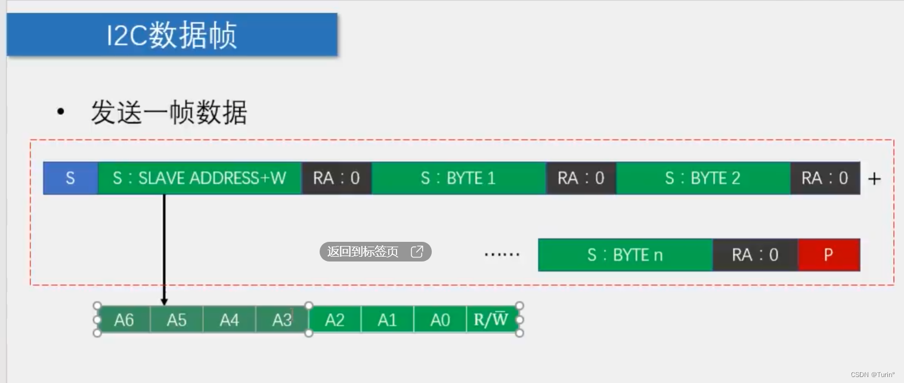
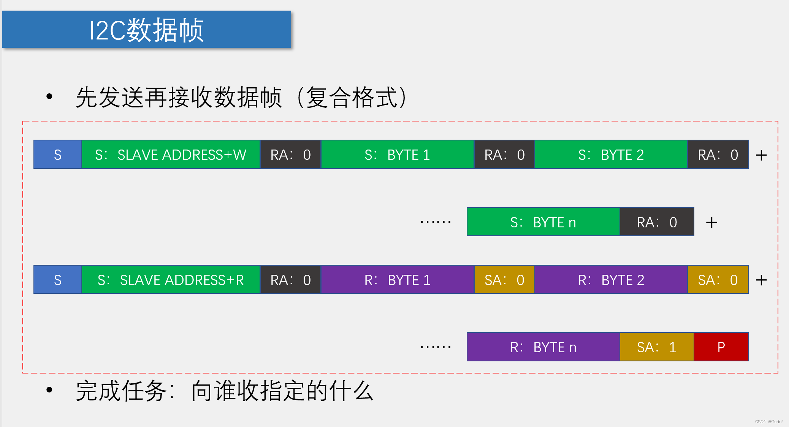

2.26更新

# 基本概念

## #前置概念

> 所用外设：
>
> ==AT24C02(EEPROM储存) 使用IIC协议==

### 一、单片机通信协议（本文以IIC为重点）

**全双工和半双工的区别：**

一、全双工（Full Duplex）通信允许数据在两个方向上同时传输，它在能力上相当于两个单工通信方式的结合。全双工指可以同时（瞬时）进行信号的双向传输（A→B且B→A）。指A→B的同时B→A，是瞬时同步的。

二、半双工（Half Duplex）数据传输指数据可以在一个信号载体的两个方向上传输，但是不能同时传输。

**MCU中常见的通信协议：**


### 二、推挽输出和开漏输出

**推挽输出：**

- 推挽输出可以输出高电平和低电平，在两种电平下都具有驱动能力。
- 相比于后面介绍的开漏输出，输出高电平时的驱动能力强很多
- 缺点：推挽输出不能实现" 线与"。

**开漏输出：**

- 常说的与推挽输出相对的就是开漏输出，抽象地说就是COMS反相器去掉了NMOS部分，PMOS管漏极输出，即开漏输出。PMOS管由高电平导通输出低电平，高电平没有驱动能力，需要借助“上拉电阻” (一般上拉电阻值较大，即弱上拉模式)[什么是弱上拉?](https://blog.csdn.net/monkey_d_xue/article/details/129802153)

==**IIC为什么要开漏输出模式？**==

- 输出端浮空，电平易受外界干扰，不稳定

### 三、I2C总线介绍：

- I2C总线（Inter IC BUS）是由Philips公司开发的一种通用数据总线 
- 两根通信线：SCL（Serial Clock）、SDA（Serial Data） 
 - 同步、半双工，带数据应答 
- 通用的I2C总线，可以使各种设备的通信标准统一，对于厂家来说，使用成熟的方案可以缩短芯片设计周期、提高稳定性，对于应用者来说，使用通用的通信协议可以避免学习各种各样的自定义协议，降低了学习和应用的难度

### 四、I2C电路规范

- 所有I2C设备的SCL连在一起，SDA连在一起

- 设备的SCL和SDA均要配置成开漏输出模式

- SCL和SDA各添加一个上拉电阻，阻值一般为4.7KΩ左右

- 开漏输出和上拉电阻的共同作用实现了“线与”的功能，此设计主要是为了解决多机通信互相干扰的问题

### 五、I2C时序结构

---







---

**总结：IIC的工作模块**

- 起始条件
- 中止条件
- 发送一个字节
- 接收一个字节
- 接收应答
- 发送应答

---

## #存储器/AT24C02

### 一、RAM和ROM

>**RAM : 易失性存储器 (高速存储） **
>
>==单片机内RAM为中间数据存储器==

- SRAM：静态RAM，电脑中的CPU，高速缓存，容量少，成本高
- DRAM：动态RAM，使用电容存储，电容容值小，需要补电能，成本相较于SRAM更低，容量更大
- 掉电丢失

>**ROM:非易失性存储器**
>
>==单片机内ROM为指令存储器==

- Mask ROM(掩膜ROM），只能读，不能写
- PROM：可编程ROM，可以写，但是只能写入一次
- EPROM：可擦除可编程ROM，可以编程，也可以清除（30分钟紫外线）
- E2PROM： 电可擦除可编程ROM，5V电可擦除，掉电不丢失
- Flash（闪存）：
- 硬盘、软盘、光盘等：磁介质、光信号

---


>单片机烧录的由来：早期通过编程储存数据，实际上是将特殊的二极管击穿，相当于“烧毁”（PROM）

---

### 二、AT24C02


# 代码部分

## 一、给AT24C02写入数据

> **实现：AT24C02掉电不丢失**

```c
#include <REGX52.H>
#include "LCD1602.h"
#include "Key.h"
#include "AT24C02.h"
#include "Delay.h"

unsigned char Data;
void main()
{
	LCD_Init();
	LCD_ShowString(1,1,"Hello World");
	//AT24C02_WriteByte(1,123);
	Delay(5);//AT21C02写一个序列的有效停止条件开始至内部写周期结束的时间
	Data=AT24C02_ReadByte(1);
	LCD_ShowNum(2,1,Data,3);
	while(1)
	{
		
	}
}
```

完善代码：

```c
#include <REGX52.H>
#include "LCD1602.h"
#include "Key.h"
#include "AT24C02.h"
#include "Delay.h"

unsigned char KeyNum;
//unsigned char Num; 这里要用到整型
unsigned int Num;
void main()
{
	LCD_Init();
	LCD_ShowNum(1,1,Num,5);
	while(1)
	{
		KeyNum=Key();
		if(KeyNum==1)
		{
			Num++;
			LCD_ShowNum(1,1,Num,5);
		}
		if(KeyNum==2)
		{
			Num--;
			LCD_ShowNum(1,1,Num,5);
		}
		if(KeyNum==3)
		{
			AT24C02_WriteByte(0,Num%256);//低八位
			Delay(5);
			AT24C02_WriteByte(1,Num/256);//高八位
			Delay(5);
			LCD_ShowString(2,1,"Write OK");//完成写入数据，提示
			Delay(1000);
			LCD_ShowString(2,1,"        ");//延时清除
		}
		if(KeyNum==4)//读的时候不需要Delay
		{
			Num=AT24C02_ReadByte(0);
			Num|=AT24C02_ReadByte(1)<<8;
			LCD_ShowNum(1,1,Num,5);
			LCD_ShowString(2,1,"Read OK");//完成读取数据，提示
			Delay(1000);
			LCD_ShowString(2,1,"        ");//延时清除
		}
	}
}
```

为什么要写:

```C
AT24C02_WriteByte(0,Num%256);//低八位
Delay(5);
AT24C02_WriteByte(1,Num/256);//高八位
```

因为：int类型最高65535,对应的二进制为16位

## 二、定时器扫描按键

>**实验：定时器按键扫描，==实现键值的数码管显示==**
>
>**实验结果：如果直接让Nixie在判断键码后显示Keynum值，只能显示一瞬间，数码管的显示方式不同于LCD1602，所以需要一个缓存量Temp**

```
		/*错误写法*/
		Temp=Key();
		if(KeyNum)//显示结果只在一瞬间显示
		{
			Nixie(1,KeyNum);
		}
		
		/*正确写法*/
		if(Temp)
		{
			KeyNum=Temp;
		}
		Nixie(1,KeyNum);
```

>**实验：定时器按键扫描实列2**

```
#include <REGX52.H>
#include "Key.h"
#include "AT24C02.h"
#include "Timer0.h"
#include "Nixie.h"
#include "Delay.h"
unsigned char KeyNum;
void main()
{
	Timer0_Init();
	while(1)
	{
		KeyNum=Key();
		if(KeyNum)
		{
			Nixie_SetBuf(1,KeyNum);
			Nixie_SetBuf(2,KeyNum);
			Nixie_SetBuf(3,KeyNum);
			Delay(1000);
		}
	}
}

void Timer0_Routine() interrupt 1 //中断子程序
{
		static unsigned int T0Count1,T0Count2;//静态局部变量，保证退出函数之后不销毁
		TL0 = 0x66;				//设置定时初始值
		TH0 = 0xFC;				//设置定时初始值	
		T0Count1++;//每次进入中断子程序，秒控制器自加一
		if(T0Count1>=20)//每隔20ms，按键函数会被调用一次
		{
			T0Count1=0;
			Key_Loop(); 
		}
		T0Count2++;
		if(T0Count2>=2)
		{
			 T0Count2=0;
			 Nixie_Loop();
		}
}
```

>**实验结果：**
>
>
>**==这时，按下按键，数码管显示会延时一秒改变，可见，使用定时器扫描按键，不会被延时函数影响，相较于延时函数使单片机的工作更具有可靠性==**

---

>**秒表源代码：**
>操作方式：
>
>- 按键1暂停
>- 按键2清零
>- 按键3通过AT24C02写入数据
>- 按键4通过AT24C02读取数据

```c
#include <REGX52.H>
#include "Key.h"
#include "AT24C02.h"
#include "Timer0.h"
#include "Nixie.h"
#include "Delay.h"


unsigned char KeyNum;
unsigned char Min,Sec,MiniSec;//单位：分，秒，1/100s=10ms
unsigned char RunFlag;//启动暂定标志位

void main()
{
	P2_5=0;//蜂鸣器关闭
	Timer0_Init();
	while(1)
	{
		KeyNum=Key();
		if(KeyNum==1)
		{
			RunFlag=!RunFlag;
		}
		
		if(KeyNum==2)
		{
			Min=0;Sec=0;MiniSec=0;
		}
		
		if(KeyNum==3)
		{	
			AT24C02_WriteByte(0,Min);
			Delay(5);
			AT24C02_WriteByte(1,Sec);
			Delay(5);
			AT24C02_WriteByte(2,MiniSec);
			Delay(5);
		}
		
		if(KeyNum==4)
		{
			Min=AT24C02_ReadByte(0);
			Sec=AT24C02_ReadByte(1);
			MiniSec=AT24C02_ReadByte(2);
		}
		
		Nixie_SetBuf(1,Min/10);
		Nixie_SetBuf(2,Min%10);
		Nixie_SetBuf(3,11);
		Nixie_SetBuf(4,Sec/10);
		Nixie_SetBuf(5,Sec%10);
		Nixie_SetBuf(6,11);
		Nixie_SetBuf(7,MiniSec/10);
		Nixie_SetBuf(8,MiniSec%10);
	}
}

void Sec_Loop(void)
{
	if(RunFlag)
	{
		MiniSec++;
		if(MiniSec>=100)
		{
			MiniSec=0;
			Sec++;
		}
		if(Sec>=60)
		{
			Sec=0;
			Min++;
		}
		if(Min>=60)
		{
			Min=0;
		}	
	}
}

void Timer0_Routine() interrupt 1 //中断子程序
{
		static unsigned int T0Count1,T0Count2,T0Count3;//静态局部变量，保证退出函数之后不销毁
		TL0 = 0x66;				//设置定时初始值
		TH0 = 0xFC;				//设置定时初始值	
		T0Count1++;//每次进入中断子程序，秒控制器自加一
		if(T0Count1>=20)//每隔20ms，按键函数会被调用一次
		{
			T0Count1=0;
			Key_Loop(); 
		}
		T0Count2++;
		if(T0Count2>=2)
		{
			 T0Count2=0;
			 Nixie_Loop();
		}
		T0Count3++;
		if(T0Count3>=10)//10ms
		{
			 T0Count3=0;
			 Sec_Loop();
		}
}
```

> 题外话: 6-1矩阵键盘密码锁：为什么密码不能设置为0开头?
> 因为0开头代表八进制,比如0123实际上对应的十进制数是83

---

# #蓝桥杯(STC15)拓展

**IIC通信底层**

```c
#include "iic.h"

#define DELAY_TIME 5
// I2C总线内部延时函数

void IIC_Delay(unsigned char i)
{
    do
    {
        _nop_();
    } while (i--);
}

// I2C总线启动信号
void IIC_Start(void)
{
    SDA = 1;
    SCL = 1;
    IIC_Delay(DELAY_TIME);
    SDA = 0;
    IIC_Delay(DELAY_TIME);
    SCL = 0;
}

// I2C总线停止信号
void IIC_Stop(void)
{
    SDA = 0;
    SCL = 1;
    IIC_Delay(DELAY_TIME);
    SDA = 1;
    IIC_Delay(DELAY_TIME);
}

//发送应答或非应答信号
void IIC_SendAck(bit ackbit)
{
    SCL = 0;
    SDA = ackbit;
    IIC_Delay(DELAY_TIME);
    SCL = 1;
    IIC_Delay(DELAY_TIME);
    SCL = 0;
    SDA = 1;
    IIC_Delay(DELAY_TIME);
}

//等待应答
bit IIC_WaitAck(void)
{
    bit ackbit;

    SCL = 1;
    IIC_Delay(DELAY_TIME);
    ackbit = SDA;
    SCL = 0;
    IIC_Delay(DELAY_TIME);
    return ackbit;
}

// I2C总线发送一个字节数据
void IIC_SendByte(unsigned char byt)
{
    unsigned char i;

    for (i = 0; i < 8; i++)
    {
        SCL = 0;
        IIC_Delay(DELAY_TIME);
        if (byt & 0x80)
            SDA = 1;
        else
            SDA = 0;
        IIC_Delay(DELAY_TIME);
        SCL = 1;
        byt <<= 1;
        IIC_Delay(DELAY_TIME);
    }
    SCL = 0;
}

// I2C总线接收一个字节数据
unsigned char IIC_RecByte(void)
{
    unsigned char i, da;
    for (i = 0; i < 8; i++)
    {
        SCL = 1;
        IIC_Delay(DELAY_TIME);
        da <<= 1;
        if (SDA)
            da |= 1;
        SCL = 0;
        IIC_Delay(DELAY_TIME);
    }
    return da;
}
```

```c
/*基于IIC底层，编写AT24C02函数模块*/

/**
  * @brief 		写入EEPROM
  * @param  	需要写的字符串，写入的地址，写入数量
  * @retval 	无
  */
void EEPROM_Write(unsigned char *EEPROM_String,unsigned char addr,unsigned char num)
{
	IIC_Start();//发送开始信号
    IIC_SendByte(0xA0);//主机发送寻址信号，确认EEPROM芯片，写模式
    IIC_WaitAck();//等待应答
    
    IIC_SendByte(addr);//写入要储存的数据地址,最好是八的倍数，如果不是8的倍数，将无法写入整页的字节
    IIC_WaitAck();//等待应答

    while(num--)
    {
        IIC_SendByte(*EEPROM_String++);//要存入AT24C02的数据,按位存
        IIC_WaitAck();//等待应答
        IIC_Delay(200);
    }
    IIC_Stop();//停止IIC命令
}

/**
  * @brief 		读取EEPROM数据,替换需要读取字符串的数据
  * @param  	需要读取的字符串，写入的地址，写入数量
  * @retval 	无
  */
void EEPROM_Read(unsigned char *EEPROM_String,unsigned char addr,unsigned char num)
{
    IIC_Start();//发送开始信号
    IIC_SendByte(0xA0);//主机发送寻址信号，确认EEPROM芯片，写模式
    IIC_WaitAck();//等待应答
	
    IIC_SendByte(addr);//写入要读取的数据地址,最好是八的倍数，如果不是8的倍数，将无法写入整页的字节
    IIC_WaitAck();//等待应答  

    IIC_Start();//发送开始信号
    IIC_SendByte(0xA1);//主机发送寻址信号，确认EEPROM芯片，读模式
    IIC_WaitAck();//等待应答	
	
    while(num--)
    {
        *EEPROM_String++=IIC_RecByte();//按位取数据
        if(num)//未取完数据
        {
            IIC_SendAck(0);
        }
        else 
        {
            IIC_SendAck(1);//主机接收完数据，发送应答
        }
    }
    IIC_Stop();//停止IIC通信
}
```

