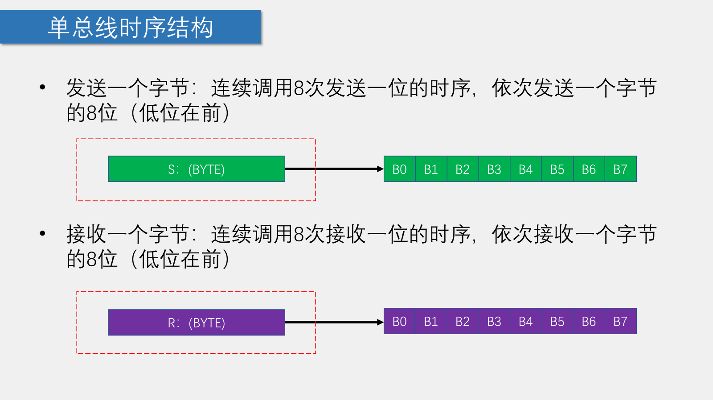

2024.1.29更新

2024.3.2

# 基本概念

> 所用外设：

> ==DS18B20温度传感器（OneWire协议）==

## #前置概念

### 一、OneWire（单总线）协议

•单总线（1-Wire BUS）是由Dallas公司开发的一种通用数据总线

•一根通信线：DQ

•异步、半双工

•单总线只需要一根通信线即可实现数据的双向传输，当采用寄生供电时，还可以省去设备的VDD线路，此时，供电加通信只需要DQ和GND两根线

### 二、单总线电路规范

•设备的DQ均要配置成开漏输出模式

•DQ添加一个上拉电阻，阻值一般为4.7KΩ左右

•若此总线的从机采取寄生供电，则主机还应配一个强上拉输出电路


### 三、单总线的时序结构




---

## DS18B20介绍

•DS18B20是一种常见的数字温度传感器，其控制命令和数据都是以数字信号的方式输入输出，相比较于模拟温度传感器，具有功能强大、硬件简单、易扩展、抗干扰性强等特点

•测温范围：-55°C 到 +125°C

•通信接口：1-Wire（单总线）

•其它特征：可形成总线结构、内置温度报警功能、可寄生供电


### 一、DS18B20温度存储格式


>**MS BYTE和LS BYTE两个字节中BIT的解释：
>BIT16~BIT11作为符号位，表示温度的正负
>BIT10~BIT4存储温度的整数部分
>BIT3~BIT0存储温度的小数部分（==精度==），BIT0 ‘1’对应 "0.0625"**

### 二、DS18B20时序


### 三、程序编写

首先写第一个函数，用于初始化，其中添加Askbit，在LCD1602上显示一个数值，观察初始化函数是否有效，即从机是否响应。

首先编写好单总线的初始化程序，如果代码正确，根据单总线的通信协议，从机会发送一个应答信号（拉低总线）。
进行应答测试，通过LCD1602观察应答位，检测代码是否有效

```bash
#include <REGX52.H>

sbit OneWire_DQ=P3^7;//通信口

unsigned char OneWire_Init(void)
{
	unsigned char i,Askbit;
	OneWire_DQ=1;
	OneWire_DQ=0;
	i = 227;while (--i);//500um
	OneWire_DQ=1;
	i = 29;while (--i);//70um
	Askbit = OneWire_DQ;
	return Askbit;
}
```
---
## 一、DS18B20温度读取
将程序下载到单片机上，运行
如下为main.c文件

```bash
#include <REGX52.H>
#include "LCD1602.h"
#include "DS18B20.h"
#include "OneWire.h"

void main()
{
	LCD_Init();
	LCD_ShowString(1,1,"Temperture:");
	DS18B20_Start();
	
	while(1)
	{
		unsigned int temp=DS18B20_Read()*10000;
		if(temp>0)
		{
			LCD_ShowString(2,1,"+");
		}
		else if(temp<0)
		{
			LCD_ShowString(2,1,"-");
		}
		LCD_ShowNum(2,2,temp/10000,4);
		LCD_ShowNum(2,6,temp%10000,4);
	}
}
```
>结果异常：LCD1602第二行显示不正确数据/显示-000.0625
>分析：
>main.c中存在语法错误
>OneWire.c DS18B20.c中的函数时序定义有误
>


对main.c进行更改
```bash
#include <REGX52.H>
#include "Delay.h"
#include "LCD1602.h"
#include "DS18B20.h"


float T;
void main()
{
	DS18B20_Convert();
	Delay(1000);
	LCD_Init();
	LCD_ShowString(1,1,"Temperature:");
	while(1)
	{
		DS18B20_Convert();
		T=DS18B20_Read();
		if(T<0)
		{
			LCD_ShowChar(2,1,'-');
			T=-T;
		}
		else
		{
			LCD_ShowChar(2,1,'+');
		}
		LCD_ShowNum(2,2,T,3);
		LCD_ShowChar(2,5,'.');
		LCD_ShowNum(2,6,(unsigned long)(T*10000)%10000,4);//强制类型转换
	}
}


```
OneWire.c 错误分析：


```bash
#include <REGX52.H>

sbit OneWire_DQ=P3^7;//通信口

void OneWire_Init(void)
{
	unsigned char i,AskBit;
	OneWire_DQ=1;
	OneWire_DQ=0;
	i = 227;while (--i);//500um
	OneWire_DQ=1;//释放总线
	i = 29;while (--i);//70um
	AskBit=OneWire_DQ;//主机判断从机是否发送应答
	i = 227;while (--i);//500um,要根据时序图构造代码
}

void OneWire_SendBit(unsigned char Bit)//发送一位
{
	unsigned char i;
	OneWire_DQ=1;
	i = 2;while (--i);//10um
	OneWire_DQ=Bit;
	i = 22;while (--i);//54um
}

unsigned char OneWire_ReadBit(void)//接收一位
{
	unsigned char i,Bit;
	OneWire_DQ=0;
	i = 2;while (--i);//10um
	OneWire_DQ=1;//释放总线
	i = 2;while (--i);//10um
	Bit=OneWire_DQ;
	i = 22;while (--i);//54um
	return Bit;
}

void OneWire_WriteByte(int Byte)
{
	unsigned int i;
	for(i=0;i<8;i++)
	{
		OneWire_SendBit(Byte&(0x01<<i));//低位在前
	}
}

unsigned char OneWire_ReadByte()
{
	unsigned int i;
	unsigned int Byte;
	for(i=0;i<8;i++)
	{
		Byte=OneWire_ReadBit()|(0x01<<i);//低位在前
	}
	return Byte;
}

```
==对OneWire.c进行更改==

```bash
#include <REGX52.H>

sbit OneWire_DQ=P3^7;//通信口

unsigned char OneWire_Init(void)
{
	unsigned char i,AskBit;
	OneWire_DQ=1;
	OneWire_DQ=0;
	i = 247;while (--i);//500us
	OneWire_DQ=1;//释放总线
	i = 29;while (--i);//70us
	AskBit=OneWire_DQ;//主机判断从机是否发送应答
	i = 247;while (--i);//500um,要根据时序图构造代码
	return AskBit;
}

void OneWire_SendBit(unsigned char Bit)//发送一位
{
	unsigned char i;
	OneWire_DQ=0;//错误，应为0
	i = 2;while (--i);//10us
	OneWire_DQ=Bit;
	i = 20;while (--i);//50us
	OneWire_DQ=1;//遗漏
}

unsigned char OneWire_ReadBit(void)//接收一位
{
	unsigned char i,Bit;
	OneWire_DQ=0;
	i = 1;while (--i);//8us
	OneWire_DQ=1;//释放总线
	i = 1;while (--i);//8us
	Bit=OneWire_DQ;
	i = 20;while (--i);//50us
	return Bit;
}

void OneWire_WriteByte(unsigned char Byte)
{
	unsigned char i;
	for(i=0;i<8;i++)
	{
		OneWire_SendBit(Byte&(0x01<<i));//低位在前
	}
}

unsigned char OneWire_ReadByte(void)
{
	unsigned char i;
	unsigned char Byte=0x00;
	for(i=0;i<8;i++)
	{
		if(OneWire_ReadBit()){Byte|=(0x01<<i);}//低位在前
	}
	return Byte;
}
```

**结论：OneWire_SendBit函数对总线的电平处理不正确**
void OneWire_SendBit(unsigned char Bit)//发送一位
{
	unsigned char i;
	OneWire_DQ=1;//==此处错误，应为0==
	i = 2;while (--i);//10us
	OneWire_DQ=Bit;
	i = 20;while (--i);//50us
	OneWire_DQ=1;//遗漏
}

## 二、DS18B20温度报警器
```bash
#include <REGX52.H>
#include "Delay.h"
#include "LCD1602.h"
#include "DS18B20.h"
#include "AT24C02.h"
#include "I2C.h"
#include "Key.h"
#include "Timer0.h"


//mark
//在编写单片机程序时，要考虑到运行的高效性，定义变量的数据类型，优先选择较低内存占用的类型
float T;
float Tshow;
char Thigh,Tlow;
unsigned char KeyNum;


void main()
{
	Thigh=AT24C02_ReadByte(0);//每次开机，读取存储器中的数据
	Tlow=AT24C02_ReadByte(1);
	
	DS18B20_Convert();//温度装载，防止T第一次读取到的是默认值20，消除多余现象
	Delay(1000);
	
	LCD_Init();
	Timer0_Init();
	LCD_ShowString(1,1,"T:");
	
	while(1)
	{
		DS18B20_Convert();//温度装载
		T=DS18B20_Read();
		if(T<0)
		{
			LCD_ShowChar(1,3,'-');
			//T=-T,这里T=-T的话，进行温度预置判断有问题，所以再定义一个变量Tshow
			Tshow=-T;
		}
		else
		{
			LCD_ShowChar(1,3,'+');
			Tshow=T;
		}
		LCD_ShowNum(1,4,Tshow,3);
		LCD_ShowChar(1,7,'.');
		LCD_ShowNum(1,8,(unsigned char)(Tshow*100)%100,2);
		
		//温度阈值控制
		KeyNum=Key();
		if(KeyNum)
		{
			if(KeyNum==1)
			{
				Thigh++;
				if(Thigh>125)
				{
					Thigh--;
				}
			}
			else if(KeyNum==2)
			{
				Thigh--;
				if(Thigh<=Tlow)
				{
					Thigh++;
				}
			}
			else if(KeyNum==3)
			{
				Tlow++;
				if(Tlow>=Thigh)
				{
					Tlow--;
				}
			}
			else if(KeyNum==4)
			{
				Tlow--;
				if(Tlow<-125)
				{
					Tlow++;
				}
			}
			AT24C02_WriteByte(0,Thigh);
			Delay(5);
			AT24C02_WriteByte(1,Tlow);
			Delay(5);
		}
		//Thigh=AT24C02_ReadByte(1);
	    //Tlow=AT24C02_ReadByte(2);错误写法，会导致出现短暂的Thigh或者Tlow被赋值0,AT24C02没来得及读取数据就赋值给变量
		LCD_ShowString(2,1,"TH:");
		LCD_ShowString(2,10,"TL:");
		LCD_ShowSignedNum(2,4,Thigh,3);//显示带符号的数字
		LCD_ShowSignedNum(2,13,Tlow,3);	
		
		//温度报警，LCD1602显示
		if(T>Thigh)
		{
			LCD_ShowString(1,13,"OV:H");
			
		}
		else if(T<Tlow)
		{
			LCD_ShowString(1,13,"OV:L");
		}
		else
		{
			LCD_ShowString(1,13,"    ");
		}
		
	}
}


void Timer0_Routine() interrupt 1 //中断子程序
{
		
		static unsigned int T0Count1;//静态局部变量，保证退出函数之后不销毁
		TL0 = 0x66;				//设置定时初始值
		TH0 = 0xFC;				//设置定时初始值	
		T0Count1++;//每次进入中断子程序，秒控制器自加一
		if(T0Count1>=20)
		{
			T0Count1=0;
			Key_Loop();
		}
}
```

>**实验现象1：加入定时器扫描按键后，按下按键不影响温度的读取和显示，但是LCD1602上显示的温度数值会出现闪烁的状态
>分析：每隔20ms进入中断程序，对按键进行扫描检测，但是，单总线上对数据的发送和接受，部分过程时间在几十us，远远小于20ms,中断程序打断了温度的正常读取
>解决方案：每个OneWire的读写操作加入定时器的关闭动作，这样不会对OneWire的读写操作产生影响**
>==如下:==

```bash
#include <REGX52.H>

sbit OneWire_DQ=P3^7;//通信口

unsigned char OneWire_Init(void)
{
	unsigned char i,AskBit;
	EA=0;
	OneWire_DQ=1;
	OneWire_DQ=0;
	i = 247;while (--i);//500us
	OneWire_DQ=1;//释放总线
	i = 29;while (--i);//70us
	AskBit=OneWire_DQ;//主机判断从机是否发送应答
	i = 247;while (--i);//500um,要根据时序图构造代码
	EA=1;
	return AskBit;
}

void OneWire_SendBit(unsigned char Bit)//发送一位
{
	unsigned char i;
	EA=0;
	OneWire_DQ=0;//错误，应为0
	i = 2;while (--i);//10us
	OneWire_DQ=Bit;
	i = 20;while (--i);//50us
	OneWire_DQ=1;//遗漏
	EA=1;
}

unsigned char OneWire_ReadBit(void)//接收一位
{
	unsigned char i,Bit;
	EA=0;
	OneWire_DQ=0;
	i = 1;while (--i);//8us
	OneWire_DQ=1;//释放总线
	i = 1;while (--i);//8us
	Bit=OneWire_DQ;
	i = 20;while (--i);//50us
	EA=1;
	return Bit;
}

void OneWire_WriteByte(unsigned char Byte)
{
	unsigned char i;
	EA=0;
	for(i=0;i<8;i++)
	{
		OneWire_SendBit(Byte&(0x01<<i));//低位在前
	}
	EA=1;
}

unsigned char OneWire_ReadByte(void)
{
	unsigned char i;
	unsigned char Byte=0x00;
	EA=0;
	for(i=0;i<8;i++)
	{
		if(OneWire_ReadBit()){Byte|=(0x01<<i);}//低位在前
	}
	EA=1;
	return Byte;
}
```

==缺点：对定时器有较大影响，需要区分任务的优先级，这里我们只有对温度进行处理的任务，一但存在多个任务，比如这里同时在数码管上显示一个时钟，使用单总线的局限性会非常大==
==IIC通信方式一般比单总线广泛地多==
==思考：IIC和单总线地区别==

---

# 蓝桥杯(STC15)拓展

**OneWire底层**

```c
/*	# 	单总线代码片段说明
	1. 	本文件夹中提供的驱动代码供参赛选手完成程序设计参考。
	2. 	参赛选手可以自行编写相关代码或以该代码为基础，根据所选单片机类型、运行速度和试题
		中对单片机时钟频率的要求，进行代码调试和修改。
*/

//
#include <onewire.h>
sbit DQ= P1^4;
void Delay_OneWire(unsigned int t)  
{
	t *= 12;
	while(t--);
}

//
void Write_DS18B20(unsigned char dat)
{
	unsigned char i;
	for(i=0;i<8;i++)
	{
		DQ = 0;
		DQ = dat&0x01;
		Delay_OneWire(5);
		DQ = 1;
		dat >>= 1;
	}
	Delay_OneWire(5);
}

//
unsigned char Read_DS18B20(void)
{
	unsigned char i;
	unsigned char dat;
  
	for(i=0;i<8;i++)
	{
		DQ = 0;
		dat >>= 1;
		DQ = 1;
		if(DQ)
		{
			dat |= 0x80;
		}	    
		Delay_OneWire(5);
	}
	return dat;
}

//
bit init_ds18b20(void)
{
  	bit initflag = 0;
  	
  	DQ = 1;
  	Delay_OneWire(12);
  	DQ = 0;
  	Delay_OneWire(80);
  	DQ = 1;
  	Delay_OneWire(10); 
    initflag = DQ;     
  	Delay_OneWire(5);
  
  	return initflag;
}

/*基于底层编写*/
float ds18b20_read(void)
{
	unsigned char low,high;//高八位，低八位，DS18B20温度数据是十六位二进制
	init_ds18b20();//ds18b20初始化时序
	Write_DS18B20(0xcc);//ds18b20跳过rom指令
	Write_DS18B20(0x44);//ds18b20开始温度转换
    
	init_ds18b20();//ds18b20初始化时序
	Write_DS18B20(0xcc);//ds18b20跳过rom指令
	Write_DS18B20(0xbe);//ds18b20开始温度读取
	low=Read_DS18B20();
	high=Read_DS18B20();
	return((high << 8 )| low) /16.0;
}
```


## 主模块(DS18B20模拟题)

```c
//头文件引用
#include <Key.h>
#include <Nixie.h>
#include <LED.h>
#include <Timer0.h>
#include <Init.h>
#include <onewire.h>
#include <iic.h>

unsigned char Nixie_Buf[8]={10,10,10,10,10,10,10,10};//数码管显示数据
unsigned char Nixie_Pos;//数码管数据数组位下标
unsigned char Nixie_Point[8]={0,0,0,0,0,0,0,0};//数码管每一段的“点”数据
unsigned char Nixie_Disp_Mode;

unsigned char Key;//键值
unsigned char Key_Up,Key_Down,Key_Val,Key_Old;//按键扫描变量

unsigned char ucLED[8]={0,0,0,0,0,0,0,0};//LED显示数据

unsigned int Nixie_Timer;//数码管定时更新
unsigned int Key_Timer;//按键定时扫描

float Tempture=0;//实时温度
unsigned char Tempture_Disp=25;//温度暂存设置参数
unsigned char Tempture_Control=25;//温度阈值参数


float DAC_Output=3.25;//DAC输出电压
bit DAC_Output_MODE;//DAC输出模式

/*按键处理函数*/
void Key_Proc(void)
{
	if(Key_Timer) return;//Key_Timer=0时执行下面的语句
	Key_Timer=1;
	//按键扫描部分//
	Key_Val=Key_Read();//读取键值
	Key_Down=Key_Val & (Key_Old ^ Key_Val);//读取上升沿键值
	Key_Up=~Key_Val & (Key_Old ^ Key_Val);//读取下降沿键值
	Key_Old=Key_Val;//保存键值（旧键值）
	
	switch(Key_Down) 
	{
		case 4:
			if(Nixie_Disp_Mode==0){Tempture_Disp=Tempture_Control;}//上一个界面为实时温度显示界面时
			if(Nixie_Disp_Mode==1){Tempture_Control=Tempture_Disp;}	//上一个界面为温度阈值设置显示界面时
			if(++Nixie_Disp_Mode==3){Nixie_Disp_Mode=0;}//模式切换 0~模式1 1~模式2
			break;
		case 5:
			DAC_Output_MODE^=1;//DAC输出模式切换
			break;
		case 8:
			if(Nixie_Disp_Mode==1)
			{
				if(++Tempture_Disp==100){Tempture_Disp=0;}//前置+1,判断条件刚好为溢出值
			}			
			break;
		case 9:
			if(Nixie_Disp_Mode==1)
			{
				if(--Tempture_Disp==255){Tempture_Disp=99;}
			}		
			break;
	}
}

/*信息处理函数*/
void Nixie_Proc(void)
{
	if(Nixie_Timer) return;//Nixie_Timer=0时执行下面的语句
	Nixie_Timer=1;
	Tempture=ds18b20_read();//实时温度读取
	
	switch(Nixie_Disp_Mode)//数码管多模式显示
	{
		case 0:
			Nixie_Buf[0]=13;
			Nixie_Buf[1]=10;
			Nixie_Buf[2]=10;
			Nixie_Buf[3]=10;
			Nixie_Buf[4]=(unsigned char)Tempture/10;
			Nixie_Buf[5]=(unsigned char)Tempture%10;
			Nixie_Point[5]=1;
			Nixie_Buf[6]=(unsigned int)(Tempture*10)%10;
			Nixie_Buf[7]=(unsigned int)(Tempture*100)%10;
			break;
		case 1:
			Nixie_Buf[0]=17;
			Nixie_Buf[1]=10;
			Nixie_Buf[2]=10;
			Nixie_Buf[3]=10;
			Nixie_Buf[4]=10;
			Nixie_Buf[5]=10;
			Nixie_Point[5]=0;
			Nixie_Buf[6]=Tempture_Disp/10;
			Nixie_Buf[7]=Tempture_Disp%10;			
			break;
		case 2:
			Nixie_Buf[0]=11;
			Nixie_Buf[1]=10;
			Nixie_Buf[2]=10;
			Nixie_Buf[3]=10;
			Nixie_Buf[4]=10;
			Nixie_Buf[5]=(unsigned char)DAC_Output;
			Nixie_Point[5]=1;
			Nixie_Buf[6]=(unsigned char)(DAC_Output*10)%10;
			Nixie_Buf[7]=(unsigned int)(DAC_Output*100)%10;			
			break;			
	}
}

/* 其他显示函数 */
void LED_Proc(void)
{
	unsigned int i;
	/*实时输出DAC电压*/
	DA_Write((unsigned char)(51*DAC_Output));//DAC输出
	if(DAC_Output_MODE==0)
	{
		if(Tempture<Tempture_Control)
		{
			DAC_Output=0;
		}
		else
		{
			DAC_Output=5.0;
		}
	}
	else
	{
		if(Tempture<20)
		{
			DAC_Output=1.0;
		}
		if(Tempture>40)
		{
			DAC_Output=4.0;
		}
		else
		{
			DAC_Output=0.15*(Tempture-20)+1.0;
		}
	}
	ucLED[0]=~DAC_Output_MODE;
	for(i=0;i<3;i++)
	{
		ucLED[i+1]= (i==Nixie_Disp_Mode);
	}
}

void Delay750ms() //@12.000MHz
{
	unsigned char i, j, k;
	i = 35;
	j = 51;
	k = 182;
	do
	{
		do
		{
			while (--k)
				;
		} while (--j);
	} while (--i);
}

void main()
{
	Tempture=ds18b20_read();//ds18b20第一次默认读取的是85
	Delay750ms();
	Timer0_Init();//定时器初始化
	System_Init();//系统板初始化
	while(1)//循环执行任务
	{
		Key_Proc();
		Nixie_Proc();
		LED_Proc();
	}
}

void Timer0_Server(void)  interrupt 1//中断服务程序
{
	if(++Nixie_Timer==300){Nixie_Timer=0;}//300ms定时长度
	if(++Key_Timer==10){Key_Timer=0;}//10ms定时长度
	if(++Nixie_Pos==8){Nixie_Pos=0;}//数码管动态显示
	Nixie_Disp(Nixie_Pos,Nixie_Buf[Nixie_Pos],Nixie_Point[Nixie_Pos]);//数码管动态显示
	LED_Disp(Nixie_Pos,ucLED[Nixie_Pos]);//LED循环“值”检测，发生变化则对LED相关IO发生电平变化
}
```


