# [51单片机] 第八节 串口通信总结

==**51单片机中的自动重载概念实际上就是当计数溢出后自动赋初值**==
==**同步通信中波特率为通信双方约定好的通信速率**==

## <前置部分>
###  一、串口简介：
- 串口是一种应用十分广泛的通讯接口，串口成本低、容易使用、通信线路简单，可实现两个设备的互相通信。
- 单片机的串口可以使单片机与单片机、单片机与电脑、单片机与各式各样的模块互相通信，极大的扩展了单片机的应用范围，增强了单片机系统的硬件实力。
- 51单片机内部自带UART（Universal Asynchronous Receiver Transmitter，通用异步收发器），可实现单片机的串口通信。

CH340串口模块
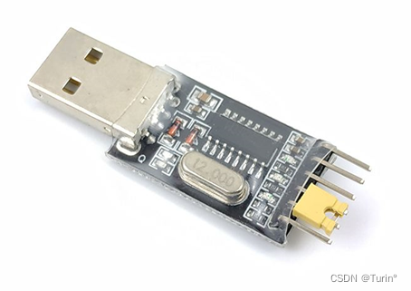
蓝牙串口模块
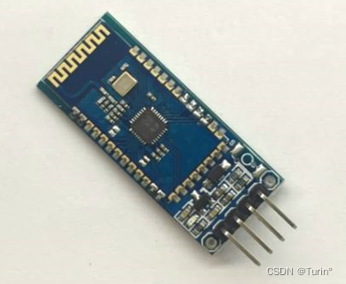
###  二、串口通信方式：
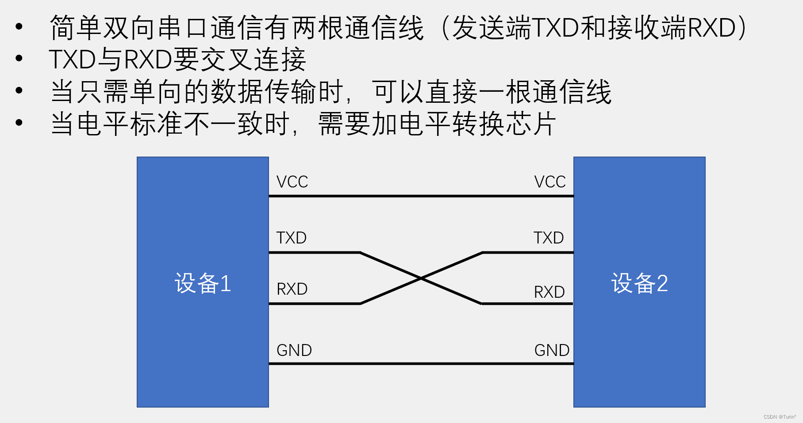
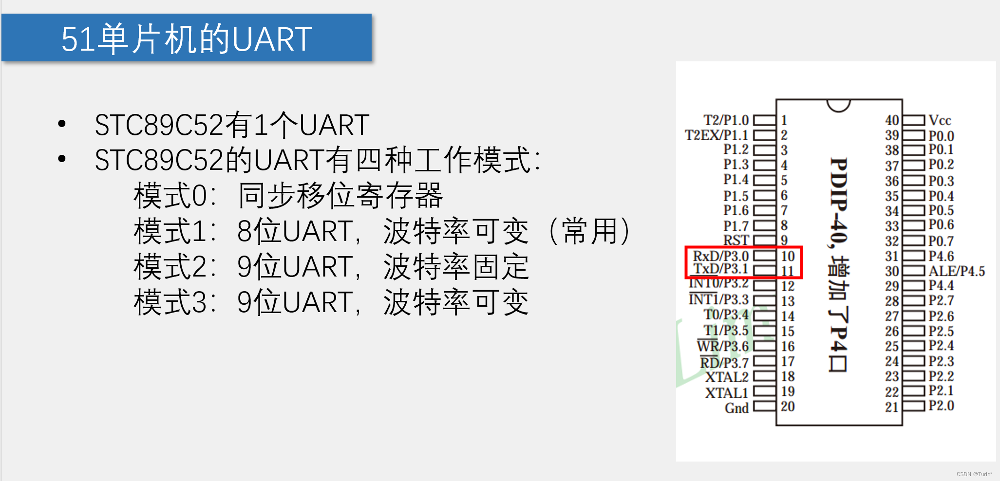
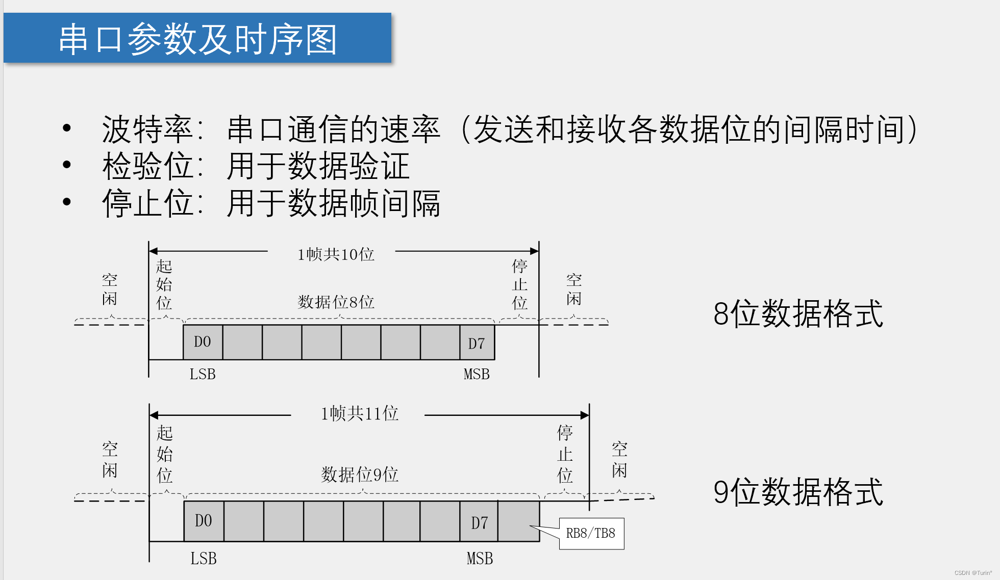
### #串口模式图：
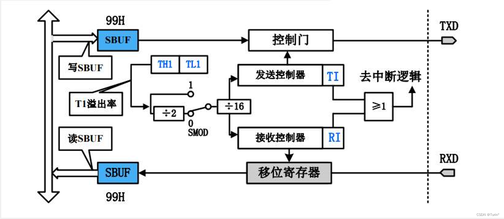
- SBUF：串口数据缓存寄存器，物理上是两个独立的寄存器，但占用相同的地址。写操作时，写入的是发送寄存器，读操作时，读出的是接收寄存器，因此要==通过检测TI和RI的信号==判断是发送还是接收操作。
### ps:用串口端控制发送/接收时，要注意对应上HEX/文本模式
- HEX模式/十六进制模式/二进制模式：以原始数据的形式显示
- 文本模式/字符模式：以原始数据编码后的形式显示


### # stc-isp 串口波特率代码生成
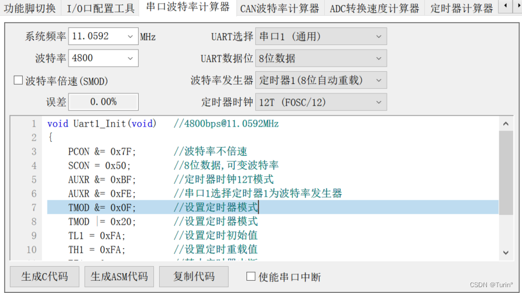
### 三、串（行）口通信相关寄存器
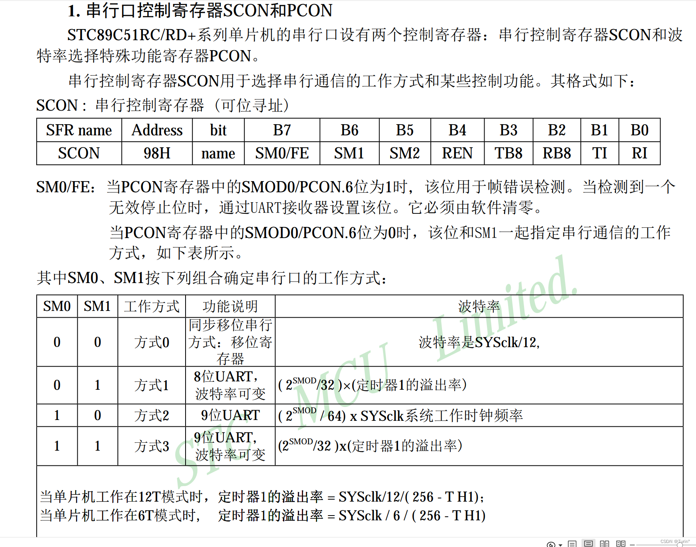
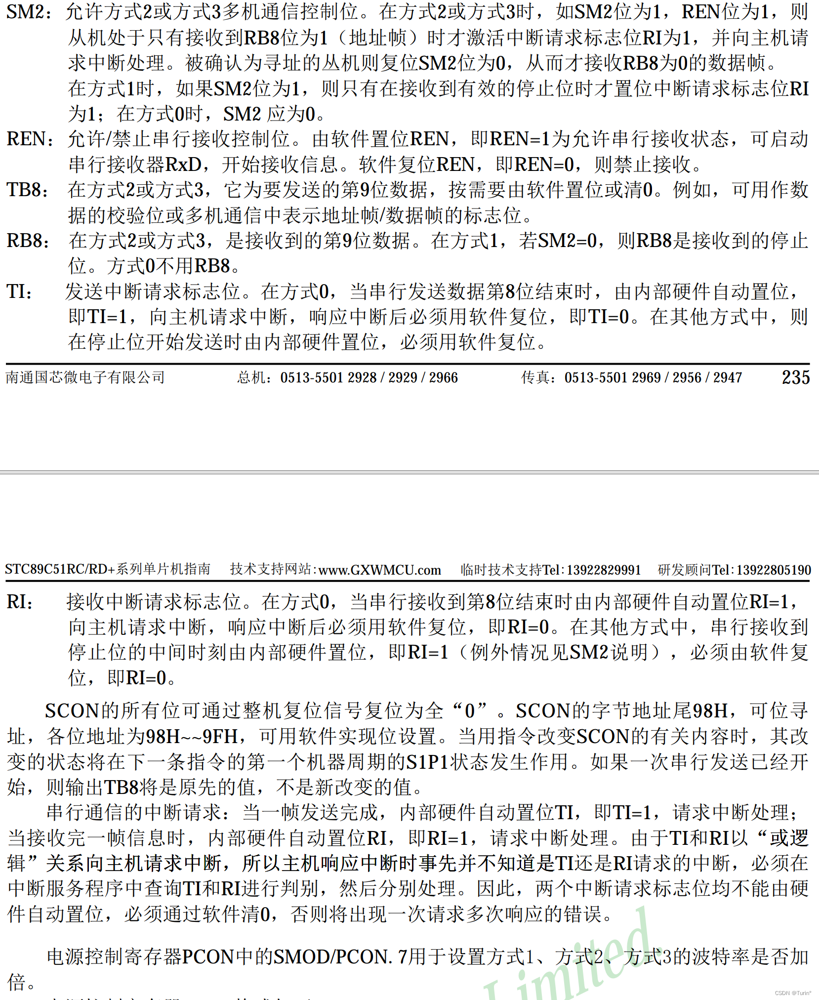
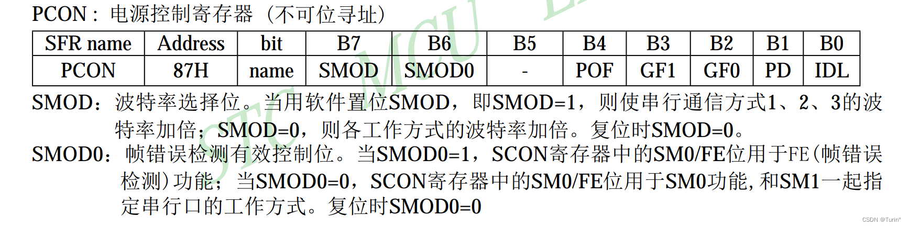
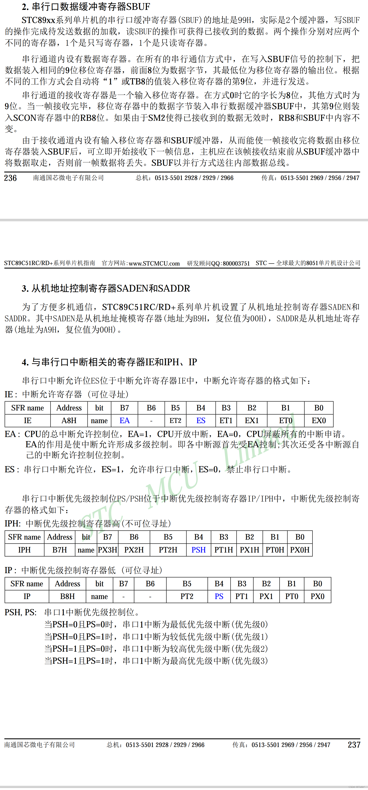


### #串口通信的寄存器解释
---
#### SCON:串行控制寄存器
- **SMO/FE：当PCON为1，FE生效，用于帧检测，当PCON为0，SM0生效，与SM1共同作用**
- 这里我们选择工作方式1，SM0=0,SM1=1，SM2=0（没有用到停止位），REN=0（暂不接收数据）,TB8=0,RB8=0,T1=0（方式1），RI=0(==在收到一个Byte的数据时RI会自动置1==); 
-  ==SCON = 0x40;==


**ps:主机响应中断不能判断是接收还是发送中断，必须在中断服务程序中判断TI和RI的值**

---
#### PCON:波特率选择寄存器
- 由常用串口软件如：stp-isp进行计算
---
#### SBUF:数据缓冲寄存器
- 通过程序，控制SBUF的内容，实现电脑端和单片机端的双向通信数据传输
---
## <代码部分>

### 一、串口向电脑端发送数据
UART.c
```c
#include <REGX52.H>

/**
  * @brief 	串口初始化，//4800bps@11.0592MHz
  * @param  无
  * @retval 无
			
  */
	
void UART_Init()//串口初始化
{//波特率：通信双方约定的通信速率
		SCON=0x40;
		PCON &= 0x7F;		//波特率不倍速
		TMOD &= 0x0F;		//设置定时器模式
	  TMOD |= 0x20;		//设置定时器模式
	  TL1 = 0xFA;			//设置定时初始值
	  TH1 = 0xFA;			//设置定时重载值
   	ET1 = 0;			//禁止定时器中断
		TR1 = 1;			//定时器1开始计时
}

/**
  * @brief 	串口发送一个字节数据
  * @param  Byte 要发送的一个字节数据
  * @retval 无
			
  */
void UART_SendByte(unsigned char Byte)
{
		SBUF=Byte;//发送缓存器中的数据为Byte
		while(TI==0);//发送完数据后，电脑端接收，然后TI=1，跳过while循环
		TI=0;//每次发送完数据,程序置0
}
```

main.c
```c
#include <REGX52.H>
#include "Delay.h"
#include "UART.h"

unsigned char Sec;

void main()
{
		UART_Init();
		while(1)
		{
				UART_SendByte(Sec);
				Sec++;
				Delay(1000);
		}
}
```
### 二、电脑通过串口控制LED
UART.c
```c
#include <REGX52.H>

/**
  * @brief 	串口初始化，//4800bps@11.0592MHz
  * @param  无
  * @retval 无
			
  */
	
void UART_Init()//串口初始化
{//波特率：通信双方约定的通信速率
		SCON=0x50;
		PCON &= 0x7F;		//波特率不倍速
		TMOD &= 0x0F;		//设置定时器模式
	  TMOD |= 0x20;		//设置定时器模式
	  TL1 = 0xFA;			//设置定时初始值
	  TH1 = 0xFA;			//设置定时重载值
   		ET1 = 0;			//禁止定时器中断
		TR1 = 1;			//定时器1开始计时
		EA=1;//启动所有中断
		ES=1;//启动串口中断
}

//自动重装

/**
  * @brief 	串口发送一个字节数据
  * @param  Byte 要发送的一个字节数据
  * @retval 无
			
  */ 
void UART_SendByte(unsigned char Byte)
{
		SBUF=Byte;
		while(TI==0);
		TI=0;
}

/*串口中断函数模板
void UART_Routine() interrupt 4
{
		if(RI==1)// 接收 中断
		{
				RI=0;
		}
}
*/
```
main.c
```c
#include <REGX52.H>
#include "Delay.h"
#include "UART.h"

void main()
{
		UART_Init();
		while(1)
		{
			
		}
}

//
void UART_Routine() interrupt 4 //带上interrupt 4表示UART_Routine()为中断服务子函数
{
		if(RI==1)// 接收 中断
		{
				P2=~SBUF;
				UART_SendByte(SBUF);//这里，单片机接收电脑端发送的数据，一个函数不能既在主函数里出现，也在中断中出现
				RI=0;//程序置0
		}
}

```
==**总结：UART：同步双向，即向电脑端发送数据，也可接收电脑端发送的数据，通过内部程序执行相应的任务**==
