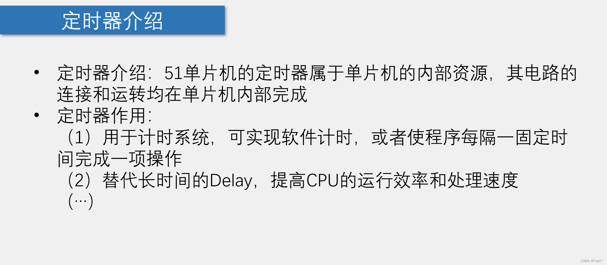
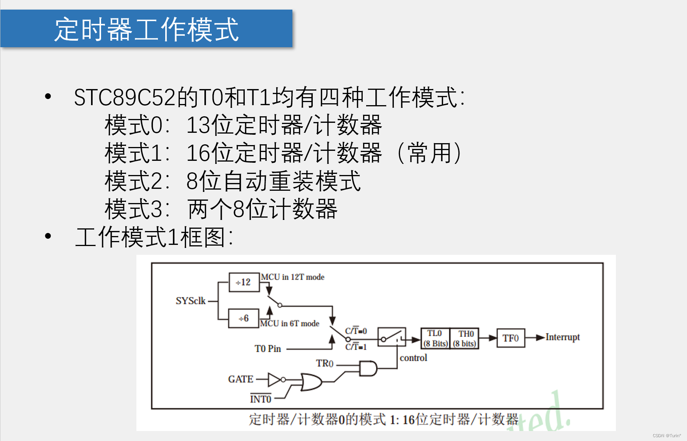
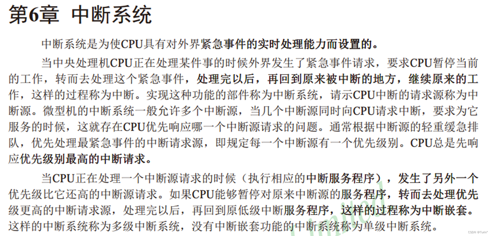
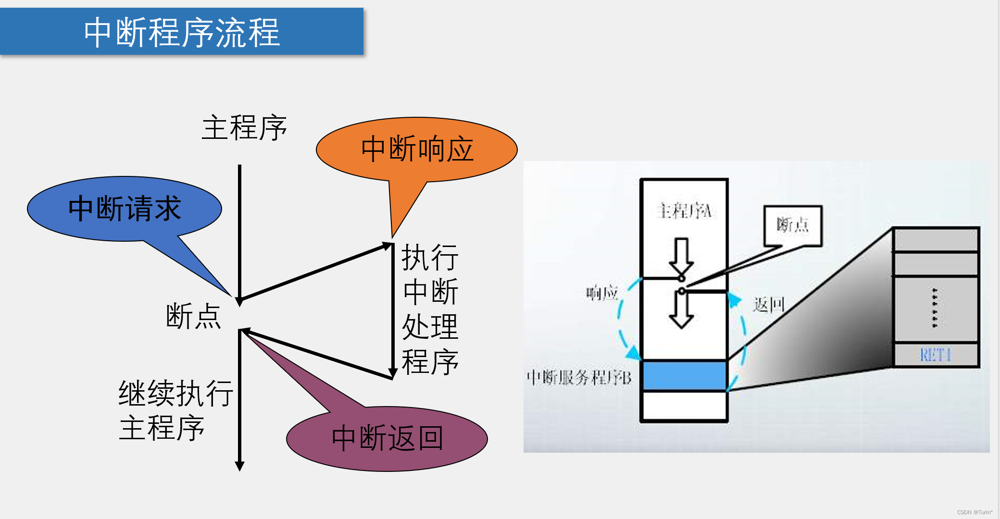
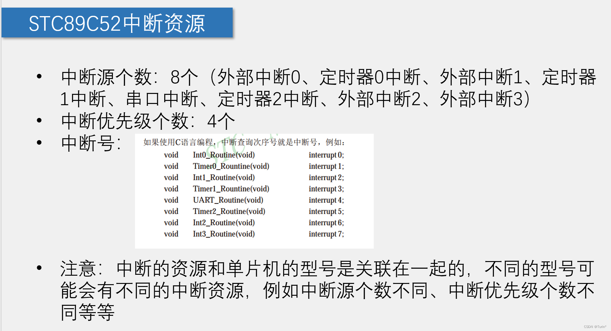
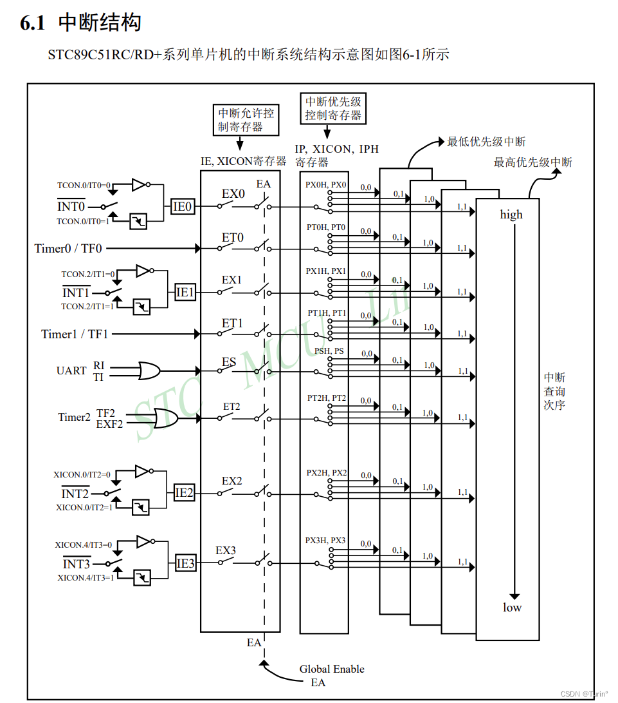
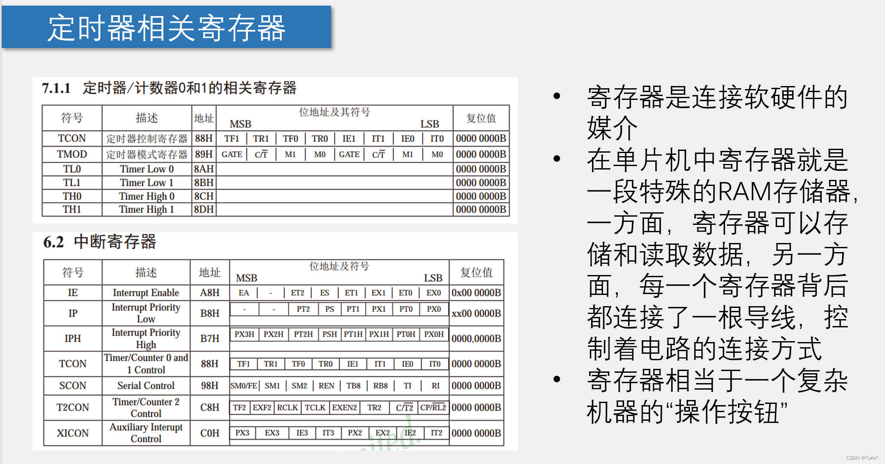
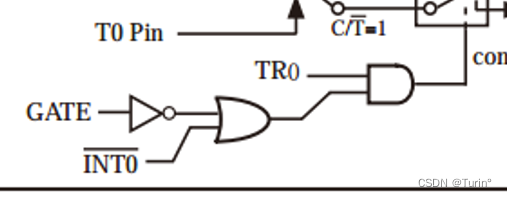

# [51单片机] 第七节 定时器和中断总结

## ==前言：定时器中断 ，寄存器都是单片机中非常重要的概念，涉及到许多交叉的控制，掌握好这些知识点是学习单片机的关键。==
## 51单片机的时钟源
1.外部脉冲
2.系统时钟（晶振），开发板上周期为12MHZ

## 一、定时器简介
- 注意：当时钟源为外部(T0)引脚提供时，定时器作为“计数器”作用，当外部每输入一个脉冲信号，计数器计数加一（不是常用功能）。
## 二、定时器工作模式

C/NT：当次开关为1时，为计数器功能(counter)，配置T0引脚，当为0时，即定时器功能(timer)，配置系统时钟。

**定时器整个工作系统分为三个模块：**
- 时钟模块: SYSclk,T0 pin ，此图为12分频的模式
- 计数模块/中断系统：计数范围：0~65530：计数溢出时会置标志位TF0,申请中断
- 控制模块:  GATE,NINT0,TR0

## 三、中断系统简介

 - 高优先级的中断可以打断低优先级的中断
 - 中断系统即对紧急事件的实时处理

## 四、中断系统工作流程

## 五、stc89c52的中断资源

## 六、中断系统的结构

- ==寄存器解释，中断系统的详细原理见数据手册（养成良好的阅读素养）==
## 寄存器的简介

- **==寄存器相当于连接单片机中电路的“特殊开关”==**

**ps: GATE直接给0 ，一级或门输出一，二级与门输出由TR0控制是否进行计数**
