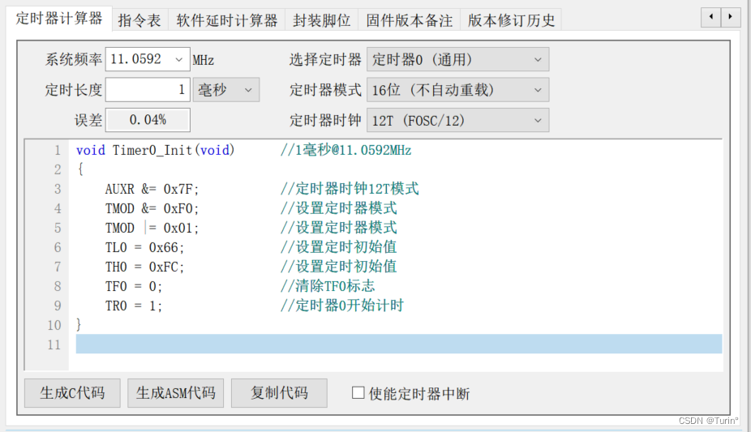
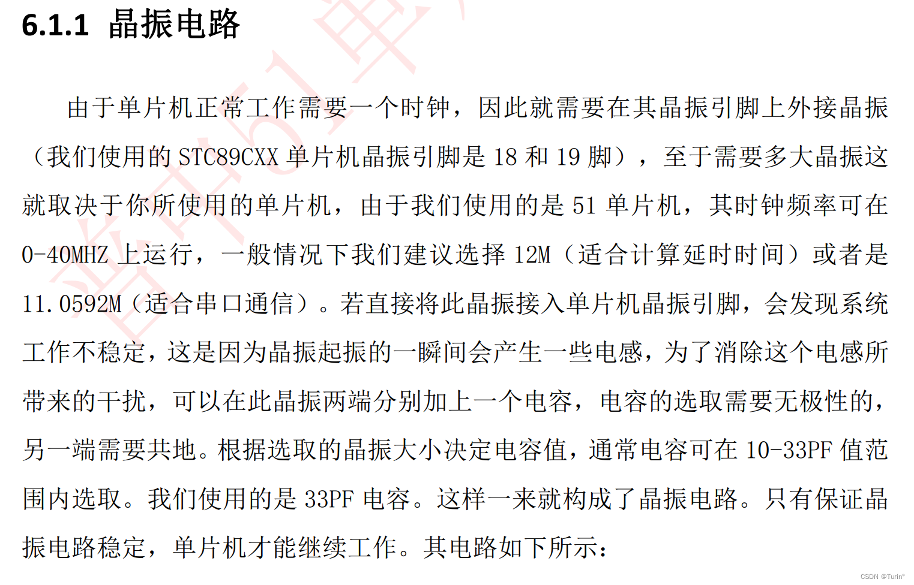

# [51单片机] 第七节 定时器和中断总结<代码部分>
### ps: 单片机的可位寻址/不可位寻址
- 可位寻址：可以对单个位赋值
- 不可位寻址：只能整体赋值 

代码示例：
```c
void Timer0_Init()
{
		TMOD=0x01; //0000 0001
		TF=0;
}
```

### 定时器的快捷配置

## 晶振电路简介（这里所使用晶振为11.0592MHZ)

## 一、中断测试代码
```c 
#include <REGX52.H>
#include "Tmier0.h"

// void Timer0_Init()//定时器配置
// {
// 		//TMOD=0x01; //0000 0001 //缺点：会影响到其他定时器
// 		TMOD &= 0xF0;//把TMOD的低四位清零，高四位保持不变 //优点：不影响高四位（其他定时器的配置）
// 		TMOD |=  0X01;//把TMOD的最低为置1，高四位保持不变
// 		TF0=0; // Gate = 0;
// 		TR0 = 1;//定时器0允许计数
// 		//mark
// 		TH0=64535/256;//16进制 取高八位
// 		TL0=64535%256;//取低八位
// 		ET0=1;//T0的中断溢出允许位
// 		EA=1;//总的允许位
// 		PT0=0;// IP
// }


//mark
//分析：如何计1s？
//0~65535
//每隔1us计数加一 12M 12分频
//总共定时时间65535us
//64535离计数器溢出差值1000，所以计时时间为1ms
//最大计65ms,所以这里分出1ms比较合适，再定义其他变量进行秒的计数


void main()
{
	Timer0_Init();//定时器初始化，中断溢出会跳到  Timer0_Routine() interrupt 1
	while(1)
	{
	
	}
}

//unsigned int T0Count;//全局变量
void Timer0_Routine() interrupt 1 //中断子程序
{
		
		static unsigned int T0Count;//静态局部变量，保证退出函数之后不销毁
		//TH0=64535/256;//计数器溢出中断后，计数会清理，所以每次进入中断后需要再赋初值
		//TL0=64535%256;
		TL0 = 0x66;				//设置定时初始值
		TH0 = 0xFC;				//设置定时初始值	
		T0Count++;//每次进入中断子程序，秒控制器自加一
		if(T0Count>=1000)//每1s执行对P2_0的操作
		{
			T0Count=0;
			P2_0 =~P2_0;
		}
}
```

## ps: 中断执行模块不宜存在过于复杂的任务

## 二、基于中断系统的流水灯按键控制
```c
#include <REGX52.H>
#include "Timer0.h"
#include "Key.h"
#include <INTRINS.H>

// void Timer0_Init()//定时器配置
// {
// 		//TMOD=0x01; //0000 0001 //缺点：会影响到其他定时器
// 		TMOD &= 0xF0;//把TMOD的低四位清零，高四位保持不变 //优点：不影响高四位（其他定时器的配置）
// 		TMOD |=  0X01;//把TMOD的最低为置1，高四位保持不变
// 		TF0=0; // Gate = 0;
// 		TR0 = 1;//定时器0允许计数
// 		//mark
// 		TH0=64535/256;//16进制 取高八位
// 		TL0=64535%256;//取低八位
// 		ET0=1;//T0的中断溢出允许位
// 		EA=1;//总的允许位
// 		PT0=0;// IP
// }


//mark
//分析：如何计1s？
//0~65535
//每隔1us计数加一 12M 12分频
//总共定时时间65535us
//64535离计数器溢出差值1000，所以计时时间为1ms
//最大计65ms,所以这里分出1ms比较合适，再定义其他变量进行秒的计数

unsigned char keynum,LEDMode;
void main()
{
	P2=0xFE;//初始化，点亮第一个LED
  Timer0_Init();//定时器初始化，中断溢出会跳到  Timer0_Routine() interrupt 1
	while(1)
	{
				keynum = Key();
				if(keynum)
				{
					if(keynum == 1)
					{
						LEDMode++;
						if(LEDMode>=2)LEDMode=0;
					}
				}
	}
}
 

//unsigned int T0Count;//全局变量
 void Timer0_Routine() interrupt 1 //中断子程序
 {
		
 		static unsigned int T0Count;//静态局部变量，保证退出函数之后不销毁
 		//TH0=64535/256;//计数器溢出中断后，计数会清理，所以每次进入中断后需要再赋初值
 		//TL0=64535%256;
 		TL0 = 0x66;				//设置定时初始值
 		TH0 = 0xFC;				//设置定时初始值	
 		T0Count++;//每次进入中断子程序，秒控制器自加一
 		if(T0Count>=500)
 		{
 			T0Count=0;
 			if(LEDMode == 0)
				P2=_crol_(P2,1);//循环左移
			if(LEDMode == 1)
				P2=_cror_(P2,1);//循环右移，类似于移位寄存器（存在反馈电路）
 		}
 }
```
==crol和cror函数区别于<<，>>移位操作符，具有“循环移位”的特性，不需要考虑移位“溢出”；==
## 三、基于定时器的LCD数字时钟

```c
#include <REGX52.H>
#include "LCD1602.h"
#include "Timer0.h"

unsigned int sec=55,min=59,hour=23; //秒时钟 分时钟 小时时钟 这里我们赋上初值
	
void main()
{
		LCD_Init();
	  LCD_ShowString(1,1,"CLOCK:");//字符串静态显示不需要放在while中
		LCD_ShowString(2,3,":  :  ");
		//LCD_ShowNum(2,1,sec,2);//需要更新显示
		Timer0_Init();
		while(1)
		{
			LCD_ShowNum(2,1,hour,2);//思考：动态的信号需要更新显示，静态的信号一般不用放在while循环中
			LCD_ShowNum(2,4,min,2);
			LCD_ShowNum(2,7,sec,2);
		}
}


void Timer0_Routine() interrupt 1 //中断子程序 秒控制计数器
{
		static unsigned int T0Count;//静态局部变量，保证退出函数之后不销毁  //不定义为全局变量是为了作为子函数内容，方便调用这个函数模板
		TL0 = 0x66;				//设置定时初始值
		TH0 = 0xFC;				//设置定时初始值	
		T0Count++;//每次进入中断子程序，秒控制器自加一
		if(T0Count>=1000)//每1s执行对P2_0的操作
		{
			T0Count=0;
			P2_0=~P2_0;
			sec++;		
				if(sec >=60)
				{
					sec=0;
					min++;
				}
				if(min >=60)
				{
					min=0;
					hour++;
				}
				if(hour >=24)
				{
					hour=0;
				}
		}
}
```

**思考：Verilog/VHDL和单片机（c语言) 程序执行区别？**
- ==c语言程序为顺序执行，而非并行执行，单片机中需要动态执行的任务要放在while循环体中==
