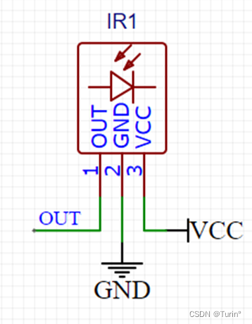
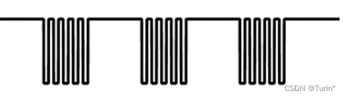
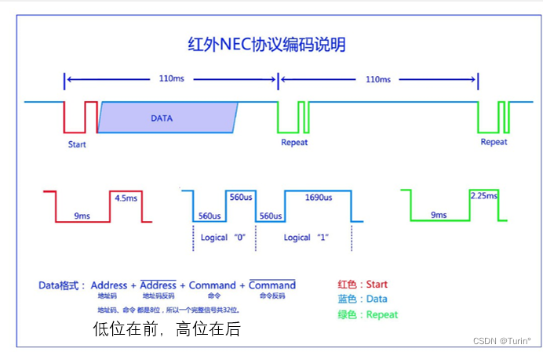
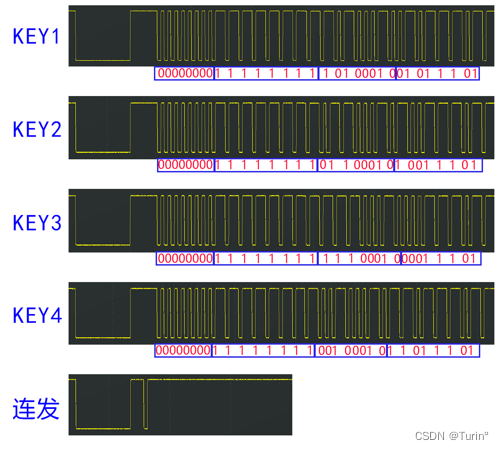
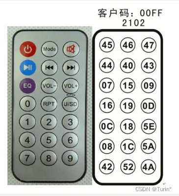
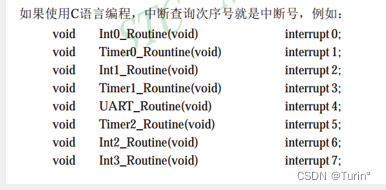
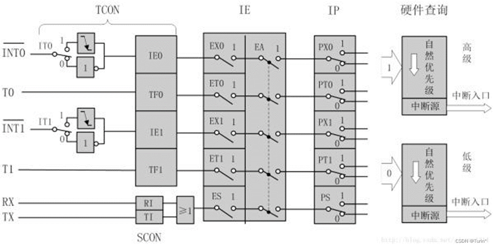
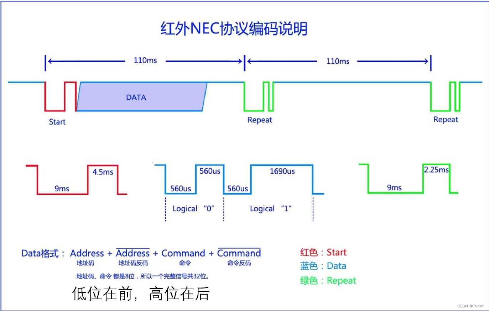
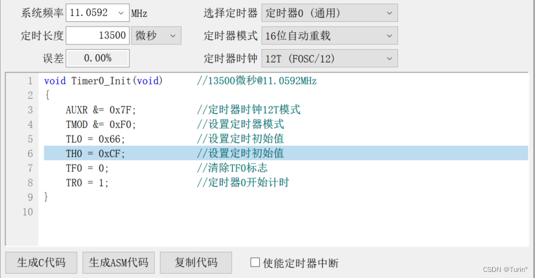
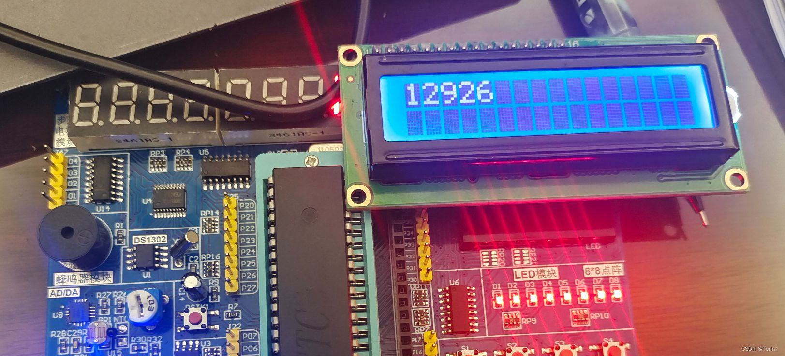

# 【51单片机】第十七讲 红外通信

2024.2.2日更新

## 一、使用模块
### 红外遥控
1. 介绍：红外遥控是利用红外光进行通信的设备，由红外LED将==调制==后的信号发出，由专用的红外接收头进行==解调==输出。
2. 红外LED波长：940nm，红外信号属于电磁波
3. 通信协议标准：==NEC标准== 

### 红外接收管

## 二、原理部分
### 一、红外通信的原理
- 空闲状态：红外LED不亮，接收头输出高电平
- 发送低电平：红外LED以38KHz频率闪烁发光，接收头输出低电平
- 发送高电平：红外LED不亮，接收头输出高电平
总而言之，只有红外LED发送38KHZ的闪烁信号时，红外接收头OUT引脚才会对外输出低电平信号
红外发送--红外接收的本质是==调制==和==解调==，在这种条件下，可以过滤掉自然界中的“噪声信号”，只有38KHZ附近的红外信号才能被红外接收头识别转换为对应的低电平。

**转换示意图：**
1.红外LED发出的信号

2.红外接收头发出的信号

其中，红外接收头发出的低电平信号的宽度等价于红外LED发送的38KHz信号的时间。

### 二、NEC通信的原理

#### 一、红外NEC协议

在51单片机中，使用NEC通信协议，虽然NEC标准上要求（比如说Start信号）低电平持续时间9ms,高电平持续时间4.5ms，但是stc89c52用红外通信要使用到外部中断，外部中断检测方式有两种：低电平/下降沿，我们这里使用下降沿检测方式，一个完整的Start信号，包含两个下降沿，即触发两次中断，所以只要从第一次中断开始起始，第二次中断判断时间长度，即可分辨是Start还是Repeat信号。

#### 二、NEC编码

**NEC编码包括地址码和命令码，其中地址吗和命令码都会进行一次反码校验。因此，一段完整的NEC数据码一共有4个字节，32位bit**

遥控器键码

这里，我们定义地址码为==Address==,命令码为==Command==, 完整的数据码为==DATA==，如果我们按下0,那么发送的**Address=0x00; Command =0x16; 那么DATA一共包含0X00,0XFF,0X16,~0X16四个字节的先后数据。**

### 三、外部中断的原理
- STC89C52有四个外部中断
- STC89C52外部中断有两种方式：下降沿/低电平触发
- 中断号

外部中断配置的寄存器：

# 三、代码部分
## #重要调试过程
**11.0592MHZ和12MHZ的定时器计数速率不一致，硬件电路或者程序运行速度相关问题，可能导致实际的（比如Start命令）宽度并不是很接近于标准的通信协议，需要我们自己去调试，这里我在调试的过程中遇到了一些问题，以下为相关代码和解决方法**

外部中断
```bash
#include <REGX52.H>
#include "Timer0.h"
#include "Delay.h"
#include "LCD1602.h"
#include "INT0.h"

unsigned char Num;
void main()
{
	LCD_Init();
	Int0_Init();
	while(1)
	{
		LCD_ShowNum(1,1,Num,2);
	}
}

void Int0_Rountine(void)	interrupt 0
{
	Num++;
}
```

```bash
#include <REGX52.H>

/**
  * @brief 
  * @param  
  * @retval 
			
  */
	
void Int0_Init(void)		//@11.0592MHz
{
	IT0=1;
	IE0=0;
	EX0=1;
	EA=1;
	PX0=1;
}

/*
void Int0_Rountine(void)	interrupt 0;
{
	
}
*/
```
Timer0计时模块编写,用作跟红外通信相关的编码时序计时


```bash
#include <REGX52.H>


void Timer0_Init(void)		//@11.0592MHz
{
	TMOD &= 0xF0;
	TMOD |= 0x01;			
	TL0 = 0x00;				
	TH0 = 0x00;				
	TF0 = 0;				
	TR0 = 0;				
	ET0=1;
	EA=1;
	PT0=0;
}

void Time0_SetCounter(unsigned int Number)
{
	TL0=0x0F&Number;
	TH0=0xF0&Number;
}

unsigned int Time0_GetCounter()
{
	unsigned int number;
	number=TL0+TH0;
	return number;
}
	
void Time0_Run(unsigned char Flag)
{
	if(Flag)
	{
		TR0=1;
	}
	else
	{
		TR0=0;
	}
}
/*定时器中断函数模板
void Timer0_Routine() interrupt 1 //中断子程序
{
		
		static unsigned int T0Count;//静态局部变量，保证退出函数之后不销毁
		TL0 = 0x66;				//设置定时初始值
		TH0 = 0xFC;				//设置定时初始值	
		T0Count++;//每次进入中断子程序，秒控制器自加一
		if(T0Count>=1000)//每1s执行对P2_0的操作
		{
			T0Count=0;
			P2_0 =~P2_0;
		}
}
*/
```
**红外通信模块**
>测试结果：红外可以接收，但是无法发送起始命令（按下按键后，LED不亮）
>问题分析 ：计时器计数的时长不在我们 > if(IR_Time>=13500-500 && IR_Time<=13500+500) < 语句的判断范围内
>解决方案：修改if语句的判断范围，使之能检测到Start命令，并用LCD1602显示定时器发送Start命令实际的定时器计数数值IR_Time。
```bash
#include <REGX52.H>
#include "Timer0.h"
#include "INT0.h"

unsigned char IR_ADDRESS;
unsigned char IR_State;
unsigned char IR_Time;

void IR_Init()//红外中断初始化
{
	Timer0_Init();
	Int0_Init();
}

void Int0_Rountine(void)	interrupt 0 //外部中断函数，使用状态机方法
{
	if(IR_State==0)//起始时，一但红外管检测到按键按下，就会进入外部中断程序，从状态0开始
	{
		Timer0_SetCounter(0);
		Timer0_Run(1);
		IR_State=1;
	}
	
	else if(IR_State==1)//状态1
	{
		IR_Time=Timer0_GetCounter();
		Timer0_SetCounter(0);
		if(IR_Time>=13500-500 && IR_Time<=13500+500)//检测红外管是否发送起始命令
		{
			P2=0;
			IR_State=2;
			Timer0_SetCounter(0);
		}
		else if(IR_Time>=11250-500 && IR_Time<=11250+500)//重复命令
		{
			IR_State=0;
			Timer0_SetCounter(0);
		}
		else
		{
			IR_State=1;//自循环
		}
	}
}
```
测试定时器是否正常计数
问题1：延时函数用到12MHZ,需要改写
问题2:   Timer0模块多个函数编写存在问题

```bash
#include <REGX52.H>
#include "Timer0.h"
#include "Delay.h"
#include "LCD1602.h"
#include "INT0.h"
#include "IR.h"

unsigned char Num;//Num只能到255
void main()
{
	LCD_Init();
	Timer0_Init();
	Timer0_SetCounter(0);
	Timer0_Run(1);
	Delay(1);
	LCD_ShowNum(1,1,Timer0_GetCounter(),5);
	while(1)
	{
		
	}
}
```
修改后，再次测试...
延时13ms观察定时器计数，通过LCD可以看到,13ms对应的计数居然是12076, 不符合12MHZ的通信要求，由此，我们要重新运算通信时序时长

使用时间转换器Timer0_usCount ，对比结果，显示真实的13500ms对应的定时器计数值
```c
#include <REGX52.H>
#include "Timer0.h"
#include "Delay.h"
#include "LCD1602.h"
#include "INT0.h"
#include "IR.h"

unsigned char Num;
void main()
{
	LCD_Init();
	Timer0_Init();Timer0_SetCounter(0);Timer0_Run(1);
	Delay(13);
	LCD_ShowNum(1,1,Timer0_GetCounter(),5);
	LCD_ShowNum(2,1,Timer0_usCount(0x66,0xCF),5);
	while(1)
	{
		
	}
}
```

实际红外管，起始命令的时长为"12926"
```bash 
#include <REGX52.H>
#include "Timer0.h"
#include "INT0.h"
#include "LCD1602.h"

unsigned char IR_ADDRESS;
unsigned char IR_State;

//unsigned char IR_Time; 错误！！！这里定义为字符类型，对应的数值仅有255，对应的13500无法赋值给IR_Time
unsigned int IR_Time;

void IR_Init()//红外中断初始化
{
	Timer0_Init();
	Int0_Init();
}

void Int0_Rountine(void)	interrupt 0 //外部中断函数，使用状态机方法
{
	if(IR_State==0)//起始时，一但红外管检测到按键按下，就会进入外部中断程序，从状态0开始
	{
		Timer0_SetCounter(0);
		Timer0_Run(1);
		IR_State=1;
	}
	else if(IR_State==1)//状态1
	{
		IR_Time=Timer0_GetCounter();
		Timer0_SetCounter(0);
		if(IR_Time>12926-500 && IR_Time<12926+500)//检测红外管是否发送起始命令
		{
			LCD_ShowNum(1,1,IR_Time,5);
			P2=0;
			IR_State=2;
			Timer0_SetCounter(0);
		}
		else if(IR_Time>=1000 && IR_Time<=2000)//重复命令
		{
			IR_State=0;
			Timer0_SetCounter(0);
		}
		else
		{
			
			P2_5=1;
			P2_5=0;
			P2_5=1;
			IR_State=1;//自循环
		}
	}
}
```
**经过对代码的修改后，将程序烧录到单片机上，在LCD1602上显示能够进入>if(IR_Time>12926-500 && IR_Time<12926+500)语句的命令时长<**

**IR_Time在12926附近浮动，可见用标准的13500作为代码中的时长判断并不合适，同理，后续的其他命令时长（低电平/高电平/Repeat/)也用这种方法测试（调大判断范围、显示真实时长、修改合适的范围）**

## 一、外部中断

1.外部中断寄存器配置

```bash
#include <REGX52.H>

/**
  * @brief 
  * @param  
  * @retval 
			
  */
	
void Int0_Init(void)		//@11.0592MHz
{
	IT0=1;//下降沿触发中断
	IE0=0;
	EX0=1;
	EA=1;
	PX0=1;
}

/*
void Int0_Rountine(void)	interrupt 0;
{
	
}
*/
```
2.对定时器0进行重编写
```bash
#include <REGX52.H>


void Timer0_Init(void)		//@11.0592MHz
{
	TMOD &= 0xF0;
	TMOD |= 0x01;			
	TL0 = 0x00;				
	TH0 = 0x00;				
	TF0 = 0;				
	TR0 = 0;				
	ET0=1;
	EA=1;
	PT0=0;
}

///TH0 TL0不能随便给Number的，有高低位之分！
void Timer0_SetCounter(unsigned int Number)
{
	TH0=Number/256;
	TL0=Number%256;
}

//!!!
unsigned int Timer0_GetCounter(void)
{
	//number=TL0+TH0;
	return (TH0<<8)|TL0;
}

//!!!
void Timer0_Run(unsigned char Flag)
{
//	if(Flag)
//	{
//		TR0=1;
//	}
//	else
//	{
//		TR0=0;
//	}
	TR0=Flag;
}

unsigned int Timer0_usCount(unsigned int TL,unsigned int TH)//时间转换器
{
	unsigned int us = (0xFF-TH)*16*16 + (0xFF-TL);
	return us;
}

/*定时器中断函数模板
void Timer0_Routine() interrupt 1 //中断子程序
{
		
		static unsigned int T0Count;//静态局部变量，保证退出函数之后不销毁
		TL0 = 0x66;				//设置定时初始值
		TH0 = 0xFC;				//设置定时初始值	
		T0Count++;//每次进入中断子程序，秒控制器自加一
		if(T0Count>=1000)//每1s执行对P2_0的操作
		{
			T0Count=0;
			P2_0 =~P2_0;
		}
}
*/
```
3.红外通信模块
```bash
#include <REGX52.H>
#include "Timer0.h"
#include "INT0.h"


//unsigned char IR_Time; 错误！！！这里定义为字符类型，对应的数值仅有255，对应的13500无法赋值给IR_Time
unsigned int IR_Time;
unsigned char IR_State;

unsigned char IR_Data[4];
unsigned char IR_Data_p;

unsigned char IR_DataFlag;
unsigned char IR_RepeatFlag;

unsigned char IR_Address;
unsigned char IR_Command;


void IR_Init()//红外中断初始化
{
	Timer0_Init();
	Int0_Init();
}

unsigned char IR_GetAdress(void)
{
	return IR_Address;
}

unsigned char IR_GetCommand(void)
{
	return IR_Command;
}

unsigned char IR_GetDataFlag(void)
{
	unsigned int Flag = IR_DataFlag;
	IR_DataFlag=0;
	return Flag;
}

unsigned char IR_GetRepeatFlag(void)
{
	unsigned int Flag = IR_RepeatFlag;
	IR_RepeatFlag=0;
	return Flag;
}


void Int0_Rountine(void)	interrupt 0 //外部中断函数，使用状态机方法
{
	if(IR_State==0)//起始时，一但红外管检测到按键按下，就会进入外部中断程序，从状态0开始
	{
		Timer0_SetCounter(0);
		Timer0_Run(1);
		IR_State=1;
	}
	else if(IR_State==1)//状态1
	{
		IR_Time=Timer0_GetCounter();
		Timer0_SetCounter(0);
		if(IR_Time>12926-500 && IR_Time<12926+500)//检测红外管是否发送起始命令
		{
			P2=0;
			IR_State=2;
		}
		else if(IR_Time>11250-500 && IR_Time<11250+500)//重复命令
		{
			IR_RepeatFlag=1;
			IR_State=0;
			Timer0_Run(0);
			
		}
		else
		{
			IR_State=1;//自循环
		}
	}
	else if(IR_State==2)//状态2
	{
		IR_Time=Timer0_GetCounter();
		Timer0_SetCounter(0);
		if(IR_Time>1032-500 && IR_Time<1032+500)//将IR_Data中的某一位置零
		{
			IR_Data[IR_Data_p/8] &= ~(0x01<<(IR_Data_p%8)); // 0x01<<1 0000 0001 0000 0010 ~(0x01<<1) 1111 1110 1111 1101
			//IR_Data_p++/8,对应的值从0到3
			//IR_Data_p++%8,对应的值0~7循环四轮
			IR_Data_p++;//Data的二进制位指针,0~31
		}
		else if(IR_Time>2074-500 && IR_Time<2074+500)
		{
			IR_Data[IR_Data_p/8] |= (0x01<<(IR_Data_p%8)); // 0x01<<1 0000 0001 0000 0010 ~(0x01<<1) 1111 1110 1111 1101
			//IR_Data_p++/8,对应的值从0到3
			//IR_Data_p++%8,对应的值0~7循环四轮
			IR_Data_p++;//Data的二进制位指针,0~31
		}
		else
		{
			IR_Data_p=0;
			IR_State=1;
		}
		if(IR_Data_p>=32)
		{
			IR_Data_p=0;//位指针清零
			if((IR_Data[0] == ~IR_Data[1]) && (IR_Data[2] == ~IR_Data[3]))
			{
				IR_DataFlag=1;
				IR_Address=IR_Data[0];
				IR_Command=IR_Data[2];
			}
			Timer0_Run(0);
			IR_State=0;
		}
	}
}
```
3.主函数
运行问题1：在没有>IR_GetDataFlag()||IR_GetRepeatFlag()<的情况下，按下对应的红外按键也会产生连加的现象，这里
//		if(Command\==0x15)
//		{
//			Num--;
//		}
//		if(Command\==0x09)
//		{
//			Num++;
//		}跳出了>if(IR_GetDataFlag())，**只要红外遥控发出信号，红外发送管会产生对应的数据码，只要红外发送管产生单个方波信号，NUM也能自加，正确情况下应该是产生完整的数据码，然后标志位=1，NUM才能加一，这里出现了代码书写逻辑的错误**<
```bash
#include <REGX52.H>
#include "LCD1602.h"
#include "IR.h"

unsigned char Num;
unsigned char Command,Address;
void main()
{
	LCD_Init();
	IR_Init();
	LCD_ShowString(1,1,"ADR  COM  NUM");//tab键会被识别
	LCD_ShowHexNum(2,1,00,2);
	LCD_ShowHexNum(2,6,00,2);
	LCD_ShowNum(2,11,00,3);
	while(1)
	{
		if(IR_GetDataFlag()||IR_GetRepeatFlag())//IR_GetRepeatFlag连加标志位
		{
			Command=IR_GetCommand();
			Address=IR_GetAdress();
			LCD_ShowHexNum(2,1,Address,2);
			LCD_ShowHexNum(2,6,Command,2);
			if(Command==0x15)
			{
				Num--;
			}
			if(Command==0x09)
			{
				Num++;
			}
			LCD_ShowNum(2,11,Num,3);
		}
//		if(Command==0x15)
//		{
//			Num--;
//		}
//		if(Command==0x09)
//		{
//			Num++;
//		}
//		LCD_ShowNum(2,8,Num,2);
	}
}
```
修改完成后，运行正常
>**现象：按下对应的按键，LCD1602上会显示对应的地址码，键码，以及NUM，按下控制NUM加减的按键，NUM会正确地进行自加减，并且具备连加/减地功能**
>**==本程序用到了大量函数封装的方法，便于我们进行调用以及参数的判断，模块化编程极大地优化了代码的结构以及可移植性==**
## 二、红外通信+PWM控制电机转速
1.主函数
**由于红外通信和PWM都要用到定时器/中断，这里同时使用到STC89C52中的定时器0和定时器1，使用定时器/红外中断时要注意区分优先级**
```bash
#include <REGX52.H>
#include "IR.h"
#include "Timer1.h"
#include "Nixie.h"
#include "Motor.h"

unsigned char Num;
unsigned char Command,Address;
unsigned char Speed;

void main()
{
	Motor_Init();
	IR_Init();
	while(1)
	{
		Command=IR_GetCommand();
		if(IR_GetDataFlag())
		{
			if(Command==IR_VOL_ADD)
			{
				Speed++;
				Speed%=4;
			}
		}
		switch(Speed)
		{
			case 0:Motor_CompareSet(0);break;
			case 1:Motor_CompareSet(50);break;
			case 2:Motor_CompareSet(75);break;
			case 3:Motor_CompareSet(100);break;
		}
		Nixie(1,Speed);
	}
}
```
2.直流电机模块（定时器1）
这里将占空比封装成函数
**思考：直接将子模块中的参数封装成函数，和直接调用全局变量的区别？**
封装成函数更便于调用
```bash
#include <REGX52.H>
#include "Timer1.h"


unsigned char Count,Compare;

sbit Motor = P1^3;

void Motor_Init(void)
{
	Timer1_Init();
}

void Motor_CompareSet(unsigned char num)//占空比设置
{
	Compare=num;
}

		
void Timer1_Routine() interrupt 3 //PWM控速
{
		TL1 = 0x9C;				
		TH1 = 0xFF;		
		Count++;
		Count%=100;
		if(Count<Compare)
		{
			Motor=1;
		}
		else
		{
			Motor=0;
		}
}
```
>**现象：按下红外遥控上对应的按键，直流电机速度发生变化**
