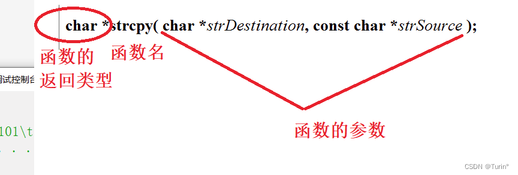
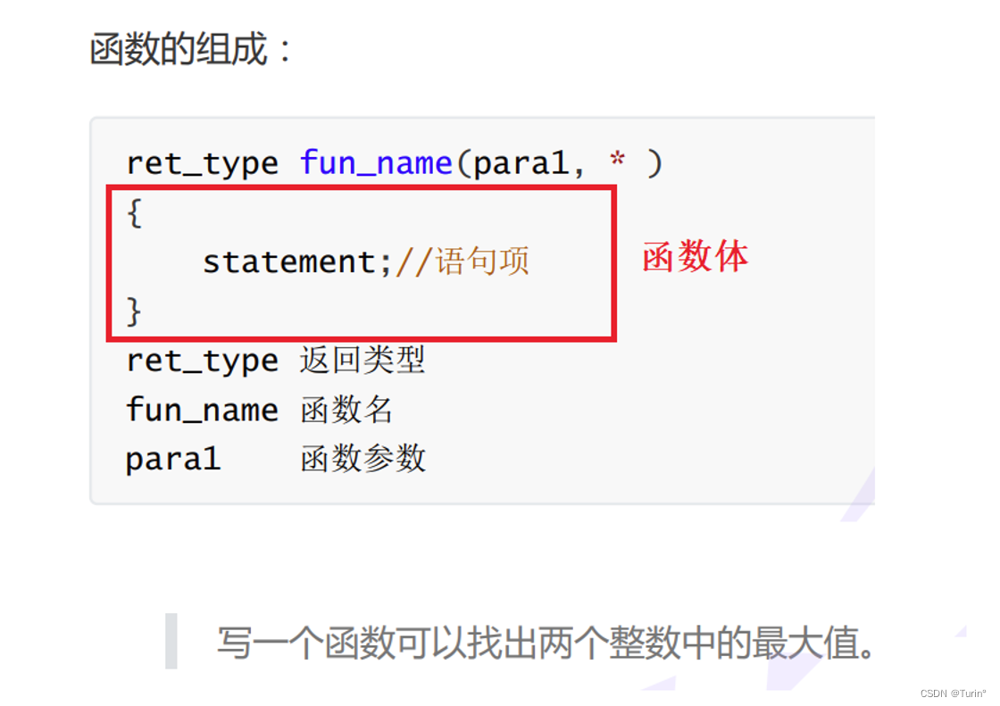
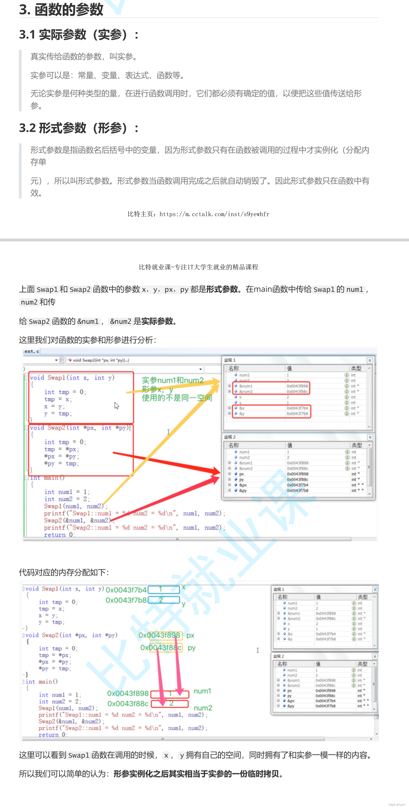

# 【C语言入门学习】函数的概念01

## #前言
数学中我们常见到函数的概念，函数是数学学习的核心思想，而计算机语言中的函数是编程的核心思想。

---

### 一、函数的定义：
维基百科中对函数的定义：[子程序](https://zh.wikipedia.org/wiki/%E5%AD%90%E7%A8%8B%E5%BA%8F)

- 在计算机科学中，子程序（英语：Subroutine, procedure, function, routine, method,subprogram, callable unit），是一个大型程序中的某部分代码， 由一个或多个语句块组成。它负责完成某项特定任务，而且相较于其他代 码，具备相对的独立性。
- 一般会有输入参数并有返回值，提供对过程的封装和细节的隐藏。这些代码通常被集成为软件库。

### 二、函数的分类
- 库函数
- 自定义函数

#### 为什么会有库函数？
c语言的基础库中提供了一系列函数库，便于我们对一些经常使用的函数进行调用，==避免重复造轮子==

#### 如何查找库函数？
以下为常用的网站：
[cplusplus.com](https://cplusplus.com/reference/) 
[cppreference.com](https://en.cppreference.com/w/) 
- 其中 **cppreference** 在edge上支持插件，在URL搜索框输入"cc"+"空格"即可实现快速查询函数的定义、使用方式、对应的封装库
#### 常见的库函数
- IO函数:如printf、scanf、
- 字符串操作函数：如strlen
- 字符操作函数
- 内存操作函数
- 时间/日期函数
- 数学函数
- 其他库函数

示例：
```c
#define _CRT_SECURE_NO_WARNINGS 1
#include<stdio.h>
#include<string.h>
int main1()
{
	//库函数的认识
	//学习c语言过程中，遇到陌生函数，主动参考文档网站（学会使用工具搜索）
	char arr1[20] = { 0 };
	char arr2[] = "hello world";
	strcpy(arr1, arr2);//字符串拷贝
	printf("%s\n", arr1);
	memset(arr1, 'x', 5);//设置内存块
	printf("%s\n", arr1);
	return 0;
	//学习重点：自定义函数
}
```

**总而言之，要使用库函数，必须通过#inlcude包含对应的头文件**
- include<>：程序语言的标准库头文件，指向的是语言安装的根目录
- include" "：我们自己创建的头文件，指向的是工程的根目录
#### 为什么要写自定义的函数？
由我们程序员自由设计函数，能够更好地加深我们的代码编写思维，更加灵活地编写程序，使我们地代码具有更大地发挥空间。

**函数的组成：**

==函数返回值类型== ==函数名==(==形参==，==形参==）
{
==函数体==；
==返回值==（若需要）；
}


头文件调用：
```c
#define _CRT_SECURE_NO_WARNINGS 1
#include<stdio.h>
```
示例1：找出两个数中的最大值
```c
int get_max(int x, int y)
{
	int z = 0;
	if (x > y)
		z = x;
	else
		z = y;
	return z;//返回z
}
```

示例2：交换两个数的值
- Swap1
```c
void Swap1(int x, int y)
{
	int temp = x;//temp = 0
	x = y;// x = 1
	y = temp;//y = 0
}
```
- Swap2
```c
//通过指针，操作变量的值
void Swap2(int* pa, int* pb)//实际上，这里也创建了两个新的变量（形参），用于存放地址
{
	//将值，传递给对应地址的内存空间，成功改变了变量a,b的值
	int temp = *pa;
	*pa = *pb;
	*pb = temp;
}
```
main函数
```c
int main()
{
	int a = 10;
	int b = 20;
	//函数的调用
	int max = get_max(a, b);

	printf("%d\n", max);

	//写一个函数 -交换两个整型变量的值
	printf("交换前：a=%d b=%d\n", a, b);
	Swap1(a, b);//形参不影响实参，实际上Swap函数创建了另外地址，操纵的是完全不同的内存空间
	printf("交换后：a=%d b=%d\n", a, b);

	int* pa = &a;//pa就是一个指针变量
	*pa = 15;//通过pa，操纵指定地址的变量的值
	printf("%d\n", a);
	printf("交换前：a=%d b=%d\n", a, b);
	Swap2(&a, &b);
	printf("交换后：a=%d b=%d\n", a, b);
	return 0;
}
```

**示例1 运行结果**
\>>20
*正确*
**示例2 运行结果1**
\>>交换前：a=10 b=20
\>>交换后：a=10 b=20
==未实现交换两个变量值的作用==

**分析：**
>**交换两个整型变量的值：void表示这个函数不返回任何值，也不需要返回
>swap1在被调用的时候，实参传给形参，其实形参是实参的一份临时拷贝
>改变形参，不能改变实参**

ps:markdown也使用转义字符,实现特定符号的显示

**示例2 运行结果2**
\>>15
\>>交换前：a=15 b=20
\>>交换后：a=20 b=15
==未实现交换两个变量值的作用==

>**通过指针，操作变量的值，实际上Swap2函数，定义了两个变量pa，pb用于存放地址，通过解引用直接操纵对应地址的内存空间，进而实现了对外部变量的改变**

板书：

## 总结：
1. 学会通过网站查询标准库
2. **形参不会改变实参，要通过函数实现对形参的改变，需要用到指针（地址），操纵指定的内存空间。**
3. 学会自定义函数
