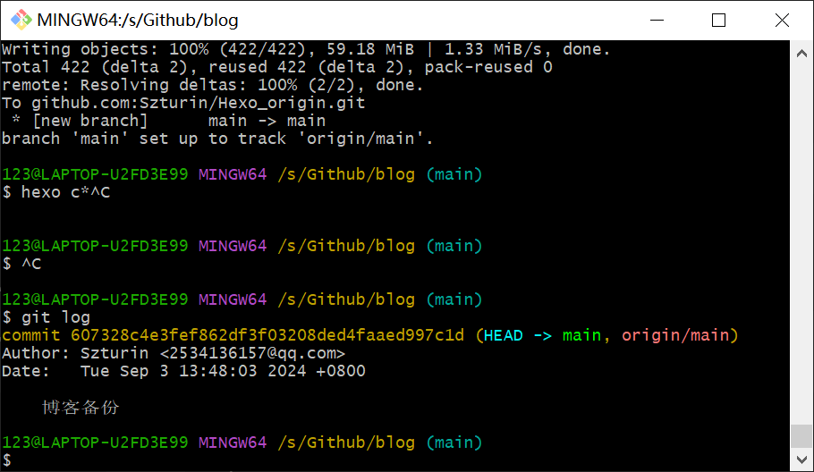
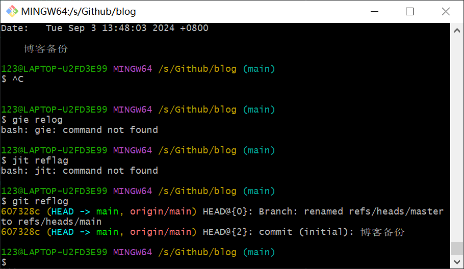
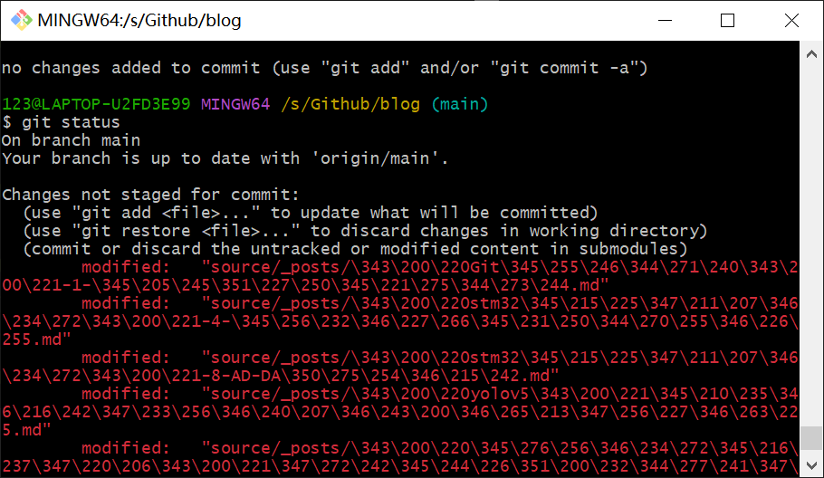
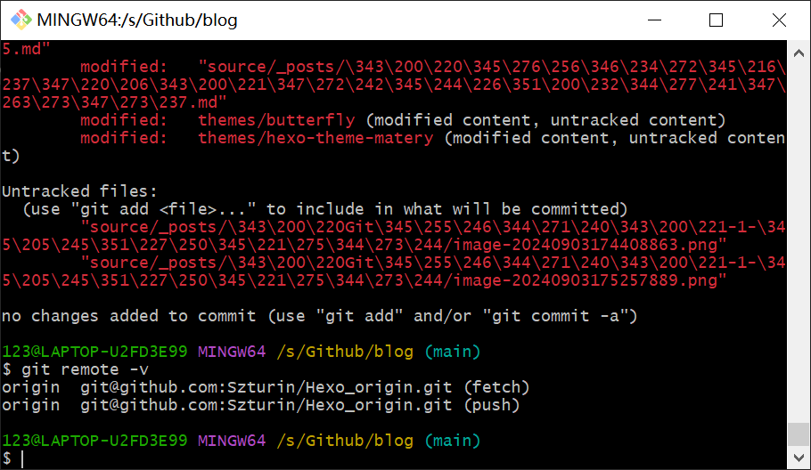
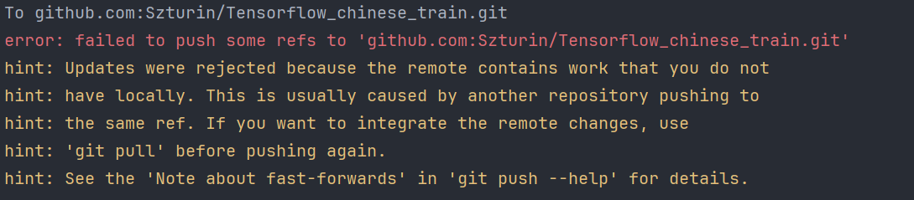

# 一、Git仓库的创建

## 1. Git仓库的创建：

将当前目录变成可以GIT管理的目录

```bash
git init//创建初始化仓库
```

## 2. 将文件添加到版本库（Repository）:

实际上就是把文件修改添加到暂存区

```bash
git add . //将当前文件目录下所有文件移入暂存区`` 
```
## 3. 将暂存区内容添加到版本库（Repository）中：

仓库创建后，``head``默认指向master分支

实际上就是把暂存区的所有内容提交到当前分支

每一次的commit相当于一次快照，一但把项目文件该乱了，可以从最近的一次commit恢复

```bash
git commit -m "第一次版本提交" //在后面加-m选项，以在命令行中提供提交注释
git commit -am "第一次版本提交"//跳过add这一步，可以直接使用 -a选项
```

注意：每次修改，如果不用`git add`到暂存区，那就不会加入到`commit`中

## 4. 修改日志

版本控制系统肯定有某个命令可以告诉我们历史记录，在Git中，我们用`git log`命令查看



## 5. 版本回退

1094a...是版本号

```bash
git reset --hard 1094a...
```

Git的版本回退速度非常快，因为Git在内部有个指向当前版本的`HEAD`指针，当你回退版本的时候，Git仅仅是把HEAD从指向`append GPL`：

```
┌────┐
│HEAD│
└────┘
   │
   └──▶ ○ append GPL
        │
        ○ add distributed
        │
        ○ wrote a readme file
```

改为指向`add distributed`：

```
┌────┐
│HEAD│
└────┘
   │
   │    ○ append GPL
   │    │
   └──▶ ○ add distributed
        │
        ○ wrote a readme file
```

当主机重启后，之前回溯到了旧版本，这次又想回到新版本，Git提供了一个命令git reflog用来记录你的每一次命令：



## 6. 撤销修改

 checkout可以丢弃工作区的修改

```plain
git checkout -- readme.txt
```

命令`git checkout -- readme.txt`意思就是，把`readme.txt`文件在工作区的修改全部撤销，这里有两种情况：

一种是`readme.txt`自修改后还没有被放到暂存区，现在，撤销修改就回到和版本库一模一样的状态；

一种是`readme.txt`已经添加到暂存区后，又作了修改，现在，撤销修改就回到添加到暂存区后的状态。

总之，就是让这个文件回到最近一次`git commit`或`git add`时的状态。

## # 其他命令

`git status`查看状态



命令`git rm`用于删除一个文件。如果一个文件已经被提交到版本库，那么你永远不用担心误删，但是要小心，你只能恢复文件到最新版本，你会丢失**最近一次提交后你修改的内容**，``git rm``使用后相当于修改后将工作区的文件提交到暂存区，相当于``rm``文件后，使用``add``提交。

# 二、远程仓库

## 1. Git连接到远程仓库（github）

```bash
git remote add origin [url]//参数[alias]为别名， [url]为远程仓库的地址
```

添加后，远程库的名字就是`origin`，这是Git默认的叫法，也可以改成别的，但是`origin`这个名字一看就知道是远程库。

下一步，就可以把本地库的所有内容推送到远程库上

## 2. 本地内容推送到远程仓库

```bash
git push -u origin main
```

由于远程库是空的，我们第一次推送`master`分支时，加上了`-u`参数，Git不但会把本地的`master`分支内容推送的远程新的`master`分支，还会把本地的`master`分支和远程的`master`分支关联起来，在以后的推送或者拉取时就可以简化命令

从现在开始，可以通过``git push -u origin main``直接推送到远程仓库

## 3. 删除远程库

如果添加的时候地址写错了，或者就是想删除远程库，可以用`git remote rm <name>`命令。使用前，建议先用`git remote -v`查看远程库信息：

```bash
$ git remote -v
```



然后，根据名字删除，比如删除`origin`：

```bash
$ git remote rm origin
```

此处的“删除”其实是解除了本地和远程的绑定关系，并不是物理上删除了远程库。远程库本身并没有任何改动。要真正删除远程库，需要登录到GitHub，在后台页面找到删除按钮再删除。

## 4. 从远程库克隆

```bash
git clone [address]
```

[从远程库克隆 - Git教程 - 廖雪峰的官方网站 (liaoxuefeng.com)](https://liaoxuefeng.com/books/git/remote/clone/index.html)

注意：Git支持多种协议，包括`https`，但`ssh`协议速度最快

# > 常见问题

## 1. ``git push -u origin main`` 报错：



>**解决方案：**
>
>要解决这个问题，你需要先将远程仓库的更改合并到你的本地分支中，然后再进行推送。你可以按照以下步骤操作：
>
>1. **执行 `git pull`**
>     在你的本地仓库中执行以下命令来获取并合并远程仓库的更改：
>
>   ```
>   git pull origin main
>   ```
>
>   这将从远程的 `main` 分支拉取最新的提交，并尝试将这些更改合并到你本地的 `main` 分支中。
>
>2. **解决冲突（如果有的话）**
>     如果 Git 在合并过程中遇到冲突，它会提示你有冲突需要手动解决。你需要打开冲突的文件，手动编辑解决冲突，然后使用 `git add` 命令将解决冲突后的文件标记为已解决。
>
>3. **提交合并（如果有冲突）**
>     解决冲突后，你需要提交这些更改：
>
>   ```
>   git commit
>   ```
>
>   如果没有冲突，Git 会自动完成合并。
>
>4. **重新推送到远程仓库**
>     一旦你已经合并了远程的更改，你可以再次尝试推送到远程仓库：
>
>   ```
>   git push origin main
>   ```
>
>按照上述步骤操作，你应该能够成功地将本地更改推送到远程仓库。如果你对合并操作不太熟悉，可以提前备份你的代码库以防万一

# 参考文章

[添加远程库 - Git教程 - 廖雪峰的官方网站 (liaoxuefeng.com)](https://liaoxuefeng.com/books/git/remote/add-remote/index.html)

# # 更新日志

> date:2024.1.10
>
> - 优化blog内容
>
> date:2024.2.18
>
> - 优化blog内容
>
> date:2024.8.30
>
> - 优化blog内容
>
> date:2024.9.3
>
> - 优化blog内容

