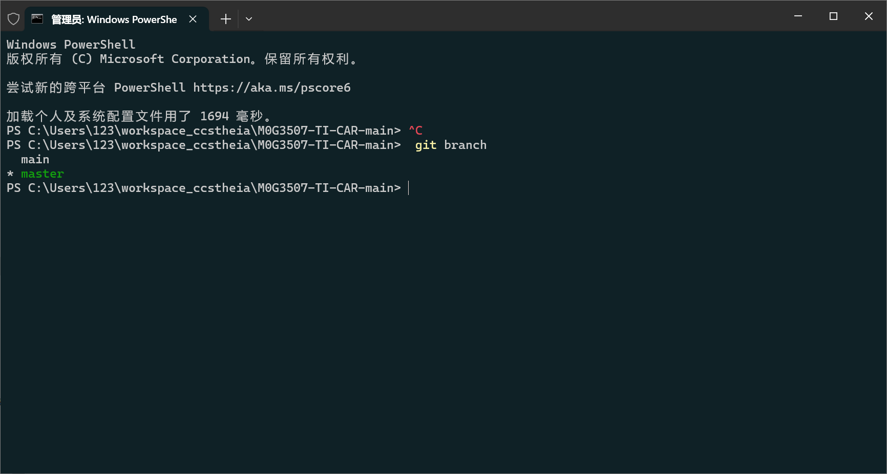
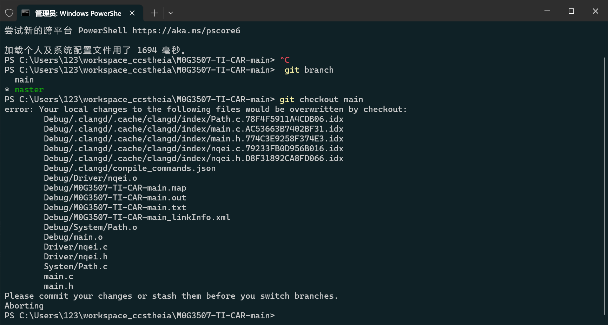
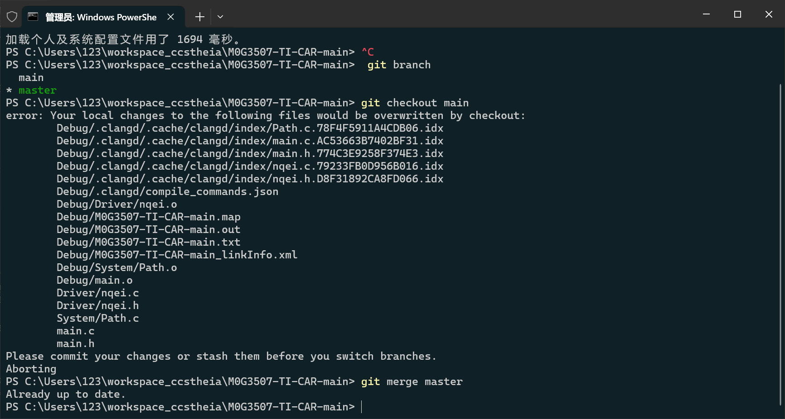

[创建与合并分支 - Git教程 - 廖雪峰的官方网站 (liaoxuefeng.com)](https://liaoxuefeng.com/books/git/branch/create/index.html)

# 一、分支的创建

## 1. 分支创建

我们创建`dev`分支，然后切换到`dev`分支：

```plain
$ git checkout -b dev
Switched to a new branch 'dev'
```

`git checkout`命令加上`-b`参数表示创建并切换，相当于以下两条命令：

```plain
$ git branch dev
$ git checkout dev
Switched to branch 'dev'
```

然后提交：

```plain
$ git add readme.txt 
$ git commit -m "branch test"
[dev b17d20e] branch test
 1 file changed, 1 insertion(+)
```

==dev 分支的任务完成，就可以切换分支了==

##  二、分支的管理

## 1. 查看分支



## 2. 切换分支



## 3. 合并分支

完成之后，master分支上的修改在main上也能看到了



## 4. 删除分支

```plain
git branch -d dev
```

