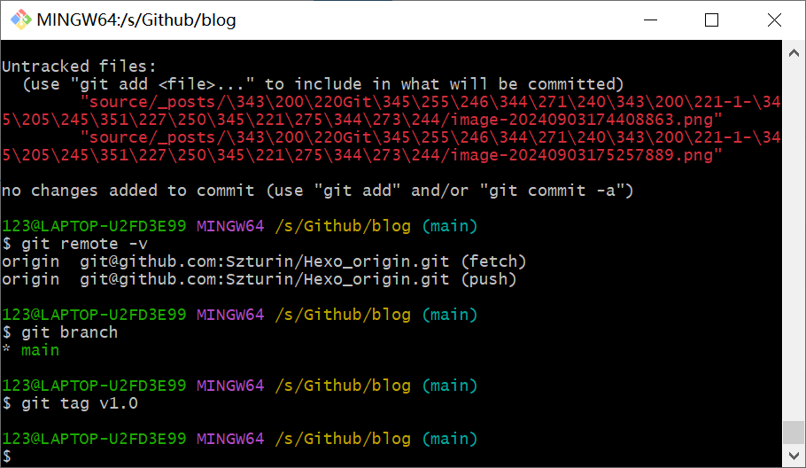
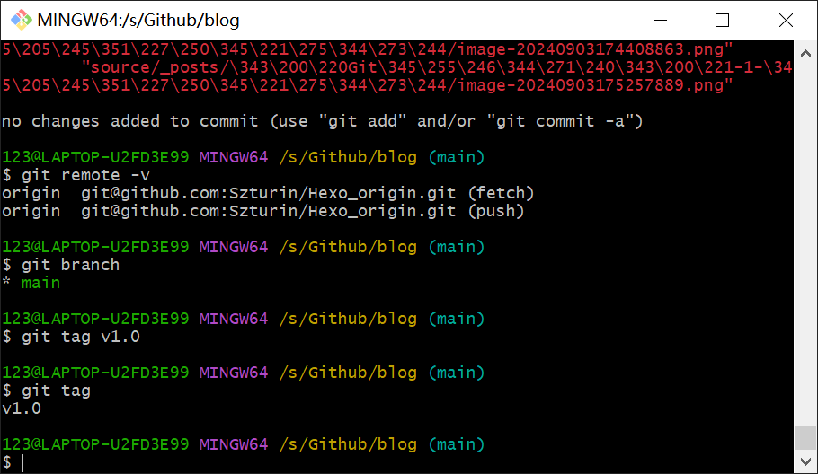
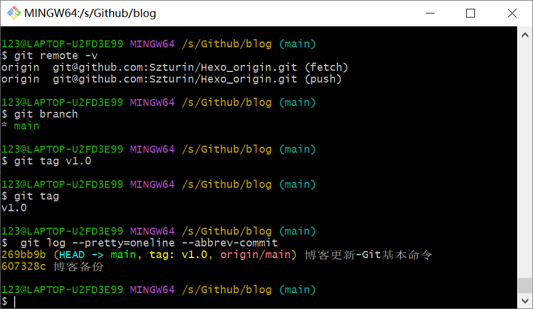
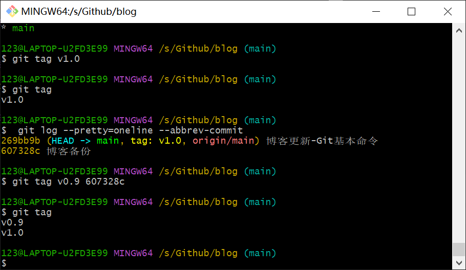
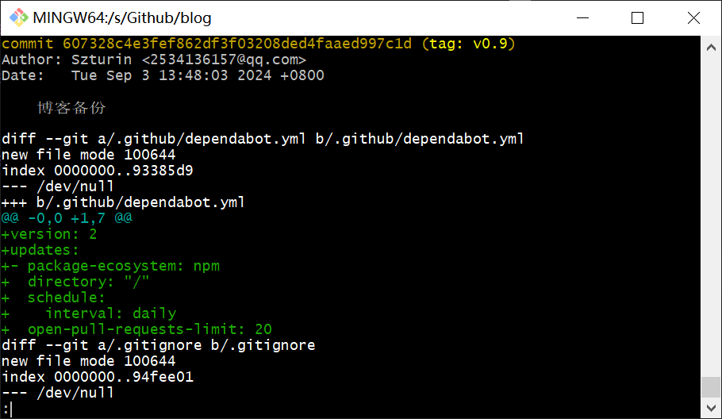

# 前言

发布一个版本时，我们通常先在版本库中打一个标签（tag），这样，就唯一确定了打标签时刻的版本。

Git的标签虽然是版本库的快照，但其实它就是指向某个commit的指针

使用``tag``命名指向历史版本号，能够更好的进行代码管理

# 一、创建标签

查看分支

```bash
git branch
```

创建新的标签

```bash
git tag v1.0
```



查看所有标签

```
git tag
```



查看历史提交

```
 git log --pretty=oneline --abbrev-commit
```



比如要对->“博客备份”这次打标签

```
git tag v0.9 607328c
```



查看标签信息，注意：```tag``是按字母顺序排列的

```
git show v0.9
```



还可以创建带有说明的标签，用`-a`指定标签名，`-m`指定说明文字：

```plain
git tag -a v0.1 -m "version 0.1 released" 1094adb
```

# 二、操作标签

删除标签

注意：对标签的操作都在本地，不会影响远程

```
git tag -d v0.1
```

如果要推送标签到远程仓库，使用：

```
git push origin v1.0
```

一次性推送全部尚未推送到远程的标签

```
git push origin --tags
```

如果标签已经推送到远程，需要：

1.删除本地标签

```
git tag -d v0.9
```

2.从远程删除

格式：:refs/tags/<tagname>

```
git push origin :refs/tags/v0.9
```

