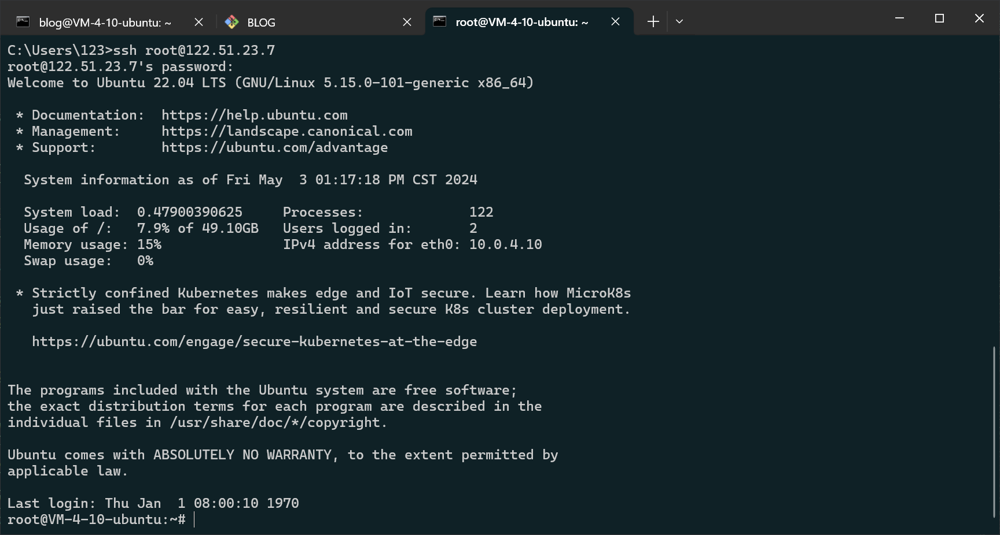
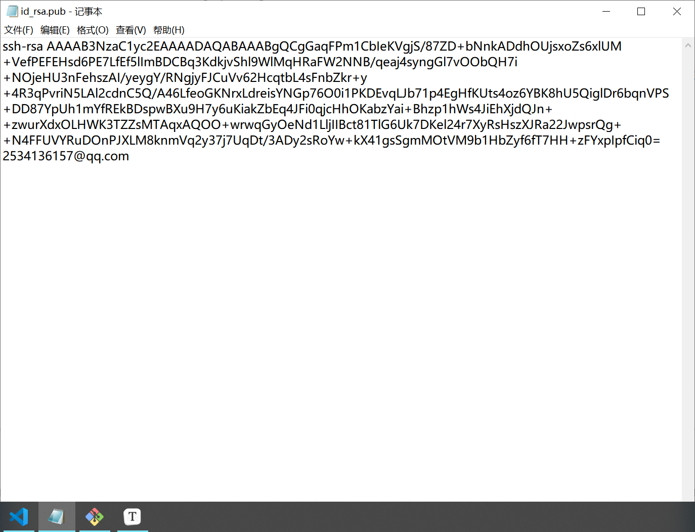
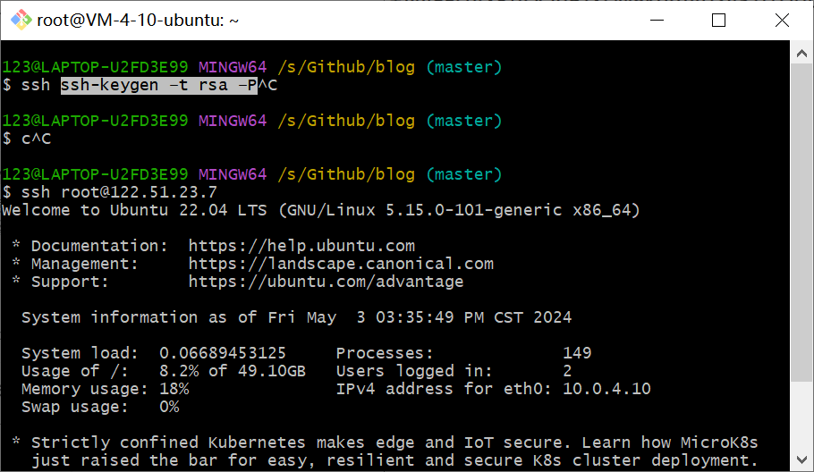

# HEXO更新日志

**2024.5.3**

- 重要更新：将HEXO博客部署到腾讯云轻量化服务器，极大提升国内访问速度，访问ip地址：[Turin's Blog - 数理照亮世界](http://122.51.23.7/)
- 优化主页文章卡片界面，参考文章：[首页 | Butterfly主题美化教程 (zhheo.com)](https://butterfly.zhheo.com/home.html)
- 优化网站页面显示效果：透明度。[博客背景使用一图流 | QianChengGit の小森林](https://qianchenggit.github.io/2021/10/06/博客背景使用一图流/)

---

xxxxxxxxxx git remote add [alias] [url]//参数[alias]为别名， [url]为远程仓库的地址bash

# 一、HEXO部署到云服务器(Ubuntu系统)

**[Hexo部署至服务器（Ubuntu 20.04）-腾讯云开发者社区-腾讯云 (tencent.com)](https://cloud.tencent.com/developer/article/1945550)**

**[04_Hexo-多平台部署-云服务器-GitHub-Gitee | Mycpen](https://blog.cpen.top/posts/38874.html)**

# 二、Ubuntu允许root连接服务器

[Linux开启ssh并允许root登录（ubuntu、centos、kalilinux）_ssh允许root远程登录-CSDN博客](https://blog.csdn.net/crayon0/article/details/122272001)

> 报错信息 “E45: 'readonly' option is set (add ! to override)” 是在使用 Vim 或 Neovim 文本编辑器时可能遇到的一个错误信息。当您尝试将更改写入以只读模式打开的文件时，就会出现这条信息。这种情况可能由几个原因引起，例如，您正在编辑的文件在文件系统级别启用了写保护，或者 Vim 打开了一个它认为不应该修改的文件（例如，系统配置文件或标记为“只读”的文件）。
>
> 要解决这个问题并强制 Vim 或 Neovim 尽管文件处于只读状态也要写入更改，您可以使用 `:w!` 命令，其中 `w` 代表“写入”，`!` 实际上意味着“强制”或“覆盖”。
>
> 下面是如何处理这种情况：
>
> ### 如果您打算修改文件
>
> 1. **强制保存更改**：如果您知道文件是安全可编辑的，且打算保存更改，可以使用 `:w!` 命令强制保存更改。这告诉 Vim 覆盖只读限制。
>
>    ```
>    :w!
>    ```
>
> 2. **更改文件权限**：如果文件是只读的是因为文件系统权限，您可能需要在 Vim 外部更改其权限。例如，在类 Unix 系统（Linux、macOS）上，您可以使用 `chmod` 命令使文件可写。假设文件名为 `example.txt`；您可以使用：
>
>    ```
>    chmod +w example.txt
>    ```
>
>    然后，在 Vim 内尝试再次保存文件。
>
> ### 如果文件应保持不变
>
> 如果文件应该是只读的，且您不小心做了更改或重新考虑了您的编辑，有几个操作您可以执行：
>
> 1. **撤销更改**：通过使用 Vim 中的撤销命令 `u` 手动撤销更改，直到您恢复到文件的原始状态。
>
> 2. **不保存并退出**：如果您想退出 Vim 而不保存任何更改，可以使用 `:q!` 命令，它退出 Vim 且不保存。
>
>    ```
>    :q!
>    ```
>
> ### 理解只读文件
>
> 在决定覆盖其只读状态之前，了解文件为什么可能处于只读模式是很重要的。文件可以因各种原因而被设置为只读：
>
> - 文件可能在文件系统级别被标记为只读，以防止意外更改。
> - 文件可能属于另一个用户或需要管理员权限才能修改。
> - Vim 可能会在检测到文件正在被另一个进程使用时，以只读模式打开文件。
> - 某些配置或命令（如使用 `vim -R <filename>` 打开文件）可以指示 Vim 以只读模式打开文件。
>
> 在尝试覆盖文件的只读状态之前，始终确保修改文件是恰当的。


**root终端连接效果**




## 公网ip访问Blog网站


**总结：使用腾讯云服务器（Unbuntu系统）部署Hexo博客，踩雷无数。此次部署博主理解了Linux服务器的详细配置流程，blog网站的访问速度得到了大幅度的提升，免受”科学上网“之苦**


# 三、问题（待解决）

## 一、每次deploy需要输入服务器root密码

- **解决方案：配置SSH公钥**

- **参考文章：**[Hexo历险记之八SSH远程链接服务器 - 知乎 (zhihu.com)](https://zhuanlan.zhihu.com/p/549151974)

**将git环境下的ssh公钥配置到服务器中的authorized_keys，并且修改sshd_config文件，配置好ssh各项权限**



**最终效果：**免密连接




**PS: 允许不同环境的终端配对的公钥可能不一样，这里使用git bash，要连接的服务器那边就需要使用git bash生成的公钥，才能实现免密登录，这样每次deploy时无需输入密码**


## 二、Blog域名


