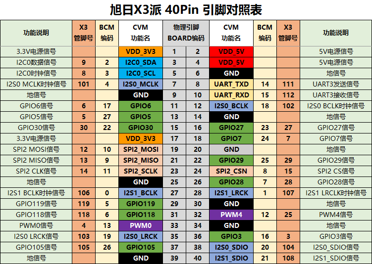
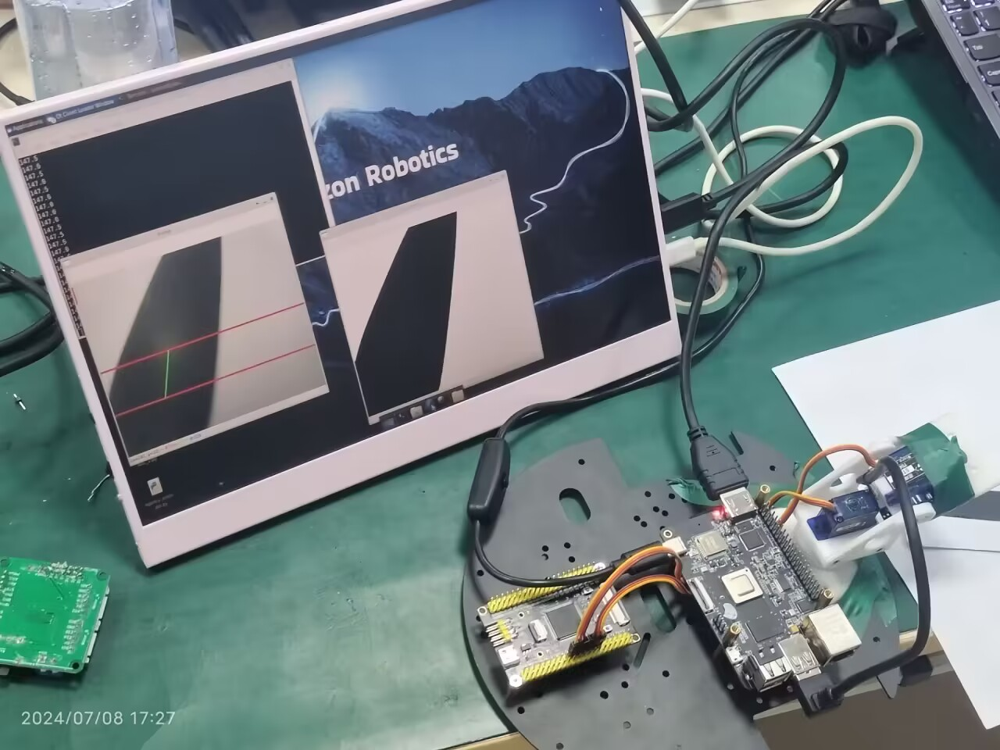

# Opencv常见基本概念

---


# 一、Opencv常见基本概念

## 1.BGR和RGB格式

> - BGR和RGB是两种常见的颜色编码格式，它们在像素颜色排列的顺序上有所不同：
>
>   1. **RGB格式**：
>      - RGB指的是红色（R）、绿色（G）、蓝色（B）三个颜色通道的顺序。
>      - 在RGB格式中，像素的颜色值按照红、绿、蓝的顺序排列，即最开始的三个字节依次表示红色、绿色和蓝色分量。
>   2. **BGR格式**：
>      - BGR则是蓝色（B）、绿色（G）、红色（R）的顺序。
>      - 在BGR格式中，像素的颜色值按照蓝、绿、红的顺序排列，即最开始的三个字节依次表示蓝色、绿色和红色分量。
>
>   这两种格式主要在图像处理中有所区别。例如，==在OpenCV中，默认情况下读取的图像格式是BGR而非RGB==，这意味着你在处理图像数据时需要注意颜色通道的顺序。如果需要与其他软件或标准的RGB格式进行交互，通常需要进行颜色通道的重新排列。
>
>   总结：
>
>   - **RGB**：红色、绿色、蓝色，像素颜色排列顺序是RGB。
>   - **BGR**：蓝色、绿色、红色，像素颜色排列顺序是BGR。

## 2.常用函数库和视觉处理方法

### 摄像头的开启

```python
#摄像头类创建
class pi_Camera():
    def __init__(self):
        # 图像初始化配置
        self.Video = cv2.VideoCapture(8, cv2.CAP_V4L2) # 使能摄像头8的驱动

        # 检查摄像头是否打开
        ret = self.Video.isOpened()
        if ret:
            print("The video is opened.")
        else:
            print("No video.")
    
        codec = cv2.VideoWriter_fourcc('M', 'J', 'P', 'G')
        self.Video.set(cv2.CAP_PROP_FOURCC, codec)
        self.Video.set(cv2.CAP_PROP_FPS, 60)  # 帧数
        self.Video.set(cv2.CAP_PROP_FRAME_WIDTH, 640)  # 列 宽度
        self.Video.set(cv2.CAP_PROP_FRAME_HEIGHT, 480)  # 行 高度
    
    def GuideLine(self, c1, c2):
        ret, image = self.Video.read()#注意：read返回一个bull值和图像数据list！，需要用两个变量获取
        if ret:
            cv2.line(image, (0, 360), (640, 360), color=(0, 0, 255), thickness=3)  # 红色的线
            cv2.line(image, (0, 240), (640, 240), color=(0, 0, 255), thickness=3)  # 红色的线
            cv2.line(image, (int(c1), 360), (int(c2), 240), color=(0, 255, 0), thickness=2)  # 绘出倾角线
            cv2.imshow("GuideLine", image)
```

**异常的处理：**[错误处理 - 廖雪峰的官方网站 (liaoxuefeng.com)](https://www.liaoxuefeng.com/wiki/1016959663602400/1017598873256736)

**ret的作用：**

​	通常是一个函数返回值的缩写，在opencv中经常用来读取函数的布尔值，判断摄像是否打开、头图像是否读取成功等，防止后续处理空值报错

**摄像头的驱动：**

- ```python
  self.Video = cv2.VideoCapture(8, cv2.CAP_V4L2)
  ```

  - `cv2.VideoCapture` 是 OpenCV 中用于捕获视频的类。
  - `8` 是指定的摄像头设备索引，表示要打开编号为 8 的摄像头。摄像头的索引通常取决于系统中摄像头的安装顺序。
  - `cv2.CAP_V4L2` 是指定使用 Video4Linux2（V4L2）作为捕获接口，这是在Linux系统中常用的视频捕获接口。

**视频的编码，帧率，图像分辨率设置：**

1. `codec = cv2.VideoWriter_fourcc('M', 'J', 'P', 'G')`：
   - 这里使用了OpenCV提供的`cv2.VideoWriter_fourcc()`函数来创建视频编解码器的四字符代码（FourCC）。
   - `'M', 'J', 'P', 'G'`代表Motion JPEG编解码器，这是一种常见的视频编码格式，通常用于存储高质量的视频。
2. `self.Video.set(cv2.CAP_PROP_FOURCC, codec)`：
   - `self.Video`可能是一个OpenCV的视频捕获对象（`cv2.VideoCapture`）或视频写入对象（`cv2.VideoWriter`）。
   - `cv2.CAP_PROP_FOURCC`是一个视频捕获属性，用于设置视频流的FourCC编码格式，即视频编码方式。
3. `self.Video.set(cv2.CAP_PROP_FPS, 60)`：
   - `cv2.CAP_PROP_FPS`是用于设置视频帧率（Frames Per Second，FPS）的视频捕获属性。
   - 这里将视频帧率设置为60帧每秒，表示视频流每秒播放60张图像帧。
4. `self.Video.set(cv2.CAP_PROP_FRAME_WIDTH, 640)`：
   - `cv2.CAP_PROP_FRAME_WIDTH`是用于设置视频帧宽度的视频捕获属性。
   - 将视频帧宽度设置为640像素，这是视频流每帧的水平像素数。
5. `self.Video.set(cv2.CAP_PROP_FRAME_HEIGHT, 480)`：
   - `cv2.CAP_PROP_FRAME_HEIGHT`是用于设置视频帧高度的视频捕获属性。
   - 将视频帧高度设置为480像素，这是视频流每帧的垂直像素数。

综上所述，这段代码的目的是通过OpenCV配置视频捕获对象或视频写入对象，确保视频捕获的编码格式为Motion JPEG（MJPG），帧率为60FPS，视频帧的尺寸为640x480像素

### numpy库


# 二、基于OpenCV的传统视觉循迹-demo1

地平线RDK X3具有相当完善的资料以及社区支持，由于本人对Linux平台，深度学习与机器视觉尚不熟悉，故基于纯Python的方法，利用OpenCV计算机视觉库，制作一个简易的摄像头循迹

**硬件平台：RDK X3派**

**摄像头：USB免驱1080P摄像头**

3

## 开发过程：



图像处理方案1：

- 用USB摄像头连接Linux嵌入式设备，驱动摄像头获取图像，将图像bgr格式转灰度后，使用大津法进行二值化，对白区域进行腐蚀处理
- 取一行像素点，本例识别黑色像素，获取黑色像素的数目，黑色像素行中心坐标值，相当于640路的灰度循迹，使用方法类似CCD摄像头
- 使用差速的方法进行循迹，左轮+(坐标值-拟合线坐标)*系数，右轮-(坐标值-拟合线坐标)*系数，原理同PID(只含P环)

PS: RDK X3自带两路PWM GPIO口，按照手册做好相关配置后，即可简单驱动小车了

待改进点：

- 使用PID得到更好的巡线拟合（前级），这部分由RDK X3进行运算，即图像测得坐标与目标拟合线的偏差，使用PID算法（输出符合当前运动状态的目标速度），调节P值，比例作用大,可以加快调节,能迅速反应误差，从而减小稳态误差。调节I值，使系统消除稳态误差，提高无差度。调节D值，减小超调量，克服振荡(大幅低频振荡->小幅高频振荡)，使系统的稳定性提高，同时加快系统的动态响应速度，减小调整时间，从而改善系统的动态性能。
- 使用单片机微控制器获得更精准强大的驱动控制能力，同时进行PID控制（这里用于减少目标速度与当前速度的误差），与上位机前级PID形成串级关系，前级PID输出作为下位机PID控制的输入。
- 代码方面：改进代码结构与算法，优化代码执行效率，使用面向对象编程方法，封装代码便于调用与移植
- 图传方面： 使用RDK X3引脚编解码代替imshow，进行推流

```python
#!/usr/bin/env python3
import math
import os
import cv2
import numpy
import numpy as np
import serial
import serial.tools.list_ports
import Hobot.GPIO as GPIO

img = cv2.VideoCapture(8, cv2.CAP_V4L2) #使能摄像头8的驱动
codec = cv2.VideoWriter_fourcc( 'M', 'J', 'P', 'G' )

direction = 302 #设置目标拟合线坐标（列数）

#图像初始化配置
img.set(cv2.CAP_PROP_FOURCC, codec)
img.set(cv2.CAP_PROP_FPS, 30) #帧数
img.set(cv2.CAP_PROP_FRAME_WIDTH, 640) #列 宽度
img.set(cv2.CAP_PROP_FRAME_HEIGHT, 480) # 行 高度

#串口选择
print("List of enabled UART:")
os.system('ls /dev/tty[a-zA-Z]*')
uart_dev= input("请输出需要测试的串口设备名:")
match uart_dev:
    case '0':
        uart_dev = "/dev/ttyS0"
    case '1':
        uart_dev = "/dev/ttyS1"
    case '2':
        uart_dev = "/dev/ttyS2"
    case '3':
        uart_dev = "/dev/ttyS3"
baudrate = input("请输入波特率(9600,19200,38400,57600,115200,921600):")
ser = serial.Serial(uart_dev, int(baudrate), timeout=1) # 1s timeout
print(ser)
print("Starting demo now! Press CTRL+C to exit")

#PWM引脚号定义
pwm_pin1 = 32
pwm_pin2 = 33

#GPIO初始化
GPIO.setmode(GPIO.BOARD)
GPIO.setup(16, GPIO.OUT,initial=GPIO.HIGH) #bn1
GPIO.setup(15, GPIO.OUT,initial=GPIO.LOW)  #bn2
GPIO.setup(11, GPIO.OUT,initial=GPIO.HIGH)  #an1
GPIO.setup(13, GPIO.OUT,initial=GPIO.LOW)  #an2
PWM_1 = GPIO.PWM(pwm_pin1, 48000)
PWM_2 = GPIO.PWM(pwm_pin2, 48000)

#占空比初值定义
val1 = 25
val2 = 25

#控制
def Control():
    PWM_1.ChangeDutyCycle(val1)
    PWM_2 .ChangeDutyCycle(val2)
    PWM_1.start(abs(val1))
    PWM_2.start(abs(val2))

#PID
class PID():
    def __init__(self,KP,KI,KD):
        self.KP = KP
        self.KI = KI
        self.KD = KD
        self.p1 , self.p2 = 0 , 0#保留一个帧的误差
        self.i = 0#积累误差初值


while True:
    ret, frame = img.read() #从相机获取图像
    
    gray = cv2.cvtColor(frame, cv2.COLOR_BGR2GRAY) #BGR格式转化为灰度

    ### cv2.line(frame, (0, 360), (640, 360), color=(0, 0, 255), thickness=3) # 红色的线
    ### cv2.line(frame, (0, 240), (640, 240), color=(0, 0, 255), thickness=3) # 红色的线

    retval, dst = cv2.threshold(gray, 0, 255, cv2.THRESH_OTSU)   ##大津法二值化

   
    dst = cv2.dilate(dst, None, iterations=2) # 膨胀，白区域变大
    
    cv2.imshow("Trace_Mode", dst) #显示二值化图像

    color = dst[400] #获取第400行像素值，视为最底层
    ##color1 = dst[360] #获取第360行像素值
    ##color2 = dst[240] #获取第240行像素
    black_count = np.sum(color == 0) #统计第400行像素个数
    # print(black_count) #串口打印底层黑色像素个数
    
    if black_count == 0:
            print("黑色像素点为0")
            #time.sleep(0.2)
            ser.write("r:0000l:0000\r\n".encode())#在这里加上了串口
            # pass
    else:
        ##black_count_1 = np.sum(color1 == 0) # 黑色像素点数目统计
        ##black_count_2 = np.sum(color2 == 0) # 黑色像素点数目统计
        black_index = np.where(color == 0) #创建list索引第360行像素值
        ##black_index_1 = np.where(color1 == 0) #创建list索引第360行像素值
        ##black_index_2 = np.where(color2 == 0)#创建list索引第360行像素值
        
        if black_count_1 > 0 and black_count_2 > 0:
            center = (black_index[0][black_count - 1] + black_index[0][0] )/2
            ##center1 = (black_index_1[0][black_count_1 - 1] + black_index_1[0][0] )/2 #计算第一行像素点中心坐标
            ##center2 = (black_index_2[0][black_count_2 - 1] + black_index_2[0][0] )/2 #计算第二行像素点中心坐标
            ##cv2.line(frame, (int(center1), 360), (int(center2), 240), color=(0, 255, 0), thickness=2) # 绘出倾角线
            err = direction - center #计算插值

            #差速循迹
            val1 = 15 - err*0.04
            val2 = 15 + err*0.04
            Control()
            print(err)
            ##cv2.imshow("frame", frame)


    #检测'Esc'按下，销毁程序    
    if cv2.waitKey(1) == 27:
        break

#清空PWM,GPIO引脚
PWM_1.stop()
PWM_2.stop()
GPIO.cleanup()
#释放图像
img.release()
#销毁CV窗口
cv2.destroyAllWindows()
```

# 三、Opencv实现色块识别


# #RDK X3 开发体验

题主目前初学Python,OpenCV,Ros2, 且对深度学习，图像处理等知识存在相当大的欠缺，基本参考RDK X3的官方手册学习，不得不说，RDK X3的官方镜像，社区生态支持做的都相当便捷，嵌入式边缘计算设备方面领域能做到对初学者如此友好的仅此一家。

> sudo bash -c 'echo 1 > /sys/devices/system/cpu/cpufreq/boost'

> 可通过`sudo hrut_somstatus`命令查看当前芯片工作频率、温度等状态：

> 供电不稳定导致X3无法正常启动，或者程序执行过程中摄像头无法正常驱动

> 驱动USB摄像头时应该确定设备号，使用`ls /dev/video*`命令查看当前的video设备

> 使用 rc.local 可以便捷配置开机自启动脚本

> 使用ros2或者tros命令应配置好环境变量

> 烧录镜像应选择稳定版本，比如 2.10 ，3.0.0beta存在一些小毛病（VNC无法正常使用）

> vscode remote无法获得opencv imshow的图像，使用MobaXterm则正常显示X3的摄像头图像


# RDK X3多媒体

## 术语约定(https://developer.horizon.cc/documents_rdk/multimedia_development/overview#terminology)

| 缩写   | 全称                                | 解释                                                         |
| ------ | ----------------------------------- | ------------------------------------------------------------ |
| VIN    | Video IN                            | 包含视频处理接入、图像信号处理器、畸变矫正和防抖处理，接收来自sensor的数据并处理，也可以直接接收内存中的图像数据 |
| VPS    | Video Process System                | 包含图像旋转、图像裁剪、缩放功能，可对同一种输入源输出不同分辨率的图像。输入源可以是VIN模块，也可以是内存中的图像数据 |
| VENC   | Video Encode                        | VENC编码模块支持H.264/H.265/JPEG/MJPEG编码，VPS模块处理后的数据可通过编码模块按不同协议编码做码流输出 |
| VDEC   | Video Decode                        | VDEC解码模块支持H.264/H.265/JPEG/MJPEG解码，可对已编码的码流进行解码，交给VPS模块做进一步处理，输出到VOT模块进行显示 |
| VPU    | Video Processing Unit               | 视频处理单元，完成视频的编解码功能                           |
| JPU    | JPEG Processing Unit                | JPEG 图片处理单元，完成JPEG、MJPEG的编解码功能               |
| VOT    | Video Output                        | 视频输出模块接收VPS、VDEC的图像数据，可输出到显示设备        |
| VIO    | Video IN/OUT                        | 视频输入、输出，包括VIN和VOT模块                             |
| MIPI   | Mobile Industry Processor Interface | 移动产业处理器接口                                           |
| CSI    | Camera Serial Interface             | 相机串行接口。CSI接口与DSI接口同属一门，都是MIPI（移动产业处理器接口联盟）制定的一种接口规范 |
| DVP    | Digital Video Port                  | 数字视频端口                                                 |
| SIF    | Sensor Interface                    | sensor接口，用来接收mipi、dvp或者内存的图像数据              |
| ISP    | Image Signal Processor              | 图像信号处理器，完成图像的效果调校                           |
| LDC    | Lens Distortion Correction          | 镜头畸变校正                                                 |
| DIS    | Digital Image Stabilizer            | 数字图像稳定                                                 |
| DWE    | Dewarp Engine                       | 畸变矫正引擎，主要是将LDC和DIS集成在一起，包括LDC的畸变矫正和DIS的统计结果 |
| IPU    | Image Process Unit                  | 图像信号处理单元，支持图像的旋转、图像裁剪、缩放功能         |
| GDC    | Geometrical Distortion Correction   | 几何畸变矫正                                                 |
| PYM    | Pyramid                             | 图像金字塔                                                   |
| OSD    | On Screen Display                   | 视频图像叠层显示                                             |
| BPU    | Brain Process Unit                  | 地平线机器人自主研发的可编程AI加速引擎                       |
| HAL    | Hardware Abstraction Layer          | 硬件抽象层                                                   |
| FW     | Firmware                            | 固件                                                         |
| Sensor | Sensor                              | 如不做特别说明，特指CMOS图像传感器                           |


# USB推理函数解释

```python
import sys
import signal
import os
from hobot_dnn import pyeasy_dnn as dnn
from hobot_vio import libsrcampy as srcampy
import numpy as np
import cv2
import colorsys
from time import time

import ctypes
import json 

def signal_handler(signal, frame):
    print("\nExiting program")
    sys.exit(0)

output_tensors = None

fcos_postprocess_info = None

class hbSysMem_t(ctypes.Structure):
    _fields_ = [
        ("phyAddr",ctypes.c_double),
        ("virAddr",ctypes.c_void_p),
        ("memSize",ctypes.c_int)
    ]

class hbDNNQuantiShift_yt(ctypes.Structure):
    _fields_ = [
        ("shiftLen",ctypes.c_int),
        ("shiftData",ctypes.c_char_p)
    ]

class hbDNNQuantiScale_t(ctypes.Structure):
    _fields_ = [
        ("scaleLen",ctypes.c_int),
        ("scaleData",ctypes.POINTER(ctypes.c_float)),
        ("zeroPointLen",ctypes.c_int),
        ("zeroPointData",ctypes.c_char_p)
    ]    

class hbDNNTensorShape_t(ctypes.Structure):
    _fields_ = [
        ("dimensionSize",ctypes.c_int * 8),
        ("numDimensions",ctypes.c_int)
    ]

class hbDNNTensorProperties_t(ctypes.Structure):
    _fields_ = [
        ("validShape",hbDNNTensorShape_t),
        ("alignedShape",hbDNNTensorShape_t),
        ("tensorLayout",ctypes.c_int),
        ("tensorType",ctypes.c_int),
        ("shift",hbDNNQuantiShift_yt),
        ("scale",hbDNNQuantiScale_t),
        ("quantiType",ctypes.c_int),
        ("quantizeAxis", ctypes.c_int),
        ("alignedByteSize",ctypes.c_int),
        ("stride",ctypes.c_int * 8)
    ]

class hbDNNTensor_t(ctypes.Structure):
    _fields_ = [
        ("sysMem",hbSysMem_t * 4),
        ("properties",hbDNNTensorProperties_t)
    ]


class FcosPostProcessInfo_t(ctypes.Structure):
    _fields_ = [
        ("height",ctypes.c_int),
        ("width",ctypes.c_int),
        ("ori_height",ctypes.c_int),
        ("ori_width",ctypes.c_int),
        ("score_threshold",ctypes.c_float),
        ("nms_threshold",ctypes.c_float),
        ("nms_top_k",ctypes.c_int),
        ("is_pad_resize",ctypes.c_int)
    ]


libpostprocess = ctypes.CDLL('/usr/lib/libpostprocess.so') 

get_Postprocess_result = libpostprocess.FcosPostProcess
get_Postprocess_result.argtypes = [ctypes.POINTER(FcosPostProcessInfo_t)]  
get_Postprocess_result.restype = ctypes.c_char_p  
```


```python
def draw_bboxs(image, bboxes, classes=get_classes()):
    """draw the bboxes in the original image"""
    # 获取类别数量
    num_classes = len(classes)
    # 获取图像的高度、宽度和通道数
    image_h, image_w, channel = image.shape
    # 生成颜色列表，每个类别一个颜色
    hsv_tuples = [(1.0 * x / num_classes, 1., 1.) for x in range(num_classes)]
    colors = list(map(lambda x: colorsys.hsv_to_rgb(*x), hsv_tuples))
    # 将颜色值转换为0-255范围内的RGB值
    colors = list(
        map(lambda x: (int(x[0] * 255), int(x[1] * 255), int(x[2] * 255)),
            colors))

    # 设置字体缩放比例
    fontScale = 0.5
    # 设置矩形框的厚度
    bbox_thick = int(0.6 * (image_h + image_w) / 600)

    # 遍历每个检测结果
    for i, result in enumerate(bboxes):
        # 获取矩形框的位置信息
        bbox = result['bbox']
        # 获取检测分数
        score = result['score']
        # 获取类别ID
        id = int(result['id'])
        # 获取类别名称
        name = result['name']

        # 将位置信息四舍五入为整数
        coor = [round(i) for i in bbox]

        # 根据类别ID获取对应的颜色
        bbox_color = colors[id]
        # 矩形框的两个顶点坐标
        c1, c2 = (coor[0], coor[1]), (coor[2], coor[3])
        # 画矩形框
        cv2.rectangle(image, c1, c2, bbox_color, bbox_thick)
        # 类别名称
        classes_name = name
        # 矩形框内显示的文字
        bbox_mess = '%s: %.2f' % (classes_name, score)
        # 获取文字尺寸
        t_size = cv2.getTextSize(bbox_mess,
                                 0,
                                 fontScale,
                                 thickness=bbox_thick // 2)[0]
        # 画矩形框的填充部分，用于显示文字背景
        cv2.rectangle(image, c1, (c1[0] + t_size[0], c1[1] - t_size[1] - 3),
                      bbox_color, -1)
        # 在图像上显示文字
        cv2.putText(image,
                    bbox_mess, (c1[0], c1[1] - 2),
                    cv2.FONT_HERSHEY_SIMPLEX,
                    fontScale, (0, 0, 0),
                    bbox_thick // 2,
                    lineType=cv2.LINE_AA)
        # 打印检测结果
        print("{} is in the picture with confidence:{:.4f}".format(
            classes_name, score))
    # 返回绘制了矩形框和文字的图像
    return image
```


```python
def get_display_res():
    # 检查指定路径下的可执行文件是否存在，如果不存在则返回默认分辨率 1920x1080
    if os.path.exists("/usr/bin/get_hdmi_res") == False:
        return 1920, 1080

    import subprocess
    # 使用子进程运行 get_hdmi_res 命令，获取输出
    p = subprocess.Popen(["/usr/bin/get_hdmi_res"], stdout=subprocess.PIPE)
    result = p.communicate()
    # 将结果按逗号分割
    res = result[0].split(b',')
    # 确保宽度和高度在合理范围内
    res[1] = max(min(int(res[1]), 1920), 0)
    res[0] = max(min(int(res[0]), 1080), 0)
    return int(res[1]), int(res[0])
```

## 代码

```python
    # Get HDMI display object
    disp = srcampy.Display()
    # For the meaning of parameters, please refer to the relevant documents of HDMI display
    disp_w, disp_h = get_display_res()
    disp.display(0, disp_w, disp_h) # 显示模块初始化，并配置显示参数
```


```python
# 创建 FcosPostProcessInfo_t 对象
fcos_postprocess_info = FcosPostProcessInfo_t()

# 设置目标图像的高度和宽度
fcos_postprocess_info.height = 512
fcos_postprocess_info.width = 512

# 设置原始图像的高度和宽度
fcos_postprocess_info.ori_height = disp_h
fcos_postprocess_info.ori_width = disp_w

# 设置分数阈值，用于过滤低置信度的检测框
fcos_postprocess_info.score_threshold = 0.5 

# 设置非极大值抑制（NMS）的阈值，用于合并重叠的检测框
fcos_postprocess_info.nms_threshold = 0.6

# 设置 NMS 阶段保留的检测框数量上限
fcos_postprocess_info.nms_top_k = 5

# 指定是否在图像调整大小时使用填充
fcos_postprocess_info.is_pad_resize = 0
```


```python
for i in range(len(models[0].outputs)):
    # 设置每个输出张量的布局属性
    output_tensors[i].properties.tensorLayout = get_TensorLayout(models[0].outputs[i].properties.layout)
    
    # 检查输出张量的 scale_data 是否为空
    if len(models[0].outputs[i].properties.scale_data) == 0:
        # 如果 scale_data 为空，设置量化类型为 0
        output_tensors[i].properties.quantiType = 0
    else:
        # 如果 scale_data 不为空，设置量化类型为 2
        output_tensors[i].properties.quantiType = 2  
        # 将 scale_data 重新调整形状
        scale_data_tmp = models[0].outputs[i].properties.scale_data.reshape(1, 1, 1, models[0].outputs[i].properties.shape[3])  
        # 将 scale_data 转换为指向浮点数的指针
        output_tensors[i].properties.scale.scaleData = scale_data_tmp.ctypes.data_as(ctypes.POINTER(ctypes.c_float))
    
    # 设置每个输出张量的有效形状和对齐形状
    for j in range(len(models[0].outputs[i].properties.shape)):
        output_tensors[i].properties.validShape.dimensionSize[j] = models[0].outputs[i].properties.shape[j]
        output_tensors[i].properties.alignedShape.dimensionSize[j] = models[0].outputs[i].properties.shape[j]
```


## 主循环

```python
while True:
        _ ,frame = cap.read()

        # print(frame.shape)

        if frame is None:
            print("Failed to get image from usb camera")
        # 把图片缩放到模型的输入尺寸
        # 获取算法模型的输入tensor 的尺寸
        h, w = models[0].inputs[0].properties.shape[2], models[0].inputs[0].properties.shape[3]
        des_dim = (w, h)
        resized_data = cv2.resize(frame, des_dim, interpolation=cv2.INTER_AREA)

        nv12_data = bgr2nv12_opencv(resized_data)

        t0 = time()
        # Forward
        outputs = models[0].forward(nv12_data)
        t1 = time()
        # print("forward time is :", (t1 - t0))

        # Do post process
        strides = [8, 16, 32, 64, 128]
        for i in range(len(strides)):
            if (output_tensors[i].properties.quantiType == 0):
                output_tensors[i].sysMem[0].virAddr = ctypes.cast(outputs[i].buffer.ctypes.data_as(ctypes.POINTER(ctypes.c_float)), ctypes.c_void_p)
                output_tensors[i + 5].sysMem[0].virAddr = ctypes.cast(outputs[i + 5].buffer.ctypes.data_as(ctypes.POINTER(ctypes.c_float)), ctypes.c_void_p)
                output_tensors[i + 10].sysMem[0].virAddr = ctypes.cast(outputs[i + 10].buffer.ctypes.data_as(ctypes.POINTER(ctypes.c_float)), ctypes.c_void_p)
            else:      
                output_tensors[i].sysMem[0].virAddr = ctypes.cast(outputs[i].buffer.ctypes.data_as(ctypes.POINTER(ctypes.c_int32)), ctypes.c_void_p)
                output_tensors[i + 5].sysMem[0].virAddr = ctypes.cast(outputs[i + 5].buffer.ctypes.data_as(ctypes.POINTER(ctypes.c_int32)), ctypes.c_void_p)
                output_tensors[i + 10].sysMem[0].virAddr = ctypes.cast(outputs[i + 10].buffer.ctypes.data_as(ctypes.POINTER(ctypes.c_int32)), ctypes.c_void_p)

            libpostprocess.FcosdoProcess(output_tensors[i], output_tensors[i + 5], output_tensors[i + 10], ctypes.pointer(fcos_postprocess_info), i)

        result_str = get_Postprocess_result(ctypes.pointer(fcos_postprocess_info))  
        result_str = result_str.decode('utf-8')  
        t2 = time()
        # print("FcosdoProcess time is :", (t2 - t1))
        # print(result_str)

        # draw result
        # 解析JSON字符串  
        data = json.loads(result_str[14:])  

        if frame.shape[0]!=disp_h or frame.shape[1]!=disp_w:
            frame = cv2.resize(frame, (disp_w,disp_h), interpolation=cv2.INTER_AREA)

        # Draw bboxs
        box_bgr = draw_bboxs(frame, data)

        # cv2.imwrite("imf.jpg", box_bgr)

        # Convert to nv12 for HDMI display
        box_nv12 = bgr2nv12_opencv(box_bgr)
        disp.set_img(box_nv12.tobytes())

        finish_time = time()
        image_counter += 1
        if finish_time - start_time >  10:
            print(start_time, finish_time, image_counter)
            print("FPS: {:.2f}".format(image_counter / (finish_time - start_time)))
            start_time = finish_time
            image_counter = 0

```

