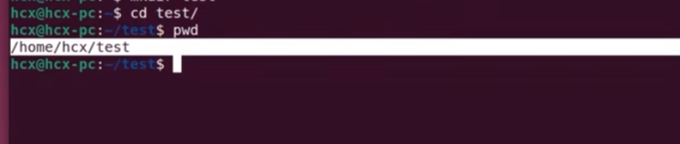
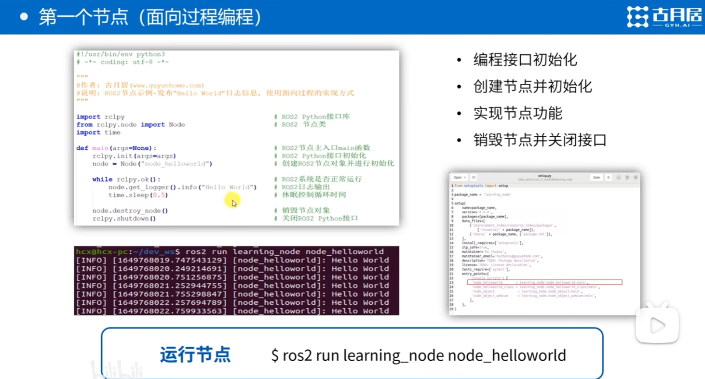

# ROS2上手体验

ros2环境的配置

```
source /opt/ros/humble/setup.bash #添加环境变量，需要每次启动终端使用此命令，比较繁琐
echo " source /opt/ros/humble/setup.bash" >> ~/.bashrc #将添加环境变量的命令添加到脚本，开启终端自启动，无需反复source
```

发布者节点

```
ros2 run demo_nodes_cpp talker 
```

订阅者节点

```
ros2 run demo_nodes_py listener
```

node

```
ros2 run turtlesim turtlesim_node
```


# Linux/Ros2命令行操作

Linux的命令庞大，但基本掌握常用的一些基础命令即可

获取当前终端操作的目录位置

```
pwd
```

列举当前目录显示的文件

```
ls
```

列举当前目录（包括被隐藏的）文件

```
ls -A
```

新建文件夹

```
mkdir test
```

修改当前终端路径

```
cd test/
```

效果：



在当前路径新建文件

```c
touch read.txt
```

在当前路径删除文件

```
rm read.txt
```

删除文件夹

```
rm -R test/ #-R表示递归删除
```

安装软件包

```
sudo apt install libopencv(自动补全)# sudo表示提升当前使用者权限为管理员,apt表示应用,install表示安装,安装opencv
```

## ros2相关

将正在运行的节点进行打印

```
ros2 node list 
```

查看节点正在运行的信息

```
ros2 node info /节点名
```

查看节点的基本数据/参数

以查看话题为例，查看哪些话题正在发布和订阅

```
ros2 topic list
```

对话题进行订阅并打印

```
ros2 topic echo /turtlel/pose
```

使用topic 进行pub，发布一个消息，和run一样可以控制“海龟”进行运动

```
ros2 topic pub --rate 1 /turtle1/cmd_vel geometry_msgs/msg/Twist "{linear: {x: 2.0, y: 0.0, z: 0.0}, angular: {x: 0.0, y: 0.0, z: 1.8}}" 
# --rate 1:频率1HZ
# /turtle1/cmd_vel geometry_msgs/msg/Twist
# linear:线速度
# angular:角速度
```

使用“服务”，产生新的机器人

```
$ ros2 service call /spawn turtlesim/srv/Spawn "{x: 2, y: 2, theta: 0.2, name: 'abb'}"

#使用ros2 topic list查看是否产生新的接口：
turin@turin-virtual-machine:~/Desktop$ ros2 topic list
/abb/cmd_vel
/abb/color_sensor
/abb/pose
/parameter_events
/rosout
/turtle1/cmd_vel
/turtle1/color_sensor
/turtle1/pose
```

总结：话题是机器人控制的==接口==,接口的名称不同，控制的对象不同


录制机器人的运动过程(录制)

```1
ros2 bag record /turtle/cmd_vel
```


# 节点

setup.py

配置ros2程序执行的入口

```python
from setuptools import setup

package_name = 'learning_node'

setup(
    name=package_name,
    version='0.0.0',
    packages=[package_name],
    data_files=[
        ('share/ament_index/resource_index/packages',
            ['resource/' + package_name]),
        ('share/' + package_name, ['package.xml']),
    ],
    install_requires=['setuptools'],
    zip_safe=True,
    maintainer='Hu Chunxu',
    maintainer_email='huchunxu@guyuehome.com',
    description='TODO: Package description',
    license='TODO: License declaration',
    tests_require=['pytest'],
    entry_points={
        'console_scripts': [
         'node_helloworld       = learning_node.node_helloworld:main', #节点的配置信息,配置完成后就可以用ros2 run运行
         'node_helloworld_class = learning_node.node_helloworld_class:main',
         'node_object            = learning_node.node_object:main',
         'node_object_webcam     = learning_node.node_object_webcam:main',
        ],
    },
)
```


**面向过程编程**



```python
#!/usr/bin/env python3
# -*- coding: utf-8 -*-

"""
@作者: 古月居(www.guyuehome.com)
@说明: ROS2节点示例-发布“Hello World”日志信息, 使用面向对象的实现方式
"""

import rclpy                                     # ROS2 Python接口库
from rclpy.node import Node                      # ROS2 节点类
import time

"""
创建一个HelloWorld节点, 初始化时输出“hello world”日志
"""
class HelloWorldNode(Node):
    def __init__(self, name):
        super().__init__(name)                       # ROS2节点父类初始化
        while rclpy.ok():                            # ROS2系统是否正常运行
            self.get_logger().info("Hello World")    # ROS2日志输出
            time.sleep(0.5)                          # 休眠控制循环时间

def main(args=None):                                 # ROS2节点主入口main函数
    rclpy.init(args=args)                            # ROS2 Python接口初始化
    node = HelloWorldNode("node_helloworld_class")   # 创建ROS2节点对象并进行初始化
    node.destroy_node()                              # 销毁节点对象
    rclpy.shutdown()                                 # 关闭ROS2 Python接口
```

**注意：编写完成程序后，需要重新编译，纯py文件无法用ros2命令直接运行, ros2 run 运行的是install**