# 一、编译器CCS Theia的基本使用

​	本文主要介绍通过CCS Theia以及Sysconfig的基本使用方法，将以GPIO和定时器为例，泛化性地介绍CCS Theia这个工具，便于其他外设配置的理解，对于CCS Theia IDE的安装及其环境配置，不做多赘述。

## 1.  范例程序的导入

> 步骤：
>
> 1. 选择File -> import Project(s)
>
> 2. 选择SDK中官方示例的地址，本文安装路径为：S:\ti\mspm0_sdk_2_01_00_03\examples\nortos\LP_MSPM0G3507\driverlib
>
>    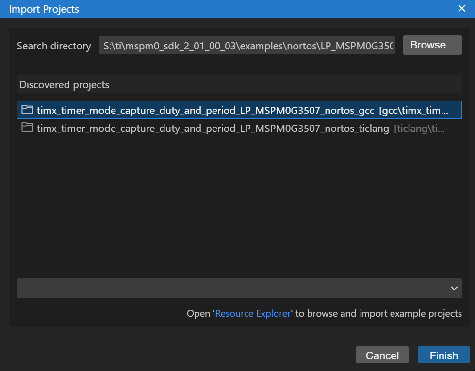
>
>    - gcc：代表C++方式编程的工程格式
>    - ticlang：代表TI官方IDE的工程格式

## 2.  Sysconfig界面

​	Sysconfig界面是TI推出的图形化界面配置，类似于ST 的CubeMX，能够极大简化对于单片机外设的初始化配置，更容易上手，但是这也需要我们正确小心地去使用这个工具，错误的配置很容易导致单片机无法正常工作。

​	一般的，在我们使用CCS Theia配置工程时，CCS==成功加载==工程文件后会显示一些特殊图标（偶尔会加载不成功，这个时候工程是无效的使用状态，需要重启软件），其中，主程序（如 main.c）同级目录下会生成一个后缀名为.syscfg的文件，这个文件用于存放TI M0系列图形化配置，点击main.syscfg即可打开图形化配置界面，本文着重介绍外设配置界面。

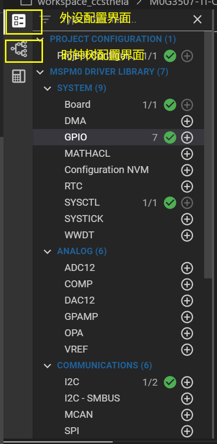

# 二、GPIO口的基本配置

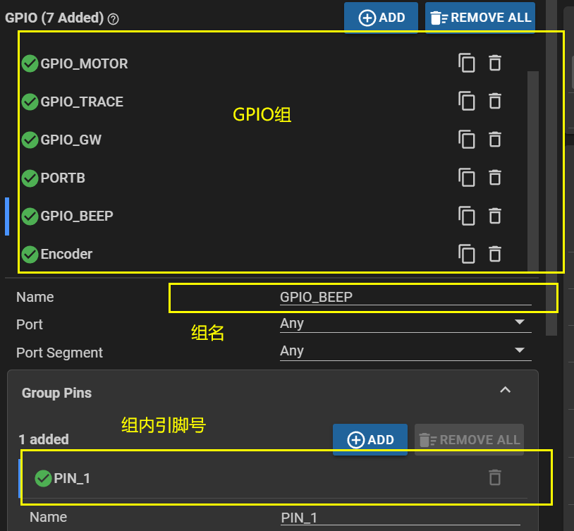

## 1. GPIO输出模式

简单配置Direction(方向)为Output即可

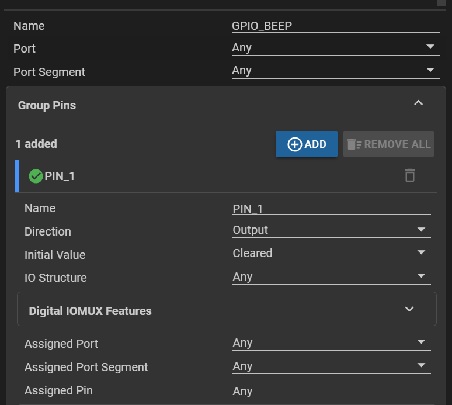

**GPIO引脚置高电平**

```c
DL_GPIO_setPins(GPIO_MOTOR_PIN_FR1_PORT, GPIO_MOTOR_PIN_FR1_PIN); //将FR1置高
```

**GPIO引脚清空**

```c
DL_GPIO_clearPins(GPIO_MOTOR_PIN_FR2_PORT, GPIO_MOTOR_PIN_FR2_PIN);//将FR2置低
```

注意：PORT和PIN的区别

- **PORT**更侧重于表示一种逻辑或物理接口的集合，而**PIN**则是指具体的电气连接点。在微控制器中，端口通常由多个引脚组成，而引脚是最基本的物理连接单位。

## 2. GPIO输入模式

### 2.1 读取引脚值

**GPIO读取引脚状态**

```c
DL_GPIO_readPins(GPIO_TRACE_PORT,GPIO_TRACE_PIN_TRACE_0_PIN);//读取TRACE0的电平（可能是n位返回值）
```

注意：

​	使用此函数读取的GPIO引脚状态为多个引脚的组合，需要经过逻辑操作来单独取一位。

### 2.2 按键

注意：特别地，如果要配置外部按键控制单片机，对应的引脚不能是浮空输入的状态，必须有具体的TTL电平状态，可以在Digtial IOMUX Features配置Internal Resistor选项为上拉输入，其他的默认配置即可。


### 2.3. 外部中断

外部中断一般用于特定的事件检测，计数（如：里程），配合定时器测电机速度等，图示为**双边沿触发的外部中断**，并且中断优先级配置为1

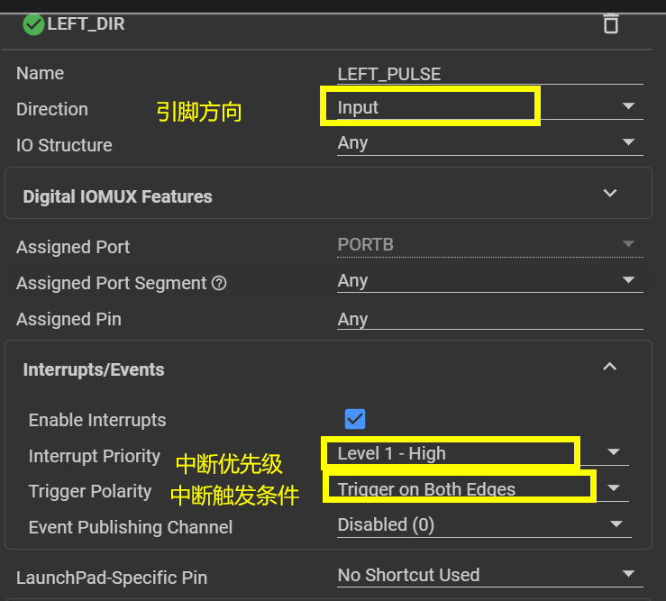

# 三、定时器的基本配置

## 1.  定时器频率设置

> - Timer Clock Source: 时钟源选择，一般为BUSCLK
> - Timer Clock Divider:前分频
> - Timer Clock Prescaler:后分频
>
> 定时器的频率/单位周期会在sysconfig中自动计算好

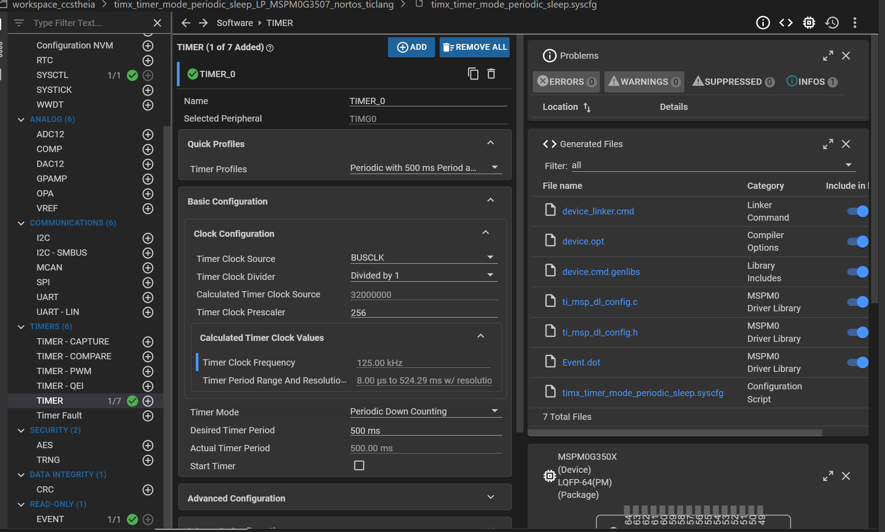

注意：

- 定时器的计数精度有限，具体由设置决定

## 3. 定时器计数模式

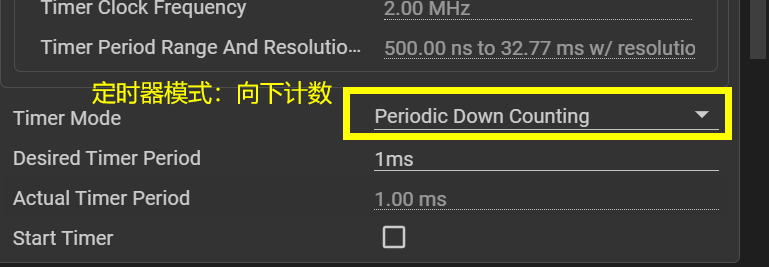

## 4. Advanced Configuration：高级功能设置

## 5. 中断配置

> - 如图，计数到零触发中断
> - interrupt Priority：中断优先级

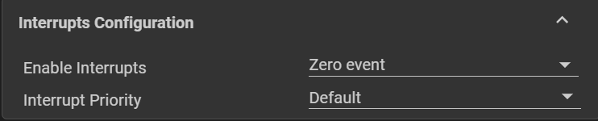

### 5.1 **中断事件使能：**

与一般单片机不同，G3507配置中断后，程序中需要加上对中断事件类型的判断。

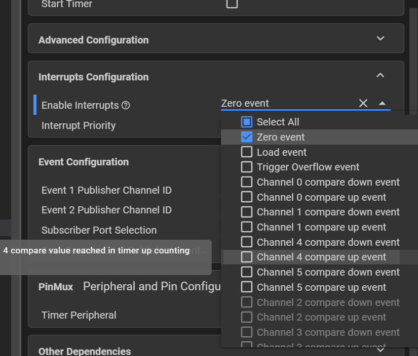

**定时器中断代码部分：**

```c
void TIMER_0_INST_IRQHandler(void)
{
    switch (DL_TimerG_getPendingInterrupt(TIMER_0_INST)) {
        case DL_TIMER_IIDX_ZERO:
            DL_GPIO_togglePins(GPIO_LEDS_PORT,
                GPIO_LEDS_USER_LED_1_PIN | GPIO_LEDS_USER_TEST_PIN);
            break;
        default:
            break;
    }
}
```

## 6. 定时器设备选择


# #M0系列的低功耗工艺

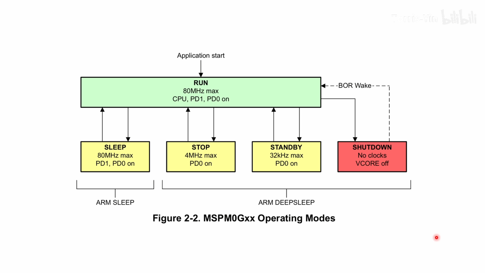

```c
DL_SYSCTL_enableSleepOnExit();//使能：当从中断返回到主函数中，单片机工作状态从RUN切换到SLEEP状态
// __WFI();
```

# 四、定时器PWM配置

## 1. PWM工作模式

- Edge-aligned:边沿对齐
- Center-aligned:中心对齐

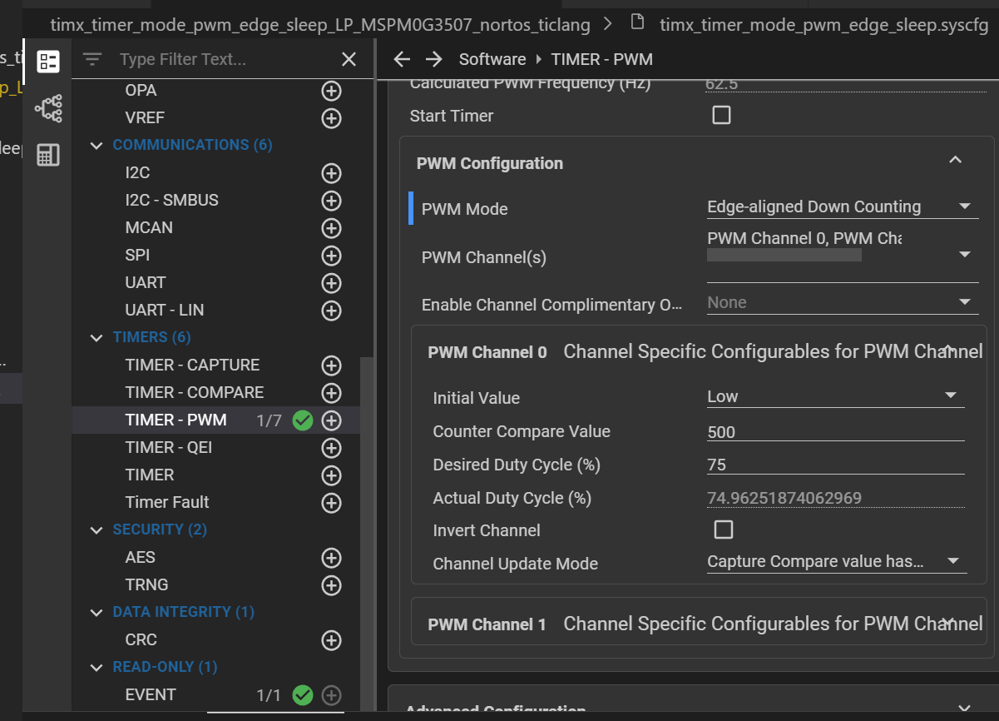

PS：

- 定时器0可以生成四路PWM

## 2. PWM的频率设置

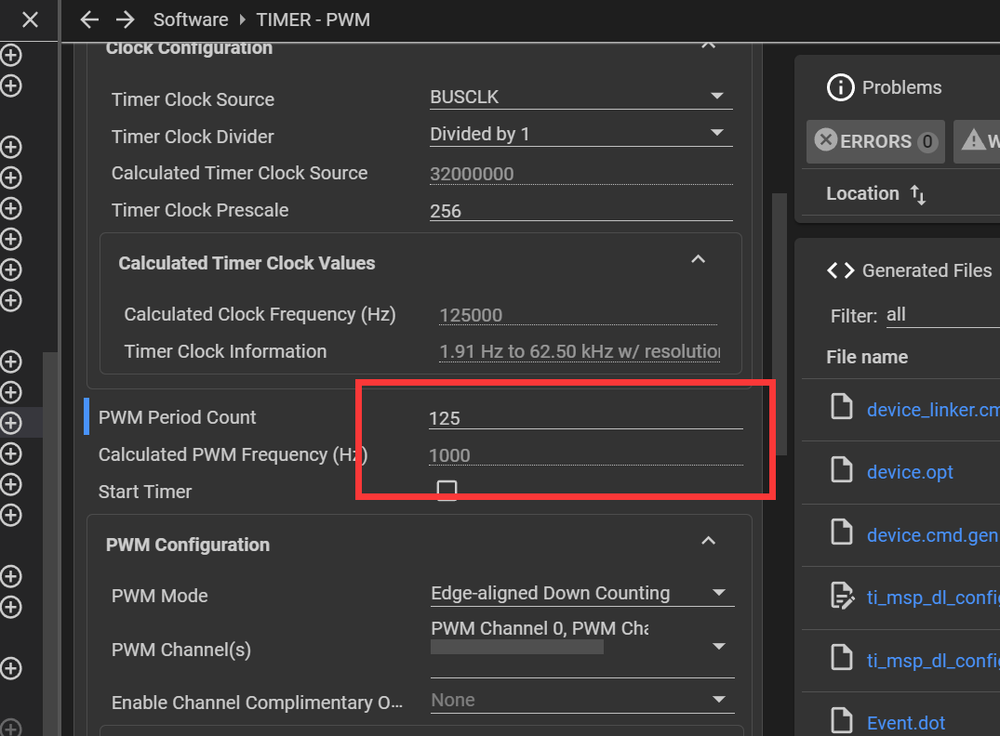


## 3. PWM占空比设置

注意：

- Compare Value = PWM Period Count  * (1-Duty Cycle)
- xxxxxxxxxx python script_name.py --train_data_dir "path/to/train_data" --test_data_dir "path/to/test_data" --img_height 128 --img_width 128 --batch_size 64 --epochs 15python

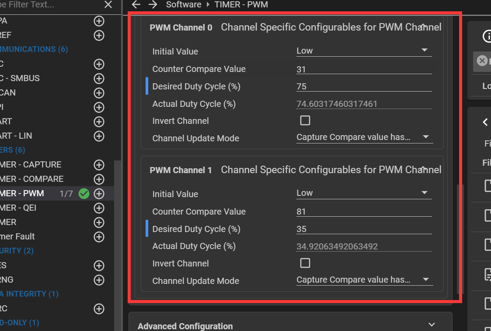

## 4. PWM输出引脚设置

注意：

- PWM四个引脚输出可以复用PWM通道

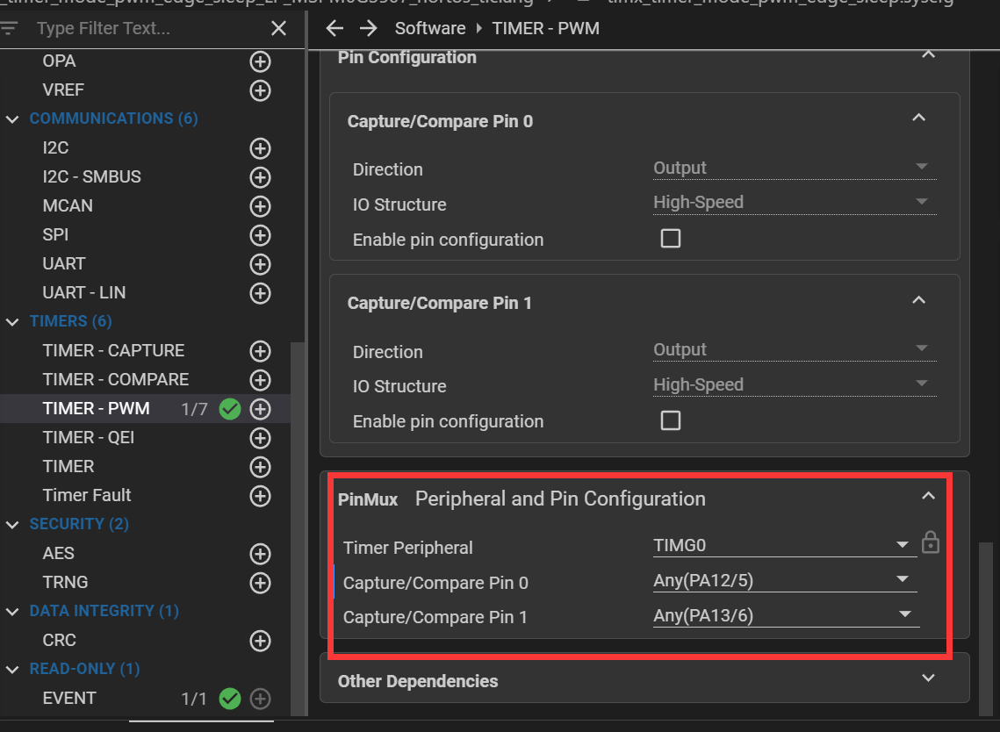

# # CCS Theia 常见的基本问题

## 一、打开工程文件夹/工作空间无法识别工程

在打开工程文件夹时，有时会出现无法加载工程的情况，出现工程文件夹无CCS Theia工程图片的现象。

**解决方案：**

用import project工具，重新导入工程，会强制CCS Theia对文件夹中的TI工程配置相关文件进行识别。

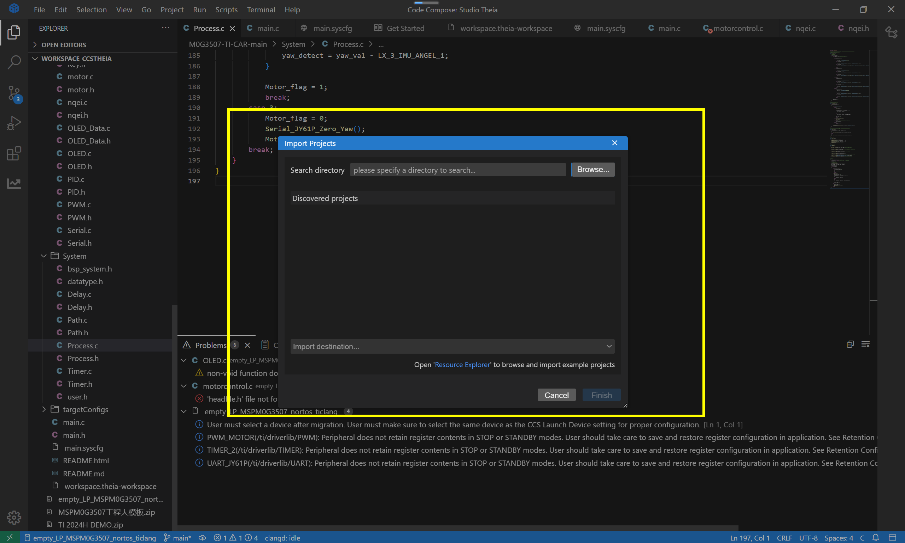

可以看到，重新import的工程出现了CCS Theia识别图标

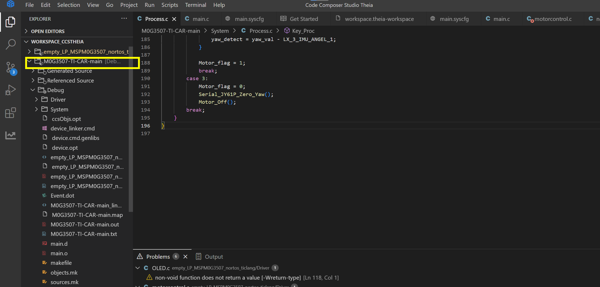
