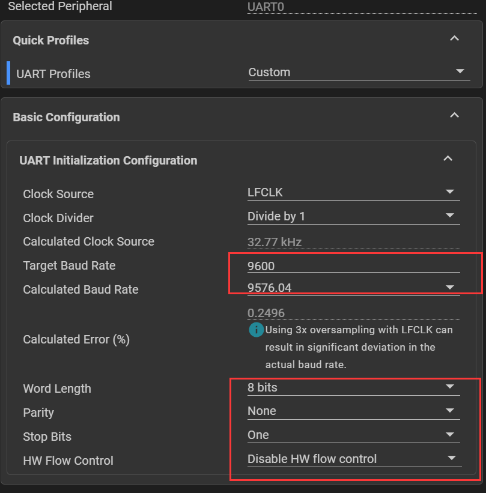
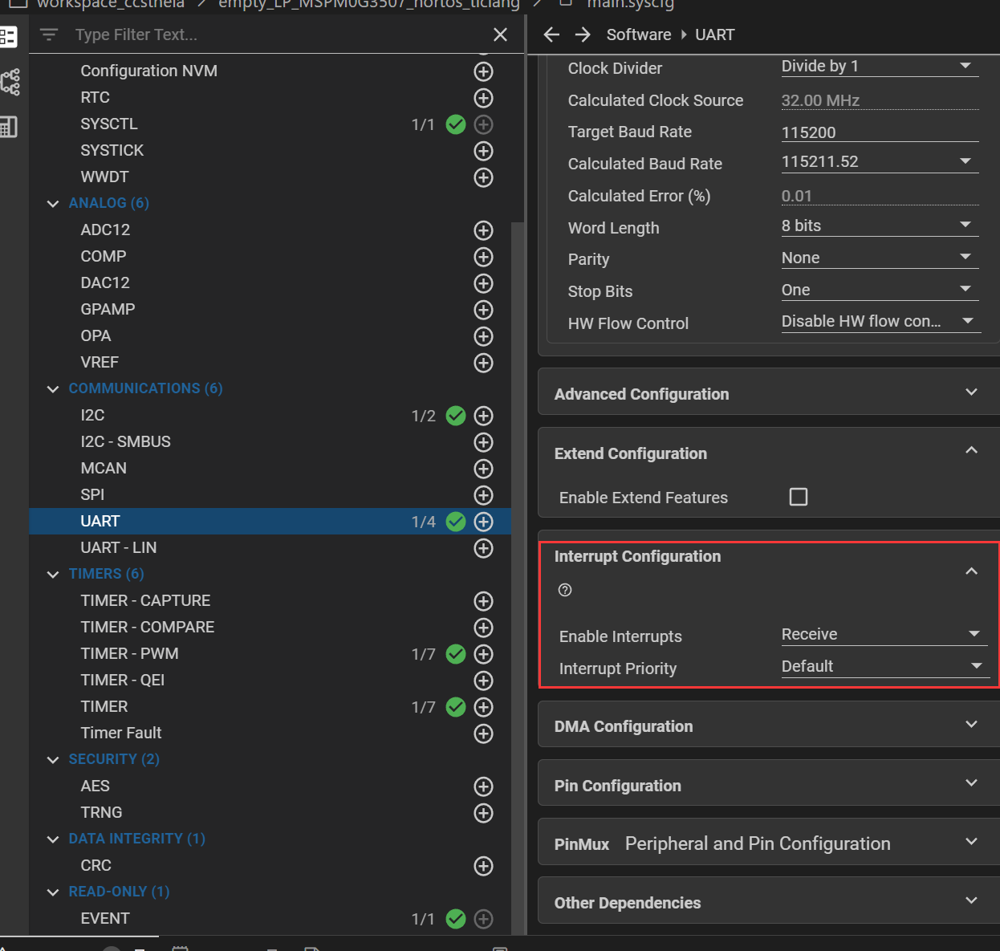
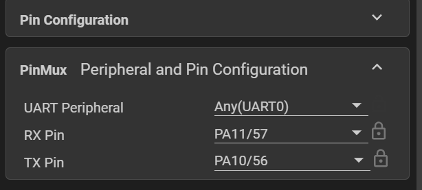

# Sysconfig界面:

## 1.波特率，数据格式的配置




## 2.中断使能配置



## 3.引脚配置

PS：LP-G3507开发板上用于板载调试的串口与单片机的PA11和PA10连接（跳线帽），配置这两个引脚可以直接通过MicroUSB接口与主机进行串口通信




# 库函数使用

## 1.初始化部分

```c
NVIC_ClearPendingIRQ(UART_0_INST_INT_IRQN);//清除串口中断标志位
NVIC_EnableIRQ(UART_0_INST_INT_IRQN);//使能串口中断
```

## 2.中断配置

```c
void UART_0_INST_IRQHandler(void)
{
    switch (DL_UART_Main_getPendingInterrupt(UART_0_INST)) {
        case DL_UART_MAIN_IIDX_RX:
            gEchoData = DL_UART_Main_receiveData(UART_0_INST);
            DL_UART_Main_transmitData(UART_0_INST, gEchoData);
            break;
        default:
            break;
    }
}
```

