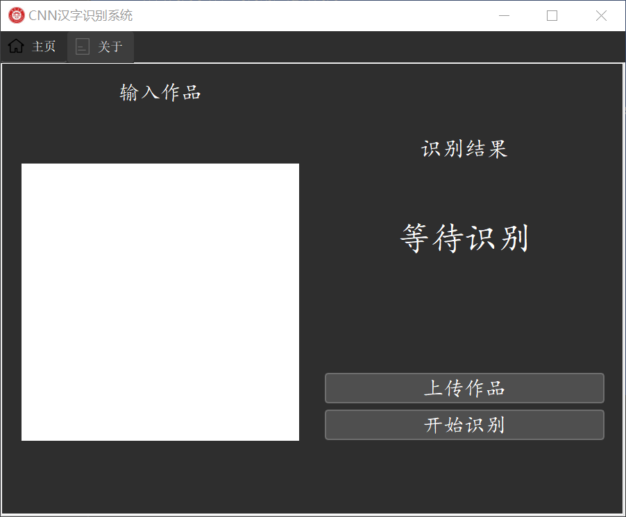
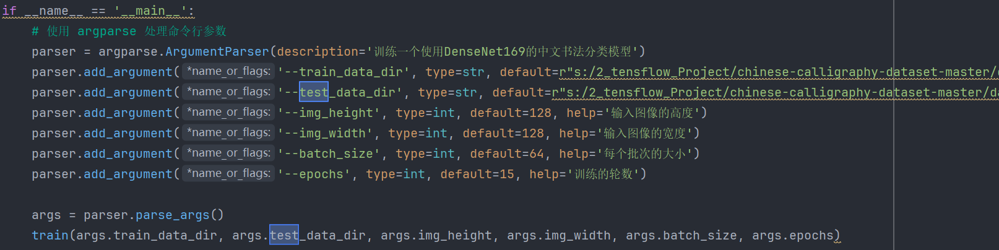

author: sz_jmu

# 前言 

TensorFlow 是一个用于机器学习和深度学习的开源框架，由 Google Brain 团队开发并在 2015 年发布。它是目前最流行的深度学习框架之一，广泛用于构建、训练和部署机器学习模型，特别是在处理复杂的神经网络任务时。TensorFlow 提供了灵活的工具和库，支持从研究到生产环境中的机器学习应用。

TensorFlow可以支持CPU，也可以支持CPU+GPU，前者配置较为简单，兼容性较好，后者需要一些额外的操作支持。

在训练规模庞大的模型时，使用CPU往往存在较大的性能限制，模型训练速度较慢。神经网络算法通常涉及大量的参数、激活值、梯度值的缓冲区，其中每个值在每一次训练迭代中国都要被完全更新，有可能会超出传统计算机的高速缓存（Cache），所以内存带宽通常会成为主要瓶颈。而与CPU相比，GPU的一个显著优势就是具有极高的内存带宽。神经网络的训练算法通常不涉及大量的分支运算和复杂控制指令，更适合在GPU硬件上完成，具有并行特性的GPU更适合神经网络的计算，因此，安装TensorFlow的GPU环境是合适的选择。

参考文章：

[解决tensorflow-gpu版本训练loss一直为nan，或者loss，accuracy数值明显不对问题_采用gpu训练 loss为负数 采用cpu训练正常-CSDN博客](https://blog.csdn.net/Sciws/article/details/125290718)

注意：配置Tensorflow gpu版本，建议使用Anoconda创建环境，避免出现污染环境变量等问题，Anoconda的配置与使用，不做过多赘述。

# 一、Tensorflow环境的基本配置

Tensorflow的GPU环境，在不同的系统下配置存在一些兼容性问题，如果直接安装最新的版本，很难完成通过GPU进行深度学习相关的环境搭建。

CUDA,cuDNN,python,tensorflow的版本需要一一对应。

使用如：python=3.8 CUDA=11.3 cuDNN=8.2.1 tensorflow-gpu=2.7.0，运行较为稳定。

**在Anoconda命令行环境下，创建Tensorflow的专属环境**。

```python
conda create -n tf_gpu_1 python==3.8
```

**诸如CSDN等网站，许多参考文章说明要从Nivida官网安装CUDA，比较耗时麻烦，实际上tensorflow需要的是CUDA中的cudatoolkit，所以在Anoconda环境下进行如下安装操作即可：**

```python
conda install cudatoolkit=11.3
```

**安装cudnn,实际上作用是CUDA的补丁包**

```python
conda install cudnn=8.2.1
```

**安装tensorflow-gpu版本**

```python
conda install tensorflow-gpu=2.7.0
```

**安装完成后，在tf_gpu_1环境中，检查是否能够查找到显卡驱动**

```
nivida-smi
```

**检查tensorflow是否识别到GPU设备**

1.进入python命令行环境

```
python
```

2.导入tensorflow库

```python
import tensorflow as tf
```

3.是否查找到GPU设备

```python
print("是否有 GPU 设备:", len(tf.config.list_physical_devices('GPU')) > 0)
```

如果tensorflow环境配置正常，能够正常识别到主机GPU，tensorflow深度学习框架基本搭建完成，由于此例使用的tensorflow和python版本不是当前最高版本，后续自行编写相关代码可能需要根据具体的情况安装更多的依赖包或对代码进行调整。

# 二、手写汉字识别神经网络模型训练

## 1.数据集的准备

要实现手写汉字识别，需要准备规模庞大的数据集。仅仅是常见的汉字数据集，就有高达七千多种类别，且汉字书法风格迥异，若要训练出泛化性强，准确度高的神经网络模型，就需要足够充分复杂的数据集，数据集即要体现出汉字的普遍特征，也要具备不同的形式风格，通过数据集也可以预料到需要足够强大的模型才能实现对任意手写汉字的识别。

例如，常见手写汉字识别数据集的下载：

[汉字名为类别标签的手写数据集](https://drive.google.com/file/d/1k849yUZhkUfbupZT0kRR2ZzZj5g89yLw/view?usp=sharing) (747M)

文件结构如下：

├── data
│   ├── chinese-calligraphy-dataset
│   │   ├── ㄚ
│   │   ├── 一
│   │   ├── 丁
│   │   ├── 七
│   │   ├── 万
│   │   └── ...
│   └── label_character.csv

## 2.编写Tensorflow工具链与使用说明

准备好数据集后，我们首先要做的工作是对数据集进行处理，使其符合神经网络模型训练的规范格式，其次，也有一些通过程序的方法能够对原始数据集进行处理，增加数据集的多样性，我们使用的方法为“数据增强”，即在原始数据集的基础上，对每张图片进行小幅度旋转，对比度调节，平移，压缩，放大等操作，这样有利于提高最后训练的模型的泛化性。

注意：代码运行需要在在命令行的==本例：tf_gpu_1==的环境中运行

### 2.1**数据集划分脚本**

本脚本分为三个阶段：

1.将原始数据集复制到指定目录，并且分为test,val,train，即测试集，验证集，训练集。

2.对分类后的数据集进行数据增强，每张图片生成5张增强后的图像，那么，数据集的复杂程度得到了一定的增加

3.检查测试集中是否存在空的子文件夹，由于有些类别的汉字图片可能较少，按照代码中：20%的比例从训练集划分给测试集，若测试集图片少于2张，可能导致测试集中该类别没有对应的图片，所以，这个阶段用于对测试集文件夹进行二次排查，确保测试集中不存在空的汉字类别图片。

==使用方法：==

修改

```python
src_data_folder = "S:/2_tensflow_Project/chinese-calligraphy-dataset-master/data/CursiveChineseCalligraphyDataset-master/Cursive_Chinese_Calligraphy_Dataset/Training"  # todo 修改你的原始数据集路径
target_data_folder = "s:/2_tensflow_Project/chinese-calligraphy-dataset-master/data/data-chinese-caoshu"  # 
```

其中src_data_folder为原始数据集路径，target_data_folder为划分好的目标路径(将包含train,val,test三个子文件夹)

在tf_gpu_1环境下，输入命令 python data_split.py

**完整代码(data_split.py)如下：**

```python
import os
import random
from shutil import copy2, move
from concurrent.futures import ThreadPoolExecutor
from tqdm import tqdm
from PIL import Image, ImageEnhance

def copy_file(src_dest):
    src_img_path, target_folder = src_dest
    copy2(src_img_path, target_folder)
def move_file(src_dest):
    src_img_path, target_folder = src_dest
    move(src_img_path, target_folder)
def augment_image(src_img_path, target_folder, num_augments=5):
    img = Image.open(src_img_path)
    for i in range(num_augments):
        img_aug = img.copy()

        # 随机旋转
        angle = random.uniform(-15, 15)  # -15到15度之间的随机旋转
        img_aug = img_aug.rotate(angle, fillcolor='white')

        # 随机平移
        max_translate = 5  # 最大平移像素值
        x_translate = random.randint(-max_translate, -max_translate)
        y_translate = random.randint(-max_translate, -max_translate)
        img_aug = img_aug.transform(img_aug.size, Image.AFFINE, (1, 0, x_translate, 0, 1, y_translate),
                                    fillcolor='white')

        # 随机缩放
        scale_factor = random.uniform(0.9, 1.1)
        w, h = img_aug.size
        img_aug = img_aug.resize((int(w * scale_factor), int(h * scale_factor)), Image.Resampling.LANCZOS)
        img_aug = img_aug.resize((w, h), Image.Resampling.LANCZOS)  # 重新调整为原始尺寸

        # 随机对比度调整
        enhancer = ImageEnhance.Contrast(img_aug)
        img_aug = enhancer.enhance(random.uniform(0.8, 1.2))

        # 随机亮度调整
        enhancer = ImageEnhance.Brightness(img_aug)
        img_aug = enhancer.enhance(random.uniform(0.8, 1.2))

        # 保存增强后的图像
        aug_img_name = os.path.basename(src_img_path).replace(".", f"_aug_{i}.")
        img_aug.save(os.path.join(target_folder, aug_img_name))


def data_set_split_and_augment(src_data_folder, target_data_folder, train_scale=0.8, val_scale=0.2, test_scale=0.0,
                               num_augments=5):
    '''
    读取源数据文件夹，生成划分好的文件夹，并对每张图片生成5张增强图片。
    :param src_data_folder: 源文件夹
    :param target_data_folder: 目标文件夹
    :param train_scale: 训练集比例
    :param val_scale: 验证集比例
    :param test_scale: 测试集比例
    :param num_augments: 每张图片生成的增强图片数量
    :return:
    '''
    class_names = os.listdir(src_data_folder)
    split_names = ['train', 'val', 'test']
    data_split_completed = True

    # 检查目标文件夹是否已存在文件，如果存在则跳过数据集划分
    for split_name in split_names:
        split_path = os.path.join(target_data_folder, split_name)
        if not os.path.exists(split_path) or len(os.listdir(split_path)) == 0:
            data_split_completed = False
            break

    if not data_split_completed:
        print("开始数据集划分")
        # 在目标目录下创建文件夹
        for split_name in split_names:
            split_path = os.path.join(target_data_folder, split_name)
            os.makedirs(split_path, exist_ok=True)
            # 在split_path的目录下创建类别文件夹
            for class_name in class_names:
                class_split_path = os.path.join(split_path, class_name)
                os.makedirs(class_split_path, exist_ok=True)

        tasks = []
        total_files = 0

        # 计算总文件数并生成任务列表
        for class_name in class_names:
            current_class_data_path = os.path.join(src_data_folder, class_name)
            current_all_data = os.listdir(current_class_data_path)
            total_files += len(current_all_data)

            random.shuffle(current_all_data)

            train_folder = os.path.join(os.path.join(target_data_folder, 'train'), class_name)
            val_folder = os.path.join(os.path.join(target_data_folder, 'val'), class_name)
            test_folder = os.path.join(os.path.join(target_data_folder, 'test'), class_name)

            train_stop_flag = len(current_all_data) * train_scale
            val_stop_flag = len(current_all_data) * (train_scale + val_scale)

            for idx, img_name in enumerate(current_all_data):
                src_img_path = os.path.join(current_class_data_path, img_name)
                if idx <= train_stop_flag:
                    tasks.append((src_img_path, train_folder))
                elif idx <= val_stop_flag:
                    tasks.append((src_img_path, val_folder))
                else:
                    tasks.append((src_img_path, test_folder))

        # 使用多线程进行复制，并显示进度条
        with ThreadPoolExecutor(max_workers=8) as executor:
            list(tqdm(executor.map(copy_file, tasks), total=total_files, desc="文件复制进度"))

        print("数据集划分完成！")
    else:
        print("数据集划分已经完成，跳过该步骤。")

    # 第二阶段：数据增强
    data_augmentation_completed = True
    for class_name in class_names:
        train_class_folder = os.path.join(target_data_folder, 'train', class_name)
        if not any("_aug_" in fname for fname in os.listdir(train_class_folder)):
            data_augmentation_completed = False
            break

    if not data_augmentation_completed:
        print("开始数据增强")
        aug_tasks = []
        for split_name in split_names:
            split_folder = os.path.join(target_data_folder, split_name)
            for class_name in class_names:
                class_split_folder = os.path.join(split_folder, class_name)
                for img_name in os.listdir(class_split_folder):
                    if "_aug_" in img_name:  # 检查是否已经增强过
                        src_img_path = os.path.join(class_split_folder, img_name)
                        aug_tasks.append((src_img_path, class_split_folder, num_augments))

        with ThreadPoolExecutor(max_workers=8) as executor:
            list(tqdm(executor.map(lambda x: augment_image(*x), aug_tasks), total=len(aug_tasks), desc="数据增强进度"))

        print("数据增强完成！")
    else:
        print("数据增强已经完成，跳过该步骤。")

    # 第三阶段：检查并补充val文件夹中的内容
    print("开始检查并补充val文件夹")
    supplement_tasks = []
    for class_name in class_names:
        val_class_folder = os.path.join(target_data_folder, 'val', class_name)
        train_class_folder = os.path.join(target_data_folder, 'train', class_name)

        val_files = os.listdir(val_class_folder)
        train_files = os.listdir(train_class_folder)

        if len(val_files) == 0 or len(val_files) < len(train_files) * 0.1:
            num_to_move = max(1, int(len(train_files) * 0.1))
            random.shuffle(train_files)
            files_to_move = train_files[:num_to_move]
            for file_name in files_to_move:
                src_img_path = os.path.join(train_class_folder, file_name)
                supplement_tasks.append((src_img_path, val_class_folder))

    with ThreadPoolExecutor(max_workers=8) as executor:
        list(tqdm(executor.map(move_file, supplement_tasks), total=len(supplement_tasks), desc="补充val文件夹进度"))

    print("val文件夹补充完成！")


if __name__ == '__main__':
    src_data_folder = "S:/2_tensflow_Project/chinese-calligraphy-dataset-master/data/CursiveChineseCalligraphyDataset-master/Cursive_Chinese_Calligraphy_Dataset/Training"  # todo 修改你的原始数据集路径
    target_data_folder = "s:/2_tensflow_Project/chinese-calligraphy-dataset-master/data/data-chinese-caoshu"  # todo 修改为你要存放的路径
    data_set_split_and_augment(src_data_folder, target_data_folder, num_augments=5)
```

### 2.2数据集标签的提取

此例汉字识别的类别高达7318种，并且为中文的格式，手动定义数据集的标签显然不太现实，因此，需要编写一个能够提取数据集标签的脚本。

使用方法：

在tf_gpu_1环境下使用命令 python labels_get.py运行此代码，将在代码相同目录下生成标签文件

**完整代码(labels_get)如下**

```python
import tensorflow as tf
from pathlib import Path


# 数据集加载函数
def load_chinese_dataset(data_dir):
    # 使用 pathlib 处理路径
    data_dir = Path(data_dir).resolve()

    # 加载数据集，获取类别标签和图像数据
    dataset = tf.keras.preprocessing.image_dataset_from_directory(
        str(data_dir),
        label_mode='int',  # 使用整数标签
        seed=123,
        batch_size=32,  # 根据内存大小调整批量大小
        image_size=(256, 256)  # 根据需要调整图像大小
    )

    # 提取类别标签
    class_names = dataset.class_names

    # 打印类别标签
    print("类别标签（中文）：", class_names)

    # 保存标签到 Python 文件
    labels_file_path = Path(data_dir).parent / "lables_caoshu.py"
    with open(labels_file_path, 'w', encoding='utf-8') as file:
        file.write("labels_caoshu = [\n")
        for label in class_names:
            file.write(f"    '{label}',\n")
        file.write("]\n")

    print(f"标签已保存到 {labels_file_path}")

    # 返回数据集和标签
    return dataset, class_names


# 示例：使用指定路径加载汉字数据集
if __name__ == '__main__':
    data_dir = r"S:/2_tensflow_Project/chinese-calligraphy-dataset-master/data/data-chinese-caoshu/train"
    dataset, chinese_labels = load_chinese_dataset(data_dir)

    # 打印一些样本数据
    for images, labels in dataset.take(1):
        print("图像批次：", images.numpy())
        print("标签批次：", labels.numpy())
```

### 2.3模型的训练

#### 2.3.1基于卷积神经网络(CNN)的模型训练

```python
import tensorflow as tf
import matplotlib.pyplot as plt
from time import time
from pathlib import Path
import os

# 设置环境变量以确保使用 UTF-8 编码
os.environ['PYTHONIOENCODING'] = 'utf-8'
os.environ['LANG'] = 'zh_CN.UTF-8'

# 数据集加载函数，指明数据集的位置并统一处理为imgheight*imgwidth的大小，同时设置batch
def data_load(data_dir, test_data_dir, img_height, img_width, batch_size):
    # 使用 pathlib 处理路径
    data_dir = Path(data_dir).resolve()
    test_data_dir = Path(test_data_dir).resolve()

    # 加载训练集
    train_ds = tf.keras.preprocessing.image_dataset_from_directory(
        str(data_dir),
        label_mode='categorical',
        seed=123,
        image_size=(img_height, img_width),
        batch_size=batch_size)
    # 加载测试集
    val_ds = tf.keras.preprocessing.image_dataset_from_directory(
        str(test_data_dir),
        label_mode='categorical',
        seed=123,
        image_size=(img_height, img_width),
        batch_size=batch_size)
    class_names = train_ds.class_names
    # 返回处理之后的训练集、验证集和类名
    return train_ds, val_ds, class_names

# 构建CNN模型
def model_load(IMG_SHAPE=(160, 160, 3), class_num=12):
    # 搭建模型
    model = tf.keras.models.Sequential([
        # 对模型做归一化的处理，将0-255之间的数字统一处理到0到1之间
        # 使用 Lambda 层代替 Rescaling 层以兼容旧版本 TensorFlow
        tf.keras.layers.Lambda(lambda x: x / 255.0, input_shape=IMG_SHAPE),
        # 卷积层，该卷积层的输出为32个通道，卷积核的大小是3*3，激活函数为relu
        tf.keras.layers.Conv2D(32, (3, 3), activation='relu'),
        # 添加池化层，池化的kernel大小是2*2
        tf.keras.layers.MaxPooling2D(2, 2),
        # Add another convolution
        # 卷积层，输出为64个通道，卷积核大小为3*3，激活函数为relu
        tf.keras.layers.Conv2D(64, (3, 3), activation='relu'),
        # 池化层，最大池化，对2*2的区域进行池化操作
        tf.keras.layers.MaxPooling2D(2, 2),
        # 将二维的输出转化为一维
        tf.keras.layers.Flatten(),
        # 和卷积前的例子一样，这里使用了 128 个全连接层和 10 个输出层
        tf.keras.layers.Dense(128, activation='relu'),
        # 通过softmax函数将模型输出为类名长度的神经元上，激活函数采用softmax对应概率值
        tf.keras.layers.Dense(class_num, activation='softmax')
    ])
    # 输出模型信息
    model.summary()
    # 指明模型的训练参数，优化器为sgd优化器，损失函数为交叉熵损失函数
    model.compile(optimizer='sgd', loss='categorical_crossentropy', metrics=['accuracy'])
    # 返回模型
    return model

# 展示训练过程的曲线
def show_loss_acc(history):
    # 从history中提取模型训练集和验证集准确率信息和误差信息
    acc = history.history['accuracy']
    val_acc = history.history['val_accuracy']
    loss = history.history['loss']
    val_loss = history.history['val_loss']

    # 按照上下结构将图画输出
    plt.figure(figsize=(8, 8))
    plt.subplot(2, 1, 1)
    plt.plot(acc, label='Training Accuracy')
    plt.plot(val_acc, label='Validation Accuracy')
    plt.legend(loc='lower right')
    plt.ylabel('Accuracy')
    plt.ylim([min(plt.ylim()), 1])
    plt.title('Training and Validation Accuracy')

    plt.subplot(2, 1, 2)
    plt.plot(loss, label='Training Loss')
    plt.plot(val_loss, label='Validation Loss')
    plt.legend(loc='upper right')
    plt.ylabel('Cross Entropy')
    plt.title('Training and Validation Loss')
    plt.xlabel('epoch')
    plt.savefig('results/results_cnn.png', dpi=100)

def train(epochs):
    # 开始训练，记录开始时间
    begin_time = time()
    # 加载数据集， 修改为你的数据集的路径
    train_ds, val_ds, class_names = data_load(
        r"S:/2_tensflow_Project/chinese-calligraphy-dataset-master/data/data-chinese-all-more/train",
        r"S:/2_tensflow_Project/chinese-calligraphy-dataset-master/data/data-chinese-all-more/val",
        160, 160, 32)
    print("类别标签（中文）：", class_names)
    # 加载模型
    model = model_load(class_num=len(class_names))
    # 指明训练的轮数epoch，开始训练
    history = model.fit(train_ds, validation_data=val_ds, epochs=epochs)
    # 保存模型， 修改为你要保存的模型的名称
    model.save("models/cnn_hanzi_2.h5")
    # 记录结束时间
    end_time = time()
    run_time = end_time - begin_time
    print('该循环程序运行时间：', run_time, "s")  # 该循环程序运行时间： 1.4201874732
    # 绘制模型训练过程图
    show_loss_acc(history)

if __name__ == '__main__':
    train(epochs=40)
```

#### **2.3.2基于残差神经网络(Resnet)的模型训练**

汉字识别模型类别非常多，使用一般的神经网络训练出来的模型可能泛化性并不理想，针对多类别的模型训练可以采用更复杂的网络，比如本例的Resnet残差神经网络，最终训练的模型准确率和泛化性极高。

==使用方法：==

代码片段中，修改路径为已经划分好的训练集，测试集路径

```python
train_ds, val_ds, class_names = data_load(
    r"s:/2_tensflow_Project/chinese-calligraphy-dataset-master/data/data-chinese-caoshu/train",

    r"s:/2_tensflow_Project/chinese-calligraphy-dataset-master/data/data-chinese-caoshu/val",
    128, 128, 64)  # 减小批处理大小
```

模型保存名称修改

```python
model.save("models/final_resnet50_chinese_kai", save_format='tf')
```

在tf_gpu_1环境下，使用命令 python model_train_resnet50.py

```python
import tensorflow as tf
import matplotlib.pyplot as plt
from time import time
from pathlib import Path
import os

# 设置环境变量以确保使用 UTF-8 编码
os.environ['PYTHONIOENCODING'] = 'utf-8'
os.environ['LANG'] = 'zh_CN.UTF-8'

# 启用混合精度训练
from tensorflow.keras.mixed_precision import experimental as mixed_precision
policy = mixed_precision.Policy('mixed_float16')
mixed_precision.set_policy(policy)

# 数据加载函数，加入数据增强
def data_load(data_dir, test_data_dir, img_height, img_width, batch_size):
    data_dir = Path(data_dir).resolve()
    test_data_dir = Path(test_data_dir).resolve()

    # 加载训练集
    train_ds = tf.keras.preprocessing.image_dataset_from_directory(
        str(data_dir),
        label_mode='categorical',
        seed=123,
        image_size=(img_height, img_width),
        batch_size=batch_size
    )

    # 获取类别标签
    class_names = train_ds.class_names

    # 数据增强
    data_augmentation = tf.keras.Sequential([
        tf.keras.layers.experimental.preprocessing.RandomFlip('horizontal'),
        tf.keras.layers.experimental.preprocessing.RandomRotation(0.1),
    ])

    # 加入数据增强
    train_ds = train_ds.map(lambda x, y: (data_augmentation(x), y), num_parallel_calls=tf.data.experimental.AUTOTUNE)

    # 加载测试集
    val_ds = tf.keras.preprocessing.image_dataset_from_directory(
        str(test_data_dir),
        label_mode='categorical',
        seed=123,
        image_size=(img_height, img_width),
        batch_size=batch_size
    )

    # 预取数据
    train_ds = train_ds.prefetch(buffer_size=tf.data.experimental.AUTOTUNE)
    val_ds = val_ds.prefetch(buffer_size=tf.data.experimental.AUTOTUNE)

    return train_ds, val_ds, class_names

# 构建ResNet模型
def model_load(IMG_SHAPE=(128, 128, 3), class_num=7200):
    resnet = tf.keras.applications.ResNet50(weights='imagenet', include_top=False, input_shape=IMG_SHAPE)

    model = tf.keras.models.Sequential([
        resnet,
        tf.keras.layers.GlobalAveragePooling2D(),
        tf.keras.layers.Dense(1024, activation='relu'),
        tf.keras.layers.Dropout(0.5),
        tf.keras.layers.Dense(class_num, activation='softmax')
    ])

    model.summary()

    initial_learning_rate = 0.01
    lr_schedule = tf.keras.optimizers.schedules.ExponentialDecay(
        initial_learning_rate, decay_steps=10000, decay_rate=0.9, staircase=True
    )

    optimizer = tf.keras.optimizers.SGD(learning_rate=lr_schedule, momentum=0.9)

    model.compile(optimizer=optimizer,
                  loss='categorical_crossentropy',
                  metrics=['accuracy'])

    return model

# 展示训练过程的曲线
def show_loss_acc(history):
    acc = history.history['accuracy']
    val_acc = history.history['val_accuracy']
    loss = history.history['loss']
    val_loss = history.history['val_loss']

    plt.figure(figsize=(8, 8))
    plt.subplot(2, 1, 1)
    plt.plot(acc, label='Training Accuracy')
    plt.plot(val_acc, label='Validation Accuracy')
    plt.legend(loc='lower right')
    plt.ylabel('Accuracy')
    plt.ylim([min(plt.ylim()), 1])
    plt.title('Training and Validation Accuracy')

    plt.subplot(2, 1, 2)
    plt.plot(loss, label='Training Loss')
    plt.plot(val_loss, label='Validation Loss')
    plt.legend(loc='upper right')
    plt.ylabel('Cross Entropy')
    plt.title('Training and Validation Loss')
    plt.xlabel('epoch')
    plt.savefig('results/results_resnet.png', dpi=100)

# 增加早停和模型检查点回调
def train(epochs):
    begin_time = time()

    train_ds, val_ds, class_names = data_load(
        r"s:/2_tensflow_Project/chinese-calligraphy-dataset-master/data/data-chinese-caoshu/train",

        r"s:/2_tensflow_Project/chinese-calligraphy-dataset-master/data/data-chinese-caoshu/val",
        128, 128, 64)  # 减小批处理大小

    print("类别标签（中文）：", class_names)

    model = model_load(class_num=len(class_names))

    early_stopping = tf.keras.callbacks.EarlyStopping(
        monitor='val_loss', patience=10, restore_best_weights=True
    )

    checkpoint = tf.keras.callbacks.ModelCheckpoint(
        'models/final_resnet50_chinese_kai', monitor='val_loss', save_best_only=True, save_format='tf'
    )

    history = model.fit(
        train_ds, validation_data=val_ds, epochs=epochs,
        callbacks=[early_stopping, checkpoint]
    )

    model.save("models/final_resnet50_chinese_kai", save_format='tf')

    end_time = time()
    run_time = end_time - begin_time
    print('该循环程序运行时间：', run_time, "s")

    show_loss_acc(history)
if __name__ == '__main__':
    train(epochs=15)
```

### 2.4 模型的测试

代码如下，更改测试集以及模型路径为相应的目标路径即可

```python
import tensorflow as tf
import matplotlib.pyplot as plt
import numpy as np
import os
import time
import random

# 设置Matplotlib显示中文
plt.rcParams['font.family'] = ['sans-serif']
plt.rcParams['font.sans-serif'] = ['SimHei']


# 数据加载
def data_load(data_dir, test_data_dir, img_height, img_width, batch_size):
    class_names = sorted(
        [dir_name for dir_name in os.listdir(data_dir) if os.path.isdir(os.path.join(data_dir, dir_name))])

    print(f"Detected {len(class_names)} classes.")

    def process_path(file_path):
        label = tf.strings.split(file_path, os.path.sep)[-2]
        label = tf.where(tf.equal(tf.constant(class_names), label))[0][0]
        img = tf.io.read_file(file_path)
        img = tf.image.decode_jpeg(img, channels=3)
        img = tf.image.resize(img, [img_height, img_width])
        return img, label

    def prepare_dataset(directory):
        list_ds = tf.data.Dataset.list_files(os.path.join(directory, '*/*'), shuffle=True)
        labeled_ds = list_ds.map(process_path, num_parallel_calls=tf.data.experimental.AUTOTUNE)
        labeled_ds = labeled_ds.batch(batch_size).prefetch(buffer_size=tf.data.experimental.AUTOTUNE)
        return labeled_ds

    train_ds = prepare_dataset(data_dir)
    val_ds = prepare_dataset(test_data_dir)

    print(f"Loaded datasets: {len(train_ds)} training batches, {len(val_ds)} validation batches.")

    return train_ds, val_ds, class_names


# 聚合类别并随机抽取10个类别生成热力图
def aggregate_labels_and_select(real_labels, pred_labels, num_classes, num_groups, selected_groups):
    group_size = num_classes // num_groups
    real_labels_agg = [label // group_size for label in real_labels]
    pred_labels_agg = [label // group_size for label in pred_labels]

    real_labels_selected = [real_labels_agg[i] for i in range(len(real_labels_agg)) if
                            real_labels_agg[i] in selected_groups]
    pred_labels_selected = [pred_labels_agg[i] for i in range(len(pred_labels_agg)) if
                            real_labels_agg[i] in selected_groups]

    return real_labels_selected, pred_labels_selected


# 测试cnn模型准确率
def test_cnn():
    # 加载数据
    start_time = time.time()
    train_ds, test_ds, class_names = data_load(
        r"S:/2_tensflow_Project/chinese-calligraphy-dataset-master/data/data-chinese-all/train",
        r"S:/2_tensflow_Project/chinese-calligraphy-dataset-master/data/data-chinese-all/val",
        160, 160, 16)

    print(f"Data loading completed in {time.time() - start_time:.2f} seconds.")

    # 加载模型
    start_time = time.time()
    model = tf.keras.models.load_model("models/final_resnet50_chinese")
    print(f"Model loaded in {time.time() - start_time:.2f} seconds.")

    # 编译模型
    model.compile(optimizer='adam', loss='sparse_categorical_crossentropy', metrics=['accuracy'])

    # 推理
    test_real_labels = []
    test_pre_labels = []
    print("Starting model inference...")
    inference_start_time = time.time()
    for batch_idx, (test_batch_images, test_batch_labels) in enumerate(test_ds):
        if batch_idx >= 10:  # 只处理前10个batch来加速测试
            break
        if batch_idx % 2 == 0:
            print(f"Processing batch {batch_idx + 1}...")
        test_batch_labels = test_batch_labels.numpy()
        test_batch_pres = model.predict(test_batch_images)

        test_real_labels.extend(test_batch_labels)
        test_pre_labels.extend(np.argmax(test_batch_pres, axis=1))
    print(f"Inference completed in {time.time() - inference_start_time:.2f} seconds.")

    # 聚合类别并随机抽取10个类别
    num_groups = 10
    selected_groups = random.sample(range(num_groups), 10)
    test_real_labels_agg, test_pre_labels_agg = aggregate_labels_and_select(
        test_real_labels, test_pre_labels, len(class_names), num_groups, selected_groups
    )

    # 生成聚合后的热力图
    print("Generating aggregated heatmaps...")
    heat_maps = np.zeros((num_groups, num_groups))
    for real_label, pred_label in zip(test_real_labels_agg, test_pre_labels_agg):
        heat_maps[real_label][pred_label] += 1

    heat_maps_sum = np.sum(heat_maps, axis=1).reshape(-1, 1)
    heat_maps_sum[heat_maps_sum == 0] = 1
    heat_maps_float = heat_maps / heat_maps_sum

    # 创建存储热力图的文件夹
    output_dir = "results/aggregated_heatmap"
    os.makedirs(output_dir, exist_ok=True)

    # 保存聚合热力图
    save_path = os.path.join(output_dir, "aggregated_heatmap.png")
    show_heatmaps("Aggregated Heatmap", selected_groups, selected_groups,
                  heat_maps_float[selected_groups][:, selected_groups], save_path)
    print(f"Saved aggregated heatmap to {save_path}")

    print("All heatmaps generated and saved.")


def show_heatmaps(title, x_labels, y_labels, harvest, save_name):
    # 创建画布
    fig, ax = plt.subplots()
    im = ax.imshow(harvest, cmap="OrRd")

    # 修改标签
    ax.set_xticks(np.arange(len(y_labels)))
    ax.set_yticks(np.arange(len(x_labels)))
    ax.set_xticklabels(y_labels)
    ax.set_yticklabels(x_labels)

    # 旋转x轴标签
    plt.setp(ax.get_xticklabels(), rotation=45, ha="right", rotation_mode="anchor")

    # 添加每个热力块的具体数值
    for i in range(len(x_labels)):
        for j in range(len(y_labels)):
            ax.text(j, i, round(harvest[i, j], 2), ha="center", va="center", color="black")

    ax.set_xlabel("Predict label")
    ax.set_ylabel("Actual label")
    ax.set_title(title)
    fig.tight_layout()
    plt.colorbar(im)
    plt.savefig(save_name, dpi=100)
    plt.close(fig)  # 关闭图形以释放内存


if __name__ == '__main__':
    start_time = time.time()
    test_cnn()
    print(f"Total execution time: {time.time() - start_time:.2f} seconds.")

```

### 2.5 tensorboard工具——模型流图

model = tf.saved_model.load("models/final_resnet50_chinese") 语句中修改为目标模型


```python
import tensorflow as tf

# 假设你已经加载了你的模型
model = tf.saved_model.load("models/final_resnet50_chinese")

# 获取模型的推理签名（与导出的模型相关，可能需要调整具体签名名称）
infer = model.signatures['serving_default']

# 创建 TensorBoard 日志目录
log_dir = "logs/graph"
writer = tf.summary.create_file_writer(log_dir)


# 创建一个包装函数并使用 tf.function
@tf.function
def model_inference(input_tensor):
    return infer(input_tensor)


# 创建一个示例输入张量（调整形状以匹配模型的输入要求）
example_input = tf.random.normal([1, 160, 160, 3])  # 假设模型输入是160x160x3的图像

# 记录数据流图
with writer.as_default():
    # 开启追踪
    tf.summary.trace_on(graph=True, profiler=True)

    # 执行一次推理以记录计算图
    model_inference(example_input)

    # 记录计算图
    tf.summary.trace_export(name="model_trace", step=0, profiler_outdir=log_dir)

    writer.flush()

print("Graph has been written to TensorBoard logs. You can view it using TensorBoard.")
```

## 2.6 模型的使用

本例为基于Qt界面的汉字识别程序，通过加载训练好的Tensorflow模型，选择本地的图片作为输入，进行手写汉字识别

```python
# -*- coding: utf-8 -*-
# @Time    : 2021/6/17 20:29
# @Author  : dejahu
# @Email   : 1148392984@qq.com
# @File    : window.py
# @Software: PyCharm
# @Brief   : 图形化界面

import tensorflow as tf
from PyQt5.QtGui import *
from PyQt5.QtCore import *
from PyQt5.QtWidgets import *
import sys
import cv2
from PIL import Image
import numpy as np
import shutil
from lables_caoshu import labels_caoshu

class MainWindow(QTabWidget):
    def __init__(self):
        super().__init__()
        self.setWindowIcon(QIcon('images/logo.png'))
        self.setWindowTitle('CNN汉字识别系统')
        self.model = tf.keras.models.load_model("models/final_resnet50_chinese")
        self.to_predict_name = "images/Start_1.png"
        self.class_names = labels_caoshu
        self.resize(900, 700)
        self.initUI()

    def initUI(self):
        main_widget = QWidget()
        main_layout = QHBoxLayout()
        font = QFont('楷体', 15)

        dark_style = """
            QWidget {
                background-color: #2E2E2E;
                color: #FFFFFF;
            }
            QLabel {
                color: #FFFFFF;
            }
            QPushButton {
                background-color: #4F4F4F;
                border: 2px solid #6E6E6E;
                color: #FFFFFF;
                padding: 5px;
                border-radius: 5px;
            }
            QPushButton:hover {
                background-color: #6E6E6E;
            }
            QPushButton:pressed {
                background-color: #3D3D3D;
            }
            QTabBar::tab {
                background: #3D3D3D;
                color: #FFFFFF;
                padding: 10px;
                border-radius: 5px;
            }
            QTabBar::tab:selected {
                background: #2E2E2E;
                border-bottom: 2px solid #4F4F4F;
            }
            QTabBar::tab:!selected {
                background: #3D3D3D;
            }
        """
        self.setStyleSheet(dark_style)

        left_widget = QWidget()
        left_layout = QVBoxLayout()
        img_title = QLabel("输入作品")
        img_title.setFont(font)
        img_title.setAlignment(Qt.AlignCenter)
        self.img_label = QLabel()
        self.process_image(self.to_predict_name)
        self.img_label.setPixmap(QPixmap("images/binary_show.png"))
        left_layout.addWidget(img_title)
        left_layout.addWidget(self.img_label, 1, Qt.AlignCenter)
        left_widget.setLayout(left_layout)

        right_widget = QWidget()
        right_layout = QVBoxLayout()
        btn_change = QPushButton(" 上传作品 ")
        btn_change.setIcon(QIcon('images/upload.png'))
        btn_change.clicked.connect(self.change_img)
        btn_change.setFont(font)
        btn_predict = QPushButton(" 开始识别 ")
        btn_predict.setIcon(QIcon('images/recognize.png'))
        btn_predict.setFont(font)
        btn_predict.clicked.connect(self.predict_img)
        label_result = QLabel(' 识别结果 ')
        self.result = QLabel("等待识别")
        label_result.setFont(QFont('楷体', 16))
        self.result.setFont(QFont('楷体', 24))
        right_layout.addStretch()
        right_layout.addWidget(label_result, 0, Qt.AlignCenter)
        right_layout.addStretch()
        right_layout.addWidget(self.result, 0, Qt.AlignCenter)
        right_layout.addStretch()
        right_layout.addStretch()
        right_layout.addWidget(btn_change)
        right_layout.addWidget(btn_predict)
        right_layout.addStretch()
        right_widget.setLayout(right_layout)

        main_layout.addWidget(left_widget)
        main_layout.addWidget(right_widget)
        main_widget.setLayout(main_layout)

        about_widget = QWidget()
        about_layout = QVBoxLayout()
        about_title = QLabel('欢迎使用手写汉字识别系统')
        about_title.setFont(QFont('楷体', 18))
        about_title.setAlignment(Qt.AlignCenter)
        about_img = QLabel()
        about_img.setPixmap(QPixmap('images/CNN.png'))
        about_img.setAlignment(Qt.AlignCenter)
        label_super = QLabel("sz_jmu")
        label_super.setFont(QFont('楷体', 12))
        label_super.setAlignment(Qt.AlignRight)
        about_layout.addWidget(about_title)
        about_layout.addStretch()
        about_layout.addWidget(about_img)
        about_layout.addStretch()
        about_layout.addWidget(label_super)
        about_widget.setLayout(about_layout)

        self.addTab(main_widget, '主页')
        self.addTab(about_widget, '关于')
        self.setTabIcon(0, QIcon('images/主页面.png'))
        self.setTabIcon(1, QIcon('images/关于.png'))

    # 上传并显示图片
    def change_img(self):
        openfile_name = QFileDialog.getOpenFileName(self, 'chose files', '',
                                                    'Image files(*.jpg *.png *jpeg)')  # 打开文件选择框选择文件
        img_name = openfile_name[0]  # 获取图片名称
        if img_name == '':
            pass
        else:
            target_image_name = "images/tmp_up." + img_name.split(".")[-1]  # 将图片移动到当前目录
            shutil.copy(img_name, target_image_name)
            self.to_predict_name = target_image_name
            self.process_image(self.to_predict_name)
            self.img_label.setPixmap(QPixmap("images/binary_show.png"))  # 显示二值化后的图片
            self.result.setText("等待识别")
            self.show_binary_image()

    # 图片处理和二值化
    def process_image(self, image_path):
        img_init = cv2.imread(image_path)  # 打开图片
        h, w, c = img_init.shape
        scale = 400 / h
        img_show = cv2.resize(img_init, (0, 0), fx=scale, fy=scale)  # 将图片的大小统一调整到400的高，方便界面显示

        # 二值化处理
        gray_img = cv2.cvtColor(img_init, cv2.COLOR_BGR2GRAY)
        _, binary_img = cv2.threshold(gray_img, 127, 255, cv2.THRESH_BINARY)
        binary_img_inverted = cv2.bitwise_not(binary_img)
        binary_img_colored = cv2.cvtColor(binary_img_inverted, cv2.COLOR_GRAY2BGR)
        binary_img_show = cv2.resize(binary_img_colored, (0, 0), fx=scale, fy=scale)  # 将二值化图像调整到400高显示

        cv2.imwrite('images/binary_show.png', binary_img_show)  # 保存显示用的二值化图片
        cv2.imwrite('images/target.png', binary_img_colored)  # 保存用于识别的二值化图片
        cv2.imwrite('images/binary_target.png', binary_img)  # 保存仅用于二值化显示的图像

    # 预测图片
    def predict_img(self):
        img = Image.open('images/target.png')  # 读取二值化图片
        img = img.resize((128, 128))  # 调整图像大小到模型所需的输入尺寸
        img = np.asarray(img)  # 将图片转化为numpy的数组

        # 确保图像是3个通道的
        if img.shape[-1] != 3:
            img = cv2.cvtColor(img, cv2.COLOR_GRAY2RGB)

        img = img.reshape(1, 128, 128, 3)  # 调整图像的形状以匹配模型输入
        outputs = self.model.predict(img)  # 将图片输入模型得到结果
        result_index = int(np.argmax(outputs))
        result = self.class_names[result_index]  # 获得对应的识别结果
        self.result.setText(result)  # 在界面上显示结果

    # 显示二值化图片
    def show_binary_image(self):
        binary_image_window = QMainWindow()
        binary_image_window.setWindowTitle('二值化处理结果')
        binary_image_widget = QLabel()
        binary_image = QPixmap("images/binary_target.png")
        binary_image_widget.setPixmap(binary_image)
        binary_image_widget.setAlignment(Qt.AlignCenter)
        binary_image_window.setCentralWidget(binary_image_widget)
        binary_image_window.resize(binary_image.size())
        binary_image_window.show()

    # 界面关闭事件，询问用户是否关闭
    def closeEvent(self, event):
        reply = QMessageBox.question(self,
                                     '退出',
                                     "是否要退出程序？",
                                     QMessageBox.Yes | QMessageBox.No,
                                     QMessageBox.No)
        if reply == QMessageBox.Yes:
            self.close()
            event.accept()
        else:
            event.ignore()


if __name__ == "__main__":
    app = QApplication(sys.argv)
    x = MainWindow()
    x.show()
    sys.exit(app.exec_())
```

**运行结果如下：**



tensorflow_gpu_tools工具链总结：

- data_split.py：数据集划分脚本

- labels_get.py：标签生成脚本

- model_train_resnet50.py：训练脚本

- tf_board.py：模型结构/流图展示脚本

- window.py：模型识别QT程序

# 更新记录

此栏目用于记录代码项目新增功能，bug修复等日志

> date:2024.8.29
>
> 对**model_train_densenet169.py** 新增**参数接口化**配置，使用**命令行**即可便捷配置模型训练参数
>
> ```python
> import argparse                          # 导入argparse模块以处理命令行参数
> ```
>
> 
>
> 
>
> 如：
>
> ```python
> python script_name.py --train_data_dir "path/to/train_data" --test_data_dir "path/to/test_data" --img_height 128 --img_width 128 --batch_size 64 --epochs 15
> ```
