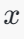
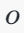
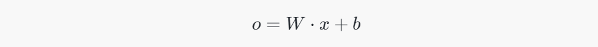
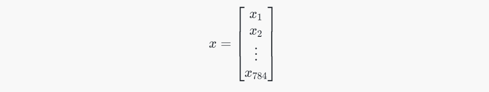
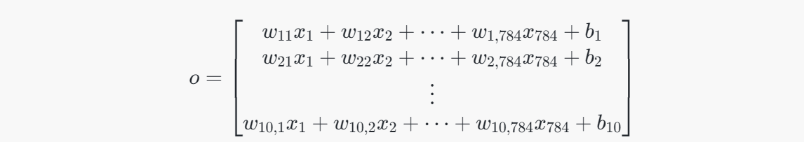
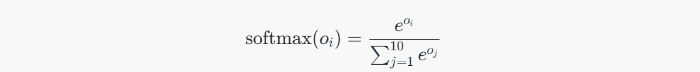

# 一、独热编码

独热编码使用N位代表N种状态，任意时候只有其中一位有效。采用独热编码的例程：

独热编码使用N位代表N种状态，任意时候只有其中一位有效。

采用独热编码的例子

```
性别:  
[0, 1]代表女，[1, 0]代表男

数字0-9: 
[0,0,0,0,0,0,0,0,0,1]代表9，[0,1,0,0,0,0,0,0,0,0]代表1
```

独热编码的优点在于

- 能够处理非连续型数值特征
- 在一定程度上也扩充了特征。比如性别本身是一个特征，经过编码以后，就变成了男或女两个特征。
- 适合分类

在神经网络中，独热编码其实具有很强的容错性，比如神经网络的输出结果是 [0,0.1,0.2,0.7,0,0,0,0,0, 0]转成独热编码后，表示数字3。即值最大的地方变为1，其余均为0。[0,0.1,0.4,0.5,0,0,0,0,0, 0]也能表示数字3。

> numpu中有一个函数，numpy.argmax()可以取得最大值的下标。

# 二、神经网络训练的重要概念

## 1. 输入（x）输出（y）、标签（label）

- 输入是指传入给网络处理的向量，相当于数学函数中的变量。
- 输出是指网络处理后返回的结果，相当于数据函数中的函数值。
- 标签是指我们期望网络返回的结果。

对于识别mnist图片而言，输入是大小为784（28 * 28）的向量，输出是大小为10的概率向量（概率最大的位置，即预测的数字）,这部分操作由==将长度为784的向量 x*x* 转换为长度为10的向量，是通过**全连接层（Fully Connected Layer）** 实现的==。

## 2. 损失函数（loss function）

损失函数评估网络模型的好坏，值越大，表示模型越差，值越小，表示模型越好。因为传入大量的训练集训练的目标，就是将损失函数的值降到最小。

### 2.1 **常见的损失函数定义：**

**差的平方和 sum((y - label)^2)**

```
[0, 0, 1] 与 [0.1, 0.3, 0.6]的差的平方和为 0.01 + 0.09 + 0.16 = 0.26
[0, 0, 1] 与 [0.2, 0.2, 0.6]的差的平方和为 0.04 + 0.04 + 0.16 = 0.24
[0, 0, 1] 与 [0.1, 0, 0.9]的差的平方和为 0.01 + 0.01 = 0.02
```

**交叉熵 -sum(label * log(y))**

```
[0, 0, 1] 与 [0.1, 0.3, 0.6]的交叉熵为 -log(0.6) = 0.51
[0, 0, 1] 与 [0.2, 0.2, 0.6]的交叉熵为 -log(0.6) = 0.51
[0, 0, 1] 与 [0.1, 0, 0.9]的交叉熵为 -log(0.9) = 0.10
```

当label为0时，交叉熵为0，label为1时，交叉熵为-log(y)，交叉熵只关注独热编码中有效位的损失。这样屏蔽了无效位值的变化（无效位的值的变化并不会影响最终结果），并且通过取对数放大了有效位的损失。当有效位的值趋近于0时，交叉熵趋近于正无穷大。

## 3. 回归模型

我们可以将网络理解为一个函数，回归模型，其实是希望对这个函数进行拟合。
比如定义模型为 Y = X * w + b，对应的损失即

```
loss = (Y - labal)^2
     = -(X * w - b - label)^2
这里损失函数用方差计算，这个函数是关于w和b的二次函数，所以神经网络训练的目的是找到w和b，使得loss最小。
```

可以通过不断地传入X和label的值，来修正w和b，使得最终得到的Y与label的loss最小。这个训练的过程，可以采用**梯度下降**的方法。通过梯度下降，找到最快的方向，调整w和b值，使得w * X + b的值越来越接近label。

[机器学习-梯度下降算法原理及公式推导_梯度下降计算公式-CSDN博客](https://blog.csdn.net/iqdutao/article/details/107174240)


## 4. 学习速率

简单说，梯度即一个函数的斜率，找到函数的斜率，其实就知道了w和b的值往哪个方向调整，能够让函数值（loss）降低得最快。那么方向知道了，往这个方向调整多少呢？这个数，神经网络中称之为学习速率。学习速率调得太低，训练速度会很慢，学习速率调得过高，每次迭代波动会很大

## 5. softmax激活函数

作用：一是放大效果，二是梯度下降时需要一个可导的函数。

```
def softmax(x):
    import numpy as np
    return np.exp(x) / np.sum(np.exp(x), axis=0)

softmax([4, 5, 10])
# [ 0.002,  0.007,  0.991]
```

# 三、tensorflow识别手写数字-实现简单的神经网络


# # 思考

## 一、输入x是 784长度的向量，什么机制使得输出y变成的长度为10的向量？

将长度为784的向量 x*x* 转换为长度为10的向量，是通过**全连接层（Fully Connected Layer）** 实现的。具体操作通过 **权重矩阵** 和 **偏置向量** 来完成。

### 1. **全连接层的基本机制：**

全连接层的工作机制可以用矩阵乘法来描述。给定输入向量 x*x*（长度为784），要转换为长度为10的输出向量，通常通过如下步骤：

#### 2. **步骤：**

1. **输入向量 **：这是一个长度为784的向量，表示神经网络的输入。

   

2. **权重矩阵 **：全连接层会有一个权重矩阵 W*W*，其维度是 10×78410×784，表示从输入784维向量到输出10维向量的权重连接。每一行表示一个输出神经元与所有输入神经元的权重连接。

3. **偏置向量 **：偏置向量 b*b* 是一个长度为10的向量，表示每个输出神经元的偏置。

4. **计算输出向量 **：通过矩阵乘法计算输出向量。输出向量 o*o* 的维度是10。具体计算方式如下：

   

   - W \cdot x \)：矩阵 \( W \) 乘以向量 \( x \)，将784维的输入向量映射为10维的输出向量。

### 3. **矩阵乘法具体步骤：**

- 假设输入向量 是长度为784的向量：

  

- 权重矩阵  是一个 10×78410×784 的矩阵：

  

- 偏置向量 是一个长度为10的向量：

  

- 输出向量 通过矩阵乘法和加法得到，维度为10：

  

每一行表示一个输出神经元的结果，最终得到一个长度为10的向量。

### 4. **激活函数：**

在得到长度为10的向量后，通常会将其通过激活函数进行处理。在分类任务中，输出层通常使用 **Softmax** 函数，将每个输出值转换为概率值。Softmax 函数公式为：



这会将输出向量 o*o* 转换为一个概率分布，表示输入属于不同类别的概率。

作用：对输出结果进行非负化和归一化，保证了概论的和为1

### 总结：

将784长度的输入向量变为10长度的输出向量的关键步骤是通过 **全连接层的矩阵乘法** 和 **偏置项**，最终计算出长度为10的向量，并通过 **Softmax** 函数将其转换为概率分布，从而实现分类。


## 二、Softmax


# # 参考文章

[TensorFlow入门(一) - mnist手写数字识别(网络搭建) | 极客兔兔 (geektutu.com)](https://geektutu.com/post/tensorflow-mnist-simplest.html)
