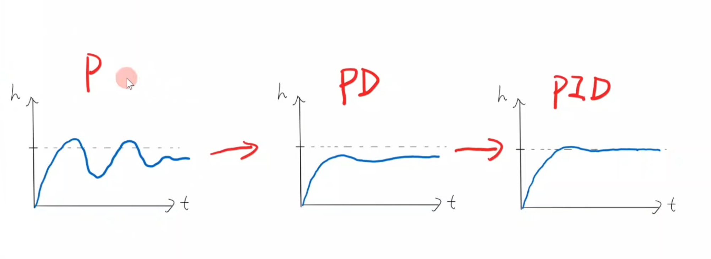
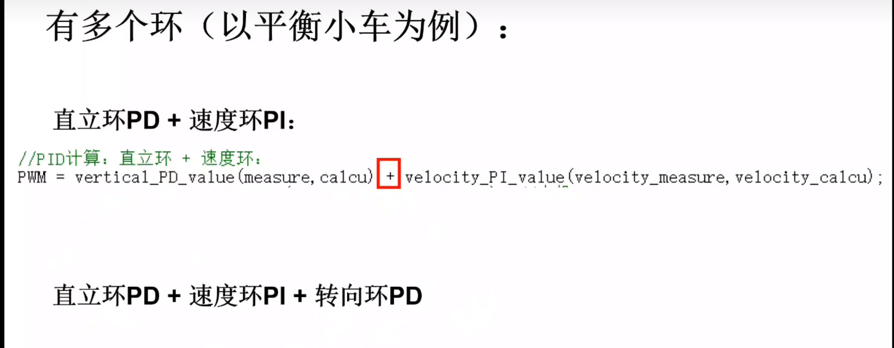

## pid模拟调参（无人机）

[Webpack App (rossning92.github.io)](https://rossning92.github.io/pid-simulation/)



## 多环(平衡小车)



```C
int Kp,Ki,Kd;
int Error;
int Error_old;
int Error_difference;
long int Error_sum;

void I_amplitude_limiting(int number)
{
	if(Error_sum>number)
	{
		Error_sum=number;
	}
}

//PID控制系统:P、I、D共同作用
//measure,calcu:系统的输入
int PID_control(float measure,float calcu)
{
	Error = measure - calcu;//误差值

	Error_sum += Error;//误差累加
	I_amplitude_limiting(2000);//限幅函数

	Error_difference = Error- Error_old;//误差变化率(近似于对时间的微分)
	Error_old = Error;

	return(Kp*Error+Kd*Error_difference+Ki*Error_sum);//PID控制器响应结果
}
```

