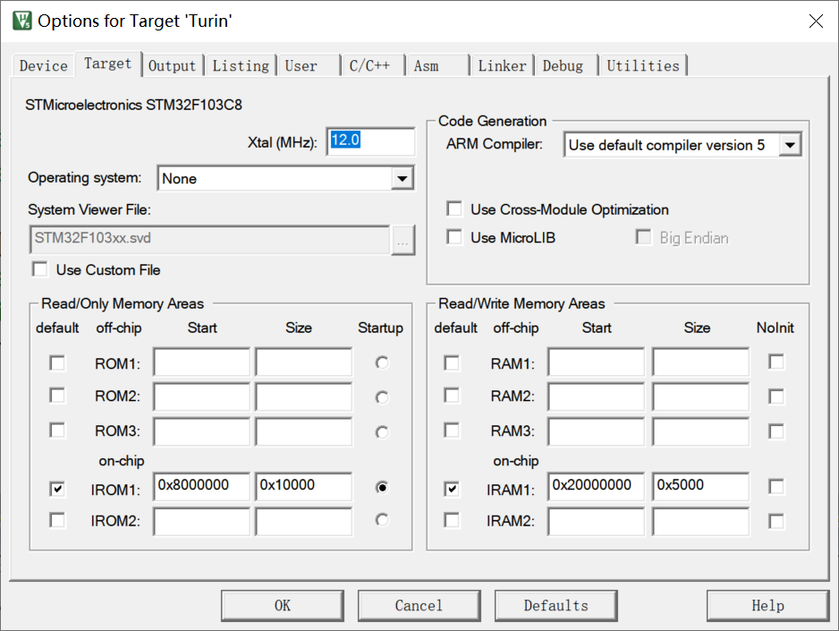
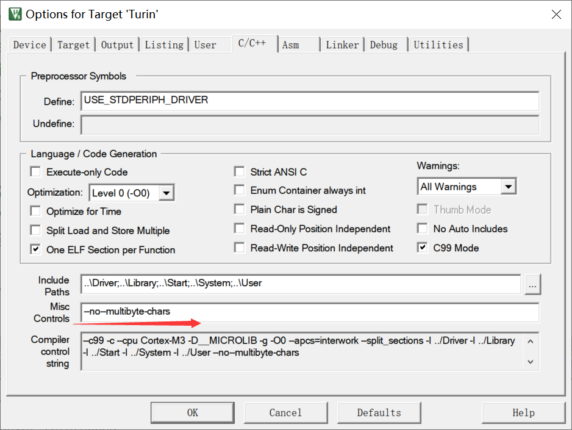
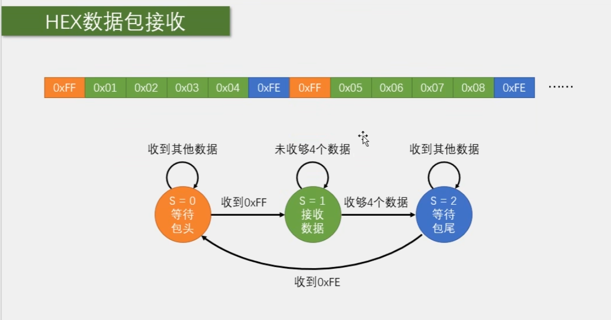
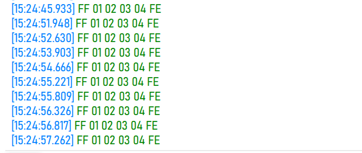
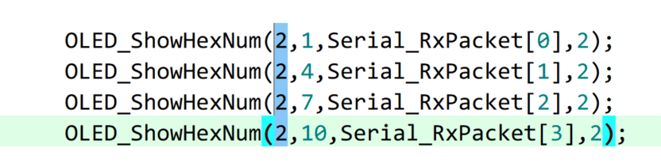
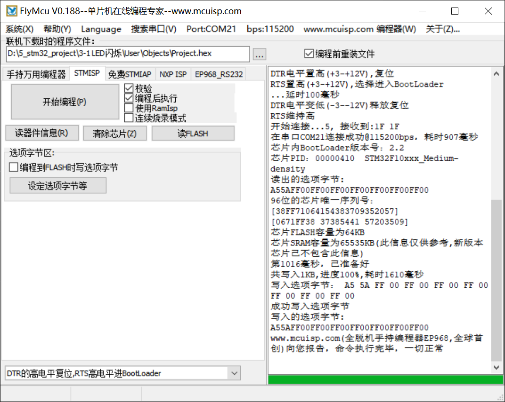
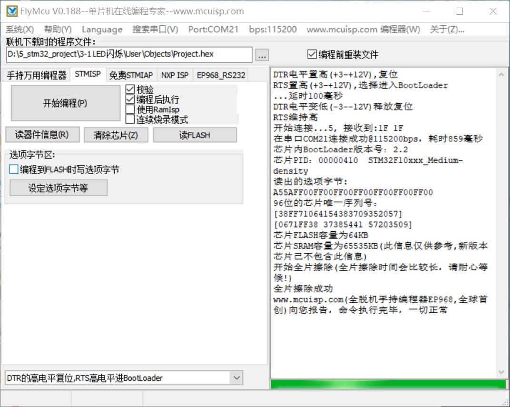
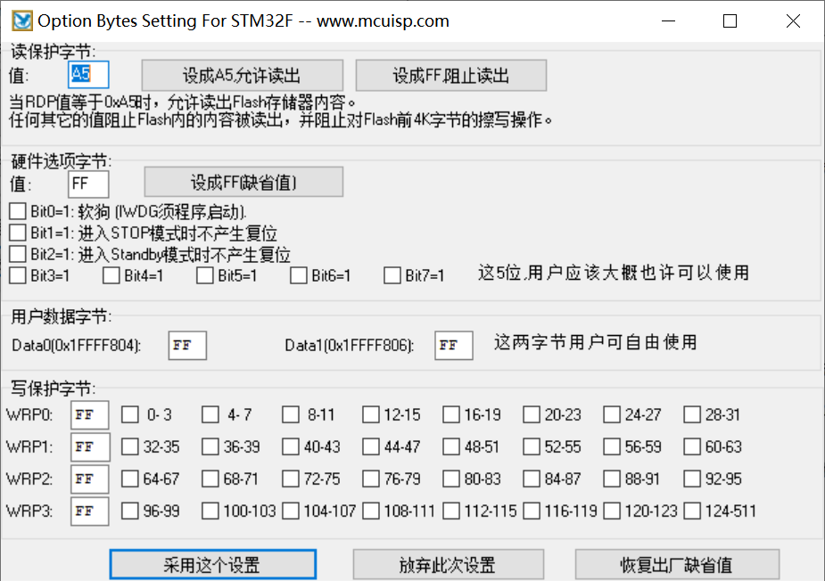

# 库函数解释

> **结构体初始化配置**
>
> void USART_DeInit(USART_TypeDef* USARTx);
> void USART_Init(USART_TypeDef* USARTx, USART_InitTypeDef* USART_InitStruct);
> void USART_StructInit(USART_InitTypeDef* USART_InitStruct);
>
> **同步时钟配置**
>
> void USART_ClockInit(USART_TypeDef* USARTx, USART_ClockInitTypeDef* USART_ClockInitStruct);
> void USART_ClockStructInit(USART_ClockInitTypeDef* USART_ClockInitStruct);
>
> **发送数据**
>
> void USART_SendData(USART_TypeDef* USARTx, uint16_t Data);
>
> - 写DR寄存器
>
> **接收数据**
>
> uint16_t USART_ReceiveData(USART_TypeDef* USARTx);
>
> - 读DR寄存器


# MicroLIB

**MicroLIB是Keil为嵌入式平台优化的一个精简库**




# 多个串口同时使用printf

```c
	char String[100];
	sprintf(String,"Num=%d\r\n",666);//sprintf.可以将指定的数据复制到数组中
	Serial_SendString(String);//打印字符串
```

# 可变参数

```c
void Serial_Prinf(char * format,...)
{
	char String[100];
	va_list arg;//参数列表变量
	va_start(arg,format);
	vsprintf(String,format,arg);
	va_end(arg);//释放参数列表
	Serial_SendString(String);
}
```

# 汉字编码发送



**统一选定为UTF-8编码**


# 串口接收

## 1.查询方法

```c
#include <stm32f10x.h> 			//Device header
#include <OLED.h>
#include <Delay.h>
#include <Serial.h>

uint8_t RXData;

int main(void)
{
	OLED_Init();
	
	
	Serial_Init();

	while(1)
	{
		if(USART_GetFlagStatus(USART1,USART_FLAG_RXNE)==SET)
		{
			RXData=USART_ReceiveData(USART1);//读DR可以自动清除标志位
			OLED_ShowHexNum(1,1,RXData,2);
		}
	}
}
```

## 2.中断方法

### 子程序

```c
#include "stm32f10x.h"                  // Device header
#include <stdio.h>
#include <stdarg.h>

uint8_t Serial_RxData;
uint8_t Serial_RxFlag;


void Serial_Init(void)
{
	RCC_APB2PeriphClockCmd(RCC_APB2Periph_USART1,ENABLE);		//开启USART1的时钟
	RCC_APB2PeriphClockCmd(RCC_APB2Periph_GPIOA,ENABLE);		//开启GPIOA的时钟
	
	/*配置PA9为复用推挽输出，供USART1的TX使用*/
	GPIO_InitTypeDef GPIO_InitStructure; //结构体类型(已经定义好的） 结构体变量名 ->结构体变量的定义
	
	/*串口发送引脚部分*/
	GPIO_InitStructure.GPIO_Speed=GPIO_Speed_50MHz;
	GPIO_InitStructure.GPIO_Pin=GPIO_Pin_9;
	GPIO_InitStructure.GPIO_Mode=GPIO_Mode_AF_PP;//复用推挽输出
	GPIO_Init(GPIOA,&GPIO_InitStructure);	

	/*串口接收引脚部分*/
	GPIO_InitStructure.GPIO_Speed=GPIO_Speed_50MHz;
	GPIO_InitStructure.GPIO_Pin=GPIO_Pin_10;
	GPIO_InitStructure.GPIO_Mode=GPIO_Mode_IPU;//上拉输入模式
	GPIO_Init(GPIOA,&GPIO_InitStructure);	
	
	/*USART结构体初始化*/
	USART_InitTypeDef USART_InitStructrue;
	USART_InitStructrue.USART_BaudRate=9600;//直接写入设定的波特率，函数内部会自动算好9600对应的寄存器配置
	USART_InitStructrue.USART_HardwareFlowControl=USART_HardwareFlowControl_None;//流控制关
	USART_InitStructrue.USART_Mode=USART_Mode_Rx | USART_Mode_Tx;//串口发送+接收
	USART_InitStructrue.USART_Parity=USART_Parity_No;//无校验位
	USART_InitStructrue.USART_StopBits=USART_StopBits_1;//1位停止位
	USART_InitStructrue.USART_WordLength=8;//字长8位
	USART_Init(USART1,&USART_InitStructrue);
	
	/*中断配置*/
	USART_ITConfig(USART1,USART_IT_RXNE,ENABLE);//开启RXNE的标志位到NVIC输出
	
	/*NVIC配置*/
	NVIC_PriorityGroupConfig(NVIC_PriorityGroup_2);//NVIC分组
	
	NVIC_InitTypeDef NVIC_InitStructure;
	NVIC_InitStructure.NVIC_IRQChannel=USART1_IRQn;
	NVIC_InitStructure.NVIC_IRQChannelCmd=ENABLE;
	NVIC_InitStructure.NVIC_IRQChannelPreemptionPriority=1;
	NVIC_InitStructure.NVIC_IRQChannelSubPriority=1;
	NVIC_Init(&NVIC_InitStructure);
	
	USART_Cmd(USART1,ENABLE);
}

void Serial_SendByte(uint8_t Byte)
{
	USART_SendData(USART1,Byte);//写入DR寄存器
	while( USART_GetFlagStatus(USART1,USART_FLAG_TXE) == RESET);//等待清空标志位为RESET,防止数据覆盖
	//PS:这个标志位不需要手动清零，当检测到为RESET会触发中断，自动清零
}

void Serial_SendArray(uint8_t *Array, uint16_t Length)
{
	uint16_t i;
	for(i=0;i<Length;i++)
	{
		Serial_SendByte(Array[i]);
	}
}

void Serial_SendString(char * String)
{
	uint8_t i;
	for(i=0;String[i] != '\0';i++)
	{
		Serial_SendByte(String[i]);
	}
}

uint32_t Serial_Pow(uint32_t X, uint32_t Y)
{
	uint32_t Result = 1;
	while(Y--)
	{
		Result *=X;
	}
	return Result;
}

void Serial_SendNumber(uint32_t Number,uint8_t Length)
{
	uint8_t i;
	for(i=0;i<Length;i++)
	{
		Serial_SendByte(Number/Serial_Pow(10,Length-i-1)%10 + '0');
	}
}

int fputc(int ch,FILE * f)
{
	Serial_SendByte(ch);
	return ch;
}

// 可变参数
void Serial_Printf(char * format,...)
{
	char String[100];
	va_list arg;//参数列表变量
	va_start(arg,format);
	vsprintf(String,format,arg);
	va_end(arg);//释放参数列表
	Serial_SendString(String);
}

//读后自动清零
uint8_t Serial_GerRxFlag(void)
{
	if(Serial_RxFlag == 1)
	{
		Serial_RxFlag = 0;
		return 1;
	}
	return 0;
}

uint8_t Serial_GetRxData(void)
{
	return Serial_RxData;
}

//串口中断函数
void USART1_IRQHandler(void)
{
	if(USART_GetITStatus(USART1,USART_IT_RXNE)==SET)
	{
		Serial_RxData = USART_ReceiveData(USART1);
		Serial_RxFlag=1;
		USART_ClearITPendingBit(USART1,USART_IT_RXNE);
	}
}
```


### 2.主程序

```c
#include <stm32f10x.h> 			//Device header
#include <OLED.h>
#include <Delay.h>
#include <Serial.h>

uint8_t RXData;

int main(void)
{
	OLED_Init();
	OLED_ShowString(1,1,"RxData:");
	
	Serial_Init();

	while(1)
	{
		if(Serial_GerRxFlag()==1)
		{
			RXData = Serial_GetRxData();
			Serial_SendByte(RXData);
			OLED_ShowHexNum(1,8,RXData,2);
		}
		/*
		if(USART_GetFlagStatus(USART1,USART_FLAG_RXNE)==SET)
		{
			RXData=USART_ReceiveData(USART1);//读DR可以自动清除标志位
			OLED_ShowHexNum(1,1,RXData,2);
		}
		*/
	}
}

```

# 串口数据包

**打包多字节为一个数据包，方便发送多字节的数据。将同一批的数据进行打包和分割**

**包头、包尾：简易通信协议**

- 文本数据包
- Hex数据包

## 状态机的方法来接收数据包



## 1.发送数据包



## 2.接收数据包

**串口中断子程序**

```C
#include "stm32f10x.h"                  // Device header
#include <stdio.h>
#include <stdarg.h>

uint8_t Serial_TxPacket[4];
uint8_t Serial_RxPacket[4];
uint8_t Serial_RxFlag;


void Serial_Init(void)
{
	RCC_APB2PeriphClockCmd(RCC_APB2Periph_USART1,ENABLE);		//开启USART1的时钟
	RCC_APB2PeriphClockCmd(RCC_APB2Periph_GPIOA,ENABLE);		//开启GPIOA的时钟
	
	/*配置PA9为复用推挽输出，供USART1的TX使用*/
	GPIO_InitTypeDef GPIO_InitStructure; //结构体类型(已经定义好的） 结构体变量名 ->结构体变量的定义
	
	/*串口发送引脚部分*/
	GPIO_InitStructure.GPIO_Speed=GPIO_Speed_50MHz;
	GPIO_InitStructure.GPIO_Pin=GPIO_Pin_9;
	GPIO_InitStructure.GPIO_Mode=GPIO_Mode_AF_PP;//复用推挽输出
	GPIO_Init(GPIOA,&GPIO_InitStructure);	

	/*串口接收引脚部分*/
	GPIO_InitStructure.GPIO_Speed=GPIO_Speed_50MHz;
	GPIO_InitStructure.GPIO_Pin=GPIO_Pin_10;
	GPIO_InitStructure.GPIO_Mode=GPIO_Mode_IPU;//上拉输入模式
	GPIO_Init(GPIOA,&GPIO_InitStructure);	
	
	/*USART结构体初始化*/
	USART_InitTypeDef USART_InitStructrue;
	USART_InitStructrue.USART_BaudRate=9600;//直接写入设定的波特率，函数内部会自动算好9600对应的寄存器配置
	USART_InitStructrue.USART_HardwareFlowControl=USART_HardwareFlowControl_None;//流控制关
	USART_InitStructrue.USART_Mode=USART_Mode_Rx | USART_Mode_Tx;//串口发送+接收
	USART_InitStructrue.USART_Parity=USART_Parity_No;//无校验位
	USART_InitStructrue.USART_StopBits=USART_StopBits_1;//1位停止位
	USART_InitStructrue.USART_WordLength=8;//字长8位
	USART_Init(USART1,&USART_InitStructrue);
	
	/*中断配置*/
	USART_ITConfig(USART1,USART_IT_RXNE,ENABLE);//开启RXNE的标志位到NVIC输出
	
	/*NVIC配置*/
	NVIC_PriorityGroupConfig(NVIC_PriorityGroup_2);//NVIC分组
	
	NVIC_InitTypeDef NVIC_InitStructure;
	NVIC_InitStructure.NVIC_IRQChannel=USART1_IRQn;
	NVIC_InitStructure.NVIC_IRQChannelCmd=ENABLE;
	NVIC_InitStructure.NVIC_IRQChannelPreemptionPriority=1;
	NVIC_InitStructure.NVIC_IRQChannelSubPriority=1;
	NVIC_Init(&NVIC_InitStructure);
	
	USART_Cmd(USART1,ENABLE);
}

void Serial_SendByte(uint8_t Byte)
{
	USART_SendData(USART1,Byte);//写入DR寄存器
	while( USART_GetFlagStatus(USART1,USART_FLAG_TXE) == RESET);//等待清空标志位为RESET,防止数据覆盖
	//PS:这个标志位不需要手动清零，当检测到为RESET会触发中断，自动清零
}

void Serial_SendArray(uint8_t *Array, uint16_t Length)
{
	uint16_t i;
	for(i=0;i<Length;i++)
	{
		Serial_SendByte(Array[i]);
	}
}

void Serial_SendString(char * String)
{
	uint8_t i;
	for(i=0;String[i] != '\0';i++)
	{
		Serial_SendByte(String[i]);
	}
}

uint32_t Serial_Pow(uint32_t X, uint32_t Y)
{
	uint32_t Result = 1;
	while(Y--)
	{
		Result *=X;
	}
	return Result;
}

void Serial_SendNumber(uint32_t Number,uint8_t Length)
{
	uint8_t i;
	for(i=0;i<Length;i++)
	{
		Serial_SendByte(Number/Serial_Pow(10,Length-i-1)%10 + '0');
	}
}

int fputc(int ch,FILE * f)
{
	Serial_SendByte(ch);
	return ch;
}

// 可变参数
void Serial_Printf(char * format,...)
{
	char String[100];
	va_list arg;//参数列表变量
	va_start(arg,format);
	vsprintf(String,format,arg);
	va_end(arg);//释放参数列表
	Serial_SendString(String);
}

//读后自动清零
uint8_t Serial_GetRxFlag(void)
{
	if(Serial_RxFlag == 1)
	{
		Serial_RxFlag = 0;
		return 1;
	}
	return 0;
}

/*串口发送数据包*/
void Serial_SendPacket(void)
{
	Serial_SendByte(0xFF);
	Serial_SendArray(Serial_TxPacket,4);
	Serial_SendByte(0xFE);
}

//串口中断函数
void USART1_IRQHandler(void)
{
	static uint8_t RxState = 0;//函数退出后下次不会初始化
	static uint8_t pRxState = 0;//表示当前接收的是第几个变量
	if(USART_GetITStatus(USART1,USART_IT_RXNE)==SET)
	{
		uint8_t RxData = USART_ReceiveData(USART1);
		if(RxState == 0)
		{
			if(RxData == 0xFF)
			{
				RxState=1;
			}
		}
		else if(RxState==1)
		{
			Serial_RxPacket[pRxState]=RxData;
			if(++pRxState>=4)
			{
				pRxState=0;
				RxState=2;
			}
		}
		else if(RxState==2)
		{
			if (RxData==0xFE)
			{
				RxState = 0;
				Serial_RxFlag=1;
			}
		}
		
		USART_ClearITPendingBit(USART1,USART_IT_RXNE);
	}
}
```

**Serial.h**

```c
#ifndef __SERIAL_H
#define __SERIAL_H
#include <stdio.h>

extern uint8_t Serial_TxPacket[];
extern uint8_t Serial_RxPacket[];

void Serial_Init(void);
void Serial_SendByte(uint8_t Byte);
void Serial_SendArray(uint8_t *Array, uint16_t Length);
void Serial_SendString(char * String);
void Serial_SendNumber(uint32_t Number,uint8_t Length);
void Serial_Printf(char * format,...);
uint8_t Serial_GetRxFlag(void);
void Serial_SendPacket(void);
#endif
```


## 小操作

**按住alt选择一列进行修改**



## 3.文本收发数据包

```c
#include "stm32f10x.h"                  // Device header
#include <stdio.h>
#include <stdarg.h>

uint8_t Serial_RxPacket[100];
uint8_t Serial_RxFlag;


void Serial_Init(void)
{
	RCC_APB2PeriphClockCmd(RCC_APB2Periph_USART1,ENABLE);		//开启USART1的时钟
	RCC_APB2PeriphClockCmd(RCC_APB2Periph_GPIOA,ENABLE);		//开启GPIOA的时钟
	
	/*配置PA9为复用推挽输出，供USART1的TX使用*/
	GPIO_InitTypeDef GPIO_InitStructure; //结构体类型(已经定义好的） 结构体变量名 ->结构体变量的定义
	
	/*串口发送引脚部分*/
	GPIO_InitStructure.GPIO_Speed=GPIO_Speed_50MHz;
	GPIO_InitStructure.GPIO_Pin=GPIO_Pin_9;
	GPIO_InitStructure.GPIO_Mode=GPIO_Mode_AF_PP;//复用推挽输出
	GPIO_Init(GPIOA,&GPIO_InitStructure);	

	/*串口接收引脚部分*/
	GPIO_InitStructure.GPIO_Speed=GPIO_Speed_50MHz;
	GPIO_InitStructure.GPIO_Pin=GPIO_Pin_10;
	GPIO_InitStructure.GPIO_Mode=GPIO_Mode_IPU;//上拉输入模式
	GPIO_Init(GPIOA,&GPIO_InitStructure);	
	
	/*USART结构体初始化*/
	USART_InitTypeDef USART_InitStructrue;
	USART_InitStructrue.USART_BaudRate=9600;//直接写入设定的波特率，函数内部会自动算好9600对应的寄存器配置
	USART_InitStructrue.USART_HardwareFlowControl=USART_HardwareFlowControl_None;//流控制关
	USART_InitStructrue.USART_Mode=USART_Mode_Rx | USART_Mode_Tx;//串口发送+接收
	USART_InitStructrue.USART_Parity=USART_Parity_No;//无校验位
	USART_InitStructrue.USART_StopBits=USART_StopBits_1;//1位停止位
	USART_InitStructrue.USART_WordLength=8;//字长8位
	USART_Init(USART1,USART_InitStructrue);
	
	/*中断配置*/
	USART_ITConfig(USART1,USART_IT_RXNE,ENABLE);//开启RXNE的标志位到NVIC输出
	
	/*NVIC配置*/
	NVIC_PriorityGroupConfig(NVIC_PriorityGroup_2);//NVIC分组
	
	NVIC_InitTypeDef NVIC_InitStructure;
	NVIC_InitStructure.NVIC_IRQChannel=USART1_IRQn;
	NVIC_InitStructure.NVIC_IRQChannelCmd=ENABLE;
	NVIC_InitStructure.NVIC_IRQChannelPreemptionPriority=1;
	NVIC_InitStructure.NVIC_IRQChannelSubPriority=1;
	NVIC_Init(&NVIC_InitStructure);
	
	USART_Cmd(USART1,ENABLE);
}

void Serial_SendByte(uint8_t Byte)
{
	USART_SendData(USART1,Byte);//写入DR寄存器
	while( USART_GetFlagStatus(USART1,USART_FLAG_TXE) == RESET);//等待清空标志位为RESET,防止数据覆盖
	//PS:这个标志位不需要手动清零，当检测到为RESET会触发中断，自动清零
}

void Serial_SendArray(uint8_t *Array, uint16_t Length)
{
	uint16_t i;
	for(i=0;i<Length;i++)
	{
		Serial_SendByte(Array[i]);
	}
}

void Serial_SendString(char * String)
{
	uint8_t i;
	for(i=0;String[i] != '\0';i++)
	{
		Serial_SendByte(String[i]);
	}
}

uint32_t Serial_Pow(uint32_t X, uint32_t Y)
{
	uint32_t Result = 1;
	while(Y--)
	{
		Result *=X;
	}
	return Result;
}

void Serial_SendNumber(uint32_t Number,uint8_t Length)
{
	uint8_t i;
	for(i=0;i<Length;i++)
	{
		Serial_SendByte(Number/Serial_Pow(10,Length-i-1)%10 + '0');
	}
}

int fputc(int ch,FILE * f)
{
	Serial_SendByte(ch);
	return ch;
}

// 可变参数
void Serial_Printf(char * format,...)
{
	char String[100];
	va_list arg;//参数列表变量
	va_start(arg,format);
	vsprintf(String,format,arg);
	va_end(arg);//释放参数列表
	Serial_SendString(String);
}


//串口中断函数
void USART1_IRQHandler(void)
{
	static uint8_t RxState = 0;//函数退出后下次不会初始化
	static uint8_t pRxState = 0;//表示当前接收的是第几个变量
	if(USART_GetITStatus(USART1,USART_IT_RXNE)==SET)
	{
		uint8_t RxData = USART_ReceiveData(USART1);
		if(RxState == 0)
		{
			if(RxData == '@' && Serial_RxFlag == 0)
			{
				RxState=1;
			}
		}
		else if(RxState==1)
		{
			if(RxData == '\r')//第一个包尾
			{
				RxState=2;
			}
			else
			{
				Serial_RxPacket[pRxState]=RxData;
				pRxState++;	
			}
		}
		else if(RxState==2)//第二个包尾
		{
			if (RxData=='\n')
			{
				RxState = 0;
				Serial_RxFlag=1;
				Serial_RxPacket[pRxState]='\0';//字符串结束时加上\0,表示字符串的结束
				pRxState=0;//MARK:忘记清零
			}
		}
		
		USART_ClearITPendingBit(USART1,USART_IT_RXNE);
	}
}
```

# #串口下载

## Boot引脚

BootLoder的作用相当于刷机

## 调试使用



可以保持跳线帽置1，但是复位后程序丢失，所以仅用来调试

## 读FLASH生成bin文件



## 读保护/写保护



# 蓝牙串口通信

[电赛|项目|课设：蓝牙模块HC05主从配置与连接_蓝牙 master和 slave 服务-CSDN博客](https://blog.csdn.net/struggle_success/article/details/130440579)

**AT指令集**

AT+NAME = xlg 设置蓝牙名称为xlg

AT+ROLE=0 蓝牙模式为从模式 AT+ROLE=1 蓝牙模式为主模式
AT+CMODE=0 蓝牙连接模式为任意地址连接模式
AT+PSWD=1234 蓝牙配对密码为1234
AT+UART=9600，0，0 蓝牙通信串口波特率为9600，停止位1位，无校验位
AT+RMAAD 清空配对列表

一、更改波特率
AT+UART=a,b,c
蓝牙通信串口波特率为a，
b:停止位1位，无校验位
返回响应为OK

二、修改蓝牙模块密码

修改密码的AT指令格式如下：（以修改后的密码为1314为例）

            AT+PSWD=1314（这里加回车）
1
三、修改蓝牙模块名字

修改模块名字的AT指令如下：

                AT+NAME =
1
1， AT+ROLE设置主从模式：
AT+ROLE=1是设成主，AT+ROLE=0是设成从，AT+ROLE=2设成回环模式Slave-Loop：被动连接，接收远程蓝 牙主设备数据并将数据原样返回给远程蓝牙
AT+ROLE?：查询主从状态
2， AT+RESET:HC-05复位

3， AT+VERSION?：获取HC-05的软件版本号，只能获取，不能修改。

4， AT+ORGL:恢复出厂默认设置，当把模块设置乱了，使用此命令进行恢复默认值。

5， AT+ADDR?：获取HC-05的蓝牙地址码，只能获取，不能修改。

6， AT+NAME？:获取HC-05的名字,AT+NAME=xlg，修改模块的名字为xlg，具体名字自行修改。

7， AT+CLASS?：设置查询设备的类型，尽量不要去修改此参数。默认是1F00。

8， AT+IAC?：查询设置查询访问码，默认是9E8B33，尽量不要去修改此参数。

9， AT+PSWD？:查询设置配对密码,AT+PSWD=”0000”,密码要有双引号,密码是四位数字.

10， AT+UART：AT+UART？是查询当前模块的波特率，AT+UART=波特率,0,0。

11， AT+CMODE：AT+CMODE？是查询当前连接模式。AT+CMODE=0，1，2(0——指定蓝牙地址连接模式（指定蓝牙地址由绑定指令设置）1——任意蓝牙地址连接模式（不受绑定指令设置地址的约束）2——回环角色（Slave-Loop）默认连接模式：0)。

12， AT+BIND:AT+BIND?查询当前绑定地址,AT+BIND=NAP，UAP，LAP(用逗号隔开)。

13， AT+RMADD:从蓝牙配对列表中删除所有认证设备.

14， AT+STATE？:获取蓝牙模块工作状态.

15， AT+LINK=NAP,UAP,LAP：与远程设备建立连接。

16， AT+DISC:断开连接.

17， AT+RNAME？NAP，UAP，LAP:获取远程蓝牙设备名称.

18， AT+ADCN?：获取蓝牙配对列表中认证设备数。

19， AT+MRAD？获取最近使用过的蓝牙认证设备地址。

20， AT+INQM:设置查询模式,AT+INQM=1，9，48(1-带RSSI信号强度指示,9-超过9个蓝牙设备响应则终止查询,48-设定超时为48*1.28=61.44秒)

**ps: HC05模块的AT指令，蓝牙命名AT+NAME= 以及密码设置AT+PSWD= 需要加双引号！**

