# IIC通信协议

## 基本功能

- 同步时序的稳定性比异步时序更高

- 半双工
- SCL、SDA两根通信线
- 支持总线挂载（一主多从，多主多从）

## 硬件电路

- 所有I2C设备的SCL连接在一起，SDA连接在一起
- 设备的SCL和SDA均要配置成开漏输出模式(防止形成短路电流，SDA要么==被上拉==，要么==输出低电平==)，会有“线与”的现象。在多主机的模式下，可以利用线与的特性，实现总线仲裁和时钟同步。
- SCL和SDA各添加一个上拉电阻，阻值一般为4.7KΩ左右

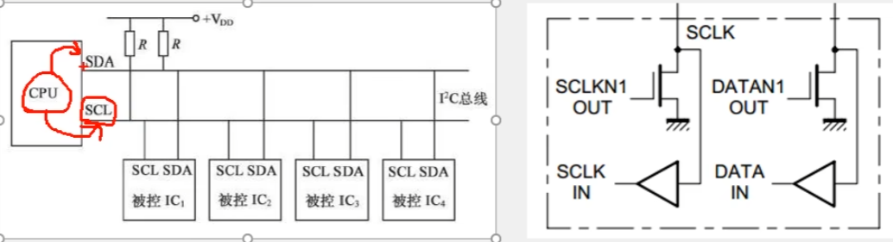

---

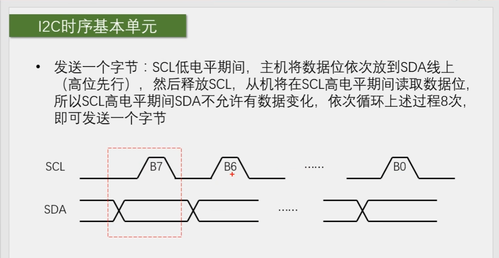

**PS：IIC时序是高位先行，串口是低位先行**

---

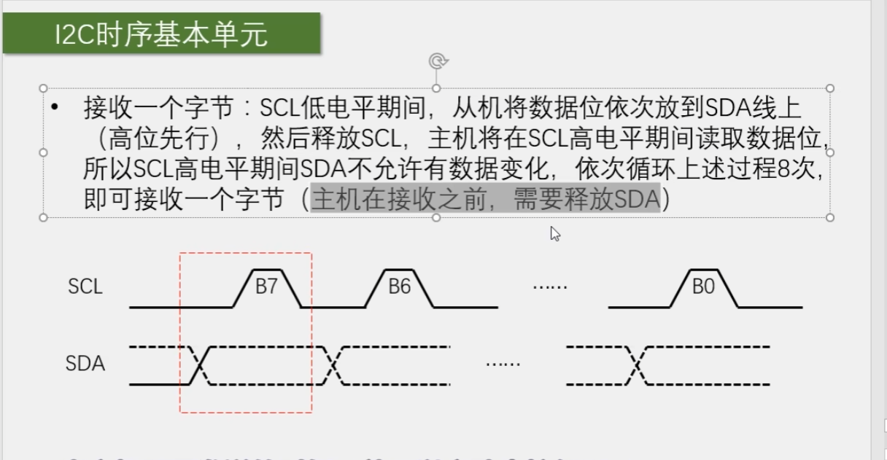

**PS：主机接收时，需要释放SDA，即输入模式**

---

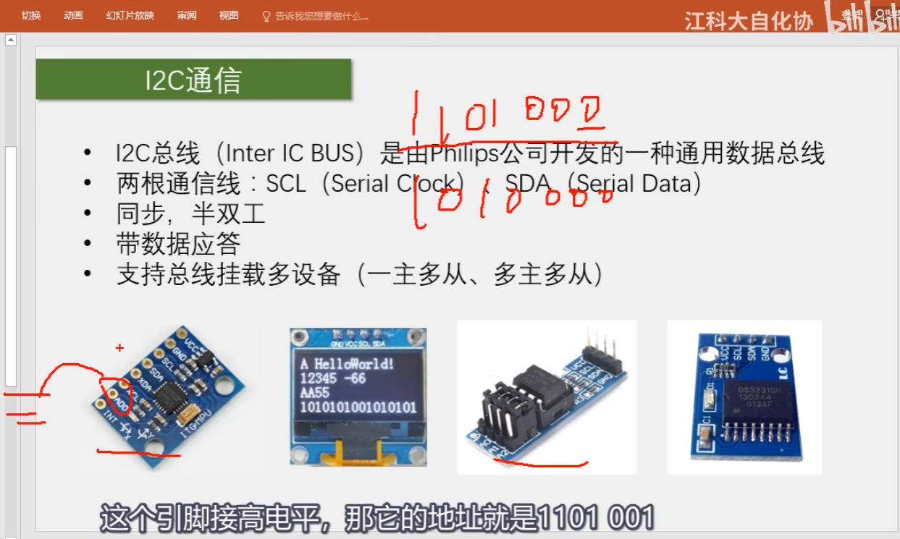

**PS:从机的地址可以通过电路改变**

---

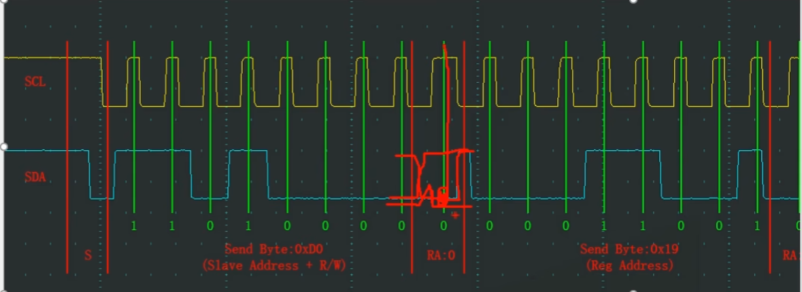

**==红线处，此时需要从机应答，这里如果但看主机的SDA，应该会释放SDA，即高电平，由于从机要发送应答，根据线与的特性，这里拉低了SDA，所以最后SDA呈现图中所示。==**

---

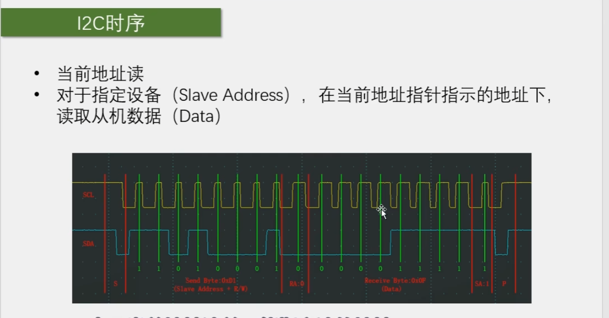

**IIC通信的设备中会有单独一个字节空间存储地址指针，当给IIC设备指定地址写时，地址指针会加一，这时如果使用当前地址读，就是读取指针地址指向的内存。此时序较为少用、**

---

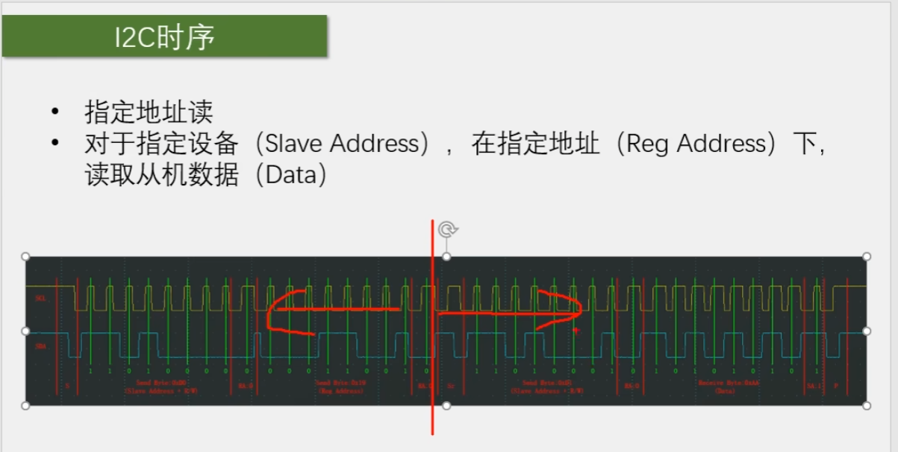

**==指定地址读的实现原理：先调用指定地址写，但是不写数据。再次调用当前地址读，这样复合的时序就能完成指定地址读的功能了==**


# MPU6050

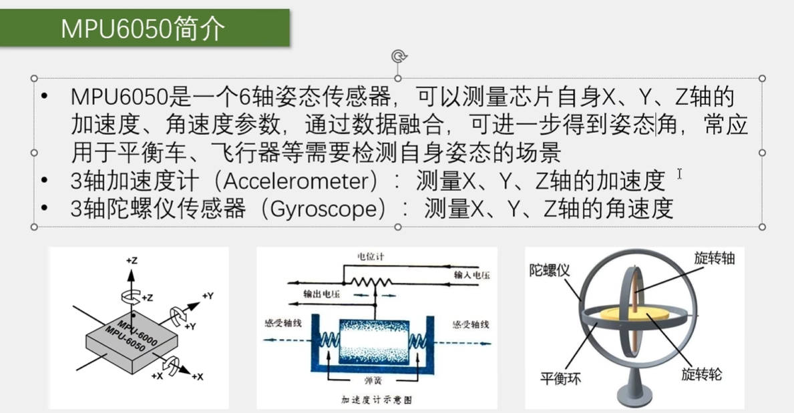

## 姿态角（欧拉角）

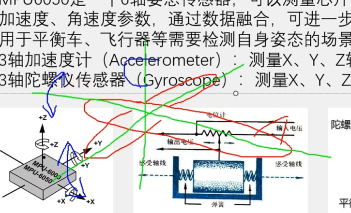

**飞机相对于初始三个轴的夹角：**

- 俯仰角：Pitch
- 滚转：Roll
- 偏航：Yaw

要想获得稳定的欧拉角，就需要进行数据融合，进一步得到姿态角。

**常见的数据融合算法：**

- 互补滤波
- 卡尔曼滤波

ps:惯性导航领域里，姿态解算


## 加速度计结构


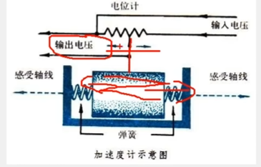

**F=ma(测力计)**

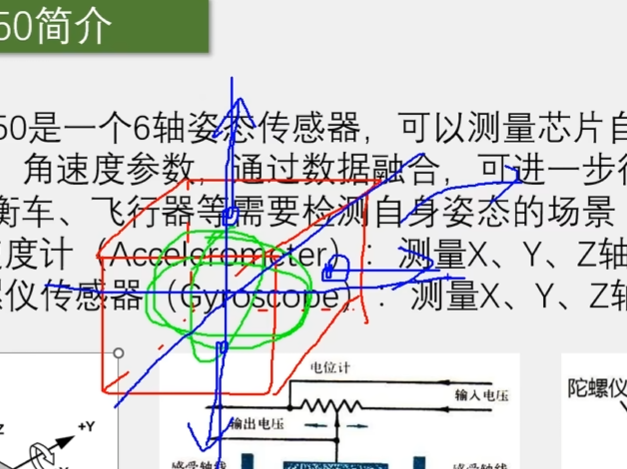

**==加速度计测得的是静态加速度，只能在物体静止的时候使用==**


## 陀螺仪传感器

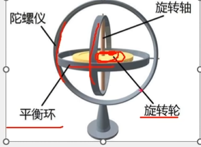

**测得的是角速度，要想得到角度，可以进行求积分**

**==陀螺仪具有动态稳定性，不具有静态稳定性==**

**==对两种传感器进行互补滤波，就可以得到稳定的姿态角了==**

## MPU6050的参数

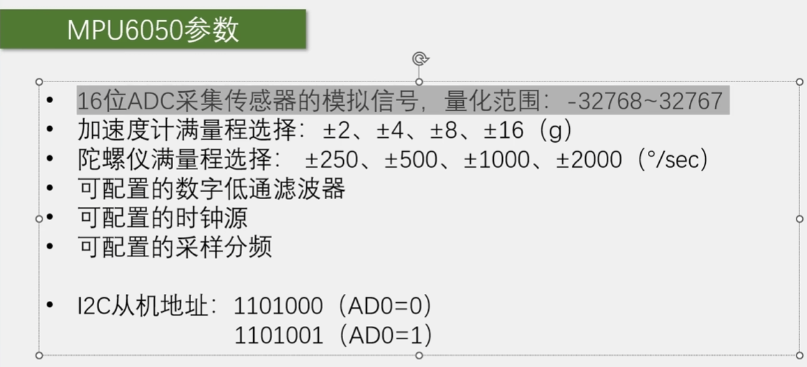

eg: mpu6050的从机地址：0x68 ，IIC时序中发送的第一个字节，高七位为从机地址，第八位为读写位。有时候把0XD0当作MPU6050的地址

## 硬件结构

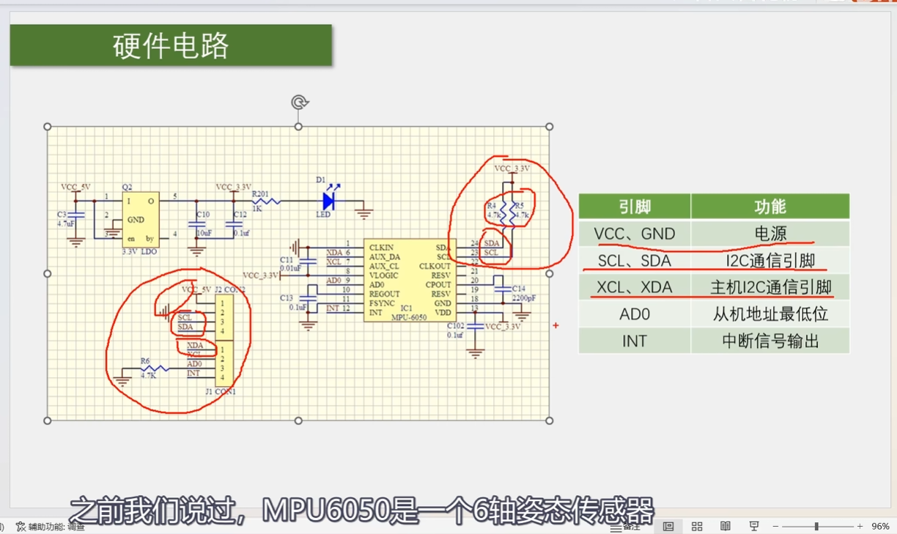

> **六轴传感器的缺点：没有稳定的参考方向**
>
> XCL，XDA：挂载磁力计，气压计
>
> INT引脚：可以配置MPU6050内部一些事件，产生电平跳变
>
> PS：MPU6050内部包含DMP单元：进行姿态融合和数据结算
>
> 包含稳压电路

==**传感器内部含有自测单元**==

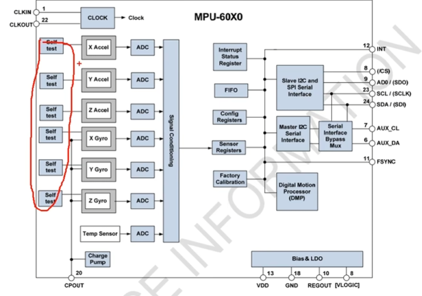

使能自测->读取数据1->失能自测->读取数据2，两个数据相减，得到的数据称作自测响应，自测响应如果在==规定的范围内==，说明芯片性能没问题。

---

**电荷泵**

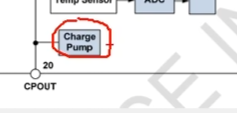

是一种==升压电路==

原理：电源和电容串并联的切换（充电->串联->相当于电压升高（放电）->快速切换到并联->充电->循环）+ 电容滤波 = 平稳升压

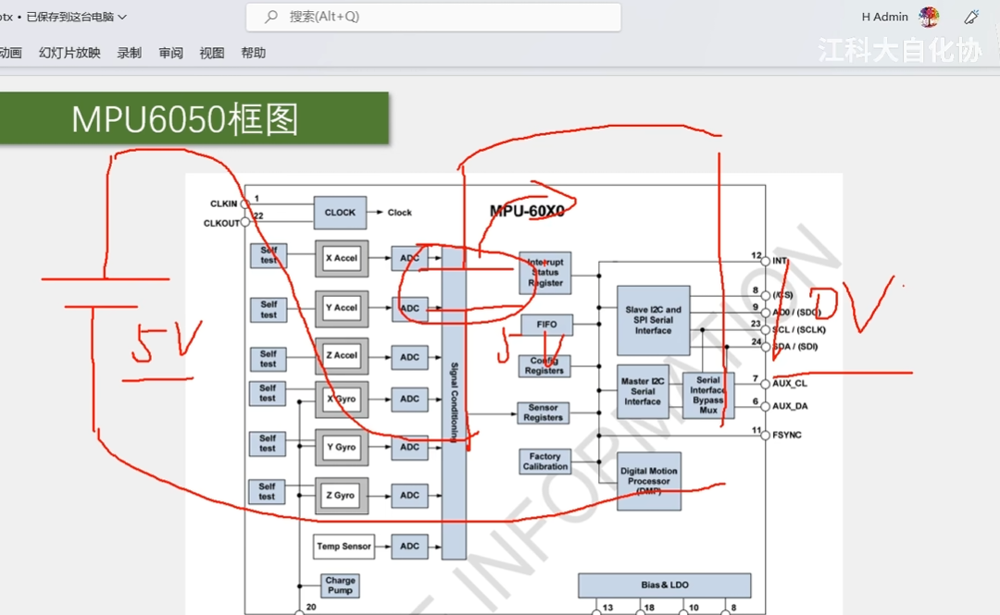

---

**DMP**（数字运动处理器）

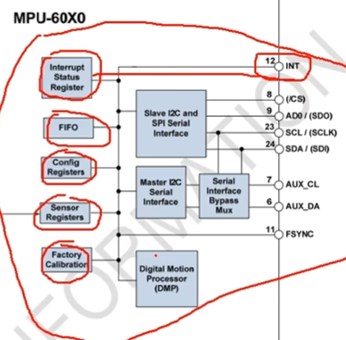

配合MPU6050官方的DMP库，进行姿态解算。

==引脚说明==

>  FSYNC：帧同步

> 通信接口：用于和STM32通信
>
> 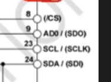

> xxxxxxxxxx python script_name.py --train_data_dir "path/to/train_data" --test_data_dir "path/to/test_data" --img_height 128 --img_width 128 --batch_size 64 --epochs 15python
>
> ​		可以拓展连接磁力计
>
> 

---

## 软件IIC读写MPU6050

```c
#include <stm32f10x.h> 			//Device header
#include <Delay.h>
#include <OLED.h>
#include <MyIIC.h>

int main(void)
{
	OLED_Init();
	
	/*主机寻址MPU6050*/
	MyIIC_Init();
	MyIIC_Start();
	MyIIC_SendByte(0xD0);//1101 000 0 前七位为MPU6050的从机地址
	uint8_t Ack = MyIIC_ReceiveAck();
	MyIIC_Stop();
	
	OLED_ShowNum(1,1,Ack,3);
	while(1)
	{
		
	}
}
```

 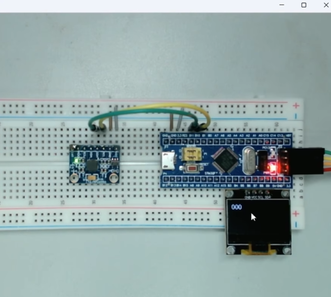

---

**修改MPU6050地址**

可见，寻址无应答

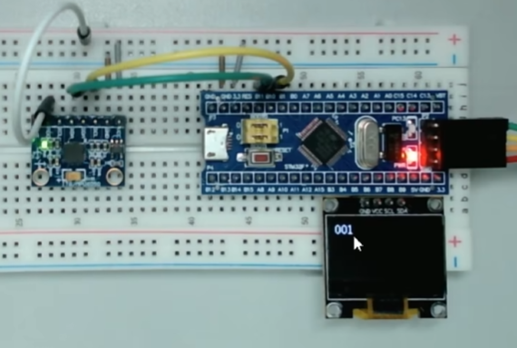

---

**读取MPU6050 ID号**

```c
int main(void)
{
	OLED_Init();
	MPU6050_Init();
	/*//主机寻址MPU6050
	MyIIC_Init();
	MyIIC_Start();
	MyIIC_SendByte(0xD2);//1101 000 0 前七位为MPU6050的从机地址
	uint8_t Ack = MyIIC_ReceiveAck();
	MyIIC_Stop();
	OLED_ShowNum(1,1,Ack,3);
	*/
	uint8_t ID = MPU6050_ReadReg(0x75);//读取MPU6050ID号
	OLED_ShowHexNum(1,1,ID,2);
	while(1)
	{
		
	}
}
```


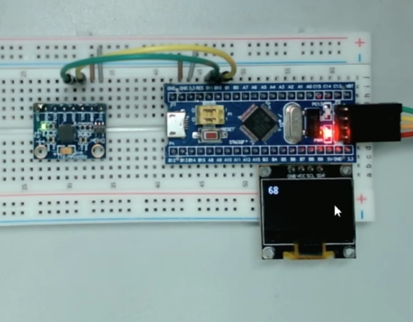

---

**写MPU6050**，需要关闭MPU6050的睡眠模式

```c
int main(void)
{
	OLED_Init();
	MPU6050_Init();
	
	MPU6050_WriteReg(0x6B,0x00);//在电源管理器1，写入0x00，接触睡眠模式

	MPU6050_WriteReg(0x19,0xAA);//更改采样频率
	
	uint8_t ID = MPU6050_ReadReg(0x19);//读取MPU6050采样频率
	OLED_ShowHexNum(1,1,ID,2);
	while(1)
	{
		
	}
}
```

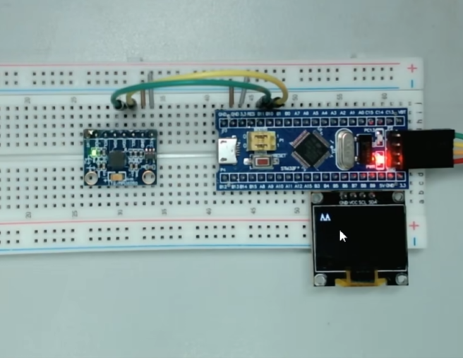

**PS:某种程度上来说，对寄存器的读写操作可以看作读写一个存储器，但是寄存器能反应硬件电路的状态，对硬件电路进行操作**

---

## MPU6050读取六轴姿态值

**函数定义**

```c
//使用指针，实现函数多返回值的操作
void MPU6050_GetData(int16_t *AccX,int16_t *AccY,int16_t *AccZ,
						int16_t *GyroX,int16_t *GyroY,int16_t *GyroZ)
{
	uint8_t DataH ,DataL;
	
	DataH=MPU6050_ReadReg(MPU6050_ACCEL_XOUT_H);
	DataL=MPU6050_ReadReg(MPU6050_ACCEL_XOUT_L);
	*AccX = (DataH<<8) | DataL;
	
	DataH=MPU6050_ReadReg(MPU6050_ACCEL_YOUT_H);
	DataL=MPU6050_ReadReg(MPU6050_ACCEL_YOUT_L);
	*AccY = (DataH<<8) | DataL;

	DataH=MPU6050_ReadReg(MPU6050_ACCEL_ZOUT_H);
	DataL=MPU6050_ReadReg(MPU6050_ACCEL_ZOUT_L);
	*AccZ = (DataH<<8) | DataL;
	
	DataH=MPU6050_ReadReg(MPU6050_GYRO_XOUT_H);
	DataL=MPU6050_ReadReg(MPU6050_GYRO_XOUT_L);
	*GyroX = (DataH<<8) | DataL;
	
	DataH=MPU6050_ReadReg(MPU6050_GYRO_YOUT_H);
	DataL=MPU6050_ReadReg(MPU6050_GYRO_YOUT_L);
	*GyroY = (DataH<<8) | DataL;
	
	DataH=MPU6050_ReadReg(MPU6050_GYRO_ZOUT_H);
	DataL=MPU6050_ReadReg(MPU6050_GYRO_ZOUT_L);
	*GyroZ = (DataH<<8) | DataL;
}
```

**主程序**

```c
int16_t Ax,Ay,Az,Gx,Gy,Gz;

int main(void)
{
	OLED_Init();
	MPU6050_Init();
	while(1)
	{
		MPU6050_GetData(&Ax,&Ay,&Az,&Gx,&Gy,&Gz);
		OLED_ShowSignedNum(2,1,Ax,5);
		OLED_ShowSignedNum(3,1,Ay,5);
		OLED_ShowSignedNum(4,1,Az,5);
		OLED_ShowSignedNum(2,8,Gx,5);
		OLED_ShowSignedNum(3,8,Gy,5);
		OLED_ShowSignedNum(4,8,Gz,5);
	}
}

```

**加速度计最大量程为16g**

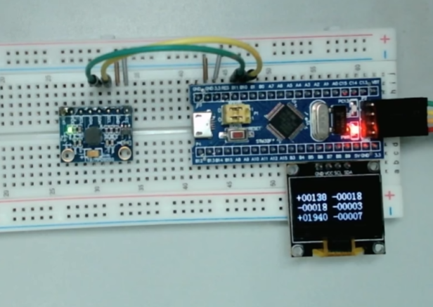

左侧为加速度计，右侧为角速度测量值

---

## 硬件IIC读写MPU6050

CR：控制寄存器

DR：数据寄存器

SR：状态寄存器

**STM32IIC外设**

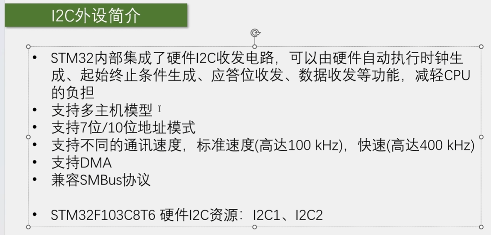

### 多主机模型

**一主多从**

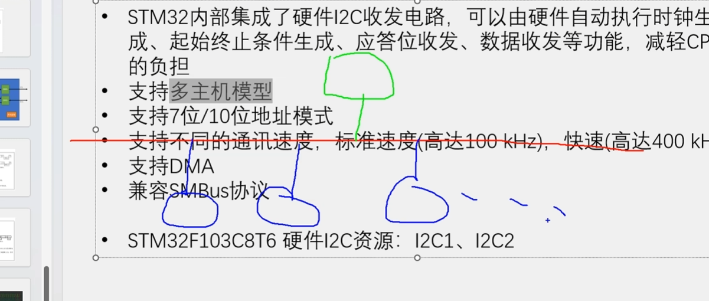

**多主多从**

固定多主机：

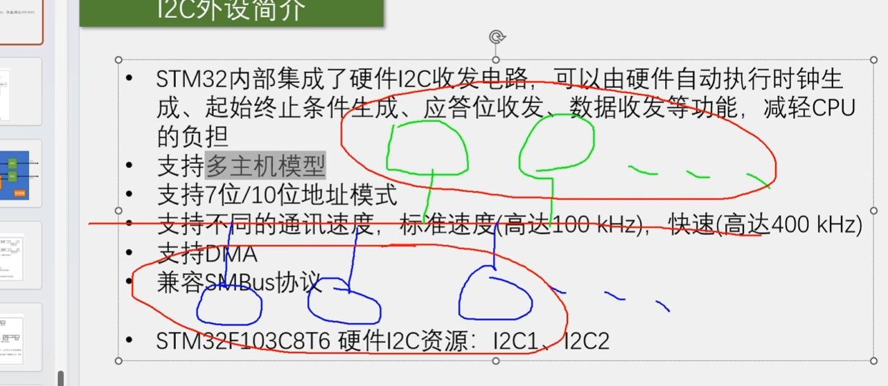

可变多主机：

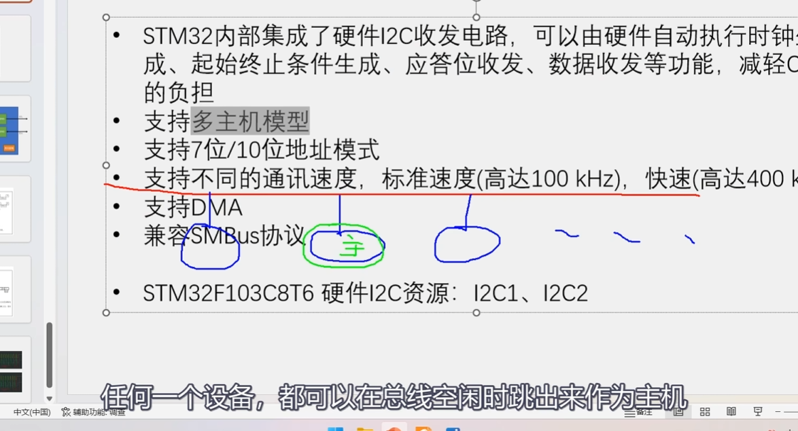

**GPIO复用输入和复用输出**

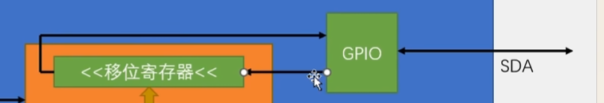

**IIC主机发送流程图**

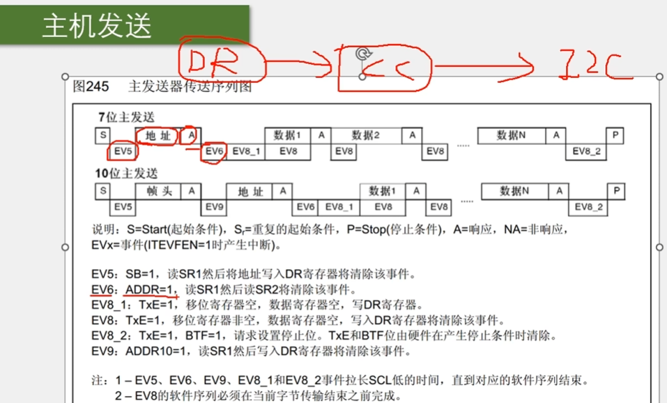

**IIC主机接收流程图**

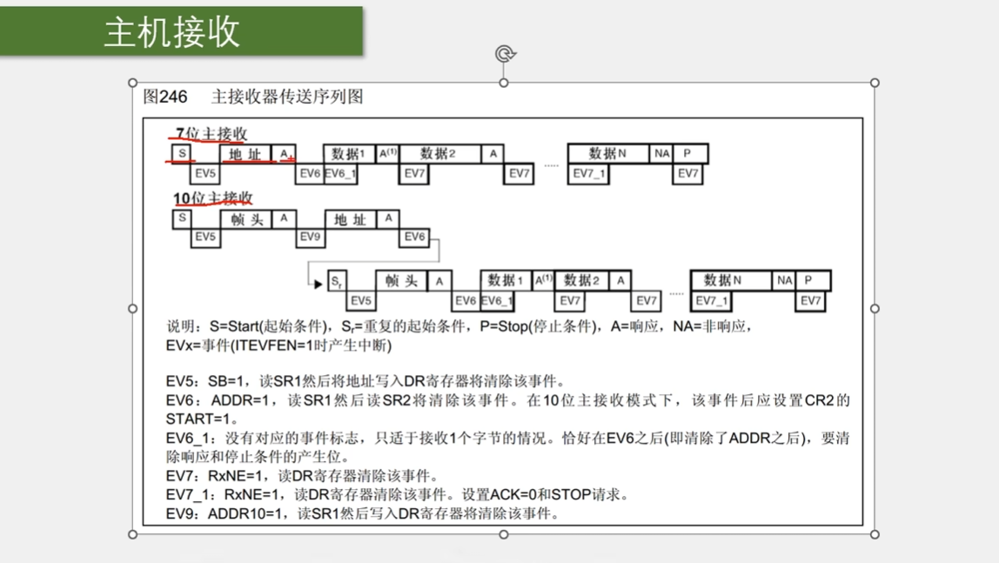

### 库函数解释

> **产生起始条件**
>
> void I2C_GenerateSTART(I2C_TypeDef* I2Cx, FunctionalState NewState);
>
> **生成终止条件**
>
> void I2C_GenerateSTOP(I2C_TypeDef* I2Cx, FunctionalState NewState);
>
> **配置在收到一个字节后，是否给从机应答**
>
> void I2C_AcknowledgeConfig(I2C_TypeDef* I2Cx, FunctionalState NewState);
>
> **写数据到数据寄存器DR**
>
> void I2C_SendData(I2C_TypeDef* I2Cx, uint8_t Data);
>
> **读取DR的数据，作为返回值**
>
> uint8_t I2C_ReceiveData(I2C_TypeDef* I2Cx);
>
> **发送7位地址**
>
> void I2C_Send7bitAddress(I2C_TypeDef* I2Cx, uint8_t Address, uint8_t I2C_Direction);

**状态监控函数的官方说明**

```c
/**
 * @brief
 ****************************************************************************************
 *
 *                         I2C State Monitoring Functions
 *                       
 ****************************************************************************************   
 * This I2C driver provides three different ways for I2C state monitoring
 *  depending on the application requirements and constraints:
 *        
 *  
 * 1) Basic state monitoring:
 *    Using I2C_CheckEvent() function:
 *    It compares the status registers (SR1 and SR2) content to a given event
 *    (can be the combination of one or more flags).
 *    It returns SUCCESS if the current status includes the given flags 
 *    and returns ERROR if one or more flags are missing in the current status.
 *    - When to use:
 *      - This function is suitable for most applications as well as for startup 
 *      activity since the events are fully described in the product reference manual 
 *      (RM0008).
 *      - It is also suitable for users who need to define their own events.
 *    - Limitations:
 *      - If an error occurs (ie. error flags are set besides to the monitored flags),
 *        the I2C_CheckEvent() function may return SUCCESS despite the communication
 *        hold or corrupted real state. 
 *        In this case, it is advised to use error interrupts to monitor the error
 *        events and handle them in the interrupt IRQ handler.
 *        
 *        @note 
 *        For error management, it is advised to use the following functions:
 *          - I2C_ITConfig() to configure and enable the error interrupts (I2C_IT_ERR).
 *          - I2Cx_ER_IRQHandler() which is called when the error interrupt occurs.
 *            Where x is the peripheral instance (I2C1, I2C2 ...)
 *          - I2C_GetFlagStatus() or I2C_GetITStatus() to be called into I2Cx_ER_IRQHandler()
 *            in order to determine which error occurred.
 *          - I2C_ClearFlag() or I2C_ClearITPendingBit() and/or I2C_SoftwareResetCmd()
 *            and/or I2C_GenerateStop() in order to clear the error flag and source,
 *            and return to correct communication status.
 *            
 *
 *  2) Advanced state monitoring:
 *     Using the function I2C_GetLastEvent() which returns the image of both status 
 *     registers in a single word (uint32_t) (Status Register 2 value is shifted left 
 *     by 16 bits and concatenated to Status Register 1).
 *     - When to use:
 *       - This function is suitable for the same applications above but it allows to
 *         overcome the limitations of I2C_GetFlagStatus() function (see below).
 *         The returned value could be compared to events already defined in the 
 *         library (stm32f10x_i2c.h) or to custom values defined by user.
 *       - This function is suitable when multiple flags are monitored at the same time.
 *       - At the opposite of I2C_CheckEvent() function, this function allows user to
 *         choose when an event is accepted (when all events flags are set and no 
 *         other flags are set or just when the needed flags are set like 
 *         I2C_CheckEvent() function).
 *     - Limitations:
 *       - User may need to define his own events.
 *       - Same remark concerning the error management is applicable for this 
 *         function if user decides to check only regular communication flags (and 
 *         ignores error flags).
 *     
 *
 *  3) Flag-based state monitoring:
 *     Using the function I2C_GetFlagStatus() which simply returns the status of 
 *     one single flag (ie. I2C_FLAG_RXNE ...). 
 *     - When to use:
 *        - This function could be used for specific applications or in debug phase.
 *        - It is suitable when only one flag checking is needed (most I2C events 
 *          are monitored through multiple flags).
 *     - Limitations: 
 *        - When calling this function, the Status register is accessed. Some flags are
 *          cleared when the status register is accessed. So checking the status
 *          of one Flag, may clear other ones.
 *        - Function may need to be called twice or more in order to monitor one 
 *          single event.
 *            
 */
```


### #IIC配置占空比的缘由

**上升沿变化较慢，下降沿比较迅速，标准速度下，时钟占空比接近1：1，快速状态，占空比接近2：1**

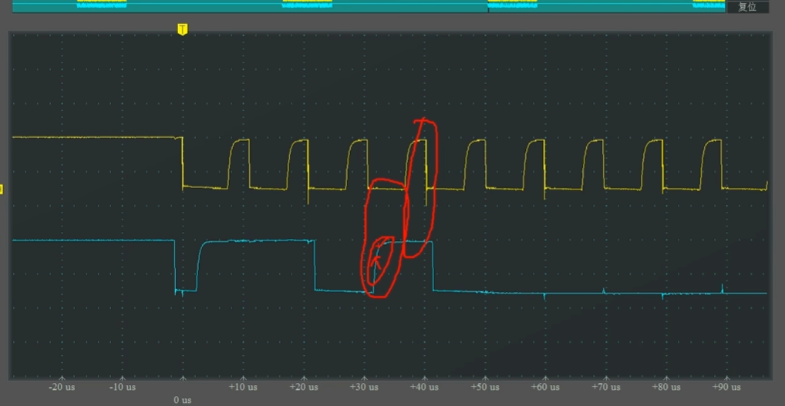

100KHZ

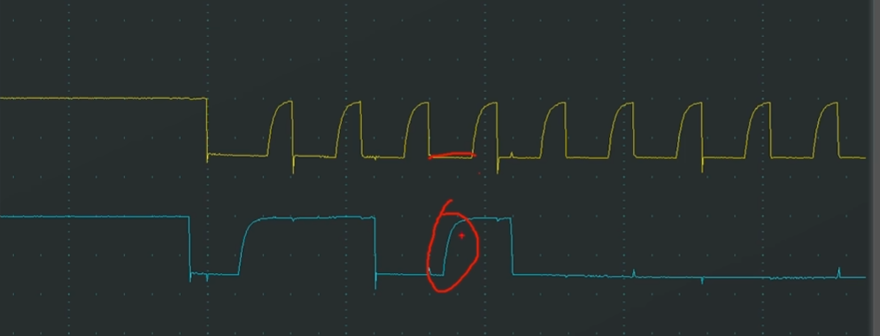

400KHZ

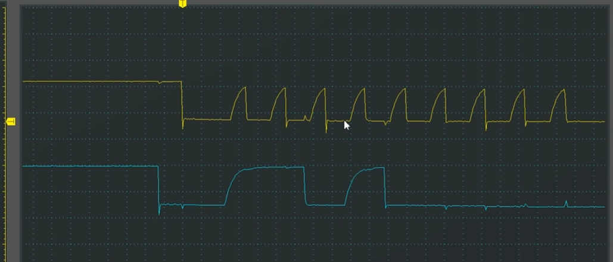

```C
 *  1) Basic state monitoring
 *******************************************************************************
 */

/**
  * @brief  Checks whether the last I2Cx Event is equal to the one passed
  *   as parameter.
  * @param  I2Cx: where x can be 1 or 2 to select the I2C peripheral.
  * @param  I2C_EVENT: specifies the event to be checked. 
  *   This parameter can be one of the following values:
  *     @arg I2C_EVENT_SLAVE_TRANSMITTER_ADDRESS_MATCHED           : EV1
  *     @arg I2C_EVENT_SLAVE_RECEIVER_ADDRESS_MATCHED              : EV1
  *     @arg I2C_EVENT_SLAVE_TRANSMITTER_SECONDADDRESS_MATCHED     : EV1
  *     @arg I2C_EVENT_SLAVE_RECEIVER_SECONDADDRESS_MATCHED        : EV1
  *     @arg I2C_EVENT_SLAVE_GENERALCALLADDRESS_MATCHED            : EV1
  *     @arg I2C_EVENT_SLAVE_BYTE_RECEIVED                         : EV2
  *     @arg (I2C_EVENT_SLAVE_BYTE_RECEIVED | I2C_FLAG_DUALF)      : EV2
  *     @arg (I2C_EVENT_SLAVE_BYTE_RECEIVED | I2C_FLAG_GENCALL)    : EV2
  *     @arg I2C_EVENT_SLAVE_BYTE_TRANSMITTED                      : EV3
  *     @arg (I2C_EVENT_SLAVE_BYTE_TRANSMITTED | I2C_FLAG_DUALF)   : EV3
  *     @arg (I2C_EVENT_SLAVE_BYTE_TRANSMITTED | I2C_FLAG_GENCALL) : EV3
  *     @arg I2C_EVENT_SLAVE_ACK_FAILURE                           : EV3_2
  *     @arg I2C_EVENT_SLAVE_STOP_DETECTED                         : EV4
  *     @arg I2C_EVENT_MASTER_MODE_SELECT                          : EV5
  *     @arg I2C_EVENT_MASTER_TRANSMITTER_MODE_SELECTED            : EV6     
  *     @arg I2C_EVENT_MASTER_RECEIVER_MODE_SELECTED               : EV6
  *     @arg I2C_EVENT_MASTER_BYTE_RECEIVED                        : EV7
  *     @arg I2C_EVENT_MASTER_BYTE_TRANSMITTING                    : EV8
  *     @arg I2C_EVENT_MASTER_BYTE_TRANSMITTED                     : EV8_2
  *     @arg I2C_EVENT_MASTER_MODE_ADDRESS10                       : EV9
  *     
  * @note: For detailed description of Events, please refer to section 
  *    I2C_Events in stm32f10x_i2c.h file.
  *    
  * @retval An ErrorStatus enumeration value:
  * - SUCCESS: Last event is equal to the I2C_EVENT
  * - ERROR: Last event is different from the I2C_EVENT
  */
```


### 解决WHILE死循环等待的问题

**多个while,比较危险，一旦通信出现问题，程序直接卡死**

```c
void MPU6050_WriteReg(uint8_t RegAddress,uint8_t Data)
{
	/*软件I2C，阻塞式程序
	MyIIC_Start();
	MyIIC_SendByte(MPU6050_ADDRESS);
	MyIIC_ReceiveAck();//可以加判断，确保时序的正确
	MyIIC_SendByte(RegAddress);//指定要写入的寄存器
	MyIIC_ReceiveAck();
	MyIIC_SendByte(Data);
	MyIIC_ReceiveAck();
	MyIIC_Stop();
	*/
	//硬件IIC，非阻塞式程序
	
	I2C_GenerateSTART(I2C2,ENABLE);

	while(I2C_CheckEvent(I2C2,I2C_EVENT_MASTER_MODE_SELECT ) !=SUCCESS);//事件监测
	
	I2C_Send7bitAddress(I2C2,MPU6050_ADDRESS,I2C_Direction_Transmitter);//选择I2C外设，从机地址，从机地址最低位。此函数自带接收应答的功能
	while(I2C_CheckEvent(I2C2,I2C_EVENT_MASTER_TRANSMITTER_MODE_SELECTED) !=SUCCESS);
	
	I2C_SendData(I2C2,RegAddress);//写入DR，需要等待EV8事件
	while(I2C_CheckEvent(I2C2,I2C_EVENT_MASTER_BYTE_TRANSMITTING) !=SUCCESS);
	
	I2C_SendData(I2C2,Data);
	while(I2C_CheckEvent(I2C2,I2C_EVENT_MASTER_BYTE_TRANSMITTED) !=SUCCESS);//发送完最后一个字节，需要监测EB8_1事件
	
	I2C_GenerateSTOP(I2C2,ENABLE);
}
```

**保护程序**

```c
void MPU6050_WaitEvent(I2C_TypeDef* I2Cx, uint32_t I2C_EVENT)
{
	uint32_t Timeout;
	Timeout= 10000;
	while(I2C_CheckEvent(I2Cx,I2C_EVENT) != SUCCESS)
	{
		Timeout--;
		if(Timeout==0)
		{
			break;
		}
	}	
}
```


# DMP库

digital motion processor数字运动处理器，mpu6050自带的一个硬件，可以直接输出用于姿态结算的四元数

# 卡尔曼滤波
