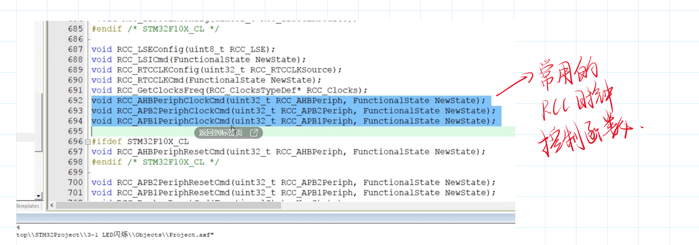

# GPIO输入

## 一、LED闪烁

```c
#include <stm32f10x.h> 			//Device header
#include <Delay.h>

int main(void)
{
	RCC_APB2PeriphClockCmd(RCC_APB2Periph_GPIOA,ENABLE);//配置GPIOA外部时钟
	
	GPIO_InitTypeDef GPIO_InitStructure;
	GPIO_InitStructure.GPIO_Mode=GPIO_Mode_Out_PP;//一般输出用推挽输出模式
	GPIO_InitStructure.GPIO_Pin=GPIO_Pin_0  ;
	GPIO_InitStructure.GPIO_Speed=GPIO_Speed_50MHz;
	GPIO_Init(GPIOA,&GPIO_InitStructure);
	
	//四个基本的输出电平设置函数
	//GPIO_SetBits(GPIOA,GPIO_Pin_0);//LED灭
	//GPIO_ResetBits(GPIOA,GPIO_Pin_0);//LED亮
	//GPIO_WriteBit(GPIOA,GPIO_Pin_0,Bit_RESET);//LED亮
	GPIO_WriteBit(GPIOA,GPIO_Pin_0,Bit_SET);//LED灭
	
	while(1)
	{
		GPIO_WriteBit(GPIOA,GPIO_Pin_0,Bit_RESET);
		Delay_ms(100);
		GPIO_WriteBit(GPIOA,GPIO_Pin_0,Bit_SET);
		Delay_ms(100);
	}
}
```

## 二、LED流水灯

```c
#include <stm32f10x.h> 			//Device header
#include <Delay.h>
#include "stdio.h"

unsigned char i;
unsigned char temp;
int main(void)
{
	RCC_APB2PeriphClockCmd(RCC_APB2Periph_GPIOA,ENABLE);
	
	GPIO_InitTypeDef GPIO_InitStructure;
	GPIO_InitStructure.GPIO_Mode=GPIO_Mode_Out_PP;//一般输出用推挽输出模式
	GPIO_InitStructure.GPIO_Pin=GPIO_Pin_All;//可以用按位或的方式同时初始化多个引脚
	GPIO_InitStructure.GPIO_Speed=GPIO_Speed_50MHz;
	GPIO_Init(GPIOA,&GPIO_InitStructure);
	
	while(1)
	{
		for(i=0;i<8;i++)
		{
			GPIO_Write(GPIOA,~(0x0001<<i)); //0000 0000 0000 0001
			Delay_ms(20);		
		}
	}
}
```

## 三、蜂鸣器

```c
#include <stm32f10x.h> 			//Device header
#include <Delay.h>


unsigned char i;
unsigned char temp;
int main(void)
{
	RCC_APB2PeriphClockCmd(RCC_APB2Periph_GPIOB,ENABLE);
	
	GPIO_InitTypeDef GPIO_InitStructure;
	GPIO_InitStructure.GPIO_Mode=GPIO_Mode_Out_PP;//一般输出用推挽输出模式
	GPIO_InitStructure.GPIO_Pin=GPIO_Pin_12;//可以用按位或的方式同时初始化多个引脚
	GPIO_InitStructure.GPIO_Speed=GPIO_Speed_50MHz;
	GPIO_Init(GPIOB,&GPIO_InitStructure);
	
	while(1)
	{
			GPIO_ResetBits(GPIOB,GPIO_Pin_12);
			Delay_ms(50);		
			GPIO_SetBits(GPIOB,GPIO_Pin_12);
			Delay_ms(50);		
			GPIO_ResetBits(GPIOB,GPIO_Pin_12);
			Delay_ms(50);		
			GPIO_SetBits(GPIOB,GPIO_Pin_12);
			Delay_ms(700);	
	}
}
```


# GPIO常用函数

-  xxxxxxxxxx typedef struct//typedef为成员列表提供了一个GPIO_InitTypeDef的名字{}GPIO_InitTypeDef;c
- GPIO_ResetBits(GPIOA,GPIO_Pin_0);**将GPIOA_0设置为低电平**
- GPIO_WriteBit(GPIOA,GPIO_Pin_0,Bit_RESET);**将GPIOA_0==选择==为高电平**



- GPIO_DeInit(*GPIO_InitTypeDef,GPIOX) **初始化指定的GPIO的时钟**

# GPIO输出

## 一、按键控制LED

### LED底层代码

```c
#include "stm32f10x.h"

/**
  * @brief 
  * @param  
  * @retval 		
  */
void LED_Init(void)
{
	RCC_APB2PeriphClockCmd(RCC_APB2Periph_GPIOA,ENABLE);
	GPIO_InitTypeDef GPIO_InitStructure; //结构体类型(已经定义好的） 结构体变量名 ->结构体变量的定义
	GPIO_InitStructure.GPIO_Speed=GPIO_Speed_50MHz;
	GPIO_InitStructure.GPIO_Pin=GPIO_Pin_All;
	GPIO_InitStructure.GPIO_Mode=GPIO_Mode_Out_PP;
	GPIO_Init(GPIOA,&GPIO_InitStructure);
	GPIO_SetBits(GPIOA,GPIO_Pin_All);//初始化默认低电平输出，所以要置高电平
}
/**
  * @brief 
  * @param  
  * @retval 		
  */
void LED1_ON(void)
{
	GPIO_ResetBits(GPIOA,GPIO_Pin_1);
}
/**
  * @brief 
  * @param  
  * @retval 		
  */
void LED1_OFF(void)
{
	GPIO_SetBits(GPIOA,GPIO_Pin_1);
}
/**
  * @brief 
  * @param  
  * @retval 		
  */
void LED2_ON(void)
{
	GPIO_ResetBits(GPIOA,GPIO_Pin_2);
}
/**
  * @brief 
  * @param  
  * @retval 		
  */
void LED2_OFF(void)
{
	GPIO_SetBits(GPIOA,GPIO_Pin_2);
}
/**
  * @brief 
  * @param  
  * @retval 		
  */
void LED1_Turn(void)
{
	if (GPIO_ReadOutputDataBit(GPIOA, GPIO_Pin_1)==0)
	{
		GPIO_SetBits(GPIOA,GPIO_Pin_1);
	}
	else
	{
		GPIO_ResetBits(GPIOA,GPIO_Pin_1);
	}
}
/**
  * @brief 
  * @param  
  * @retval 		
  */
void LED2_Turn(void)
{
	if (GPIO_ReadOutputDataBit(GPIOA, GPIO_Pin_2)==0)
	{
		GPIO_SetBits(GPIOA,GPIO_Pin_2);
	}
	else
	{
		GPIO_ResetBits(GPIOA,GPIO_Pin_2);
	}
}
```

## 二、按键底层代码

```c
#include "stm32f10x.h"                  // Device header
#include "Delay.h"

void Key_Init(void)
{
	RCC_APB2PeriphClockCmd(RCC_APB2Periph_GPIOB,ENABLE);//GPIOB外部时钟配置
	GPIO_InitTypeDef GPIO_InitStructure; //结构体类型(已经定义好的） 结构体变量名 ->结构体变量的定义
	GPIO_InitStructure.GPIO_Speed=GPIO_Speed_50MHz;//输入最大频率
	GPIO_InitStructure.GPIO_Pin=GPIO_Pin_1|GPIO_Pin_11;
	GPIO_InitStructure.GPIO_Mode=GPIO_Mode_IPU;//上拉输入模式
	GPIO_Init(GPIOB,&GPIO_InitStructure);//引脚初始化
}

uint8_t Key_GetNum(void) //uint8_t相当于unsigned char 
{
	uint8_t KeyNum = 0;
	if(GPIO_ReadInputDataBit(GPIOB,GPIO_Pin_11)==0)
	{
		Delay_ms(20);
		while(GPIO_ReadInputDataBit(GPIOB,GPIO_Pin_11)==0);
		Delay_ms(20);
		KeyNum= 2;
	}
	if(GPIO_ReadInputDataBit(GPIOB,GPIO_Pin_1)==0)
	{
		Delay_ms(20);
		while(GPIO_ReadInputDataBit(GPIOB,GPIO_Pin_1)==0);
		Delay_ms(20);
		KeyNum= 1;
	}
	return KeyNum;
}
```

## 三、主程序

```c
#include <stm32f10x.h> 			//Device header
#include <Delay.h>
#include <LED.h>
#include <Key.h>

uint8_t KeyNum;

int main(void)
{
    /*初始化，配置按键输入引脚/LED电平输出引脚*/
	LED_Init();
	Key_Init();
    
	while(1)
	{
		KeyNum=Key_GetNum();
		if(KeyNum==1)
		{
			LED1_Turn();
		}
		if(KeyNum==2)
		{
			LED2_Turn();
		}
	}
}
```

