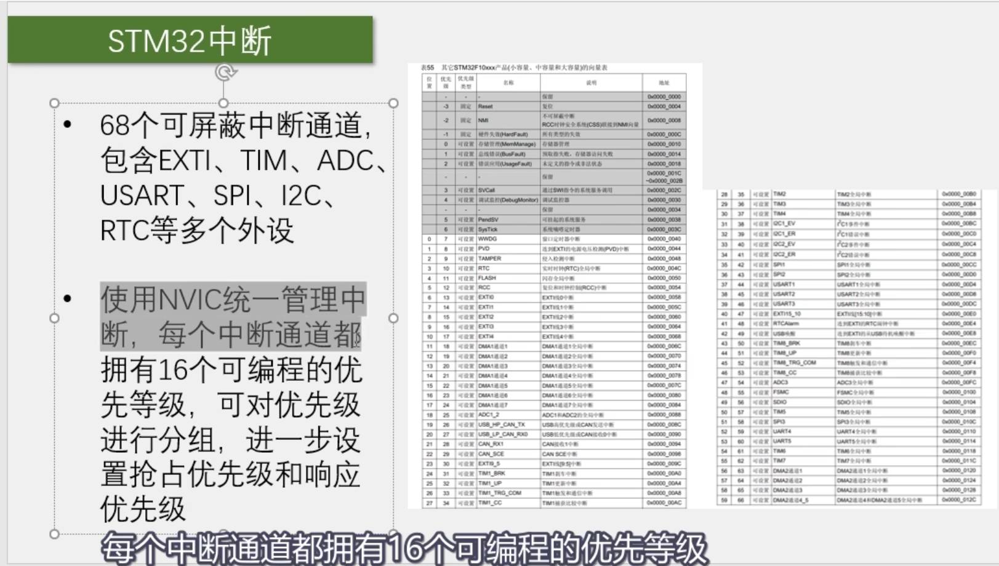
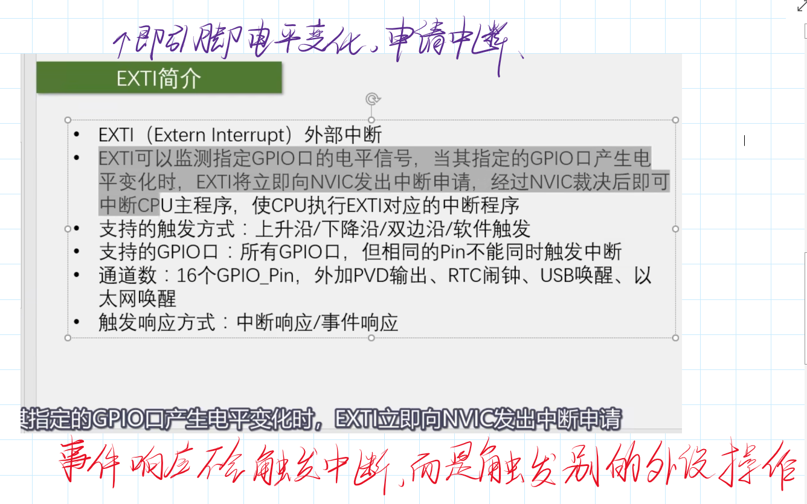
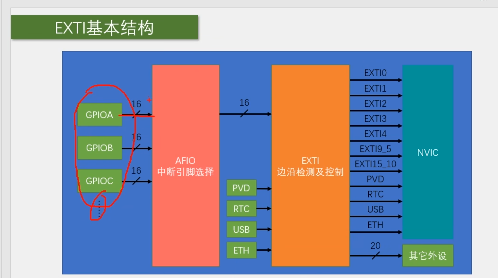

# stm32的中断结构



## NVIC

[STM32中的NVIC详解_stm32 nvic-CSDN博客](https://blog.csdn.net/liuqi3256797/article/details/89891621)

## EXTI






## 一、对射式红外传感器计次

### 红外传感器底层程序

```c
#include "stm32f10x.h"                  // Device header

uint16_t CountSensor_Count;				//全局变量，用于计数

/**
  * 函    数：计数传感器初始化
  * 参    数：无
  * 返 回 值：无
  */
void CountSensor_Init(void)
{
	/*外部中断的定义*/
	/*开启时钟*/
	RCC_APB2PeriphClockCmd(RCC_APB2Periph_GPIOB, ENABLE);		//开启GPIOB的时钟
	RCC_APB2PeriphClockCmd(RCC_APB2Periph_AFIO, ENABLE);		//开启AFIO的时钟，外部中断必须开启AFIO的时钟
	
	/*GPIO初始化*/
	GPIO_InitTypeDef GPIO_InitStructure;
	GPIO_InitStructure.GPIO_Mode = GPIO_Mode_IPU;
	GPIO_InitStructure.GPIO_Pin = GPIO_Pin_14;
	GPIO_InitStructure.GPIO_Speed = GPIO_Speed_50MHz;
	GPIO_Init(GPIOB, &GPIO_InitStructure);						//将PB14引脚初始化为上拉输入
	
	/*AFIO选择中断引脚*/
	GPIO_EXTILineConfig(GPIO_PortSourceGPIOB, GPIO_PinSource14);//将外部中断的14号线映射到GPIOB，即选择PB14为外部中断引脚
	
	/*EXTI初始化*/
	EXTI_InitTypeDef EXTI_InitStructure;						//定义结构体变量
	EXTI_InitStructure.EXTI_Line = EXTI_Line14;					//选择配置外部中断的14号线
	EXTI_InitStructure.EXTI_LineCmd = ENABLE;					//指定外部中断线使能
	EXTI_InitStructure.EXTI_Mode = EXTI_Mode_Interrupt;			//指定外部中断线为中断模式
	EXTI_InitStructure.EXTI_Trigger = EXTI_Trigger_Falling;		//指定外部中断线为下降沿触发
	EXTI_Init(&EXTI_InitStructure);								//将结构体变量交给EXTI_Init，配置EXTI外设
	
	/*NVIC中断分组*/
	NVIC_PriorityGroupConfig(NVIC_PriorityGroup_2);				//配置NVIC为分组2
																//即抢占优先级范围：0~3，响应优先级范围：0~3
																//此分组配置在整个工程中仅需调用一次
																//若有多个中断，可以把此代码放在main函数内，while循环之前
																//若调用多次配置分组的代码，则后执行的配置会覆盖先执行的配置
	
	/*NVIC配置*/
	NVIC_InitTypeDef NVIC_InitStructure;						//定义结构体变量
	NVIC_InitStructure.NVIC_IRQChannel = EXTI15_10_IRQn;		//选择配置NVIC的EXTI15_10线
	NVIC_InitStructure.NVIC_IRQChannelCmd = ENABLE;				//指定NVIC线路使能
	NVIC_InitStructure.NVIC_IRQChannelPreemptionPriority = 1;	//指定NVIC线路的抢占优先级为1
	NVIC_InitStructure.NVIC_IRQChannelSubPriority = 1;			//指定NVIC线路的响应优先级为1
	NVIC_Init(&NVIC_InitStructure);								//将结构体变量交给NVIC_Init，配置NVIC外设
}

/**
  * 函    数：获取计数传感器的计数值
  * 参    数：无
  * 返 回 值：计数值，范围：0~65535
  */
uint16_t CountSensor_Get(void)
{
	return CountSensor_Count;
}

/**
  * 函    数：EXTI15_10外部中断函数
  * 参    数：无
  * 返 回 值：无
  * 注意事项：此函数为中断函数，无需调用，中断触发后自动执行
  *           函数名为预留的指定名称，可以从启动文件复制
  *           请确保函数名正确，不能有任何差异，否则中断函数将不能进入
  */
void EXTI15_10_IRQHandler(void)//每次进入中断服务程序，中断标志位都会置1
{
	if (EXTI_GetITStatus(EXTI_Line14) == SET)		//判断是否是外部中断14号线触发的中断
	{
		/*如果出现数据乱跳的现象，可再次判断引脚电平，以避免抖动*/
		if (GPIO_ReadInputDataBit(GPIOB, GPIO_Pin_14) == 0)
		{
			CountSensor_Count ++;					//计数值自增一次
		}
		EXTI_ClearITPendingBit(EXTI_Line14);		//清除外部中断14号线的中断标志位
													//中断标志位必须清除
													//否则中断将连续不断地触发，导致主程序卡死
	}
}
```

### xxxxxxxxxx typedef struct//typedef为成员列表提供了一个GPIO_InitTypeDef的名字{}GPIO_InitTypeDef;c

```c
#include <stm32f10x.h> 			//Device header
#include <Delay.h>
#include <OLED.h>
#include <CountSensor.h>

unsigned char i;
unsigned char temp;
int main(void)
{
	OLED_Init();
	OLED_ShowString(1,1,"Count:");
	CountSensor_Init();
	while(1)
	{
		OLED_ShowNum(1,7,CountSensor_Get(),5);
	}
}

```

## 二、旋转编码器

### 底层程序

```c
#include "stm32f10x.h"                  // Device header

uint16_t CountSensor_Count;				//全局变量，用于计数

/**
  * 函    数：计数传感器初始化
  * 参    数：无
  * 返 回 值：无
  */
void CountSensor_Init(void)
{
	/*外部中断的定义*/
	/*开启时钟*/
	RCC_APB2PeriphClockCmd(RCC_APB2Periph_GPIOB, ENABLE);		//开启GPIOB的时钟
	RCC_APB2PeriphClockCmd(RCC_APB2Periph_AFIO, ENABLE);		//开启AFIO的时钟，外部中断必须开启AFIO的时钟
	
	/*GPIO初始化*/
	GPIO_InitTypeDef GPIO_InitStructure;
	GPIO_InitStructure.GPIO_Mode = GPIO_Mode_IPU;
	GPIO_InitStructure.GPIO_Pin = GPIO_Pin_14;
	GPIO_InitStructure.GPIO_Speed = GPIO_Speed_50MHz;
	GPIO_Init(GPIOB, &GPIO_InitStructure);						//将PB14引脚初始化为上拉输入
	
	/*AFIO选择中断引脚*/
	GPIO_EXTILineConfig(GPIO_PortSourceGPIOB, GPIO_PinSource14);//将外部中断的14号线映射到GPIOB，即选择PB14为外部中断引脚
	
	/*EXTI初始化*/
	EXTI_InitTypeDef EXTI_InitStructure;						//定义结构体变量
	EXTI_InitStructure.EXTI_Line = EXTI_Line14;					//选择配置外部中断的14号线
	EXTI_InitStructure.EXTI_LineCmd = ENABLE;					//指定外部中断线使能
	EXTI_InitStructure.EXTI_Mode = EXTI_Mode_Interrupt;			//指定外部中断线为中断模式
	EXTI_InitStructure.EXTI_Trigger = EXTI_Trigger_Falling;		//指定外部中断线为下降沿触发
	EXTI_Init(&EXTI_InitStructure);								//将结构体变量交给EXTI_Init，配置EXTI外设
	
	/*NVIC中断分组*/
	NVIC_PriorityGroupConfig(NVIC_PriorityGroup_2);				//配置NVIC为分组2
																//即抢占优先级范围：0~3，响应优先级范围：0~3
																//此分组配置在整个工程中仅需调用一次
																//若有多个中断，可以把此代码放在main函数内，while循环之前
																//若调用多次配置分组的代码，则后执行的配置会覆盖先执行的配置
	
	/*NVIC配置*/
	NVIC_InitTypeDef NVIC_InitStructure;						//定义结构体变量
	NVIC_InitStructure.NVIC_IRQChannel = EXTI15_10_IRQn;		//选择配置NVIC的EXTI15_10线
	NVIC_InitStructure.NVIC_IRQChannelCmd = ENABLE;				//指定NVIC线路使能
	NVIC_InitStructure.NVIC_IRQChannelPreemptionPriority = 1;	//指定NVIC线路的抢占优先级为1
	NVIC_InitStructure.NVIC_IRQChannelSubPriority = 1;			//指定NVIC线路的响应优先级为1
	NVIC_Init(&NVIC_InitStructure);								//将结构体变量交给NVIC_Init，配置NVIC外设
}

/**
  * 函    数：获取计数传感器的计数值
  * 参    数：无
  * 返 回 值：计数值，范围：0~65535
  */
uint16_t CountSensor_Get(void)
{
	return CountSensor_Count;
}

/**
  * 函    数：EXTI15_10外部中断函数
  * 参    数：无
  * 返 回 值：无
  * 注意事项：此函数为中断函数，无需调用，中断触发后自动执行
  *           函数名为预留的指定名称，可以从启动文件复制
  *           请确保函数名正确，不能有任何差异，否则中断函数将不能进入
  */
void EXTI15_10_IRQHandler(void)//每次进入中断服务程序，中断标志位都会置1
{
	if (EXTI_GetITStatus(EXTI_Line14) == SET)		//判断是否是外部中断14号线触发的中断
	{
		/*如果出现数据乱跳的现象，可再次判断引脚电平，以避免抖动*/
		if (GPIO_ReadInputDataBit(GPIOB, GPIO_Pin_14) == 0)
		{
			CountSensor_Count ++;					//计数值自增一次
		}
		EXTI_ClearITPendingBit(EXTI_Line14);		//清除外部中断14号线的中断标志位
													//中断标志位必须清除
													//否则中断将连续不断地触发，导致主程序卡死
	}
}
```

### 主程序

```c
#include <stm32f10x.h> //Device header
#include <Delay.h>
#include <OLED.h>
#include <CountSensor.h>
#include <Encoder.h>

int n;
int main(void)
{
	OLED_Init();
	Encoder_Init();
	OLED_ShowString(1, 1, "Encoder_Count:");
	while (1)
	{
		n += Encoder_Get_Change_value();
		OLED_ShowSignedNum(2, 1, n, 5);
	}
}
```

