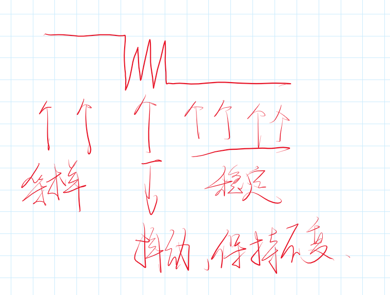

- 打开RCC内部时钟
- 选择时基单元时钟源

- 配置时基单元
- 配置输出中断控制，允许更新中断输出到NVIC
- 配置NVIC，打开定时器通道，并分配一个优先级
- 运行控制

# 相关函数

> -  恢复缺省配置
>
> TIM_DeInit(TIM_TypeDef* TIMx);
>
> - 时基单元初始化
>
> TIM_TimeBaseInit(TIM_TypeDef* TIMx, TIM_TimeBaseInitTypeDef* TIM_TimeBaseInitStruct);
>
> > TIMx：选择定时器
> >
> > TIM_TimeBaseInitStruct：结构体，定时器有关的配置
>
> - 结构体初始化
>
> TIM_TimeBaseStructInit(TIM_TimeBaseInitTypeDef* TIM_TimeBaseInitStruct);  
>
> - 使能计数器，对应==运行控制==
>
> TIM_Cmd(TIM_TypeDef* TIMx, FunctionalState NewState); 
>
> - 中断输出使能控制
>
> TIM_ITConfig(TIM_TypeDef* TIMx, uint16_t TIM_IT, FunctionalState NewState); 使能中断输出
>
> > uint16_t TIM 选择中断输出
> >
> > NewState：使能状态
>
> **时基单元的时钟选择部分函数：**
>
> - 选择内部时钟
>
> void TIM_InternalClockConfig(TIM_TypeDef* TIMx);
>
> - 选择ITRX其他定时器的时钟
>
> void TIM_ITRxExternalClockConfig(TIM_TypeDef* TIMx, uint16_t TIM_InputTriggerSource);
>
> > TIMx 选择要配置的寄存器
> >
> > TIM_InputTriggerSource 选择接入的寄存器
>
> - 选择TIX捕获通道的时钟
>
> void TIM_TIxExternalClockConfig(TIM_TypeDef* TIMx, uint16_t TIM_TIxExternalCLKSource,uint16_t TIM_ICPolarity, uint16_t ICFilter);
>
> > TIM_TIxExternalCLKSource,uint16_t  选择TIX具体的引脚
> >
> > TIM_ICPolarity 输入的极性
> >
> > ICFilter 滤波器
>
> - 选择ETR通过外部时钟模式1输入的时钟
>
> void TIM_ETRClockMode1Config(TIM_TypeDef* TIMx, uint16_t TIM_ExtTRGPrescaler, uint16_t TIM_ExtTRGPolarity,  uint16_t ExtTRGFilter);
>
> > TIM_ExtTRGPrescaler 可以对ETR外部时钟再次分频
> >
> > ExtTRGPolarity/ExtTRGFilter 极性/滤波器
>
> - 选择ETR通过外部时钟模式1输入的时钟
>
> void TIM_ETRClockMode2Config(TIM_TypeDef* TIMx, uint16_t TIM_ExtTRGPrescaler, uint16_t TIM_ExtTRGPolarity, uint16_t ExtTRGFilter);
>
> > 同TIM_ETRClockMode1Config(
>
> - 单独配置ETR引脚的预分频器、极性、滤波器这些参数
>
> void TIM_ETRConfig(TIM_TypeDef* TIMx, uint16_t TIM_ExtTRGPrescaler, uint16_t TIM_ExtTRGPolarity,
> uint16_t ExtTRGFilter);


**初始化后，像自动重装值和预分频值等等，可能需要修改，有一些函数可以单独修改这些参数**

> - 单独修改预分频值
>
> void TIM_PrescalerConfig(TIM_TypeDef* TIMx, uint16_t Prescaler, uint16_t TIM_PSCReloadMode);
>
> > uint16_t Prescaler 要写入的预分频值
> >
> > PSCReloadMode 写入的模式
>
> - 改变计数器的计数模式
>
> void TIM_CounterModeConfig(TIM_TypeDef* TIMx, uint16_t TIM_CounterMode);
>
> > TIM_CounterMode 计数器的计数模式
>
> - 自动重装器==预装功能==配置
>
> void TIM_ARRPreloadConfig(TIM_TypeDef* TIMx, FunctionalState NewState);
>
> > NewState 使能状态
>
> - 给计数器写入一个值
>
> xxxxxxxxxx python script_name.py --train_data_dir "path/to/train_data" --test_data_dir "path/to/test_data" --img_height 128 --img_width 128 --batch_size 64 --epochs 15python
>
> - 给自动重装器写入一个值
>
> void TIM_SetAutoreload(TIM_TypeDef* TIMx, uint16_t Autoreload);
>
> - 获取当前计数器的值
>
> uint16_t TIM_GetCounter(TIM_TypeDef* TIMx);
>
> - 获取当前预分频器的值
>
> uint16_t TIM_GetPrescaler(TIM_TypeDef* TIMx);
>
> - 获取/清除标志位相关函数
>
> FlagStatus TIM_GetFlagStatus(TIM_TypeDef* TIMx, uint16_t TIM_FLAG);
> void TIM_ClearFlag(TIM_TypeDef* TIMx, uint16_t TIM_FLAG);
> ITStatus TIM_GetITStatus(TIM_TypeDef* TIMx, uint16_t TIM_IT);
> void TIM_ClearITPendingBit(TIM_TypeDef* TIMx, uint16_t TIM_IT);


## 编写定时器初始化框架

```c
void Timer_Init(void)
{
	RCC_APB1PeriphClockCmd(RCC_APB1Periph_TIM2,ENABLE);//开启TIM2时钟
	
	TIM_InternalClockConfig(TIM2);//定时器上电后默认使用内部时钟,此语句也可以不写
	
	TIM_TimeBaseInitTypeDef TIM_TimeBaseInitStructure;
	TIM_TimeBaseInitStructure.TIM_ClockDivision;
	TIM_TimeBaseInitStructure.TIM_CounterMode;
	TIM_TimeBaseInitStructure.TIM_Prescaler;
	TIM_TimeBaseInitStructure.TIM_Period;
	TIM_TimeBaseInitStructure.TIM_RepetitionCounter
}
```


## 滤波原理



- 在一个固定的时钟频率f下进行采样，如果连续N个采样点都是相同的电平，说明信号稳定，如果N个采样点抖动，就让输出保持不变，这样就能保证输出信号在一定程度上被滤波保护。

- 采样点数越多，滤波效果越好，但是同时信号延迟越大

- 采样频率的来源？
  - 由内部时钟直接而来
  - 也可是内部时钟+一个时钟分频而来

**TIM_Clock_Division_CKD的取值**

```
#define TIM_CKD_DIV1                       ((uint16_t)0x0000)//1分频
#define TIM_CKD_DIV2                       ((uint16_t)0x0100)
#define TIM_CKD_DIV4                       ((uint16_t)0x0200)
```


## 代码部分

### 一、定时器中断（内部时钟）

**定时器底层程序**

```c
#include "stm32f10x.h"                  // Device header


void Timer_Init(void)
{
	RCC_APB1PeriphClockCmd(RCC_APB1Periph_TIM2,ENABLE);//开启TIM2时钟
	
	/*时基单元初始化配置*/
	TIM_InternalClockConfig(TIM2);//定时器上电后默认使用内部时钟,此语句也可以不写
	
	TIM_TimeBaseInitTypeDef TIM_TimeBaseInitStructure;
	TIM_TimeBaseInitStructure.TIM_ClockDivision =  TIM_CKD_DIV1 ;//1分频
	TIM_TimeBaseInitStructure.TIM_CounterMode = TIM_CounterMode_Up;//向上计数
	/*时基单元关键寄存器*/
	TIM_TimeBaseInitStructure.TIM_Prescaler= 7200 - 1;//ARR ， 对72MHZ进行7200分频 也就是10MHZ
	TIM_TimeBaseInitStructure.TIM_Period= 10000 - 1;//PSC，计数器重装载值，10000次清零,控制ARR和PSC可以控制计数频率
	TIM_TimeBaseInitStructure.TIM_RepetitionCounter=0;//重复计数器，高级定时器钟存在，这里不需要用
	
	
	TIM_TimeBaseInit(TIM2,&TIM_TimeBaseInitStructure);//时基单元初始化
	//1-->注意：更新中断和更新事件同时发生，初始化会立刻进入中断
	TIM_ClearFlag(TIM2,TIM_FLAG_Update);//2-->手动清理中断标志位
	
	TIM_ITConfig(TIM2,TIM_IT_Update,ENABLE);//中断配置，选择更新中断,使能
	
	NVIC_PriorityGroupConfig(NVIC_PriorityGroup_2);
	
	NVIC_InitTypeDef NVIC_InitStructure;
	NVIC_InitStructure.NVIC_IRQChannel= TIM2_IRQn;//定时器通道设置，选择TIM2_IRQn
	NVIC_InitStructure.NVIC_IRQChannelCmd= ENABLE;
	NVIC_InitStructure.NVIC_IRQChannelPreemptionPriority=2;
	NVIC_InitStructure.NVIC_IRQChannelSubPriority=1;
	
	NVIC_Init(&NVIC_InitStructure);//定时器初始化
	
	TIM_Cmd(TIM2,ENABLE);//启动定时器
}

//中断服务程序模板
/*
void TIM2_IRQHandler(void)
{
	if (TIM_GetITStatus(TIM2,TIM_IT_Update) == SET)//获取中断标志位，参数：定时器2，检测更新标志位
	{
		TIM_ClearITPendingBit(TIM2,TIM_IT_Update);//清除标志位
	}
}
*/
```

**主程序**

```c
#include <stm32f10x.h> //Device header
#include <Delay.h>
#include <OLED.h>
#include <CountSensor.h>
#include <Encoder.h>
#include <Timer.h>

uint16_t Num;//定义一个16位的全局变量

int main(void)
{
	OLED_Init();
	Timer_Init();
	
	OLED_ShowString(1,1,"Num:");
	OLED_ShowString(2,1,"CNT:");
	while (1)
	{
		OLED_ShowNum(1,5,Num,5);//计时的值
		OLED_ShowNum(2,5,TIM_GetCounter(TIM2),5);//CNT计数器的值
	}
}

void TIM2_IRQHandler(void)
{
	if (TIM_GetITStatus(TIM2,TIM_IT_Update) == SET)//获取中断标志位，参数：定时器2，检测更新标志位
	{
		Num++;
		TIM_ClearITPendingBit(TIM2,TIM_IT_Update);//清除标志位
	}
}
```

### 二、外部时钟

**定时器底层程序**

```c
#include "stm32f10x.h"                  // Device header


void Timer_Init(void)
{
	RCC_APB1PeriphClockCmd(RCC_APB1Periph_TIM2,ENABLE);//开启TIM2时钟
	RCC_APB1PeriphClockCmd(RCC_APB2Periph_GPIOA,ENABLE);//开启GPIOA时钟
	
	GPIO_InitTypeDef GPIO_InitStructure;
	GPIO_InitStructure.GPIO_Mode=GPIO_Mode_IPU;//上拉输入模式
	GPIO_InitStructure.GPIO_Pin=GPIO_Pin_0;
	GPIO_InitStructure.GPIO_Speed=GPIO_Speed_50MHz;
	GPIO_Init(GPIOA,&GPIO_InitStructure);
	
	//TIM_InternalClockConfig(TIM2);//定时器上电后默认使用内部时钟,此语句也可以不写
	TIM_ETRClockMode2Config(TIM2,TIM_ExtTRGPSC_OFF,TIM_ExtTRGPolarity_NonInverted,0x00);//通过ETR引脚的外部时钟模式2配置
	//定时器选择    不需要分频    外部触发的极性：不反相     外部触发滤波器,决定F和N，这里不需要滤波器
	
	/*时基单元初始化配置*/
	TIM_TimeBaseInitTypeDef TIM_TimeBaseInitStructure;
	TIM_TimeBaseInitStructure.TIM_ClockDivision =  TIM_CKD_DIV1 ;//1分频
	TIM_TimeBaseInitStructure.TIM_CounterMode = TIM_CounterMode_Up;//向上计数
	/**时基单元关键寄存器**/
	TIM_TimeBaseInitStructure.TIM_Prescaler= 1 - 1;//ARR ， 对72MHZ进行7200分频 也就是10MHZ
	TIM_TimeBaseInitStructure.TIM_Period= 10 - 1;//PSC，计数器重装载值，10000次清零,控制ARR和PSC可以控制计数频率
	TIM_TimeBaseInitStructure.TIM_RepetitionCounter=0;//重复计数器，高级定时器钟存在，这里不需要用
	
	
	TIM_TimeBaseInit(TIM2,&TIM_TimeBaseInitStructure);//时基单元初始化
	//1-->注意：更新中断和更新事件同时发生，初始化会立刻进入中断
	TIM_ClearFlag(TIM2,TIM_FLAG_Update);//2-->手动清理中断标志位
	
	/*中断配置*/
	TIM_ITConfig(TIM2,TIM_IT_Update,ENABLE);//中断配置，选择更新中断,使能
	
	
	/*NVIC配置*/
	NVIC_PriorityGroupConfig(NVIC_PriorityGroup_2);
	NVIC_InitTypeDef NVIC_InitStructure;
	NVIC_InitStructure.NVIC_IRQChannel= TIM2_IRQn;//定时器通道设置，选择TIM2_IRQn
	NVIC_InitStructure.NVIC_IRQChannelCmd= ENABLE;
	NVIC_InitStructure.NVIC_IRQChannelPreemptionPriority=2;
	NVIC_InitStructure.NVIC_IRQChannelSubPriority=1;
	NVIC_Init(&NVIC_InitStructure);//NVIC初始化
	
	TIM_Cmd(TIM2,ENABLE);//启动定时器
}

//CNT值封装函数
uint16_t Timer_GetCounter(void)
{
	return TIM_GetCounter(TIM2);
}

/*
void TIM2_IRQHandler(void)
{
	if (TIM_GetITStatus(TIM2,TIM_IT_Update) == SET)//获取中断标志位，参数：定时器2，检测更新标志位
	{
		TIM_ClearITPendingBit(TIM2,TIM_IT_Update);//清除标志位
	}
}
*/
```

**主程序**

```c
#include <stm32f10x.h> //Device header
#include <Delay.h>
#include <OLED.h>
#include <CountSensor.h>
#include <Encoder.h>
#include <Timer.h>

uint16_t Num=0;//定义一个16位的全局变量

int main(void)
{
	OLED_Init();
	Timer_Init();
	
	OLED_ShowString(1,1,"Num:");
	OLED_ShowString(2,1,"CNT:");
	while (1)
	{
		OLED_ShowNum(1,5,Num,5);//计时的值
		OLED_ShowNum(2,5,Timer_GetCounter(),5);//CNT计数器的值
	}
}

void TIM2_IRQHandler(void)
{
	if (TIM_GetITStatus(TIM2,TIM_IT_Update) == SET)//获取中断标志位，参数：定时器2，检测更新标志位
	{
		Num++;
		TIM_ClearITPendingBit(TIM2,TIM_IT_Update);//清除标志位
	}
}

```


==**什么时候可以使用浮空输入？**==

如果外部输入的信号功率很小时，内部的上拉电阻可能影响到外部输入信号，这时候就使用浮空输入模式，防止影响外部输入电平。

# 高级定时器

## 问题

**没有初始化重复计数器造成定时器计数出现计数缓慢，被其他中断程序干扰的现象**

**解决方法：**

```c
TIM_TimeBaseStructure.TIM_RepetitionCounter=0;//重复计数器，高级定时器钟存在,
```

