# 基本概念

xxxxxxxxxx $ tags: -数字电路与VHDL设计"bash 

另外它们的CH1到CH4，4个通道的引脚，也是公用的

所以对于同一个定时器，输入捕获和输出比较只能用其中一个。

## 一、输出比较

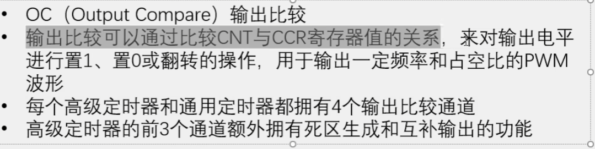

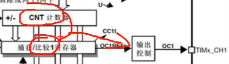

**根据CNT和CCR的大小关系，从通道引脚输出高低电平**

## 二、输入捕获

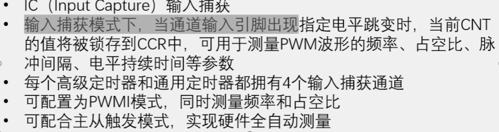

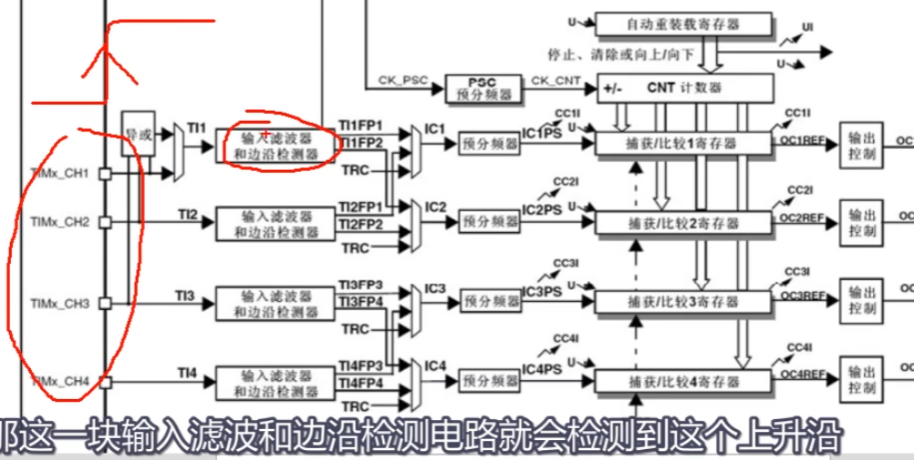

输入滤波器：可以对毛刺信号进行滤波

交叉输入的作用？

TRC?

CNT计数器是由内部的标准时钟进行驱动的，可以用于测量外部检测两个上升沿的时间间隔，

所以需要在检测到一个上升沿过后，清零CNT，这样在第二次上升沿后，CNT值就是测周法的N，可以通过主从触发模式，自动完成。

**总结：**

输入捕获类似于外部中断。都是检测边沿，然后执行相应的动嘴，而在输入捕获中。检测到指定电平跳变后，CNT的值所存到CCR中。

- 输出比较。引脚是输出端口，根据CNT和CCR的大小关系执行输出的动作。

- 输入捕获。引脚是输入端口，接收到输入信号，执行锁存的动作。

**#主从触发模式：**

将主从触发模式和PWMI模式相结合，可以让硬件自动测量频率和占空比，软件无需进行干预。

## 三、频率测量

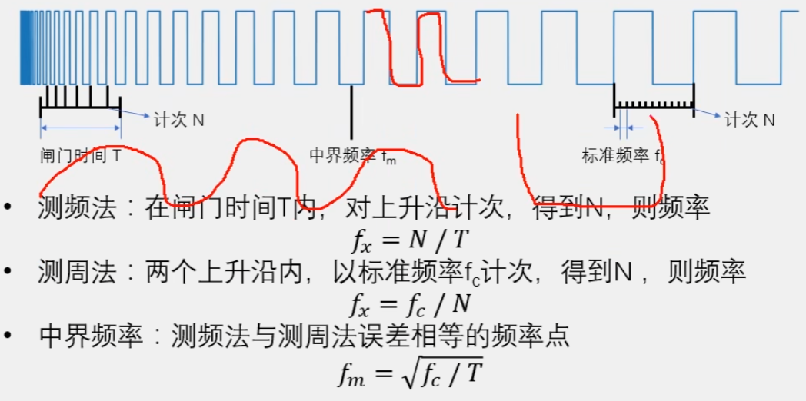

**PS：STM32测频率只能测量数字信号，若测量正选波，可以用运放电路搭建一个比较器。若测量的信号电压较高，需要考虑隔离的问题，比如隔离放大器，电压互感器等元件。总而言之，要用STM32测量频率，只能用数字信号，高电平3.3V，低电平0V**

**#区别**

- 测频法：规定时间，记录上升沿次数，==适合测量高频信号==。在计次N过少时，误差会比较大。

  ​		测频法自带均值滤波，得到的其实是平均频率。

- 测周法：从待测频率的第一个上升沿开始，以一个标准的频率计次，记录计数器的次数，直到检测到待测频率信号的第二个上升沿。==适合测量低频信号==，低频信号，周期长，计次多，有利于减小误差。

  一般情况下，待测信号几百几千HZ以上，测周法更新更快，又因为测周法只测量一个周期，所以结果容易收到噪声的影响，波动较大。

- 两种方法都会出现正负1误差

#**中界频率**

- 用于界定选用测频法还是测周法的频率

## 四、输入捕获通道

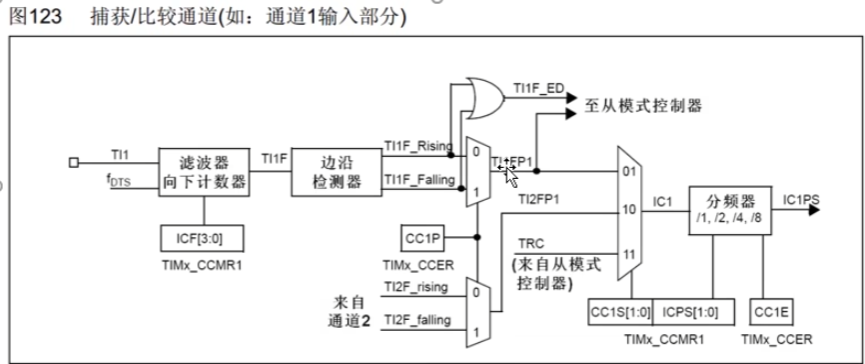

==fDTS是滤波器的采样时钟来源。TI1是输入信号，TI1F是滤波后的信号，CCMR1寄存器中的ICF位可以控制滤波器的参数==

​														ICF相关定义

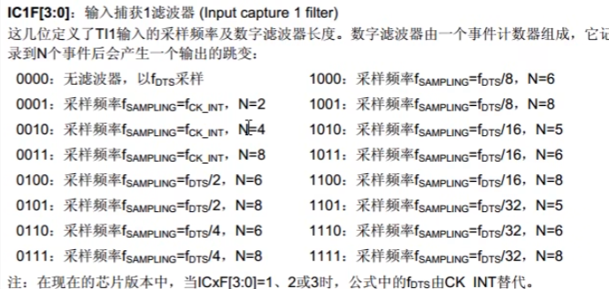

滤波之后的信号通过后续的边沿检测器，并且可以通过CCIP选择极性。最终得到TI1FP1的触发信号，进入通道1后续的捕获电路。同样的，通道2也是一样的流程，不过图中省略了。

CC1E位，控制输出使能或失能。

**如何自动清零CNT？**

### 主从触发模式

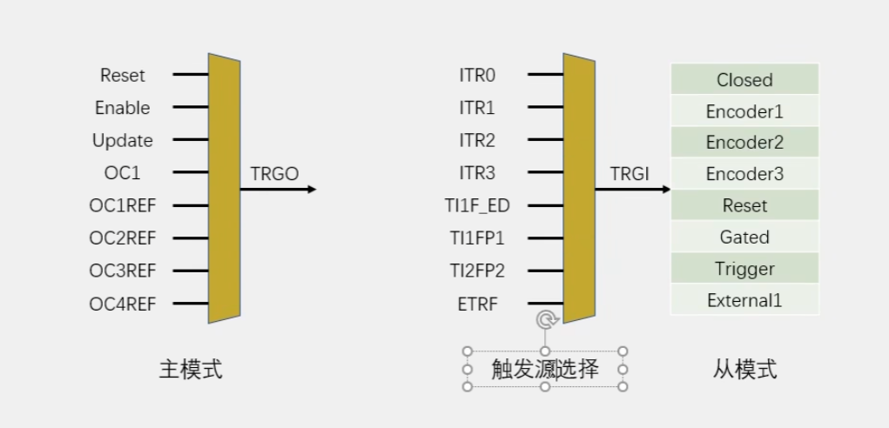

- 主模式可以将定时器内部的信号，映射到TRGO引脚，用于触发别的外设

- 从模式接收其他外设或者自身外设的一些信号，用于控制自身定时器的运行。

**这里将TI1FP1作为触发源，从模式执行Reset操作，这样就可以实现CNT自动清零。**

## 总结

### 输入捕获基本结构

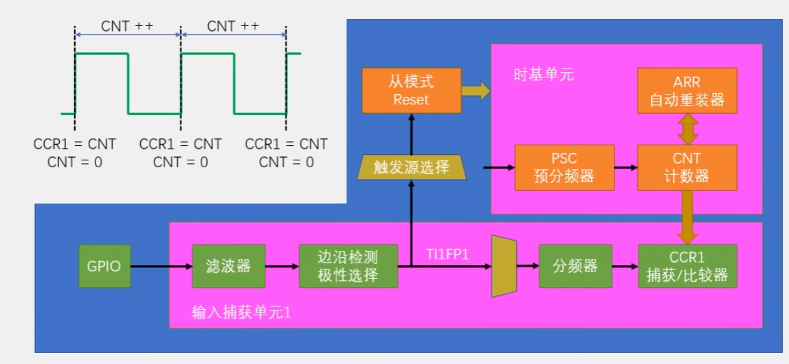

这个结构只使用了一个通道，只能用于测量频率。

先转运CNT，再对CNT进行清零。

使用从模式自动清零CNT，只能用通道1和通道2。

### PWMI基本结构

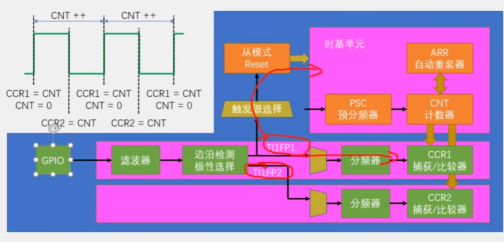

开始，第一个上升沿，CCR1捕获并且清零CNT，CNT++。第一个下降沿，CCR2捕获CNT，但不会执行CNT清零。第二个上升沿，CCR1捕获CNT，同时CNT清零。

这样CCR1值就是整个周期的计数值，CCR2就是高电平期间的计数值。这样可以同时得到PWM的频率和占空比。

这里也可以配置两个通道同时捕获第二个引脚的输入，使用TI2FP1和TI2FP2两个引脚。

# 代码部分

> ---
>
> **单独修改PSR值**
>
> void TIM_PrescalerConfig(TIM_TypeDef* TIMx, uint16_t Prescaler, uint16_t TIM_PSCReloadMode)
>
> - TIMx：定时器
> - Prescaler：PSR值
> - TIM_PSCReloadMode：指定定时器预分频器的重装模式
>   - @arg TIM_PSCReloadMode_Update: The Prescaler is loaded at the update event. 在更新事件中 重装
>     *     @arg TIM_PSCReloadMode_Immediate: The Prescaler is loaded immediately. 立即重装
>
> ---
>
> **输入捕获**
>
> void TIM_ICInit(TIM_TypeDef* TIMx, TIM_ICInitTypeDef* TIM_ICInitStruct);
>
> 输入捕获函数，4个通道共用一个函数
>
> ---
>
> **给输入捕获结构体赋初值**
>
> void TIM_ICStructInit(TIM_ICInitTypeDef* TIM_ICInitStruct);
>
> ---
>
> **选择输入触发源TIGI**
>
> void TIM_SelectInputTrigger(TIM_TypeDef* TIMx, uint16_t TIM_InputTriggerSource);
>
> 配置从模式的输入触发源
>
> ---
>
> **选择输出触发源TRGO**
>
> void TIM_SelectInputTrigger(TIM_TypeDef* TIMx, uint16_t TIM_InputTriggerSource);
>
> 配置主模式的输出触发源
>
> ---
>
> **配置从模式**
>
> void TIM_SelectSlaveMode(TIM_TypeDef* TIMx, uint16_t TIM_SlaveMode);
>
> 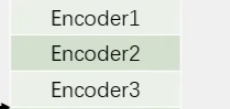
>
> ==ps:这三个从模式是给编码器接口用的，会有另外的函数进行配置==
>
> ---
>
> **配置通道1234的定时器**
>
> void TIM_SetIC1Prescaler(TIM_TypeDef* TIMx, uint16_t TIM_ICPSC);
> void TIM_SetIC2Prescaler(TIM_TypeDef* TIMx, uint16_t TIM_ICPSC);
> void TIM_SetIC3Prescaler(TIM_TypeDef* TIMx, uint16_t TIM_ICPSC);
> void TIM_SetIC4Prescaler(TIM_TypeDef* TIMx, uint16_t TIM_ICPSC);
>
> ---
>
> **读取4个通道的CCR**
>
> uint16_t TIM_GetCapture1(TIM_TypeDef* TIMx);
> uint16_t TIM_GetCapture2(TIM_TypeDef* TIMx);
> uint16_t TIM_GetCapture3(TIM_TypeDef* TIMx);
> uint16_t TIM_GetCapture4(TIM_TypeDef* TIMx);
>
> **对于写4个通道CCR的函数**
>
> void TIM_SetCompare1(TIM_TypeDef* TIMx, uint16_t Compare1);
> void TIM_SetCompare2(TIM_TypeDef* TIMx, uint16_t Compare2);
> void TIM_SetCompare3(TIM_TypeDef* TIMx, uint16_t Compare3);
> void TIM_SetCompare4(TIM_TypeDef* TIMx, uint16_t Compare4);
>
> ==输入捕获模式下，CCR是只读的，要用GetCapture读出==
>
> ---
>
> **==TIM_PWMIConfig(TIM3,&TIM_ICInitStructure);//标准库中已将上述注释部分封装好,即会将以及配置号的部分，再配置另外的通道将参数进行相反的设置==**
>
> ---

