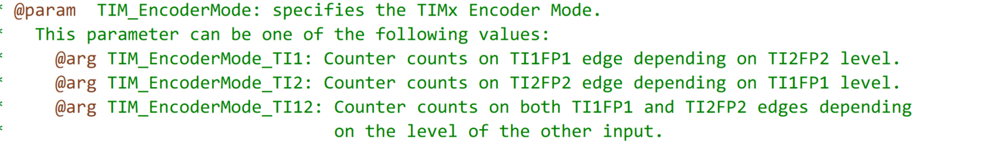
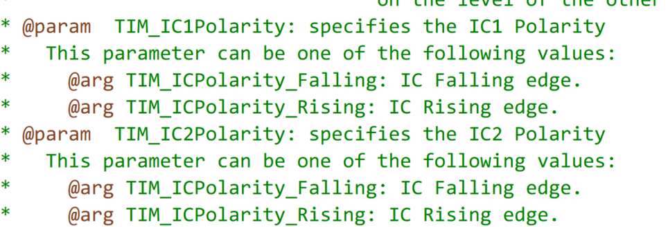

  

## 相关库函数

> **定时器编码器配置**
>
> void TIM_EncoderInterfaceConfig(TIM_TypeDef* TIMx, uint16_t TIM_EncoderMode,
>                                 uint16_t TIM_IC1Polarity, uint16_t TIM_IC2Polarity);
>
> - TIMx:选择定时器
> - TIM_EncoderMode: 选择编码器模式，T1单独计数，T2单独计数，T1/T2同时计数
>
> 
>
> - TIM_IC1Polarity：电平极性
> - TIM_IC2Polarity：电平极性  可以通过配置这两个参数，设置正相和反相
>
> 


## 编码器测计数

```c
#include "stm32f10x.h"                  // Device header

void Encoder_Init(void)
{

	RCC_APB1PeriphClockCmd(RCC_APB1Periph_TIM3,ENABLE);//开启TIM2时钟	
	RCC_APB2PeriphClockCmd(RCC_APB2Periph_GPIOA,ENABLE);
	
	GPIO_InitTypeDef GPIO_InitStructure; //结构体类型(已经定义好的） 结构体变量名 ->结构体变量的定义
	GPIO_InitStructure.GPIO_Speed=GPIO_Speed_50MHz;
	GPIO_InitStructure.GPIO_Pin=GPIO_Pin_6|GPIO_Pin_7;	
	GPIO_InitStructure.GPIO_Mode=GPIO_Mode_IPU;//上拉输入
	GPIO_Init(GPIOA,&GPIO_InitStructure);
	
	/*时基单元初始化配置*/
	TIM_InternalClockConfig(TIM3);//定时器上电后默认使用内部时钟,此语句也可以不写
	
	TIM_TimeBaseInitTypeDef TIM_TimeBaseInitStructure;
	TIM_TimeBaseInitStructure.TIM_ClockDivision =  TIM_CKD_DIV1 ;//1分频
	TIM_TimeBaseInitStructure.TIM_CounterMode = TIM_CounterMode_Up;//向上计数
	TIM_TimeBaseInitStructure.TIM_Prescaler= 1-1;//PSC 不分频
	TIM_TimeBaseInitStructure.TIM_Period= 65536 - 1;//ARR 
	TIM_TimeBaseInitStructure.TIM_RepetitionCounter=0;//重复计数器，高级定时器钟存在，这里不需要用
	TIM_TimeBaseInit(TIM3,&TIM_TimeBaseInitStructure);//时基单元初始化
	
	/*输入捕获单元配置*/
	/**通道1配置**/
	TIM_ICInitTypeDef TIM_ICInitStructure;
    TIM_ICStructInit(&TIM_ICInitStructure);//给结构体赋初始值，防止出现不确定的状态
	TIM_ICInitStructure.TIM_Channel=TIM_Channel_1;//输入捕获通道选择
	TIM_ICInitStructure.TIM_ICFilter=0XF;//输入捕获滤波器
	//TIM_ICInitStructure.TIM_ICPolarity=TIM_ICPolarity_Rising;//极性，上升沿触发  TIM_EncoderInterfaceConfig重复配置了相同的寄存器
	TIM_ICInit(TIM3,&TIM_ICInitStructure);
    /**通道2配置**/ //注意：这里不需要再定义新的结构体。因为上一次的值已经写入硬件寄存器
	TIM_ICInitStructure.TIM_Channel=TIM_Channel_2;//输入捕获通道选择
	TIM_ICInitStructure.TIM_ICFilter=0XF;//输入捕获滤波器
	//TIM_ICInitStructure.TIM_ICPolarity=TIM_ICPolarity_Rising;//极性，上升沿触发
	TIM_ICInit(TIM3,&TIM_ICInitStructure);

    /*配置编码器接口*/
    TIM_EncoderInterfaceConfig(TIM3,TIM_EncoderMode_TI12,TIM_ICPolarity_Rising,TIM_ICPolarity_Rising);//定时器3 ，T1T2同时使用，极性相同(上升沿/下降沿两个都是有效的)，即为正相
    //若要反相，那么一个配置位上升沿，一个配置为下降沿有效
	TIM_Cmd(TIM3,ENABLE);//启动定时器
}

int16_t Encoder_Get(void)//int16_t 表示有符号数，能把unint16_相比最高位变为了符号位,这里利用到了补码的特性
{
	return TIM_GetCounter(TIM3);
}
```

## 编码器测速

```c

```

