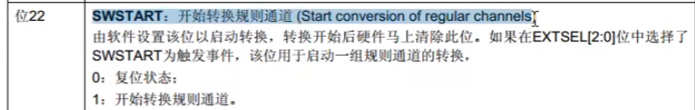

# 库函数解释

> xxxxxxxxxx $ tags: -数字电路与VHDL设计"bash 
>
> void RCC_ADCCLKConfig(uint32_t RCC_PCLK2);
>
> **恢复缺省配置**
>
> void ADC_DeInit(ADC_TypeDef* ADCx);
>
> **ADC初始化**
>
> void ADC_Init(ADC_TypeDef* ADCx, ADC_InitTypeDef* ADC_InitStruct);
>
> **结构体初始化**
>
> void ADC_StructInit(ADC_InitTypeDef* ADC_InitStruct);
>
> **ADC上电**
>
> void ADC_Cmd(ADC_TypeDef* ADCx, FunctionalState NewState);
>
> **开启DMA输出信号**
>
> void ADC_DMACmd(ADC_TypeDef* ADCx, FunctionalState NewState);
>
> **中断输出控制**
>
> void ADC_ITConfig(ADC_TypeDef* ADCx, uint16_t ADC_IT, FunctionalState NewState);
>
> - 用于控制某个中断能否通往NVIC
>
> **复位校准**
>
> void ADC_ResetCalibration(ADC_TypeDef* ADCx);
>
> **获取复位校准状态**
>
> void ADC_ResetCalibration(ADC_TypeDef* ADCx);
>
> **开始校准**
>
> void ADC_StartCalibration(ADC_TypeDef* ADCx);
>
> **获取开始校准状态**
>
> FlagStatus ADC_GetCalibrationStatus(ADC_TypeDef* ADCx);
>
> **ADC软件触发的函数**
>
> void ADC_SoftwareStartConvCmd(ADC_TypeDef* ADCx, FunctionalState NewState);
>
> **ADC获取软件转换状态**
>
> FlagStatus ADC_GetSoftwareStartConvStatus(ADC_TypeDef* ADCx);
>
> - 实际上是获取CR2的SWSTART这一位,但是SWSTART在开始ADC转换后直接清除，所以并不能通过这个函数获得是否开始转换的信息
>
>   
>
> **==如何获取ADC是否开启的状态？==**
>
> **获取标志位状态**
>
> FlagStatus ADC_GetFlagStatus(ADC_TypeDef* ADCx, uint8_t ADC_FLAG);
>
> - 可以调用这个函数,ADC_FLAG选择EOC,判断EOC标志位是否置1
>
> **每隔几个通道间断一次**
>
> void ADC_DiscModeChannelCountConfig(ADC_TypeDef* ADCx, uint8_t Number);
>
> **是否启动间断模式**
>
> void ADC_DiscModeCmd(ADC_TypeDef* ADCx, FunctionalState NewState);
>
> ==**ADC规则组通道配置**==
>
> void ADC_RegularChannelConfig(ADC_TypeDef* ADCx, uint8_t ADC_Channel, uint8_t Rank, uint8_t ADC_SampleTime);
>
> - ADCx
> - ADC_Channel：指定的通道
> - Rank：序列的位置
> - ADC_SampleTime：指定通道的采样时间
>
> **ADC外部触发转换控制（是否允许外部触发转换）**
>
> void ADC_ExternalTrigConvCmd(ADC_TypeDef* ADCx, FunctionalState NewState);
>
> ==**ADC获取转换值**==
>
> uint16_t ADC_GetConversionValue(ADC_TypeDef* ADCx);
>
> - 获取AD转换的数据寄存器，读取转换结果
>
> **ADC获取双模式转换值**
>
> uint32_t ADC_GetDualModeConversionValue(void);
>
> **是否启动模拟看门狗**
>
> void ADC_AnalogWatchdogCmd(ADC_TypeDef* ADCx, uint32_t ADC_AnalogWatchdog);
>
> **配置高低阈值**
>
> void ADC_AnalogWatchdogThresholdsConfig(ADC_TypeDef* ADCx, uint16_t HighThreshold, uint16_t LowThreshold);
>
> **配置看门的通道**
>
> void ADC_AnalogWatchdogSingleChannelConfig(ADC_TypeDef* ADCx, uint8_t ADC_Channel);
>
> **ADC温度传感器、内部参考电压控制**
>
> void ADC_TempSensorVrefintCmd(FunctionalState NewState);

