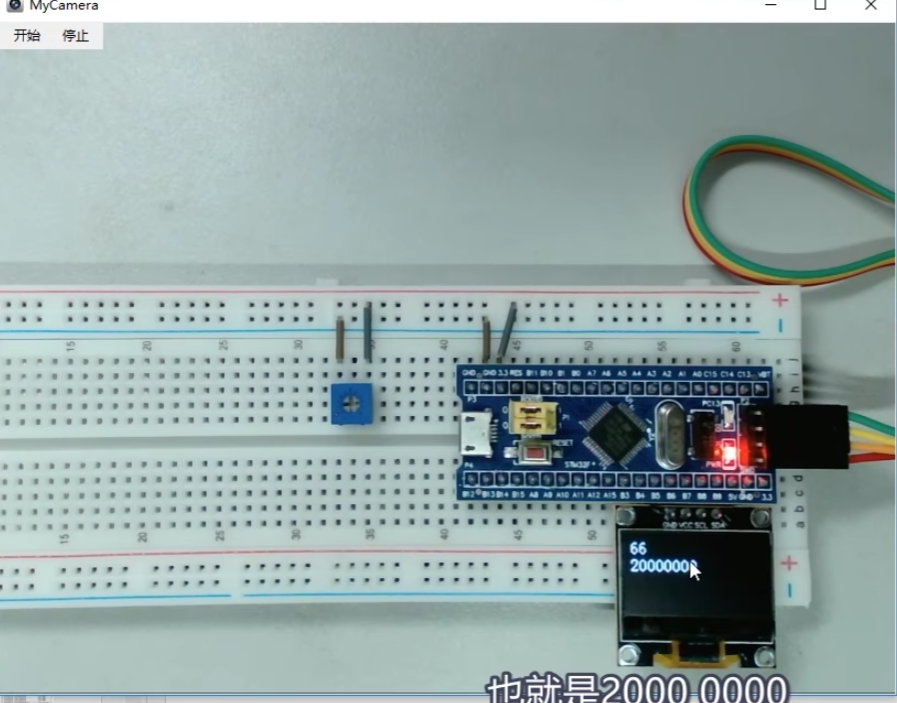
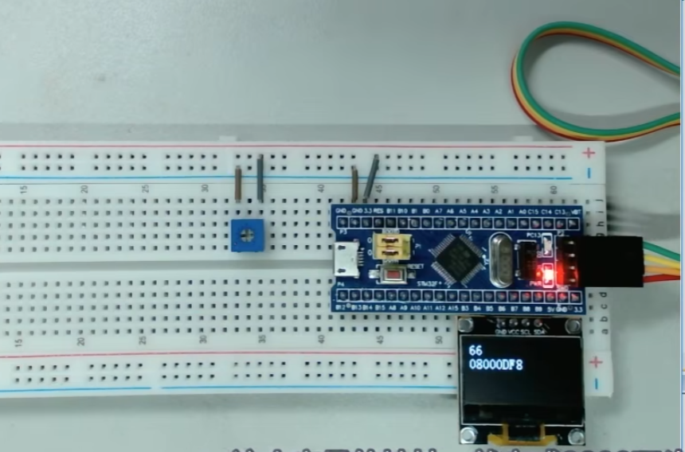
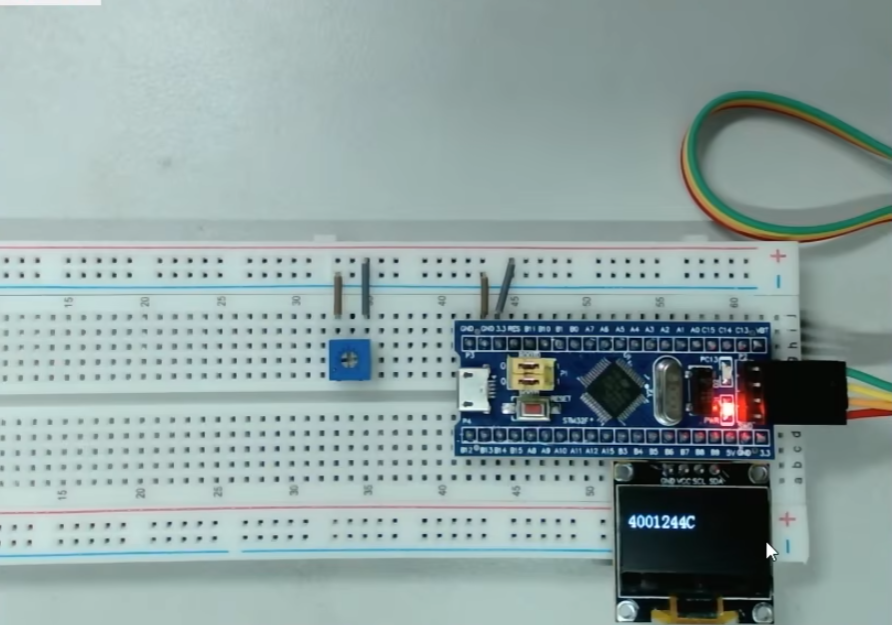
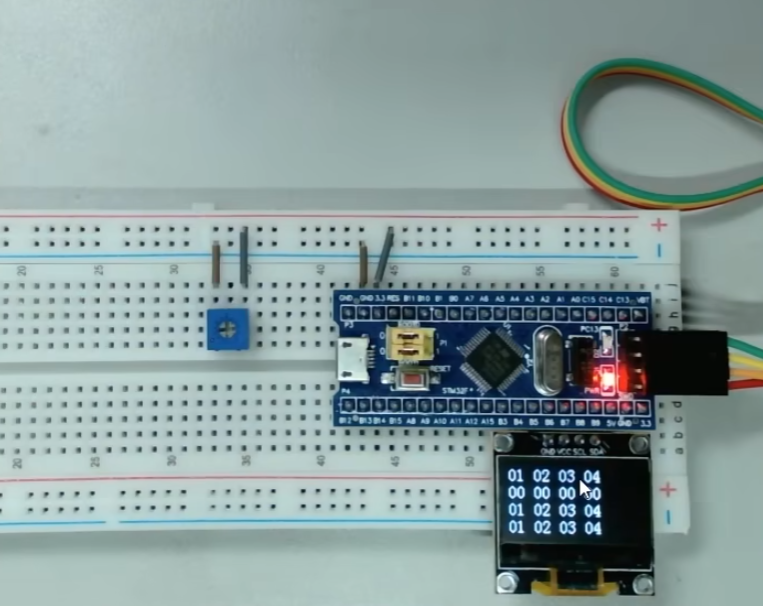
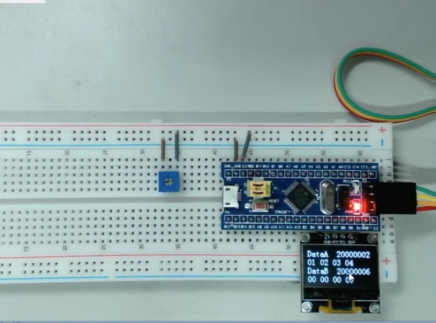
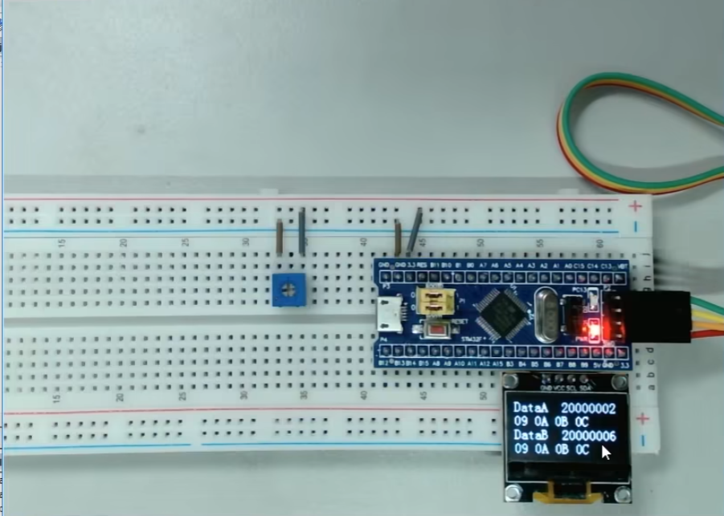
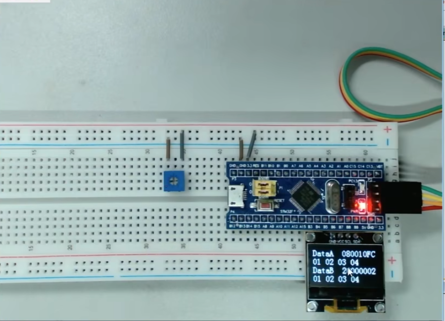

#  相关库函数

> **恢复缺省配置**
>
> void DMA_DeInit(DMA_Channel_TypeDef* DMAy_Channelx);
>
> **初始化DMA**
>
> void DMA_Init(DMA_Channel_TypeDef* DMAy_Channelx, DMA_InitTypeDef* DMA_InitStruct);
>
> **结构体初始化**
>
> void DMA_StructInit(DMA_InitTypeDef* DMA_InitStruct);
>
> **DMA使能**
>
> void DMA_Cmd(DMA_Channel_TypeDef* DMAy_Channelx, FunctionalState NewState);
>
> **中断输出使能**
>
> void DMA_ITConfig(DMA_Channel_TypeDef* DMAy_Channelx, uint32_t DMA_IT, FunctionalState NewState);
>
> **DMA设置当前数据寄存器**
>
> void DMA_SetCurrDataCounter(DMA_Channel_TypeDef* DMAy_Channelx, uint16_t DataNumber); 
>
> **DMA获取当前数据寄存器**
>
> uint16_t DMA_GetCurrDataCounter(DMA_Channel_TypeDef* DMAy_Channelx);
>
> **获取DMA标志位状态**
>
> FlagStatus DMA_GetFlagStatus(uint32_t DMAy_FLAG);
>
> **清除DMA标志位**
>
> void DMA_ClearFlag(uint32_t DMAy_FLAG);
>
> **获取DMA中断标志位状态**
>
> ITStatus DMA_GetITStatus(uint32_t DMAy_IT);
>
> **清除DMA中断标志位**
>
> void DMA_ClearITPendingBit(uint32_t DMAy_IT);
>
> **开启ADC DMA触发信号**
>
> void ADC_DMACmd(ADC_TypeDef* ADCx, FunctionalState NewState);

- **==DMA是AHB总线的设备==**

- **==DMA软件触发和硬件触发不能同时使用，如果同时使用DMA就会连续触发==**

-  DMA转运有三个条件：1.传输计数器大于0 2.触发源有触发信号 3.DMA使能

# 一、DMA数据转运

## 1.stm32单片机RAM和ROM

### 不加const修饰



###  加上const修饰

**代码部分**

```c
#include <stm32f10x.h> 			//Device header
#include "Delay.h"
#include "OLED.h"

const uint8_t aa =0x66;//使用const修饰完成的常变量，贮存在flash里面

int main(void)
{
	OLED_Init();
	
	OLED_ShowHexNum(1,1,aa,2);
	OLED_ShowHexNum(2,1,(uint32_t)&aa,8);//stm32单片机为32位系统，地址为32位，需要加上强制类型转换，如果不加，相当于指针跨级赋值了
	while(1)
	{
		
	}
}

```

**现象**

flash里面编译的代码部分，地址位于flah最前面，所以这里变量的显示在靠后的地址



## const关键字节省SRAM空间

```c
/*OLED字模库，宽8像素，高16像素*/
const uint8_t OLED_F8x16[][16]=
{
	0x00,0x00,0x00,0x00,0x00,0x00,0x00,0x00,
	0x00,0x00,0x00,0x00,0x00,0x00,0x00,0x00,//  0
	
	...
};
```

## 结构体访问寄存器RAM地址

```c
OLED_ShowHexNum(2,1,(uint32_t)&ADC1->DR,8);
```



**==外设的起始地址+寄存器的偏移地址=指定寄存器的地址==**

**==使用结构体访问，指定地址对应寄存器，这样，结构体访问就是寄存器的地址==**

## 2.DMA转运数组

**软件触发代码部分**

 ```c
 #include <stm32f10x.h> 			//Device header
 #include "Delay.h"
 #include "OLED.h"
 #include "MyDMA.h"
 
 //const uint8_t aa =0x66;//使用const修饰完成的常变量，贮存在flash里面
 
 uint8_t DataA[]={0X01,0X02,0X03,0X04};
 uint8_t DataB[]={0,0,0,0};
 
 int main(void)
 {
 	//OLED_ShowHexNum(1,1,aa,2);
 	//OLED_ShowHexNum(2,1,(uint32_t)&ADC1->DR,8);//stm32单片机为32位系统，地址为32位，需要加上强制类型转换，如果不加，相当于指针跨级赋值了
 	
 	OLED_Init();
 	
 	OLED_ShowHexNum(1,1,DataA[0],2);
 	OLED_ShowHexNum(1,4,DataA[1],2);
 	OLED_ShowHexNum(1,7,DataA[2],2);
 	OLED_ShowHexNum(1,10,DataA[3],2);
 	
 	OLED_ShowHexNum(2,1,DataB[0],2);
 	OLED_ShowHexNum(2,4,DataB[1],2);
 	OLED_ShowHexNum(2,7,DataB[2],2);
 	OLED_ShowHexNum(2,10,DataB[3],2);
 	
 	MyDMA_Init((uint32_t)DataA,(uint32_t)DataB,4);
 	OLED_ShowHexNum(3,1,DataA[0],2);
 	OLED_ShowHexNum(3,4,DataA[1],2);
 	OLED_ShowHexNum(3,7,DataA[2],2);
 	OLED_ShowHexNum(3,10,DataA[3],2);
 	
 	OLED_ShowHexNum(4,1,DataB[0],2);
 	OLED_ShowHexNum(4,4,DataB[1],2);
 	OLED_ShowHexNum(4,7,DataB[2],2);
 	OLED_ShowHexNum(4,10,DataB[3],2);
 	while(1)
 	{
 		
 	}
 }
 ```





## 3.DMA软件触发



**DMA传输计数器软件重装**

```c
#include "stm32f10x.h"                  // Device header

uint16_t MyDMA_Size;

/**
  * @函	数		DMA初始化配置
  * @参	数		要转运数据的首地址，存储器站点的起始地址，传输次数
  * @返回值		
  * @特殊说明		
  */
void MyDMA_Init(uint32_t AddrA,uint32_t AddrB,uint16_t Size)
{
	MyDMA_Size=Size;
	RCC_AHBPeriphClockCmd(RCC_AHBPeriph_DMA1,ENABLE);
	/*DMA结构体初始化*/
	DMA_InitTypeDef DMA_InitStructure;
	DMA_InitStructure.DMA_DIR=DMA_DIR_PeripheralSRC;//指定外设地址是源端还是目的地,这里将外设选择数据源
	DMA_InitStructure.DMA_BufferSize=Size;//缓冲区大小，直接赋值给了传输计数器的寄存器，指定传输几次,取值0~65535
	DMA_InitStructure.DMA_Mode=DMA_Mode_Normal;//传输模式，是否使用自动重装,这里选择正常模式
	DMA_InitStructure.DMA_M2M=DMA_M2M_Enable;//选择是否是存储器到存储器，硬件触发/软件触发
	DMA_InitStructure.DMA_Priority=DMA_Priority_Medium;//指定通道的软件优先级
	
	/*存储器站点配置*/
	DMA_InitStructure.DMA_MemoryBaseAddr=AddrB;//存储器站点的起始地址
	DMA_InitStructure.DMA_MemoryDataSize=DMA_MemoryDataSize_Byte;//以字节传输
	DMA_InitStructure.DMA_MemoryInc=DMA_MemoryInc_Enable;
	/*外设站点配置*/
	DMA_InitStructure.DMA_PeripheralBaseAddr=AddrA;
	DMA_InitStructure.DMA_PeripheralDataSize=DMA_PeripheralDataSize_Byte;//转运数据宽度为一个字节
	DMA_InitStructure.DMA_PeripheralInc=DMA_PeripheralInc_Enable;//地址是否自增
	
	/*把结构体的参数，配置到通道1中去*/
	DMA_Init(DMA1_Channel1,&DMA_InitStructure);//存储器到存储器，使用软件触发，所以通道可以任意选择
	
	DMA_Cmd(DMA1_Channel1,DISABLE);
}

void MyDMA_Transfer(void)
{
	DMA_Cmd(DMA1_Channel1,DISABLE);//给DMA传输计数器赋值，需要关闭CMD
	DMA_SetCurrDataCounter(DMA1_Channel1,MyDMA_Size);
	DMA_Cmd(DMA1_Channel1,ENABLE);
	
	while(DMA_GetFlagStatus(DMA1_FLAG_TC1) == RESET);
	DMA_ClearFlag(DMA1_FLAG_TC1);//清除转运标志位
}
```

**main.c**

```c
#include <stm32f10x.h> 			//Device header
#include "Delay.h"
#include "OLED.h"
#include "MyDMA.h"

//const uint8_t aa =0x66;//使用const修饰完成的常变量，贮存在flash里面

uint8_t DataA[]={0X01,0X02,0X03,0X04};
uint8_t DataB[]={0,0,0,0};

int main(void)
{
	OLED_Init();	
	//OLED_ShowHexNum(1,1,aa,2);
	//OLED_ShowHexNum(2,1,(uint32_t)&ADC1->DR,8);//stm32单片机为32位系统，地址为32位，需要加上强制类型转换，如果不加，相当于指针跨级赋值了
	
	MyDMA_Init((uint32_t)DataA,(uint32_t)DataB,4);
	OLED_ShowString(1,1,"DataA");
	OLED_ShowString(3,1,"DataB");
	OLED_ShowHexNum(1,8,(uint32_t)DataA,8);
	OLED_ShowHexNum(3,8,(uint32_t)DataB,8);

	
	OLED_ShowHexNum(2,1,DataA[0],2);
	OLED_ShowHexNum(2,4,DataA[1],2);
	OLED_ShowHexNum(2,7,DataA[2],2);
	OLED_ShowHexNum(2,10,DataA[3],2);
	OLED_ShowHexNum(4,1,DataB[0],2);
	OLED_ShowHexNum(4,4,DataB[1],2);
	OLED_ShowHexNum(4,7,DataB[2],2);
	OLED_ShowHexNum(4,10,DataB[3],2);
	
	while(1)
	{
		DataA[0]++;
		DataA[1]++;
		DataA[2]++;
		DataA[3]++;
		
		OLED_ShowHexNum(2,1,DataA[0],2);
		OLED_ShowHexNum(2,4,DataA[1],2);
		OLED_ShowHexNum(2,7,DataA[2],2);
		OLED_ShowHexNum(2,10,DataA[3],2);
		OLED_ShowHexNum(4,1,DataB[0],2);
		OLED_ShowHexNum(4,4,DataB[1],2);
		OLED_ShowHexNum(4,7,DataB[2],2);
		OLED_ShowHexNum(4,10,DataB[3],2);		
		
		Delay_ms(1000);
		MyDMA_Transfer();
		
		OLED_ShowHexNum(2,1,DataA[0],2);
		OLED_ShowHexNum(2,4,DataA[1],2);
		OLED_ShowHexNum(2,7,DataA[2],2);
		OLED_ShowHexNum(2,10,DataA[3],2);
		OLED_ShowHexNum(4,1,DataB[0],2);
		OLED_ShowHexNum(4,4,DataB[1],2);
		OLED_ShowHexNum(4,7,DataB[2],2);
		OLED_ShowHexNum(4,10,DataB[3],2);
		
		Delay_ms(1000);
	}
}
```




**将DataA用const修饰**

DataA此时为flash里面的变量，所以地址为08开头




# ADC+ DMA转运

**ADC单次扫描，DMA单次转运+软件触发**

```c
#include "stm32f10x.h"                  // Device header

uint16_t AD_Value[4];
void AD_DMA_Init()
{
	/*RCC时钟配置*/
	RCC_APB2PeriphClockCmd(RCC_APB2Periph_ADC1,ENABLE);//ADC属于APB2上的设备
	RCC_APB2PeriphClockCmd(RCC_APB2Periph_GPIOA,ENABLE);
	RCC_AHBPeriphClockCmd(RCC_AHBPeriph_DMA1,ENABLE);
	
	RCC_ADCCLKConfig(RCC_PCLK2_Div6);//最大频率14MHZ,所以选择6分频，12MHZ
	
	/*GPIO配置*/
	GPIO_InitTypeDef GPIO_InitStructure; //结构体类型(已经定义好的） 结构体变量名 ->结构体变量的定义
	GPIO_InitStructure.GPIO_Mode=GPIO_Mode_AIN;//模拟输入模式，断开GPIO，防止GPIO的输入输出对模拟电压造成干扰
	GPIO_InitStructure.GPIO_Pin=GPIO_Pin_0 | GPIO_Pin_1 | GPIO_Pin_2 | GPIO_Pin_3;
	GPIO_InitStructure.GPIO_Speed=GPIO_Speed_50MHz;
	GPIO_Init(GPIOA,&GPIO_InitStructure);
	
	ADC_RegularChannelConfig(ADC1,ADC_Channel_0,1,ADC_SampleTime_55Cycles5);//在规则组菜单列表第1个位置，写入通道
	ADC_RegularChannelConfig(ADC1,ADC_Channel_1,2,ADC_SampleTime_55Cycles5);//在规则组菜单列表第2个位置，写入通道
	ADC_RegularChannelConfig(ADC1,ADC_Channel_2,3,ADC_SampleTime_55Cycles5);//在规则组菜单列表第3个位置，写入通道
	ADC_RegularChannelConfig(ADC1,ADC_Channel_3,4,ADC_SampleTime_55Cycles5);//在规则组菜单列表第4个位置，写入通道	
	
	/*ADC相关寄存器配置*/
	//ADC_RegularChannelConfig(ADC1,ADC_Channel_0,1,ADC_SampleTime_55Cycles5);//在规则组菜单列表第一个位置，写入通道0
	
	ADC_InitTypeDef ADC_InitStructure;
	ADC_InitStructure.ADC_ContinuousConvMode=DISABLE;//单次模式
	ADC_InitStructure.ADC_DataAlign=ADC_DataAlign_Right;//右对齐
	ADC_InitStructure.ADC_ExternalTrigConv=ADC_ExternalTrigConv_None;//不使用外部触发
	ADC_InitStructure.ADC_Mode=ADC_Mode_Independent;//独立模式
	ADC_InitStructure.ADC_NbrOfChannel=4;//仅在扫描模式下才需要大于1
	ADC_InitStructure.ADC_ScanConvMode=ENABLE;//非扫描模式,这里改成扫描模式
	ADC_Init(ADC1,&ADC_InitStructure);

	/*DMA结构体初始化*/
	DMA_InitTypeDef DMA_InitStructure;
	
	/*外设站点配置*/
	DMA_InitStructure.DMA_PeripheralBaseAddr=(uint32_t)&ADC1->DR;//源地址填写ADC_DR的地址
	DMA_InitStructure.DMA_PeripheralDataSize=DMA_PeripheralDataSize_HalfWord;//转运数据宽度为一个字节,HalfWord表示半字16位选择DR寄存器低16位数据
	DMA_InitStructure.DMA_PeripheralInc=DMA_PeripheralInc_Disable;//地址是否自增,不自增
	
	/*存储器站点配置*/
	DMA_InitStructure.DMA_MemoryBaseAddr=(uint32_t)AD_Value;//存储器站点的起始地址
	DMA_InitStructure.DMA_MemoryDataSize=DMA_MemoryDataSize_HalfWord;//半字16位
	DMA_InitStructure.DMA_MemoryInc=DMA_MemoryInc_Enable;//存储器地址自增

	
	
	DMA_InitStructure.DMA_DIR=DMA_DIR_PeripheralSRC;//指定外设地址是源端还是目的地,这里将外设选择数据源
	DMA_InitStructure.DMA_BufferSize=4;//缓冲区大小，直接赋值给了传输计数器的寄存器，指定传输几次,取值0~65535
	DMA_InitStructure.DMA_Mode=DMA_Mode_Normal;//传输模式，是否使用自动重装,这里选择正常模式
	DMA_InitStructure.DMA_M2M=DMA_M2M_Disable;//选择是否是存储器到存储器，硬件触发/软件触发。这里选择硬件触发
	DMA_InitStructure.DMA_Priority=DMA_Priority_Medium;//指定通道的软件优先级
	
	/*把结构体的参数，配置到通道1中去*/
	DMA_Init(DMA1_Channel1,&DMA_InitStructure);//存储器到存储器，使用软件触发，ADC1对应DMA的通道1，这里必须选择通道1
	
	DMA_Cmd(DMA1_Channel1,ENABLE);
	ADC_DMACmd(ADC1,ENABLE);//开启DMA触发信号
	ADC_Cmd(ADC1,ENABLE);//开启ADC电源
	
	ADC_ResetCalibration(ADC1);//复位校准,操作CR2_RSTCAL_Set
	while(ADC_GetResetCalibrationStatus(ADC1) == SET);//是否复位完成
	ADC_StartCalibration(ADC1);//启动校准
	while(ADC_GetCalibrationStatus(ADC1) == SET);//校准标志位判断，等待校准完成
}

void AD_GetValue(void)
{
	DMA_Cmd(DMA1_Channel1,DISABLE);//给DMA传输计数器赋值，需要关闭CMD
	DMA_SetCurrDataCounter(DMA1_Channel1,4);//传输次数给4
	DMA_Cmd(DMA1_Channel1,ENABLE);
	
	//ADC_RegularChannelConfig(ADC1,ADC_Channel,1,ADC_SampleTime_55Cycles5);//在规则组菜单列表第一个位置，写入通道
	ADC_SoftwareStartConvCmd(ADC1,ENABLE);//软件触发转换
	
	//这里选择了ADC触发DMA，标志位自动清零，所以不需要软件清零
	/*
	while(ADC_GetFlagStatus(ADC1,ADC_FLAG_EOC)==RESET);//等待转换完成标志位置1
	return ADC_GetConversionValue(ADC1);
	*/
	
	/*DMA转运完成总是在ADC完成之后的，所以这里等待DMA状态标志位即可*/
	while(DMA_GetFlagStatus(DMA1_FLAG_TC1) == RESET);
	DMA_ClearFlag(DMA1_FLAG_TC1);//清除转运标志位
}
```

**ADC连续扫描+DMA循环转运模式**

```c
void AD_DMA_Init()
{
	/*RCC时钟配置*/
	RCC_APB2PeriphClockCmd(RCC_APB2Periph_ADC1,ENABLE);//ADC属于APB2上的设备
	RCC_APB2PeriphClockCmd(RCC_APB2Periph_GPIOA,ENABLE);
	RCC_AHBPeriphClockCmd(RCC_AHBPeriph_DMA1,ENABLE);
	
	RCC_ADCCLKConfig(RCC_PCLK2_Div6);//最大频率14MHZ,所以选择6分频，12MHZ
	
	/*GPIO配置*/
	GPIO_InitTypeDef GPIO_InitStructure; //结构体类型(已经定义好的） 结构体变量名 ->结构体变量的定义
	GPIO_InitStructure.GPIO_Mode=GPIO_Mode_AIN;//模拟输入模式，断开GPIO，防止GPIO的输入输出对模拟电压造成干扰
	GPIO_InitStructure.GPIO_Pin=GPIO_Pin_0 | GPIO_Pin_1 | GPIO_Pin_2 | GPIO_Pin_3;
	GPIO_InitStructure.GPIO_Speed=GPIO_Speed_50MHz;
	GPIO_Init(GPIOA,&GPIO_InitStructure);
	
	ADC_RegularChannelConfig(ADC1,ADC_Channel_0,1,ADC_SampleTime_55Cycles5);//在规则组菜单列表第1个位置，写入通道
	ADC_RegularChannelConfig(ADC1,ADC_Channel_1,2,ADC_SampleTime_55Cycles5);//在规则组菜单列表第2个位置，写入通道
	ADC_RegularChannelConfig(ADC1,ADC_Channel_2,3,ADC_SampleTime_55Cycles5);//在规则组菜单列表第3个位置，写入通道
	ADC_RegularChannelConfig(ADC1,ADC_Channel_3,4,ADC_SampleTime_55Cycles5);//在规则组菜单列表第4个位置，写入通道	
	
	/*ADC相关寄存器配置*/
	//ADC_RegularChannelConfig(ADC1,ADC_Channel_0,1,ADC_SampleTime_55Cycles5);//在规则组菜单列表第一个位置，写入通道0
	
	ADC_InitTypeDef ADC_InitStructure;
	ADC_InitStructure.ADC_ContinuousConvMode=ENABLE;//连续模式
	ADC_InitStructure.ADC_DataAlign=ADC_DataAlign_Right;//右对齐
	ADC_InitStructure.ADC_ExternalTrigConv=ADC_ExternalTrigConv_None;//不使用外部触发
	ADC_InitStructure.ADC_Mode=ADC_Mode_Independent;//独立模式
	ADC_InitStructure.ADC_NbrOfChannel=4;//仅在扫描模式下才需要大于1
	ADC_InitStructure.ADC_ScanConvMode=ENABLE;//非扫描模式,这里改成扫描模式
	ADC_Init(ADC1,&ADC_InitStructure);

	/*DMA结构体初始化*/
	DMA_InitTypeDef DMA_InitStructure;
	
	/*外设站点配置*/
	DMA_InitStructure.DMA_PeripheralBaseAddr=(uint32_t)&ADC1->DR;//源地址填写ADC_DR的地址
	DMA_InitStructure.DMA_PeripheralDataSize=DMA_PeripheralDataSize_HalfWord;//转运数据宽度为一个字节,HalfWord表示半字16位选择DR寄存器低16位数据
	DMA_InitStructure.DMA_PeripheralInc=DMA_PeripheralInc_Disable;//地址是否自增,不自增
	
	/*存储器站点配置*/
	DMA_InitStructure.DMA_MemoryBaseAddr=(uint32_t)AD_Value;//存储器站点的起始地址
	DMA_InitStructure.DMA_MemoryDataSize=DMA_MemoryDataSize_HalfWord;//半字16位
	DMA_InitStructure.DMA_MemoryInc=DMA_MemoryInc_Enable;//存储器地址自增

	
	
	DMA_InitStructure.DMA_DIR=DMA_DIR_PeripheralSRC;//指定外设地址是源端还是目的地,这里将外设选择数据源
	DMA_InitStructure.DMA_BufferSize=4;//缓冲区大小，直接赋值给了传输计数器的寄存器，指定传输几次,取值0~65535
	DMA_InitStructure.DMA_Mode=DMA_Mode_Circular;//传输模式，是否使用自动重装,DMA循环模式
	DMA_InitStructure.DMA_M2M=DMA_M2M_Disable;//选择是否是存储器到存储器，硬件触发/软件触发。这里选择硬件触发
	DMA_InitStructure.DMA_Priority=DMA_Priority_Medium;//指定通道的软件优先级
	
	/*把结构体的参数，配置到通道1中去*/
	DMA_Init(DMA1_Channel1,&DMA_InitStructure);//存储器到存储器，使用软件触发，ADC1对应DMA的通道1，这里必须选择通道1
	
	DMA_Cmd(DMA1_Channel1,ENABLE);
	ADC_DMACmd(ADC1,ENABLE);//开启DMA触发信号
	ADC_Cmd(ADC1,ENABLE);//开启ADC电源
	
	ADC_ResetCalibration(ADC1);//复位校准,操作CR2_RSTCAL_Set
	while(ADC_GetResetCalibrationStatus(ADC1) == SET);//是否复位完成
	ADC_StartCalibration(ADC1);//启动校准
	while(ADC_GetCalibrationStatus(ADC1) == SET);//校准标志位判断，等待校准完成
	
	ADC_SoftwareStartConvCmd(ADC1,ENABLE);//软件触发转换
}
```


**思考：**

- 定时器触发ADC单词转换后通过DMA转运？
- 串口发送的数据使用DMA进行存储器到外设的转运
