# 前言

- xxxxxxxxxx $ tags: -数字电路与VHDL设计"bash 
- 需要安装java环境，才能正常允许CubeMX
- 确保以及安装了Keil MDK，Keil完成了stm32的芯片包配置，至少下载串口通信（FLY MCU） , STLink Unit中其中一款下载/串口通信软件。

# 一、CubeMX初始配置

## 1.CubeMX安装芯片固件包

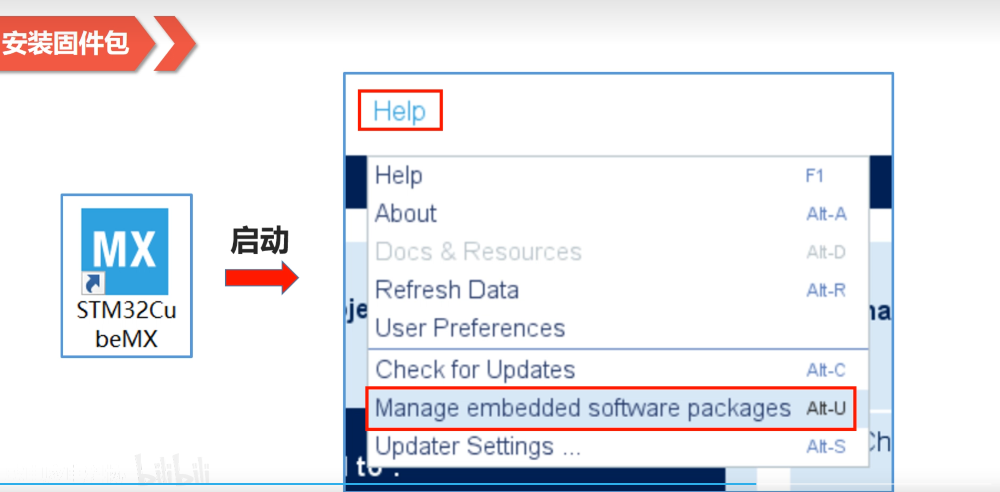

xxxxxxxxxx typedef struct//typedef为成员列表提供了一个GPIO_InitTypeDef的名字{}GPIO_InitTypeDef;c

**像常用的stm32f103c8t6，我们就选择STM32F1，勾选最新固件包，点击Install Now进行在线安装**

---

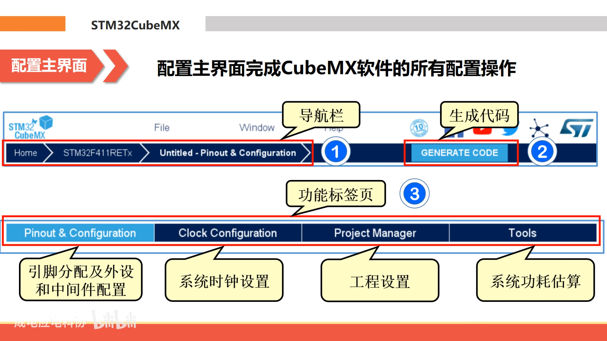

---

## 2.工程创建

1.打开stm32cubeMX，File > New project >MCU/MPU Selector >Part Number
2.输入stm32f103c8,Start Project
3.Project Manager > Project


## 3.引脚配置


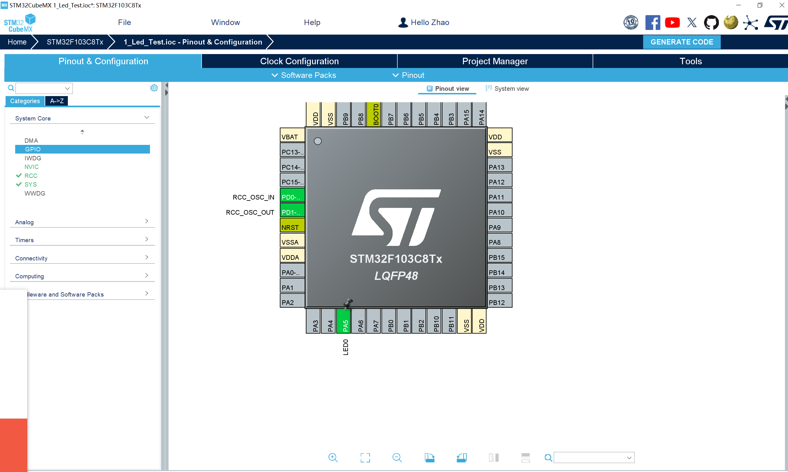


## 3.外设配置

==GPIO属性配置==

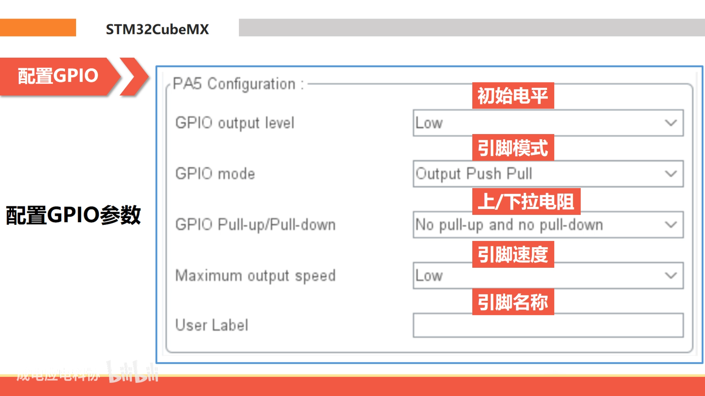

> GPIO output level > High 输出等级 高 
>
> GPIO mode Output > Push Pull 输出模式 推挽输出 
>
> GPIO Pull-up/Pull-down > Pull-down 初始输出 设为低 
>
> User Label >  用户标签，方便代码中使用，如图：
>
> ​			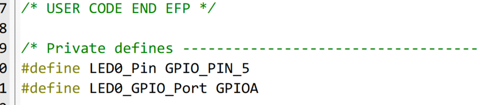

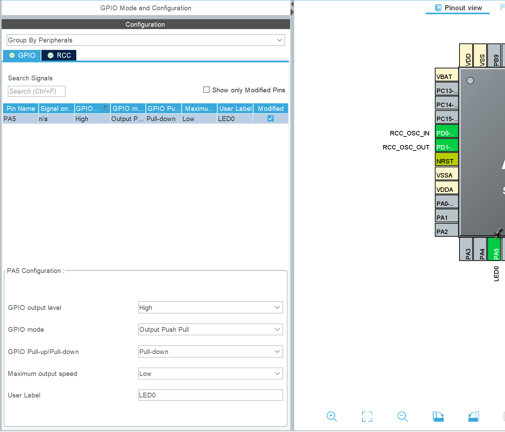


==配置时钟模式==

Pinout & Configuration > A-Z > RCC > High Speed Clock
Crystal/Ceramic Resonator 使用外部时钟源

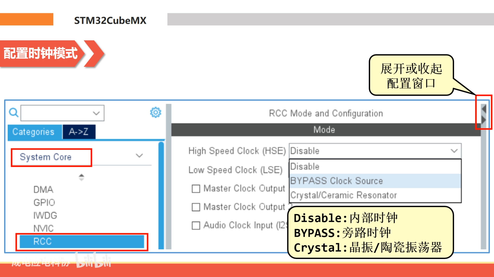

==时钟可视化配置==

Clock Configuration
选中HSE,倍频x9，不分频

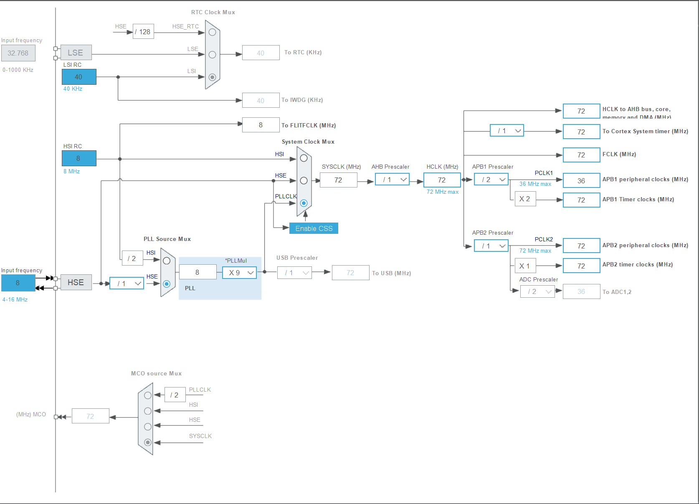

## 4.工程设置

> Project Name 项目名称，填写led 
>
> Project Location 项目位置，选择一个你喜欢的文件夹，不要出现中文 Toolchain/IDE 
>
> 交叉编译链，选择MDK，V5
>
> 勾选 Use latest available version

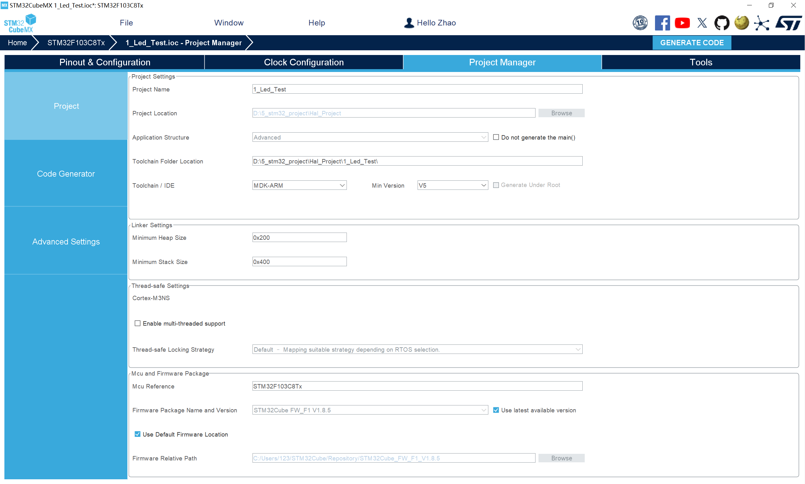

> Project Manager > Code Generator
>
> 勾选Generate peripheral...

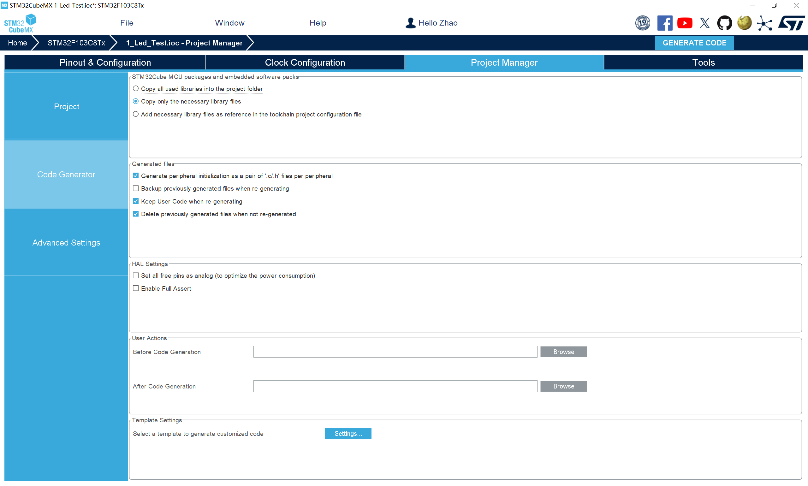

> 其余默认配置即可 

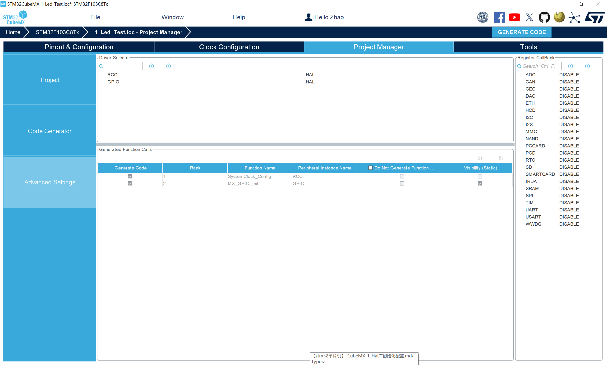

> GENERATE CODE生成代码，Open Project

# 二、MDK代码编写

```c
int main(void)
{
/* USER CODE BEGIN 1 */
  HAL_Init();//HAL库初始化
  SystemClock_Config();//时钟初始化
  MX_GPIO_Init();//GPIO初始化
/* USER CODE END 1 */
  while (1)
  {
    /* USER CODE END WHILE */

    /* USER CODE BEGIN 3 */
	  HAL_GPIO_TogglePin(GPIOA,GPIO_PIN_5);//翻转引脚电平
	  HAL_Delay(500);//延时500ms
  }
  /* USER CODE END 3 */
}
```

**==注意：    /* USER CODE BEGIN 3 */之内的代码不会杯CubeMX重新生成代码时覆盖掉！ /* USER CODE END 3 */==**

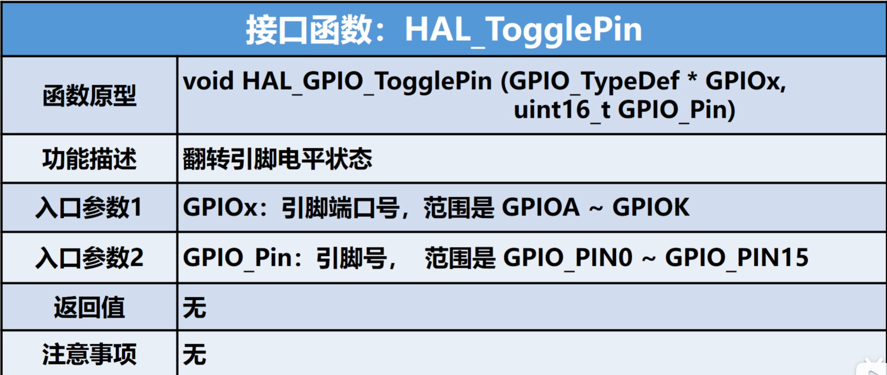

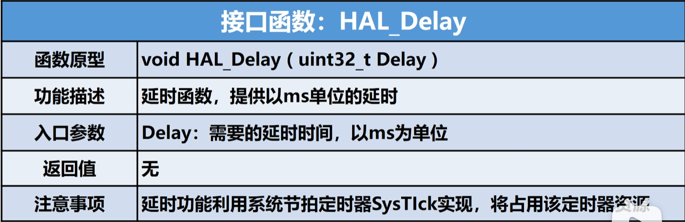

下载后编译，观察PA5引脚电平变化（利用LED），是否以0.5s周期变化
