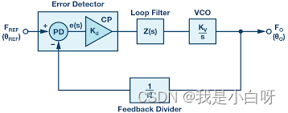

# 一、锁相环的原理与应用

参考文章：[【STM32】知识补充 锁相环原理与应用解析_stm32数字锁相-CSDN博客](https://blog.csdn.net/weixin_46274168/article/details/130437627)

## 什么是锁相环 (PPL)

锁相环是一种闭环反馈控制系统. 用于生成与输入信号同步且[相位](https://so.csdn.net/so/search?q=相位&spm=1001.2101.3001.7020)相同的输出信号. 它的核心功能是在输入信号的相位变化时, 自动调整输出信号以保持同步. 这使得锁相环成为了一种理想的频率和相位控制技术.

## 锁相环的基本组成
锁相环主要由以下几个部分组成:

- 相位比较器 (Phase Detector): 相位比较器负责比较输入信号和反馈信号的相位差, 并将其转换为电压信号
- 低通滤波器 (Low-Pass Filter): 低通滤波器对相位比较器的输出信号进行滤波, 以消除高频噪声和相位抖动
- 电压控制振荡器 (Voltage-Controlled Oscillator): 根据低通过滤波器的输出电压调整输出信号的频率和相位
- 反馈分频器 (Feedback Divider): 反馈分频器对 VCO 的输出信号进行分频处理, 并将其反馈给相位比较器
