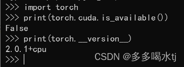
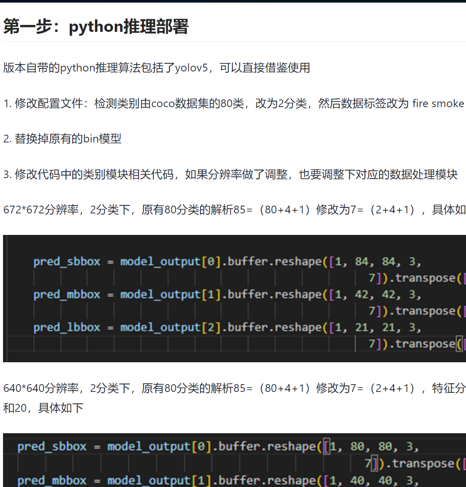

# 一、Windows环境下的模型训练

针对YOLO的模型训练环境配置，Windows端兼容性差于Ubuntu，如果电脑上有Ubuntu系统，建议用Ubuntu系统进行训练（但注意，虚拟机安装的Ubuntu系统无法使用物理GPU进行训练）。

**==YOLO版本：YOLOV5 7.0==**

## 1. 数据集的准备

准备好目标模型对应的图片数据集，使用labelme命令，启动数据集打标工具

## 2. 模型的训练和导出ONNX

### 2.1 环境配置

> Anoconda可以区分不同的环境，不同的环境下可以使用的命令是不同的
>
> 创建环境
>
> ```python
> conda create -n yolov5_7.0 python==3.8.5
> ```
>
> 列举所有环境
>
> ```python
> conda env list
> ```
>
> 删除'环境
>
> ```python
> conda env remove --name <env_name>
> ```
>
> 激活环境
>
> ```python
> conda activate <env_name>
> ```

> 如配置好yolo的环境，安装好pytorch，cuda，yolo相关依赖，就需要使用conda activate yolov5_7.0激活

#### 2.1.1 ==常见问题：==

Anoconda环境下无法识别到CUDA

**参考文章**：[print(torch.cuda.is_available())是false_pip install torch==2.0.1+cu117-CSDN博客](https://blog.csdn.net/qq_71547093/article/details/133581922)



**问题原因**：

所使用的环境是anaconda pytorch。

使用GPU来加速某个项目，但是GPU不能用，原因是没有安装GPU版本的torch和torchvision

**解决方法**：

使用pip安装GPU版本的支持CUDA 11.7的torch和torchvision，并且版本分别为torch==2.0.1和torchvision==0.15.2。具体可以根据需要的版本进行修改。

```python
pip install torch==2.0.1+cu117 torchvision==0.15.2+cu117 -f https://download.pytorch.org/whl/torch_stable.html
```

安装完成之后，检查是否可以正常使用。

**==如果在线安装速度过慢，可以尝试进入网页的方法：==**

手动下载 `.whl` 文件并离线安装。

1. **下载 `.whl` 文件**：
   访问 [PyTorch 官网](https://download.pytorch.org/whl/torch_stable.html) 或使用下面的链接手动下载相应的 `.whl` 文件：

   - [torch-2.0.1+cu117](https://download.pytorch.org/whl/cu117/torch-2.0.1%2Bcu117-cp38-cp38-win_amd64.whl)
   - [torchvision-0.15.2+cu117](https://download.pytorch.org/whl/cu117/torchvision-0.15.2%2Bcu117-cp38-cp38-win_amd64.whl)

2. **离线安装**：
   下载完成后，使用 `pip` 离线安装：

   ```python
   pip install path/to/torch-2.0.1+cu117-cp38-cp38-win_amd64.whl
   pip install path/to/torchvision-0.15.2+cu117-cp38-cp38-win_amd64.whl
   ```

输入python，回车，然后输入：

```python
import torch
print(torch.cuda.is_available())
```

---

### 2.3 **训练过程源码修改(板端设备 RDK X3)**

修改YOLO源码的内容，使用GPU进行快速训练

**参考文章：**[YOLOv5较新版本的部署方法 (horizon.cc)](https://developer.horizon.cc/forumDetail/177840589839214598)

主目录下 export.py 约1351行附近，标注两处不做注释

```python
    shape = tuple((y[0] if isinstance(y, tuple) else y).shape)  # model output shape#转换时注释
    metadata = {"stride": int(max(model.stride)), "names": model.names}  # model metadata###
    LOGGER.info(f"\n{colorstr('PyTorch:')} starting from {file} with output shape {shape} ({file_size(file):.1f} MB)")#转换时注释
```

model/yolo.py 约91行处
```python
def forward(self, x):
    """Processes input through YOLOv5 layers, altering shape for detection: `x(bs, 3, ny, nx, 85)`."""
    z = []  # inference output
    for i in range(self.nl):
        x[i] = self.m[i](x[i])  # conv###
        bs, _, ny, nx = x[i].shape  # x(bs,255,20,20) to x(bs,3,20,20,85)###
        
	### ###
        #转换成注释，训练时启用
        x[i] = x[i].view(bs, self.na, self.no, ny, nx).permute(0, 1, 3, 4, 2).contiguous()
        if not self.training:  # inference
            if self.dynamic or self.grid[i].shape[2:4] != x[i].shape[2:4]:
                self.grid[i], self.anchor_grid[i] = self._make_grid(nx, ny, i)

            if isinstance(self, Segment):  # (boxes + masks)
                xy, wh, conf, mask = x[i].split((2, 2, self.nc + 1, self.no - self.nc - 5), 4)
                xy = (xy.sigmoid() * 2 + self.grid[i]) * self.stride[i]  # xy
                wh = (wh.sigmoid() * 2) ** 2 * self.anchor_grid[i]  # wh
                y = torch.cat((xy, wh, conf.sigmoid(), mask), 4)
            else:  # Detect (boxes only)
                xy, wh, conf = x[i].sigmoid().split((2, 2, self.nc + 1), 4)
                xy = (xy * 2 + self.grid[i]) * self.stride[i]  # xy
                wh = (wh * 2) ** 2 * self.anchor_grid[i]  # wh
                y = torch.cat((xy, wh, conf), 4)
            z.append(y.view(bs, self.na * nx * ny, self.no))
    return x if self.training else (torch.cat(z, 1),) if self.export else (torch.cat(z, 1), x)
	### ###
        # x[i] = x[i].permute(0, 2, 3, 1).contiguous()#转换时启用,训练时注释
    # return x#转换时启用
```

### 2.1 模型的训练

```python
python train.py --data face_data.yaml --cfg face_yolo5s.yaml --weights pretrained/yolov5s.pt --batch-size 16 --epochs 300  --imgsz 672 --device 0
```

- face_data.yaml：指定数据集的配置文件为 `face_data.yaml`，这个文件包含了训练和验证数据集的路径、类别数以及类别名称等信息
- face_yolo5s.yaml：指定 YOLOv5 模型的配置文件为 `face_yolo5s.yaml`，这个文件定义了模型的结构和各项超参数
- weights：指定预训练权重文件的路径为 `pretrained/yolov5s.pt`，这些权重将用于初始化模型的参数，以加速训练收敛
- batch-size：设置训练时的批量大小为 4，这表示每次迭代中使用的样本数为 4，影响训练速度和模型训练过程
- device：指定训练时使用的设备，这里的 `0` 表示使用 GPU 0。如果你有多个 GPU，可以根据需要更改这个数字；如果你想使用 CPU，可以将其设置为 `cpu`
- epochs：训练轮数
- imgsz：模型大小（本例 输入输出为 672 x672）
- deviece：选择设备号，0一般指向GPU（需要安装对应版本的CUDA和cudnn）

## 2.2 模型的ONNX格式导出

```python
python export.py --weights runs/train/exp/weights/best.pt --include onnx engine --img-size 672 --batch-size 1 --device 0 
```

- --weights：此段命令指向训练好的pt模型目录
- include：目标格式

## 3. 模型的Windows端验证

```python
 # 检测摄像头
 python detect.py  --weights runs/train/exp_yolov5s/weights/best.pt --source 0  # webcam
 # 检测图片文件
  python detect.py  --weights runs/train/exp_yolov5s/weights/best.pt --source file.jpg  # image 
 # 检测视频文件
   python detect.py --weights runs/train/exp_yolov5s/weights/best.pt --source file.mp4  # video
 # 检测一个目录下的文件
  python detect.py --weights runs/train/exp_yolov5s/weights/best.pt path/  # directory
 # 检测网络视频
  python detect.py --weights runs/train/exp_yolov5s/weights/best.pt 'https://youtu.be/NUsoVlDFqZg'  # YouTube video
 # 检测流媒体
  python detect.py --weights runs/train/exp_yolov5s/weights/best.pt 'rtsp://example.com/media.mp4'  # RTSP, RTMP, HTTP stream                            
```

# 二、模型部署

## 1. 模型的工具链环境(Ubuntu)——onnx转化bin格式

**参考文章：[【模型提速】如何在X3pi使用yolov5模型50ms推理 (horizon.cc)](https://developer.horizon.cc/forumDetail/163807123501918330)**

---

**文件结构**：

`hb_mapper_makertbin.log`是工具链自动生成的日志文件
`imgs_train`存放训练集中的原图片
`imgs_cal`存放转化模型需要的图片校准数据
`tran.py`用于将原训练集图片转化成校准数据
`medels_onnx`存放转化前的onnx模型
`models_onnx`存放转化后的bin文件
`tran.yaml`是转化所需的文本

---

**模型验证**

```python
hb_mapper checker --model-type onnx --march bernoulli2 --model models_onnx/my_face.onnx --input-shape images 1x3x672x672
```

注意：--input-shape 需要跟之前的模型尺寸参数对应

验证执行之后，在命令行界面可以看到算子是否在CPU/BPU上支持运行

**板载模型转化**

转化之前，yaml文件中要注意修改对应标注的参数

```python
hb_mapper makertbin --config yaml文件的位置 --model-type onnx
```

执行命令之后，可以在model_output文件夹中找到对应的bin文件

**模型性能分析(开发机评测性能)**

使用 `hb_perf` 工具评测模型性能，使用方式如下：

```bash
hb_perf  ***.bin
```

## 2. 板端（RDK X3）部署

将转换完成的bin文件，复制到板端对应目录即可

**RDK X3 板端模型运行过程：**

- 模型预处理：CPU

- 模型推理：BPU 与 CPU 并行
- 模型后处理：CPU

### 2.1 后处理函数部分

#### 2.1.1 Python版本

> 后处理函数中类别数目，类名都要跟模型一一对应
>
> - `postprocess.py`，把`num_classes`改成自己模型的class数量
> - `def get_classes(class_file_name='dominoes.names')`，改成存放标签的名词

**后处理函数中数据处理模块需要根据模型的分辨率，类别数目进行修改。如若参数不对应，使用后处理函数时会报错**

[YOLOV5 在地平线RDK X3的高效部署 (horizon.cc)](https://developer.horizon.cc/forumDetail/198686198578007656)



#### 2.1.2 C++版本

由于Python是解释型语言，运行后处理这类计算量较大的操作非常耗时，用C++的方法编写代码速度快得多。

一种解决方案是，使用Cython加速后处理部分，用Cython的方法封装C++为Python的接口。能够极大提升模型性能。

**参考文章：**[[BPU部署教程\] 教你搞定YOLOV5部署 (版本_ 6.2) (d-robotics.cc)](https://developer.d-robotics.cc/forumDetail/112555549341653639)

# 总结

参考文章汇总：

- [print(torch.cuda.is_available())是false_pip install torch==2.0.1+cu117-CSDN博客](https://blog.csdn.net/qq_71547093/article/details/133581922)
- [YOLOv5较新版本的部署方法 (horizon.cc)](https://developer.horizon.cc/forumDetail/177840589839214598)
- [【模型提速】如何在X3pi使用yolov5模型50ms推理 (horizon.cc)](https://developer.horizon.cc/forumDetail/163807123501918330)
- [YOLOV5 在地平线RDK X3的高效部署 (horizon.cc)](https://developer.horizon.cc/forumDetail/198686198578007656)
- [[BPU部署教程\] 教你搞定YOLOV5部署 (版本_ 6.2) (d-robotics.cc)](https://developer.d-robotics.cc/forumDetail/112555549341653639)

本文使用环境：Windows(训练) -> 虚拟机Ubuntu(转换，校验) -> 板端RDK X3(最终部署)

建议环境：Ubuntu(训练)->Ubuntu(转换，校验)->板端部署

本文使用YOLOv5 7.0，也可以尝试 YOLOv5 tag2.0 版本，站内有教程说明tag2.0版本与BPU的适配性更好。

