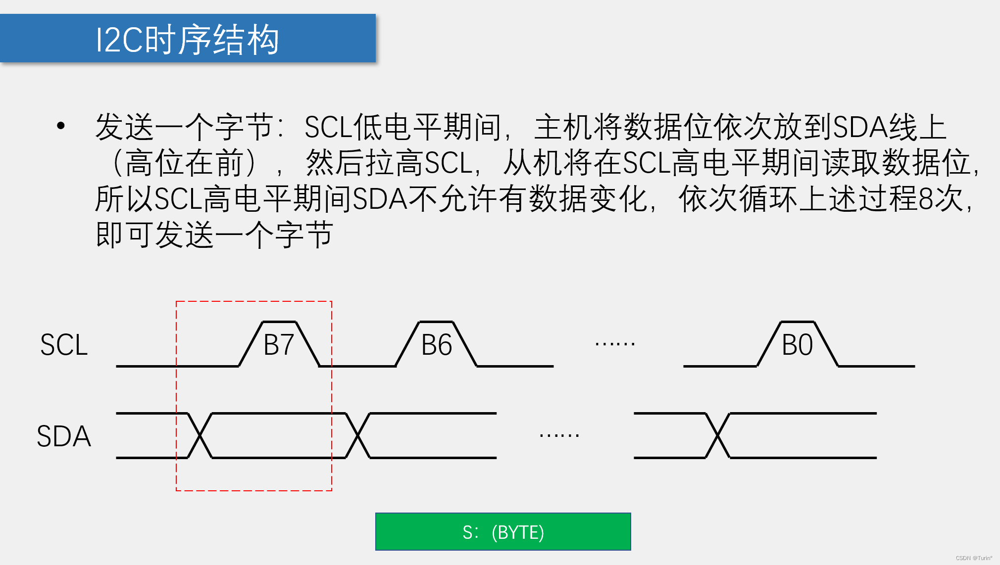

### 一、单片机通信基础概念

**全双工和半双工的区别：**

一、全双工（Full Duplex）通信允许数据在两个方向上同时传输，它在能力上相当于两个单工通信方式的结合。全双工指可以同时（瞬时）进行信号的双向传输（A→B且B→A）。指A→B的同时B→A，是瞬时同步的。

二、半双工（Half Duplex）数据传输指数据可以在一个信号载体的两个方向上传输，但是不能同时传输。

**MCU中常见的通信协议：**


### 二、推挽输出和开漏输出

**推挽输出：**

> 推挽输出结构是由两个MOS或者[三极管](https://so.csdn.net/so/search?q=三极管&spm=1001.2101.3001.7020)收到互补控制的信号控制，两个管子时钟一个在导通，一个在截止，如图1所示：


特点:

- 推挽输出可以输出高电平和低电平，在两种电平下都具有驱动能力。
- 相比于后面介绍的开漏输出，输出高电平时的驱动能力强很多
- 缺点：推挽输出不能实现" 线与"。

**开漏输出：**

> 常说的与推挽输出相对的就是开漏输出，抽象地说就是COMS反相器去掉了NMOS部分，PMOS管漏极输出，即开漏输出。PMOS管由高电平导通输出低电平，高电平没有驱动能力，需要借助“上拉电阻” (一般上拉电阻值较大，即弱上拉模式)[什么是弱上拉?](https://blog.csdn.net/monkey_d_xue/article/details/129802153)


##### **开漏输出的另一个优点在于可以实现"线与"功能，所谓的"线与"指的是多个信号线直接连接在一起，只有当所有信号全部为高电平时，合在一起的总线为高电平；只要有任意一个或者多个信号为低电平，则总线为低电平(这就是为什么后面用到IIC通信,当一个信号线为低电平,要"释放总线")。**

##### **而推挽输出就不行，如果高电平和低电平连在一起，会出现电流倒灌，损坏器件**

==**IIC为什么要开漏输出模式？**==

- 输出端浮空，电平易受外界干扰，不稳定

### 三、I2C总线介绍：

- I2C总线（Inter IC BUS）是由Philips公司开发的一种通用数据总线 
- 两根通信线：SCL（Serial Clock）、SDA（Serial Data） 
 - 同步、半双工，带数据应答 
- 通用的I2C总线，可以使各种设备的通信标准统一，对于厂家来说，使用成熟的方案可以缩短芯片设计周期、提高稳定性，对于应用者来说，使用通用的通信协议可以避免学习各种各样的自定义协议，降低了学习和应用的难度

### 四、I2C电路规范

- 所有I2C设备的SCL连在一起，SDA连在一起

- 设备的SCL和SDA均要配置成开漏输出模式

- SCL和SDA各添加一个上拉电阻，阻值一般为4.7KΩ左右

- 开漏输出和上拉电阻的共同作用实现了“线与”的功能，此设计主要是为了解决多机通信互相干扰的问题

### 五、I2C时序结构

---





---

**总结：IIC的 时序模块**

- 起始条件
- 中止条件
- 发送一个字节
- 接收一个字节
- 接收应答
- 发送应答


# 蓝桥杯相关

## IIC模块

```c
#include "iic.h"

#define DELAY_TIME 5
// I2C总线内部延时函数

void IIC_Delay(unsigned char i)
{
    do
    {
        _nop_();
    } while (i--);
}

// I2C总线启动信号
void IIC_Start(void)
{
    SDA = 1;
    SCL = 1;
    IIC_Delay(DELAY_TIME);
    SDA = 0;
    IIC_Delay(DELAY_TIME);
    SCL = 0;
}

// I2C总线停止信号
void IIC_Stop(void)
{
    SDA = 0;
    SCL = 1;
    IIC_Delay(DELAY_TIME);
    SDA = 1;
    IIC_Delay(DELAY_TIME);
}

//发送应答或非应答信号
void IIC_SendAck(bit ackbit)
{
    SCL = 0;
    SDA = ackbit;
    IIC_Delay(DELAY_TIME);
    SCL = 1;
    IIC_Delay(DELAY_TIME);
    SCL = 0;
    SDA = 1;
    IIC_Delay(DELAY_TIME);
}

//等待应答
bit IIC_WaitAck(void)
{
    bit ackbit;

    SCL = 1;
    IIC_Delay(DELAY_TIME);
    ackbit = SDA;
    SCL = 0;
    IIC_Delay(DELAY_TIME);
    return ackbit;
}

// I2C总线发送一个字节数据
void IIC_SendByte(unsigned char byt)
{
    unsigned char i;

    for (i = 0; i < 8; i++)
    {
        SCL = 0;
        IIC_Delay(DELAY_TIME);
        if (byt & 0x80)
            SDA = 1;
        else
            SDA = 0;
        IIC_Delay(DELAY_TIME);
        SCL = 1;
        byt <<= 1;
        IIC_Delay(DELAY_TIME);
    }
    SCL = 0;
}

// I2C总线接收一个字节数据
unsigned char IIC_RecByte(void)
{
    unsigned char i, da;
    for (i = 0; i < 8; i++)
    {
        SCL = 1;
        IIC_Delay(DELAY_TIME);
        da <<= 1;
        if (SDA)
            da |= 1;
        SCL = 0;
        IIC_Delay(DELAY_TIME);
    }
    return da;
}
```

### AD/DA转换模块

```c
unsigned char AD_Read(unsigned char addr)
{
    unsigned char temp;
    
    IIC_Start();       //主机发送开始信号
    IIC_SendByte(0x90); //主机发送寻址信号, 确认PCF8591，写模式
    IIC_WaitAck();      //主机等待应答
    IIC_SendByte(addr); //主机发送一个字节(要操作数据的地址),对应AD转换的通道
    IIC_WaitAck();      //主机等待应答
    
    IIC_Start();		 //主机发送开始信号
    IIC_SendByte(0x91); //主机发送寻址信号, 确认PCF8591，读模式
    IIC_WaitAck();		//主机等待应答
    temp = IIC_RecByte(); //从机送出数据,主机读入的数据用变量存储
    IIC_SendAck(1);		//主机发送应答,1表示完成数据的接收,从机停止发送数据
    IIC_Stop();			//中止信号,结束IIC通信
    return temp;
}

void DA_Write(unsigned char Data)
{
    IIC_Start();	//主机发送开始信号
    IIC_SendByte(0x90);//主机发送寻址信号, 确认PCF8591，写模式
    IIC_WaitAck();	//主机等待应答
    IIC_SendByte(0x41); //主机发送一个字节(要操作数据的地址),对应DA转换的通道
    IIC_WaitAck();	//主机等待应答
    IIC_SendByte(Data); //主机送出DA输出的数据字节
    IIC_WaitAck(); //主机等待应答
    IIC_Stop(); //中止信号,结束IIC通信
}
```

### AT24C02（EPPROM）模块

```c

void EEPROM_Write(unsigned char *EEPROM_String,unsigned char addr,unsigned char num)
{
	IIC_Start();//主机发送开始信号
    IIC_SendByte(0xA0);//主机发送寻址信号，确认EEPROM芯片，写模式
    IIC_WaitAck();//主机等待应答
    IIC_SendByte(addr);//发送一个要操作数据的地址字节,最好是八的倍数，如果不是8的倍数，将无法写入整页的字节
    IIC_WaitAck();//主机等待应答

    while(num--)//循环发送数据字节,存入AT24C02
    {
        IIC_SendByte(*EEPROM_String++);//发送数据字节,要存入AT24C02的数据,字节个数为num
        IIC_WaitAck();//主机等待应答
        IIC_Delay(200);//延时200ms,保证从机(AT24C02能够完整收到数据)
    }
    
    IIC_Stop();//终止IIC通信
}

void EEPROM_Read(unsigned char *EEPROM_String,unsigned char addr,unsigned char num)
{
    IIC_Start();//主机发送开始信号
    IIC_SendByte(0xA0);//主机发送寻址信号，确认EEPROM芯片，写模式
    IIC_WaitAck();//主机等待应答
	
    IIC_SendByte(addr);//发送一个要操作数据的地址字节
    IIC_WaitAck();//主机等待应答  

    IIC_Start();//主机发送开始信号
    IIC_SendByte(0xA1);//主机发送寻址信号，确认EEPROM芯片，读模式
    IIC_WaitAck();//主机等待应答	
	
    while(num--)//循环接收数据字节,存入EEPROM_String指向的地址
    {
        *EEPROM_String++=IIC_RecByte();//指针移位读取数据到对应的地址中
        if(num)//判断是否读取完数据
        {
            IIC_SendAck(0);//发送应答0,表示继续接收数据
        }
        else 
        {
            IIC_SendAck(1);//发送应答1,表示停止接收数据
        }
    }
    IIC_Stop();//终止IIC通信
}
```
