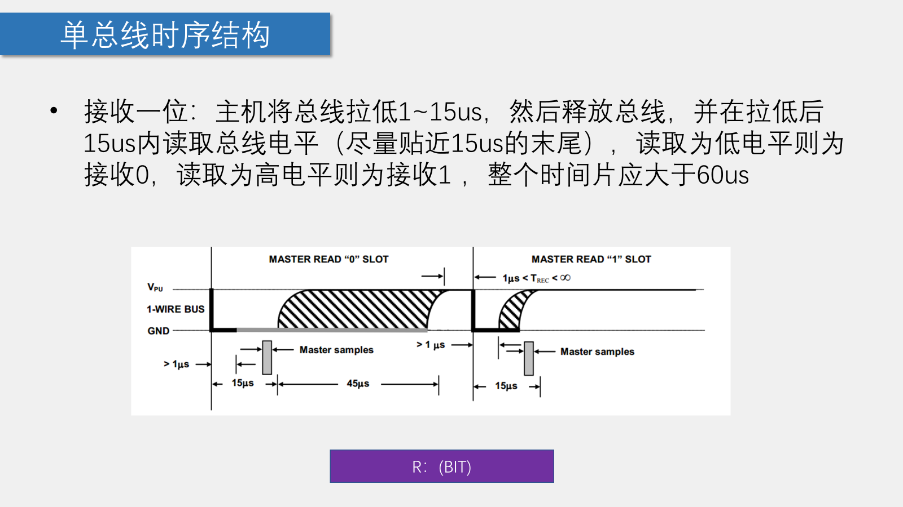

### 一、OneWire（单总线）协议

•单总线（1-Wire BUS）是由Dallas公司开发的一种通用数据总线

•一根通信线：DQ

•异步、半双工

•单总线只需要一根通信线即可实现数据的双向传输，当采用寄生供电时，还可以省去设备的VDD线路，此时，供电加通信只需要DQ和GND两根线

### 二、单总线电路规范

•设备的DQ均要配置成开漏输出模式

•DQ添加一个上拉电阻，阻值一般为4.7KΩ左右

•若此总线的从机采取寄生供电，则主机还应配一个强上拉输出电路


### 三、单总线的时序结构





---

# 蓝桥杯相关

## OneWire底层

```c
#include "onewire.h"
#include "reg52.h"

sbit DQ = P1^4;  

//单总线内部延时函数
void Delay_OneWire(unsigned int t)  
{
	t *= 12;
	while(t--);
}

//单总线写操作
void Write_DS18B20(unsigned char dat)
{
	unsigned char i;
	for(i=0;i<8;i++)
	{
		DQ = 0;
		DQ = dat&0x01;
		Delay_OneWire(5);
		DQ = 1;
		dat >>= 1;
	}
	Delay_OneWire(5);
}

//单总线读操作
unsigned char Read_DS18B20(void)
{
	unsigned char i;
	unsigned char dat;
  
	for(i=0;i<8;i++)
	{
		DQ = 0;
		dat >>= 1;
		DQ = 1;
		if(DQ)
		{
			dat |= 0x80;
		}	    
		Delay_OneWire(5);
	}
	return dat;
}

//DS18B20初始化
bit init_ds18b20(void)
{
  	bit initflag = 0;
  	
  	DQ = 1;
  	Delay_OneWire(12);
  	DQ = 0;
  	Delay_OneWire(80);
  	DQ = 1;
  	Delay_OneWire(10); 
    initflag = DQ;     
  	Delay_OneWire(5);
  
  	return initflag;
}
```


## DS18B20温度读取时序

```c
/*基于底层编写*/
float ds18b20_read(void)
{
	unsigned char low,high;//高八位，低八位，DS18B20温度数据是十六位二进制
	init_ds18b20();//ds18b20初始化时序
	Write_DS18B20(0xcc);//ds18b20跳过rom指令
	Write_DS18B20(0x44);//ds18b20开始温度转换
    
	init_ds18b20();//ds18b20初始化时序
	Write_DS18B20(0xcc);//ds18b20跳过rom指令
	Write_DS18B20(0xbe);//ds18b20开始温度读取
	low=Read_DS18B20();
	high=Read_DS18B20();
	return((high << 8 )| low) /16.0;
}
```

