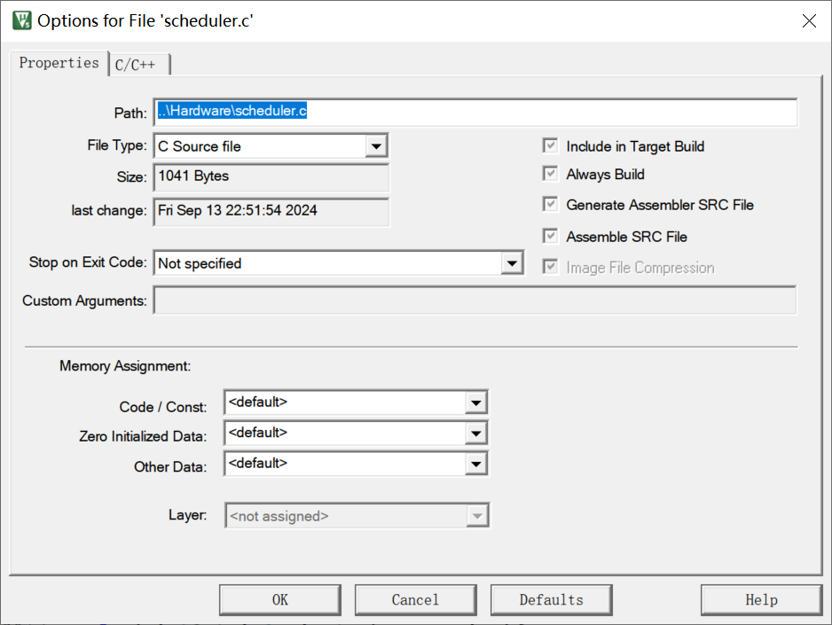
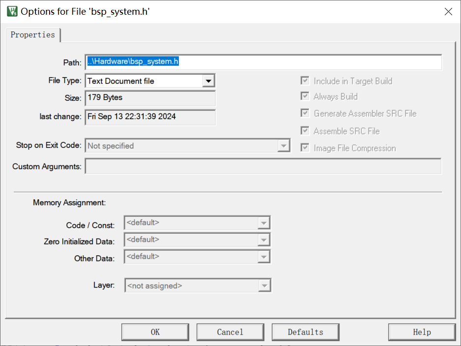
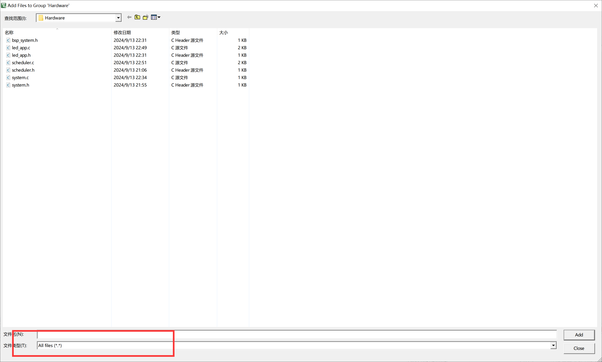

# Keil问题

## 编译报错问题1：

> *** Using Compiler 'V5.06 update 5 (build 528)', folder: 'D:\keil5\ARM\ARMCC\Bin' Build target 'Test_v2' FCARM - Output Name not specified, please check 'Options for Target - Utilities' Target not created. Build Time Elapsed:  00:00:00

原因：引入了错误的文件类型

解决方案：[keil错误和解决办法(1):FCARM - Output Name not specified, please check ‘Options for Target - Utilities‘_fcarm - output name not specified, please check 'o-CSDN博客](https://blog.csdn.net/Zhichao_Zhang/article/details/125893598)

注意：.c文件要配置为

.h文件要配置为

但是，只要导入的时候，选择All files，就不会出现文件类型引用错误。

