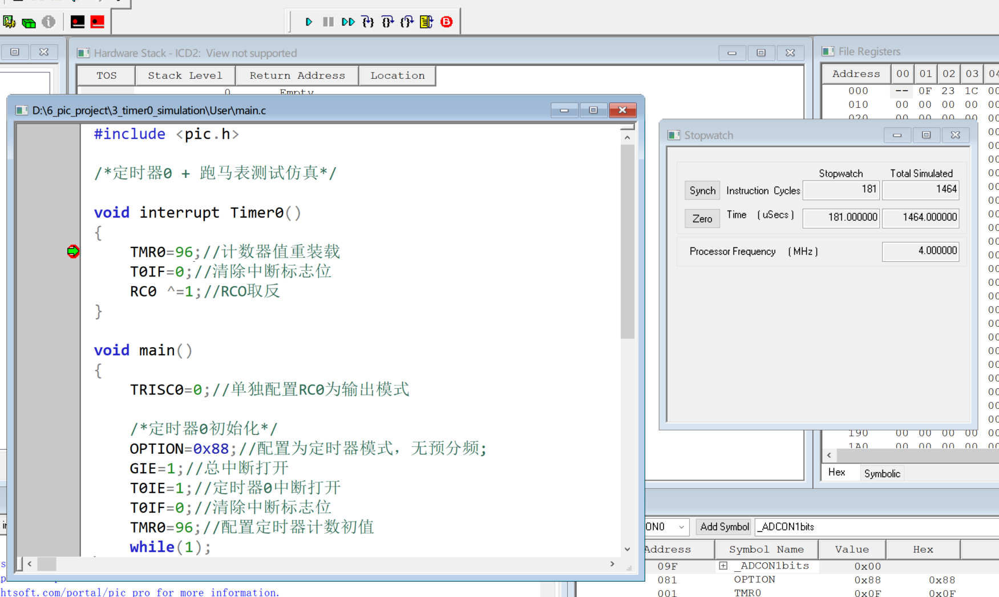
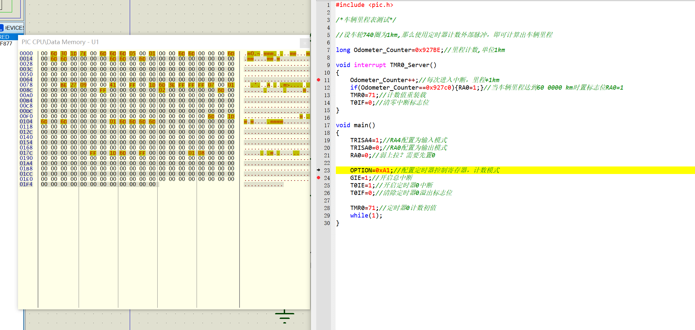
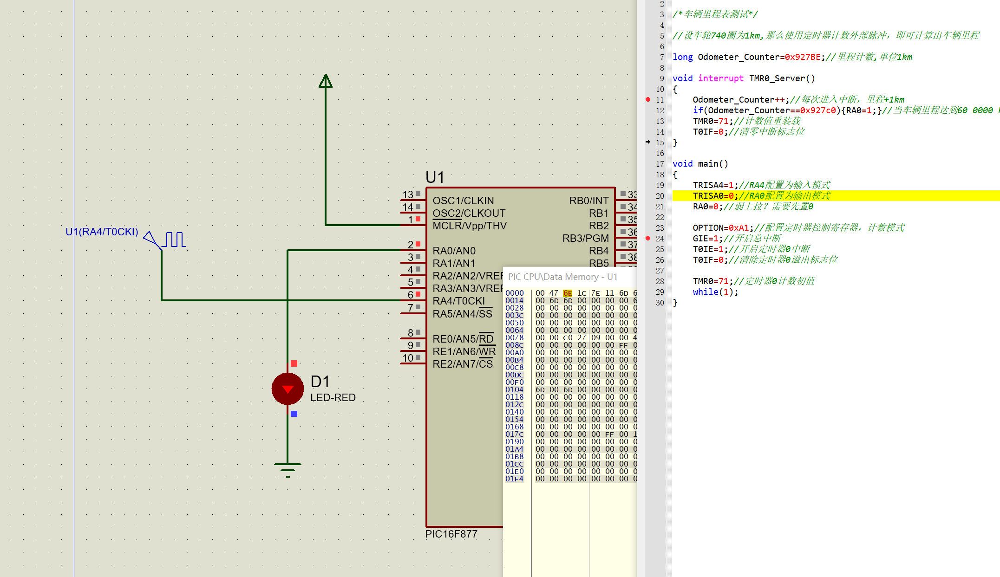

# 如何打开Stop Watch窗口？

>  **在DEBUG下选mplab sim后，再点DEBUGSETTING来设好频率，设好后点stopwatch**

# 跑马表仿真测试

==在中断**对应**的位置打上断点，点击仿真运行，即可通过跑马表查看每次进中断的运行时间==

# 车辆里程表

## proteus仿真

==可以通过工具栏**调试**选项==，查看各个所需的调试窗口，运行调试工具。

ps:**step into**可以跳过断点

第二次进中断，LED灯点亮

ps:**cof为仿真文件,hex为下载文件**
