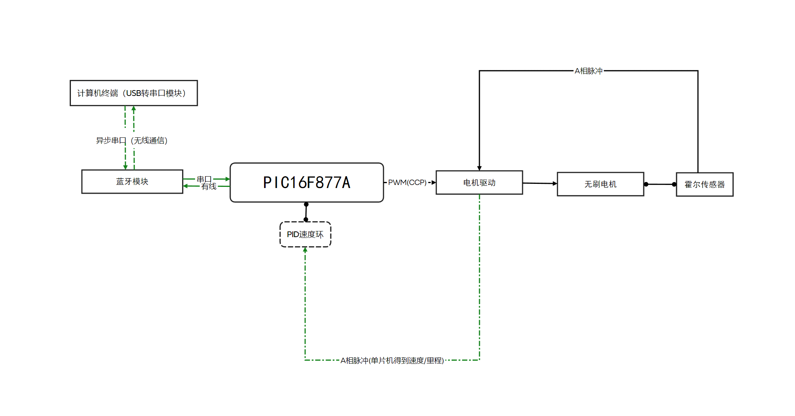
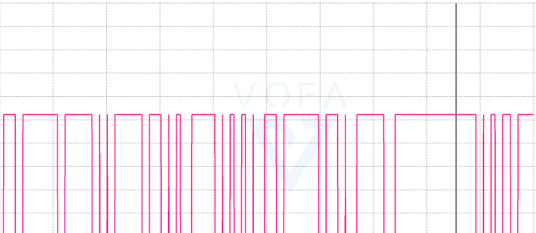
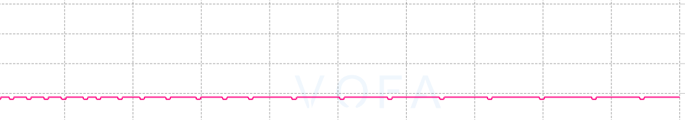
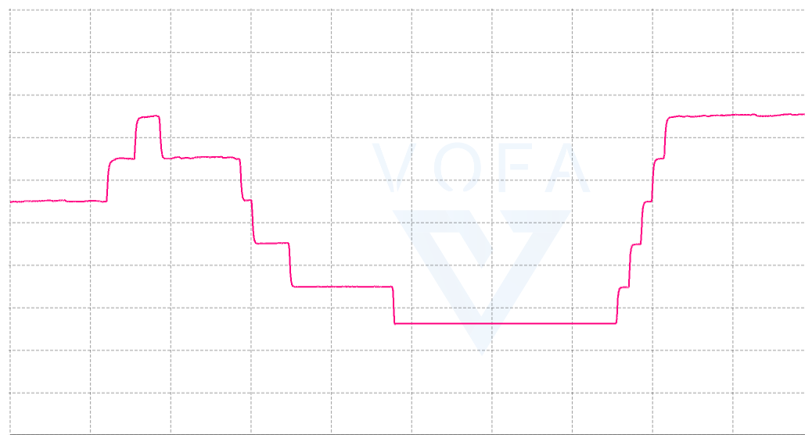
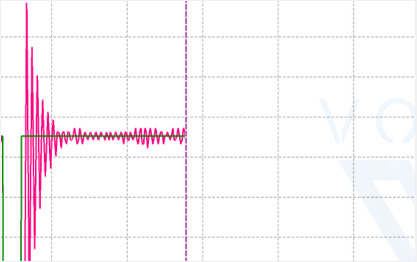
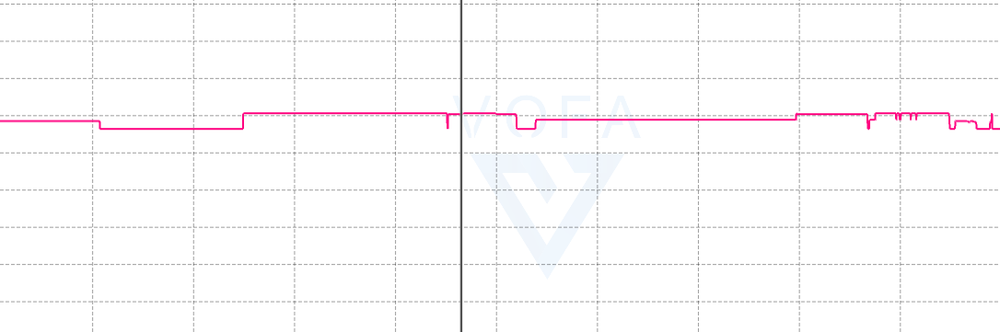

# 小车基本控制设计

## 一、前期系统分析与设计

​      在本次设计的前期准备工作中，通过对题目的分析，小车运动的精确低延迟控制+蓝牙通信都是相当重要的关键点。本次课程设计，使用电机型号为带霍尔传感器地无刷电机，能够通过内置编码器的A,B相固定输出390次/圈的脉冲，可以用于精准测量电机转速以及作为==车辆里程表==。因此，我基于所用电机的特性，利用PIC单片机CCP极其优秀的PWM输出功能，设计了一个易用的电机驱动程序，能够使得单片机输出频率10KHZ，占空比可调范围在0~100的PWM信号。对比于常规的使用定时器作为计时基准的方法，直接利用单片机设计好的电路外设模块，减轻了单片机==程序==上消耗的资源，也大幅提高了后续小车的运动性能以及稳定性。重要的一点是，基于对自动控制原理的粗略学习，我们可以利用本次电机所带的编码器模块，实现**单片机测速——程序PID控制器——输出PWM波**的一个PID自动控速系统以及能够精准记录脉冲数的**车辆里程表（这在后面进行内外圈转向时发挥了关键的作用）**，同时，蓝牙模块也是一个极其便捷的工具，使用两片蓝牙模块，分别连接单片机和计算机，在一些串口助手软件上，能够迅速实现基于上位机的参数检测以及调试系统。

注：本次设计的串口助手为VOFA，可以兼容所有串口调试的基本功能，能够根据数值的大小显示波形。

### 设计框图：蓝牙控速小车

**基于上述程序的编写以及小车板块的搭建，首先设计一个可以通过计算机或者手机终端等设备进行蓝牙遥控的小车运动系统。本次课程设计我们基于实验以及课程的理论经验，从搭建==底层框架==再到完成其余功能要求的设计思想，分阶段、板块完成设计，更有利于后面的高效分工与调试。**



## 1.电机驱动程序设计

**问题1：PWM输出**

​	常见的8位单片机（stc89c52），产生PWM，通常是利用到定时器模块，以定时器计时为基准（时间基准t1，假设为1ms），程序上定义计时变量time(每次进定时器中断time自加1)、周期时间变量T（假设T=100）、占空比时间变量N（假设N=50），然后通过IF语句判断，翻转设定的引脚（假设为RC1）输出PWM方波信号。但是考虑到如果使用定时器，如果定时器的计数寄存器（计时溢出周期）设置过小，程序会频繁进入中断，不利于其他部分程序的执行，占用了软件上的资源；如果定时器计时周期设置的太大，比如10ms，又想输出一个可调范围0~100的PWM，那么PWM方波信号的周期就高达1s，PWM频率仅仅只有1HZ，这样就会使得电机无法正常驱动或者运动过程有明显的卡顿（PWM分辨率过低）。而本次使用的PIC16F877A单片机，具备CCP1+CCP2模块，能够通过配置寄存器，硬件自动生成两路的PWM信号，节省了软件资源，并且PIC单片机的CCP模块生成的PWM方波相当的精准可靠，在完成CCP模块PWM模式的初始化后，只需要修改CCP1L/CCP2L的值即可修改PWM（RC6、RC7）的占空比。

---

电机驱动模块子程序设计

```c
#include <pic.h>

#define Motor_PWM_A RC2
#define Motor_PWM_B RC1
#define Motor_LogicA_1 RB4
#define Motor_LogicA_2 RB5
#define Motor_LogicB_1 RB6
#define Motor_LogicB_2 RB7

unsigned char Speed_measure1;
unsigned char Speed_measure2;

/*
	函    数	
	参    数	要写入的命令
	返 回 值	无
	特殊说明	无
*/
void Motor_GPIO_Init()
{
	TRISB4=0;
	TRISB5=0;
	TRISB6=0;
	TRISB7=0;
	TRISC1=0;
	TRISC2=0;
}

void Motor_CCP_PWM_Init()
{
	/*定义CCP1工作在PWM模式*/
	CCP1CON=0X0C;//定义CCP1模块工作在PWM模式
	CCPR1L=50;//定义脉宽为50us
	PR2=100;
	
	/*定义CCP2工作在PWM模式*/
    CCP2CON = 0x0c; // 配置CCP2为PWM模式
    CCPR2L = 50;          // 设置CCP2 PWM占空比（高位）
    	
    /*与CCP模块PWM模式配合的TMR2*/
	T2CON=0;//定义TM2模块工作在预、后分频比都是1:1的定时器模式
	TMR2=0;
	TMR2ON=1;//启动TMR2，此刻从RC2引脚输出所设的波形		
}

void Motor_Speed_Set(int Speed1,int Speed2)
{
	if(Speed1 > 0 )
	{
		Motor_LogicA_1 = 1;
		Motor_LogicA_2 = 0;
		CCPR1L=(unsigned char)Speed1;
	}
	else
	{
		Motor_LogicA_1 = 0;
		Motor_LogicA_2 = 1;
		CCPR1L=(unsigned char)(-Speed1);
	}
	
	if(Speed2 >0 )
	{
		Motor_LogicB_1 = 1;
		Motor_LogicB_2 = 0;
		CCPR2L=(unsigned char)Speed2;
	}
	else
	{
		Motor_LogicB_1 = 0;
		Motor_LogicB_2 = 1;
		CCPR2L=(unsigned char)(-Speed2);		
	}	
}
```

---

**问题2：测速**

==**通过外部中断配合定时器1测速**==

​	我们可以按照实验课中的方法，使用定时器1和外部中断配合设计测速系统，通过检测信号跳变，配合定时器1的TMR1ON控制启停，计算电平的持续时间，这样就能测量PWM的占空比。但是，通过对本次课程设计电机模块的分析以及学习（本次设计为无刷电机==(注意固定螺丝不能太长会磨损电机减速箱)==，并且自带霍尔编码器）

​	霍尔编码器：通过霍尔传感器感应电机转过的次数，相应的，在本次设计中使用的电机模块，转动一圈产生390个脉冲。直接使用实验五的方法，通过串口调试助手打印测得速度，发现速度是不连续的（此图出现如290km/h 71km/h 15 km/h等速度）。因为如果要使用霍尔传感器，它的脉冲实际上不是代表的PWM，只有通过记录编码器输出的脉冲次数才能实现单位时间内小车的速度/里程计算。



---

==**采用外部中断计数的方法测速，如下图**==

**我们改用定时器0（50ms为计数周期)，外部中断（测量电机驱动输出的编码器脉冲计数），这样就能轻而易举地计算出50ms内地脉冲数目，进而进行速度的精准测量+里程的累计。**

可见，直接通过计算脉冲次数的方法，速度的测量基本无波动（横坐标表示50ms时间内的脉冲计数,此图位48-49范围内波动，基本无误差）。



---

**子函数设计**

```c
#include <pic.h>

#define Motor_PWM_A RC2
#define Motor_PWM_B RC1
#define Motor_LogicA_1 RB4
#define Motor_LogicA_2 RB5
#define Motor_LogicB_1 RB6
#define Motor_LogicB_2 RB7

unsigned char Speed_measure1;
unsigned char Speed_measure2;

/*
	函    数	
	参    数	要写入的命令
	返 回 值	无
	特殊说明	无
*/
void Motor_GPIO_Init()
{
	TRISB4=0;
	TRISB5=0;
	TRISB6=0;
	TRISB7=0;
	TRISC1=0;
	TRISC2=0;
}

void Motor_CCP_PWM_Init()
{
	/*定义CCP1工作在PWM模式*/
	CCP1CON=0X0C;//定义CCP1模块工作在PWM模式
	CCPR1L=50;//定义脉宽为50us
	PR2=100;
	
	/*定义CCP2工作在PWM模式*/
    CCP2CON = 0x0c; // 配置CCP2为PWM模式
    CCPR2L = 50;          // 设置CCP2 PWM占空比（高位）
    	
    /*与CCP模块PWM模式配合的TMR2*/
	T2CON=0;//定义TM2模块工作在预、后分频比都是1:1的定时器模式
	TMR2=0;
	TMR2ON=1;//启动TMR2，此刻从RC2引脚输出所设的波形		
}

void Motor_Speed_Set(int Speed1,int Speed2)
{
	if(Speed1 > 0 )
	{
		Motor_LogicA_1 = 1;
		Motor_LogicA_2 = 0;
		CCPR1L=(unsigned char)Speed1;
	}
	else
	{
		Motor_LogicA_1 = 0;
		Motor_LogicA_2 = 1;
		CCPR1L=(unsigned char)(-Speed1);
	}
	
	if(Speed2 >0 )
	{
		Motor_LogicB_1 = 1;
		Motor_LogicB_2 = 0;
		CCPR2L=(unsigned char)Speed2;
	}
	else
	{
		Motor_LogicB_1 = 0;
		Motor_LogicB_2 = 1;
		CCPR2L=(unsigned char)(-Speed2);		
	}	
}
```

- 电机的速度计算准确后，通过我们对自动控制原理的学习了解，或许可以应用一些简单的算法，进行小车的速度闭环负反馈控制？

### 3.串口通信初始化

```c
#include <pic.h>
#include <stdio.h>
unsigned char recv_data;

//putch 重定向
void putch(unsigned char ch)
{
    TXREG=ch;
    while(TRMT==0);
}

/*??????????*/
void Serial_PrintString(unsigned char *String)
{
	while(*String != '\0')
	{
		printf("%c",*String++);
	}
}

/*串口引脚初始化*/
void Usart_GPIO_Init(void)
{
	TRISC6=1;
	TRISC7=1;
}

/*串口初始化*/
void Usart_Init(void)
{

    SPBRG=12;//波特率设置为19200
    TXSTA=0B00100100;//异步模式。发送8位数据，允许发送
    RCSTA=0B10010000;//允许串口工作，连续接收使能，接收8位数据
    GIE=1;PEIE=1;RCIE=1;//开放USART接收中断

}
```

将连接单片机的蓝牙模块配置为主机模式，连接计算机的蓝牙模块配置为从机模式，并且两片蓝牙的密码设置为一致，波特率与单片机、电脑串口助手都设置为19200。这样，单片机就能够发送数据到串口助手，串口中断打印出数据/波形，实现远程调参效果。

### PID控速的尝试与应用

1.给定占空比

​	通过修改CCP1L和CCP2L的值，可以实现指定PWM占空比的电机变速效果，通过串口助手显示编码器测速的波形，发现给定PWM的速度也是比较稳定的。



2.PID控速

​	编写PID速度环控制子程序，将速度测量值以及速度目标值作为输入，返回值为PID的输出值，作为PWM的输出，形成闭环反馈系统。经上位机显示速度波形，测量速度（红线）能够逐渐趋近于目标速度（绿线），说明PID速度闭环的程序是正确的，后面对各个参数（Kp、Ki、Kd）进行优化，减少过充现象，增大反应速度，提高PID速度闭环系统的抗干扰能力。



​	经过我们后面对PIC16F877A的引脚分配，发现它能够进行速度测量的引脚基本上只能使用外部中断，CCP模块以及被用作PWM输出，那么PID控速的想法就暂时被搁置了。但是，我们后面将编码器的脉冲输入作为车辆里程表，也可以实现灵活度更高的功能（内外圈转向区分）。

# 灰度巡线PID - 数学模型解决工程问题




**头文件定义/变量定义**

```c
#include <pic.h>//PIC库
__CONFIG(0xFF29);//配置起始位
#include <stdio.h>//C语言库

/*PIC单片机驱动相关子函数*/
#include "..\..\Driver\LCD1602.H"//LCD1602子函数
#include "..\..\Driver\KeyBoard.H"//按键子函数
#include "..\..\Driver\iic.H"//iic通信
#include "..\..\Driver\Motor.H"//电机驱动
#include "..\..\Driver\Usart.H"//串口（蓝牙）通信
#include "..\..\Driver\Led.H"//Led
#include "..\..\Driver\Encoder.H"//霍尔编码器测速
#include "..\..\Driver\PID.H"//PID控制程序
#include "..\..\Driver\csb.H"//超声波控制程序

/*PIC单片机系统相关子函数*/
#include "..\..\System\Timer.H"//定时器初始化程序
#include "..\..\System\Delay.H"//延时子程序

unsigned char bluetooth;//蓝牙接收字节存储变量

/*外部中断测速*/
unsigned int Counter_temp;//车辆旋转圈数计数变量
unsigned int Timer0_Counter;//定时器0溢出计数变量
unsigned int Encoder_Counter;//脉冲计数


/*循迹控制主要变量*/
unsigned char Motor_Flag;//电机允许模式
unsigned char Turn_PWM;//转向PWM，由循迹PID控制函数输出赋值
unsigned char Trace_Byte;//八路循迹对应一个字节
unsigned char Speed_left,Speed_right;//寻线速度77y89-
unsigned char Speed_Velcolity=33;//直行速度
unsigned char IO_flag=0;//（90度转向）启停标志位
unsigned char Circle_Mode=0;//车辆运行模式
unsigned char Start_Find_flag=0;//脉冲计数标志位
unsigned char Bifurcate_Flag=0;//分叉路口标志位，0表示第一个，1表示第二个
unsigned char Stop_Flag=0;//停车标志位
unsigned char Trace_Mode=0;//八路循迹状态
unsigned int distance;//超声波距离
unsigned char BT_State=0;//蓝牙通信状态机，无线调参

unsigned char csb_Flag=0;

unsigned char NQ_fast_Flag=0;
/*//循迹工作验证函数
unsigned char yz[8]={0};
unsigned char mod;
void yanzheng()
{ 
	unsigned char temp = mod;
	for(int i=0;i<8;i++)
	{
		yz[i] = temp %2;
		temp/=2;
	}	
}
*/
```

**模块验证函数**

```c
/*//循迹工作验证函数
unsigned char yz[8]={0};
unsigned char mod;
void yanzheng()
{ 
	unsigned char temp = mod;
	for(int i=0;i<8;i++)
	{
		yz[i] = temp %2;
		temp/=2;
	}	
}
*/
```


**循迹控制函数**

```c
unsigned char Trace_Byte;

float Kp=3.2;
int Kd=0;
static int turn_err;
static int last_err;
static int err_difference;

int Trace_PID()
{	
	Trace_Byte = (RC0<<7|RC3<<6|RE0<<5|RE1<<4|RE2<<3|RA4<<2|RC4<<1|RC5);
	
	switch(Trace_Byte)
	{
		//直行
		case 0B11100111: 
			turn_err=0;
			break;
		case 0B11110111:
			turn_err=-1;
			break;
		case 0B11101111:
			turn_err=1;
			break;
		//左转
		case 0B11001111:
			turn_err=2;
			break;
		case 0B11011111:
			turn_err=3;
			break;
		case 0B10011111:
			turn_err=4;
			break;
		case 0B10111111:
			turn_err=5;
			break;
		case 0B00111111:
			turn_err=6;
			break;
		case 0B01111111:
			turn_err=7;
			break;

		//右转
		case 0B11110011:
			turn_err=-2;
			break;
		case 0B11111011:
			turn_err=-3;
			break;
		case 0B11111001:
			turn_err=-4;
			break;
		case 0B11111101:
			turn_err=-5;
			break;
		case 0B11111100:
			turn_err=-6;
			break;
		case 0B11111110:
			turn_err=-7;
			break;	
	}
	
	err_difference= turn_err - last_err;
	
	last_err= turn_err;
	
	return (int)(turn_err*Kp + err_difference*Kd);
}
```

**路线控制函数**

```c
void Trace_Control()
{
		if(Circle_Mode == 0)//起始点
		{
			Motor_Speed_Set(Speed_Velcolity,Speed_Velcolity);
			
			if(Start_PD() == 1)//起始线扫描判断
			{	
				Start_Find_flag = 1;//脉冲计数标志位
			}
			
			if(Encoder_Counter >550)//固定距离，越过黑线
			{
				Start_Find_flag = 0;
				Encoder_Counter=0;
				Circle_Mode = 1;
			}
		}	
		else if(Circle_Mode == 1)//第一圈，外圈
		{
			if(Start_PD() == 1)//起始线扫描判断
			{
				Start_Find_flag =1;
			}
			
			if(Start_Find_flag == 1)
			{
				Speed_Velcolity=35;
				Motor_Speed_Set(Speed_Velcolity,Speed_Velcolity);
				if(Encoder_Counter > 200)//固定里程前进一段
				{
					csb_Flag=1;
					IO_flag = 1;
					Encoder_Counter=0;
					Circle_Mode = 2;//内圈
				}					
			}
			else//正常巡线
			{	
				Turn_PWM = Trace_PID();
				Speed_left = Speed_Velcolity - Turn_PWM;
				Speed_right = Speed_Velcolity + Turn_PWM;
				Motor_Speed_Set(Speed_left,Speed_right);					
			}
		}
		else if(Circle_Mode == 2)//第二圈，内圈
		{
			if(IO_flag == 0)//正常巡线
			{
				if(Start_PD() == 1)//起始线扫描判断
				{
					//putch(3);//进入第三圈
					Start_Find_flag = 1;
					
				}

				if(Start_Find_flag == 1  && NQ_fast_Flag == 0)//开启计脉冲且，内圈没有加速
				{
					Motor_Speed_Set(Speed_Velcolity,Speed_Velcolity);
					if(Encoder_Counter > 300)//固定里程前进一段
					{
						Speed_Velcolity=35;
						Start_Find_flag = 0;
						IO_flag = 0;
						Encoder_Counter=0;
						Circle_Mode = 3;
						csb_Flag= 0;
					}					
				}
				else//正常巡线
				{
					if(NQ_fast_Flag)//开启内圈加速
					{
						if(Encoder_Counter > 800)//固定里程前进一段
						{
							csb_Flag=1;
							NQ_fast_Flag = 0;
							Start_Find_flag = 0;
							Encoder_Counter=0;
							Speed_Velcolity=35;//回归
						}						
					}
					
					Turn_PWM = Trace_PID();
					Speed_left = Speed_Velcolity - Turn_PWM;
					Speed_right = Speed_Velcolity + Turn_PWM;
					Motor_Speed_Set(Speed_left,Speed_right);					
				}
			}	
			else//内圈固定转向
			{
				Motor_Speed_Set(20,60);
				if(Encoder_Counter > 320)
				{
					csb_Flag=1;
					NQ_fast_Flag = 1;
					IO_flag = 0;
					Speed_Velcolity+=3;
				}
					
			}
		}
		else if(Circle_Mode == 3)//第三圈，外圈
		{
			if(Start_PD() == 1)//起始线扫描判断
			{
				Start_Find_flag = 1;			
				Stop_Flag=1;
			}
				
			if(Stop_Flag == 1)
			{
				putch(0x08);
				Motor_Speed_Set(0,0);//停车
			}
			else//正常巡线
			{
				Turn_PWM = Trace_PID();
				Speed_left = Speed_Velcolity - Turn_PWM;
				Speed_right = Speed_Velcolity + Turn_PWM;
				Motor_Speed_Set(Speed_left,Speed_right);					
			}
		}
}
```

