# # 前言

## 一、红外通信系统

### 二、红外调制解调的原理

- 空闲状态：红外LED不亮，接收头输出高电平
- 发送低电平：红外LED以38KHz频率闪烁发光，接收头输出低电平
- 发送高电平：红外LED不亮，接收头输出高电平
  总而言之，只有红外LED发送38KHZ的闪烁信号时，红外接收头OUT引脚才会对外输出低电平信号
  红外发送--红外接收的本质是==调制==和==解调==，在这种条件下，可以过滤掉自然界中的“噪声信号”，只有38KHZ附近的红外信号才能被红外接收头识别转换为对应的低电平。

**转换示意图：**
1.红外LED发出的信号

2.红外接收头发出的信号
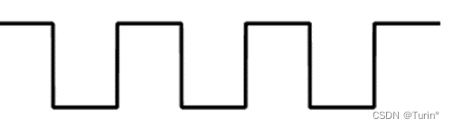
其中，红外接收头发出的低电平信号的宽度等价于红外LED发送的38KHz信号的时间。

# 一、基于CCP1输入捕获模式的解调电路

## 1. Proteus生成基带信号

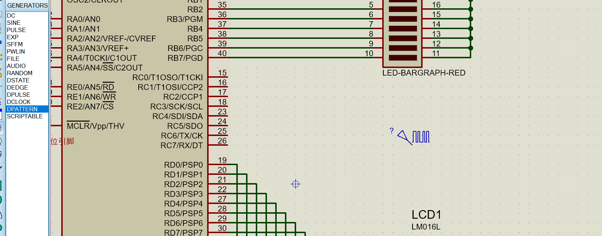

### 1.1脉冲最小单位

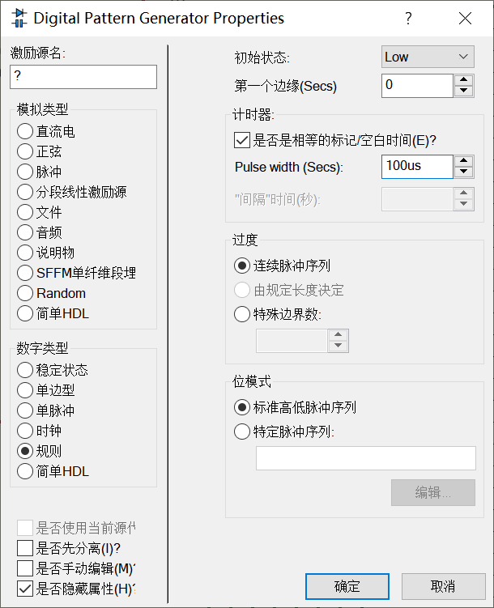

### 1.2特定脉冲序列

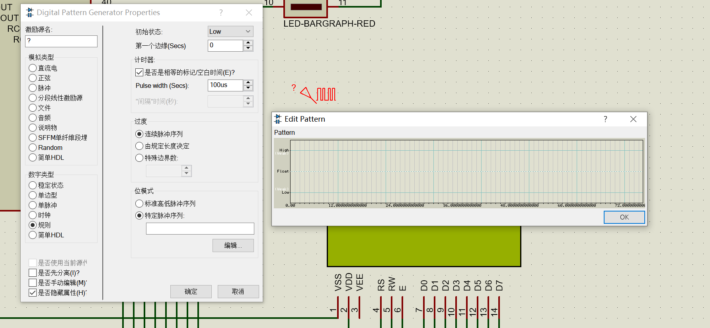

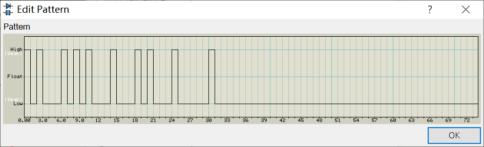

**从左往右表示数据从高位到低位，如图所示为01001101**

### 1.3仿真结果

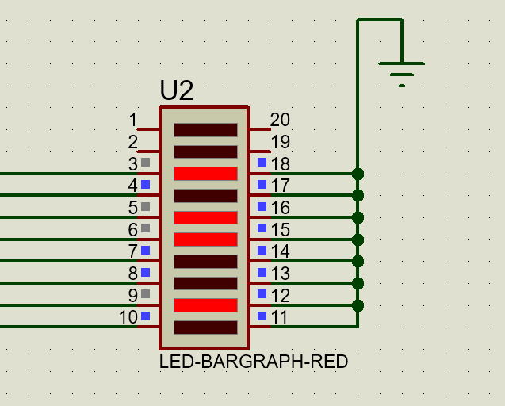

**代码部分**

```c
#include <pic.h>

char B;//接收数据储存变量

/*输入捕获模式接收信号跳变*/
void interrupt ccp1_int()
{
	CCP1IF = 0;
	if(CCP1M0 == 0)//本次接收信号为下跳变
	{
		TMR1H=0;TMR1L=0;
		CCP1CON=0X05;
		CCP1IF=0;
	}
	else//本次接收信号为上跳变
	{	
		CCP1CON=0X04;
		CCP1IF=0;
		if(CCPR1L > 0 && CCPR1H == 0X00){B=B<<1;}			//'0'
		if(CCPR1L < 0X50 && CCPR1H == 0X01){B=B<<1;B=B+1;}  //'1'
		if(CCPR1L > 0XA0 && CCPR1H == 0X01){PORTB = B;}  	//结束信号，电平宽度匹配时表示完整接收到1Byte数据
	}
}

void main()
{
	CCPR1H=CCPR1L=0;
	INTCON=0;
	PIR1=0;PIR2=0;
	PIE1=0;PIE2=0;//清空寄存器
	TRISC=0X04; // C口定义为输出口，只定义RC2/CCP1作为输入
	CCP1IE=1;T1CON=0;PEIE=1;GIE=1;//中断相关寄存器配置
	PORTC = 0X80;
	CCP1CON=0X04;		//CCP1设置为捕捉模式，捕捉下降沿
	B=0;TRISB=0; PORTB=0X22;
	TMR1ON=1;//开启定时器
	while(1);
}
```


# 二、基于CCP1输出比较模式的基带信号生成电路

## 1.MPALB波形显示窗口，显示RC2产生的基带信号

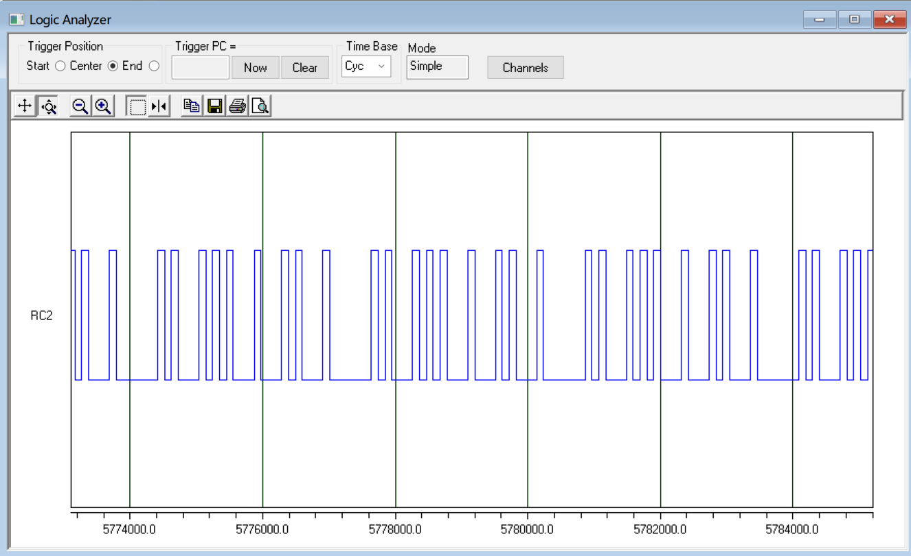

## 2.代码解释

**CCP1模块每次发送1位二进制的负脉冲宽度，每次循环从data左移一位。PIC单片机C语言循环移位语句用汇编语句asm("rlf _data,f")，每次将最高位移入CARRY寄存器中，以最高的程序执行效率进行数据移位并生成基带信号的操作，并且每次发送1位二进制负脉冲宽度之后，会发送1位同步头的正脉冲宽度。发送完所有二进制数据之后，发送1位结束头低电平宽度**

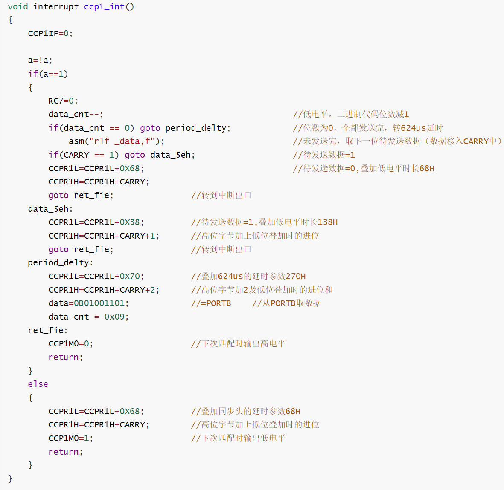

**代码部分**

```c
#include <pic.h>
__CONFIG(0xFF29);

char data,data_cnt;//发送的二进制代码，代码长度
char IR_SendSelect;
bit a;

void interrupt ccp1_int()
{
	CCP1IF=0;
	
	a=!a;
	if(a==1)
	{
		RC7=0;
		data_cnt--;										//低电平。二进制代码位数减1
		if(data_cnt == 0) goto period_delty;			//位数为0，全部发送完，转624us延时
			asm("rlf _data,f");							//未发送完，取下一位待发送数据（数据移入CARRY中）
		if(CARRY == 1) goto data_5eh;					//待发送数据=1
		CCPR1L=CCPR1L+0X68;								//待发送数据=0,叠加低电平时长68H
		CCPR1H=CCPR1H+CARRY;
		goto ret_fie;				//转到中断出口
	data_5eh:
		CCPR1L=CCPR1L+0X38;			//待发送数据=1,叠加低电平时长138H
		CCPR1H=CCPR1H+CARRY+1;		//高位字节加上低位叠加时的进位
		goto ret_fie;				//转到中断出口
	period_delty:
		CCPR1L=CCPR1L+0X70;			//叠加624us的延时参数270H
		CCPR1H=CCPR1H+CARRY+2;		//高位字节加2及低位叠加时的进位和
		data=0B01001101;			//=PORTB 	//从PORTB取数据
		data_cnt = 0x09;
	ret_fie:
		CCP1M0=0;					//下次匹配时输出高电平
		return;
	}
	else
	{
		CCPR1L=CCPR1L+0X68;			//叠加同步头的延时参数68H
		CCPR1H=CCPR1H+CARRY;		//高位字节加上低位叠加时的进位
		CCP1M0=1;					//下次匹配时输出低电平
		return;
	}
}


void main()
{
	nRBPU=0;						//启用RB弱上拉
	TRISB=0xFF;						//作输入口
	TRISC2=0;						//C口定义为输入口，只定义RC2作为输出
	CCP1IE=1;T1CON=0;PEIE=1;GIE=1;	//设置预分频比为 = 1:1,开中断
	data_cnt = 0x09;				//每组数据位数=9 - 1 = 8 .因为子程序是减1后判断
	CCP1CON = 0X08;					//CCP1设为匹配时令CCP1/RC2引脚输出高电平
	TMR1ON=1;						//启动TMR1
	data = 0B01001101;				//=PORTB;从PORTB取数据
	while(1);
}
```


# 三、将基带电路与调制电路配合，组成简易的红外通信系统

**如图所示，因为RC2输出的红外基带信号带有毛刺，所以这里改为RC7引脚输出基带信号，这样，就能组成一个完整的红外发送-接收系统，运行仿真，此时红外接收端的LED同与发送端PORTB的逻辑**

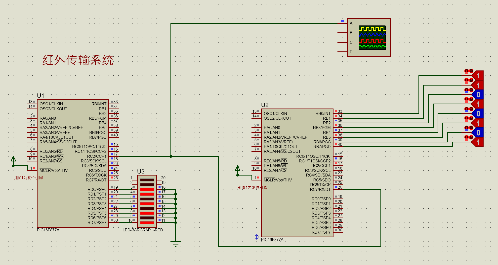


# 四、配合CCP1输出比较和CCP2 PWM输出模式，构成载波-调制信号

**MPLAB仿真观测调制信号，与原基带信号进行对比，验证代码现象**

**调制信号在图像上有些地方在同步头结束后为高电平，但在经过红外发送管之后，发送的信号依然对应者基带信号的波形，所以实际上并没有影响**

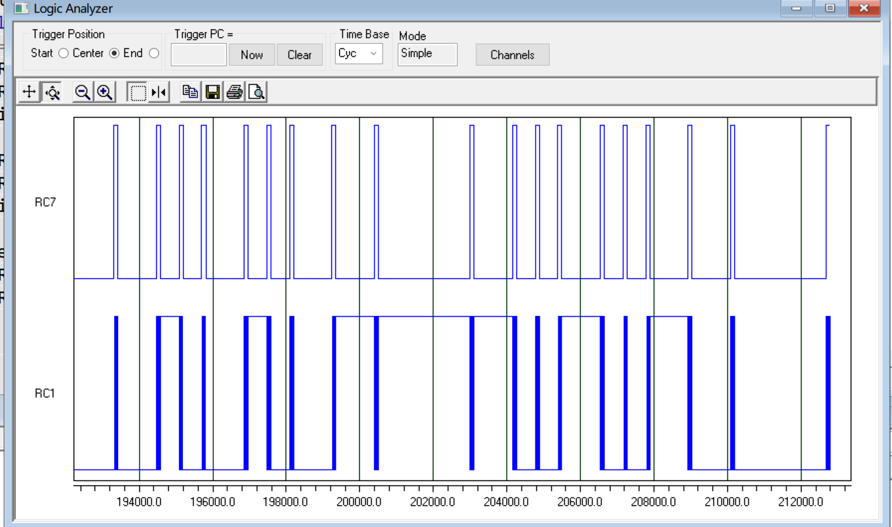


# 五、实物测试部分

## 1.红外二极管收发

### ==使用电压表测试红外接收管压降==

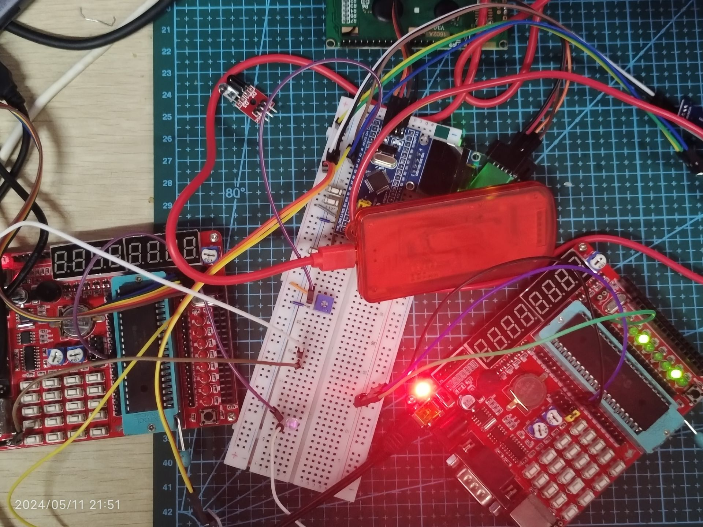

## 2.测试红外接收模块是否能被触发

- ==**首先测试能否顺利进入中断，用PIC板载LED进行观测，每次进入中断，代表接收到一次38KHZ的红外信号，同时PIC板的八位LED进行取反闪烁**==

```c
#include <pic.h>

char B;
void interrupt ccp1_int()
{
	CCP1IF = 0;
	PORTD^=0xFF;
	/*
	if(CCP1M0 == 0)
	{
		TMR1H=0;TMR1L=0;
		CCP1CON=0X05;
		CCP1IF=0;
	}
	else
	{	
		CCP1CON=0X04;
		CCP1IF=0;
		if(CCPR1L > 0 && CCPR1H == 0X00){B=B<<1;}			//'0'==0x685
		if(CCPR1H == 0X01){B=B<<1;B=B+1;}  					//'1'==0x12C
		if(CCPR1H == 0X02){PORTD = B;}  						//结束信号==0x270
	}
	*/
}

void main()
{
	CCPR1H=CCPR1L=0;
	INTCON=0;
	PIR1=0;PIR2=0;
	PIE1=0;PIE2=0;
	TRISC=0X04; // C口定义为输出口，只定义RC2/CCP1作为输入
	CCP1IE=1;T1CON=0;PEIE=1;GIE=1;
	PORTC = 0X80;
	CCP1CON=0X04;		//CCP1设置为捕捉模式，捕捉下降沿
	B=0;TRISD=0; PORTD=0X22;
	TMR1ON=1;
	while(1);
}
```

## 3.仿真软件测量接收信号时，选定捕捉每个bit数据的范围

### 3.1 程序调试，使得红外传输系统更加精确稳定

==**虽然在红外调制电路代码中，我们指定了每个二进制数据，停止位，起始位的电平长度，但是，因为程序设计以及单片机响应速度的原因，我们并不知道它最终生成信号各个部分的电平宽度具体值，如果将编写好的程序直接拿来用，可能得不到任何想要的现象。因此，要通过测量红外解调电路实际获取到的各个二进制电平的长度（通过LCD1602显示），然后再修改程序，使得红外接收单片机能够稳定接收红外发送单片机发送的信号。**==


**下面为用于测试接收端接收到各个bit数据电平宽度的代码，如：控制发送端发送的数据为0x00，然后接收端这边进行对'0'的电平宽度测量，显示在LCD1602上，其他任意宽度的bit位也是同理**

```c
#include <pic.h>
#include "..\Driver\LCD1602.h"

char B;
int Time_Data;

void interrupt ccp1_int()
{
	CCP1IF = 0;
	//PORTD^=0xFF;

	
	if(CCP1M0 == 0)//本次捕捉下降沿
	{
		TMR1H=0;TMR1L=0;
		CCP1CON=0X05;
		CCP1IF=0;
	}
	else
	{	
		CCP1CON=0X04;
		CCP1IF=0; Time_Data = CCPR1H << 8 | CCPR1L;
		if(CCPR1L > 0 && CCPR1H == 0X00){LCD1602_WriteNum(1,0,Time_Data,5);CCP1IE=0;}//55
		//if(CCPR1H == 0X01){LCD1602_WriteNum(1,0,Time_Data,5);CCP1IE=0;}//263
		//if(CCPR1H == 0X02){LCD1602_WriteNum(1,0,Time_Data,5);CCP1IE=0;}//575
	}
	
	
	/*
	if(CCP1M0 == 0)//本次捕捉下降沿
	{
		TMR1H=0;TMR1L=0;//清零TMR1寄存器值
		CCP1CON=0X05;//下一次捕捉上升沿
		CCP1IF=0;//清除输入捕捉标志位
	}
	else
	{	
		CCP1CON=0X04;//下一次捕捉下降沿
		CCP1IF=0;
		if(CCPR1L > 0 && CCPR1H == 0X00){B=B<<1;}			//0'068
		if(CCPR1H == 0X01){B=B<<1;B=B+1;}  					//'1'==0x12C
		if(CCPR1H == 0X02){PORTD = B;}  						//结束信号==0x270
	}
	*/

}

void main()
{
	TRISD=0X00;//数据口
    TRISA=0x00;//RA0配置为输出模式
	ADCON1=0X07;//RA端口与AD转换有关！！！，不然无法正常显示LCD1602
	LCD1602_Init();
	LCD1602_WriteString(2,0,"OK");
	CCPR1H=CCPR1L=0;
	INTCON=0;
	PIR1=0;PIR2=0;
	PIE1=0;PIE2=0;
	TRISC=0X04; // C口定义为输出口，只定义RC2/CCP1作为输入
	CCP1IE=1;T1CON=0;PEIE=1;GIE=1;
	PORTC = 0X80;

	CCP1CON=0X04;		//CCP1设置为捕捉模式，捕捉下降沿

	B=0;TRISD=0; PORTD=0X22;
	TMR1ON=1;
	while(1);
}
```

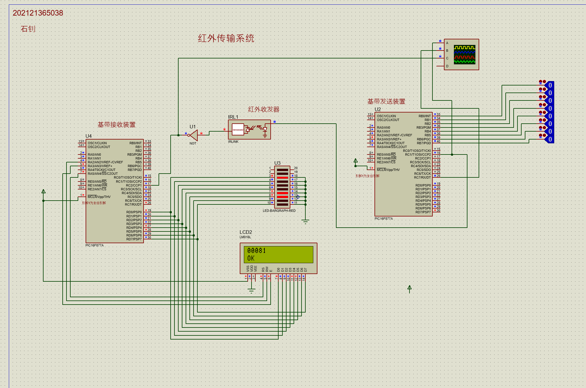


## 发送端和接收端的红外传续协议定义为每次收发24位bit的连续数据

**如图所示，发送连续三个Byte的一帧数据**

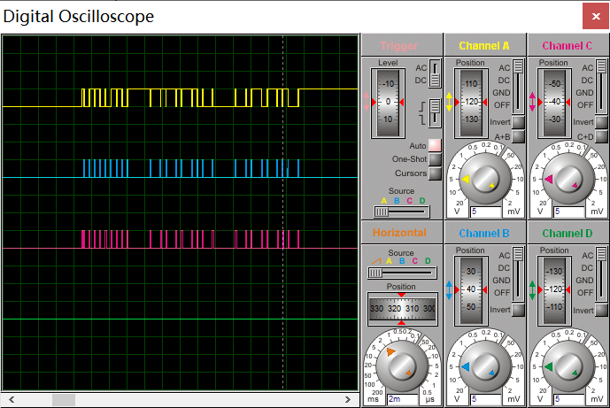

**代码部分**

```c
#include <pic.h>
#include "..\Driver\LCD1602.h"
__CONFIG(0xFF29);

char data,data_cnt;//发送的二进制代码，代码长度
char IR_SendSelect;
char measure_Flag;

unsigned char CCP1_HighByte;//CCP1高字节
unsigned char CCP1_LowByte;//CCP1低字节
unsigned char Over_Counter=0;//溢出计数值
unsigned char Over_Counter_temp;//溢出计数暂存值
unsigned char CCP1IF_TriggerFlag;//CCP1中断触发标志位
static volatile char TABLE[16]={0x30,0x31,0x32,0x33,0x34,0x35,0x36,0x37,0x38,0x39,0x41,0x42,0x43,0x44,0x45,0x46};
char Send_Counter;//发送字节次数

union 
{
	long Cycle;
	unsigned char Data[3];
}T_data_new;

union 
{
	long Cycle;
	unsigned char Data[3];
}T_data;

union
{
	long Data[3];
}T_data_M;

//稳定数据滤波器
void data_filter()
{
	unsigned char i;
	T_data_new.Data[0]=Over_Counter;
	T_data_new.Data[1]=CCP1_HighByte;
	T_data_new.Data[2]=CCP1_LowByte;
	
	T_data_M.Data[i++]= T_data_new.Cycle;
	i%=3;
	
	if(T_data_M.Data[0]==T_data_M.Data[1] && T_data_M.Data[1] == T_data_M.Data[2])//当三次取值相等时，才为有效值
	{
		T_data.Cycle=T_data_new.Cycle;
	}
}

void interrupt ccp1_int()
{
	/*
	if(measure_Flag == 0)//为周期测量模式
	{
		if(TMR1IF==1)
		{
			Over_Counter_temp++;//累加TMR1的溢出次数
			TMR1IF=0;	
		}
		else if(CCP1IF==1)//判断是不是由CCP1引起的中断
		{
			CCP1IF_TriggerFlag^=1;//标志位取反
			if(CCP1IF_TriggerFlag==1)//第一次捕捉到跳变
			{
				TMR1H=0;//清除定时器0计数寄存器值
				TMR1L=0;
				TMR1ON=1;//定时器1开始计时
				CCP1IF=0;//清除中断标志位
			}
			else//第二次捕捉到跳变
			{
				
				CCP1_LowByte=CCPR1L+31;//校准值
				CCP1_HighByte=CCPR1H+CARRY;//加上进位标志位
				Over_Counter=Over_Counter_temp;//将计数溢出暂存值赋值给显示值
				data_filter();
				
				Over_Counter_temp=0;//清除计数溢出暂存值
				TMR1H=0;//清除定时器0计数寄存器值
				TMR1L=0;
				
				
				LCD1602_WriteCommand(0x80);
				LCD1602_WriteData(TABLE[T_data_new.Data[0]>>4]);
				LCD1602_WriteData(TABLE[T_data_new.Data[0]&0x0F]);
				LCD1602_WriteData(TABLE[T_data_new.Data[1]>>4]);
				LCD1602_WriteData(TABLE[T_data_new.Data[1]&0x0F]);
				LCD1602_WriteData(TABLE[T_data_new.Data[2]>>4]);
				LCD1602_WriteData(TABLE[T_data_new.Data[2]&0x0F]);
				LCD1602_WriteData('H');
						
				
				TMR1ON=0;//定时器1停止计时
				CCP1IF=0;
				
				/*PWM,输出比较配置
				T2CON=0;PR2=25;TMR2=0;				//TMR2初始化，周期26us
				CCP2CON=0X0C;
				CCPR2L=13;							//CCP2初始化，脉宽13us				
				T1CON=0;							//设置预分频比为 = 1:1,开中断
				data_cnt = 0x09;					//每组数据位数=9 - 1 = 8 .因为子程序是减1后判断
				CCP1CON = 0X08;					//CCP1设为匹配时令CCP1/RC2引脚输出电平不变
				TMR1ON=1;							//启动TMR1
				measure_Flag=1;
			}
		}	
	}
	*/
	
	if(measure_Flag == 0)//将测量值发送(PWM(CCP2),输出比较(CCP1))
	{
		CCP1IF=0;
		if(CCP1M0==1)
		{
			RC7=0;
			CCP2CON=0x00;
			data_cnt--;										//低电平。二进制代码位数减1
			if(data_cnt == 0){goto period_delty;} 		//位数为0，全部发送完，转624us延时
				asm("rlf _data,f");							//未发送完，取下一位待发送数据（数据移入CARRY中）
			if(CARRY == 1) goto data_5eh;					//待发送数据=1
			CCPR1L=CCPR1L+0X04;								//待发送数据=0,叠加低电平时长68H
			CCPR1H=CCPR1H+CARRY+2;
			goto ret_fie;				//转到中断出口
		data_5eh:
			CCPR1L=CCPR1L+0X18;			//待发送数据=1,叠加低电平时长138H
			CCPR1H=CCPR1H+CARRY+4;		//高位字节加上低位叠加时的进位
			goto ret_fie;				//转到中断出口
		period_delty:
			Send_Counter++;
			CCPR1L=CCPR1L+0XC0;			//叠加624us的延时参数270H
			CCPR1H=CCPR1H+CARRY+9;			//高位字节加2及低位叠加时的进位和
			data=0B10101001;				//=PORTB 	//从PORTB取数据
			data_cnt = 9;
		ret_fie:
			CCP1M0=0;					//下次匹配时输出高电平
		}
		else
		{
			CCP2CON=0X0C;
			RC7=1;TMR2ON=1;//同步头时间，启动PWM信号输出
			CCPR1L=CCPR1L+0X68;			//叠加同步头的延时参数68H
			CCPR1H=CCPR1H+CARRY;		//高位字节加上低位叠加时的进位
			CCP1M0=1;					//下次匹配时输出低电平
		}
		
		
		if(Send_Counter >= 3)
		{
			Send_Counter=0;
			measure_Flag = 2;	
			
			/*
			CCP1IF=0;//CCP标志位清零
			TMR1IE=1;//定时器1中断使能
			TMR1IF=0;//定时器1中断标志位清零
			T1CON=0B00000000;//TMR1为定时器，预分频比1:1,不启动定时器1
			CCP1CON=0X05;//使能CCP1捕捉每一个输入信号的上升沿	
			*/
			
			TMR1ON=0;//关闭定时器1
			CCP2CON=0X00;//关闭PWM
			CCP1CON=0X00;
		}
						
	}
}

void main()
{
	Send_Counter=0;
	nRBPU=0;							//启用RB弱上拉
	TRISB=0xFF;							//作输入口
	TRISC7=0;
	TRISC1=0;							//PWM信号（载波）输出引脚
	TRISC2=1;
	
	TRISD=0X00;							//数据口
    TRISA=0x00;							//RA0配置为输出模式
	ADCON1=0X07;						//RA端口与AD转换有关！！！，不然无法正常显示LCD1602 
	LCD1602_Init();	
	LCD1602_WriteString(2,0,"OK");
	
	/*CCP中断配置*/
	GIE=1;//总中断打开
	PEIE=1;//第二梯队中断打开
	CCP1IE=1;//CCP中断打开
	
	
	/*周期测量
	CCP1IF=0;//CCP标志位清零
	TMR1IE=1;//定时器1中断使能
	TMR1IF=0;//定时器1中断标志位清零
	T1CON=0B00000000;//TMR1为定时器，预分频比1:1,不启动定时器1
	CCP1CON=0X05;//使能CCP1捕捉每一个输入信号的上升沿	
	*/
	
				T2CON=0;PR2=25;TMR2=0;				//TMR2初始化，周期26us
				CCP2CON=0X0C;
				CCPR2L=13;							//CCP2初始化，脉宽13us				
				T1CON=0;							//设置预分频比为 = 1:1,开中断
				data_cnt = 0x09;					//每组数据位数=9 - 1 = 8 .因为子程序是减1后判断
				CCP1CON = 0X08;					//CCP1设为匹配时令CCP1/RC2引脚输出电平不变
				TMR1ON=1;							//启动TMR1
					
	data = PORTB;						//=PORTB;从PORTB取数据
	while(1);
}
```


## 猜测：同步头的宽窄，导致信号处理出现错误数据


**解决方案：==调整同步头宽度。每Byte数据需要等待一定的时间==**

##  仿真测试结果：没有完整移入数据，实际上只接收到了7位

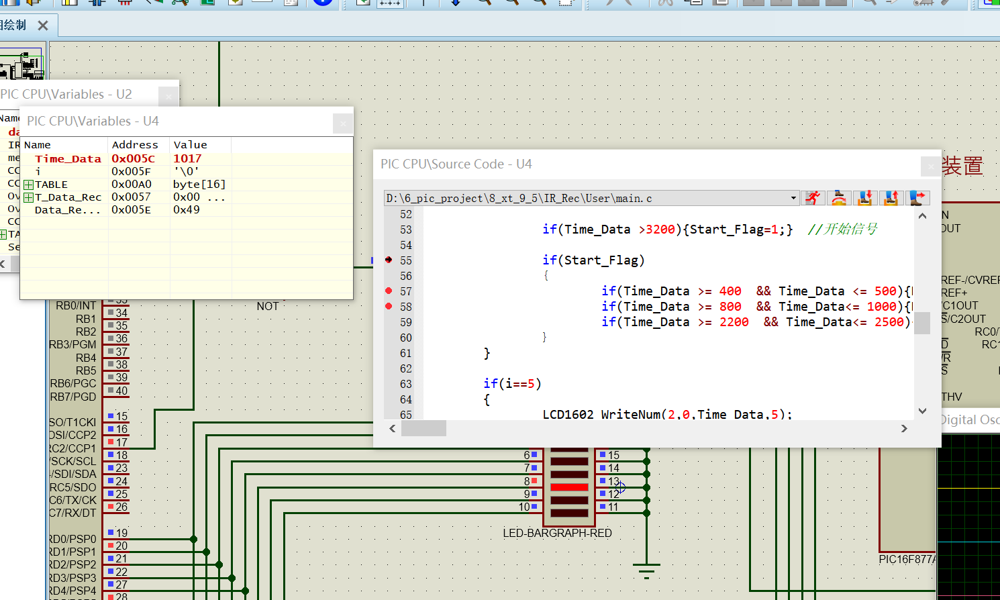

**更改输入捕获中断内对各个二进制捕获的电平时间范围，使得红外解调的容允值更大，修改后，代码如下**

```c
#include <pic.h>
#include "..\Driver\LCD1602.h"

unsigned char Data_RecByte;
int Time_Data;
bit Data_RecFlag;
char i;
static volatile char TABLE[16]={0x30,0x31,0x32,0x33,0x34,0x35,0x36,0x37,0x38,0x39,0x41,0x42,0x43,0x44,0x45,0x46};
bit Start_Flag;

union
{
	unsigned char Data[5];
}T_Data_Rec;

void interrupt ccp1_int()
{
	CCP1IF = 0;
	//PORTD^=0xFF;

	
	/*
	if(CCP1M0 == 0)//本次捕捉下降沿
	{
		TMR1H=0;TMR1L=0;
		CCP1CON=0X05;
		CCP1IF=0;
	}
	else
	{	
		CCP1CON=0X04;
		CCP1IF=0; Time_Data = CCPR1H << 8 | CCPR1L;
		//if(Time_Data > 400  && Time_Data< 500){LCD1602_WriteNum(1,0,Time_Data,5);CCP1IE=0;}//55
		//if(Time_Data > 800  && Time_Data< 1000){LCD1602_WriteNum(1,0,Time_Data,5);CCP1IE=0;}//263
		//if(Time_Data > 2300  && Time_Data< 2600){LCD1602_WriteNum(1,0,Time_Data,5);CCP1IE=0;}//575
		if(Time_Data > 2900 ){LCD1602_WriteNum(1,0,Time_Data,5);CCP1IE=0;}//575
	}
	*/
	
	
	
	if(CCP1M0 == 0)//本次捕捉下降沿
	{
		TMR1H=0;TMR1L=0;//清零TMR1寄存器值
		CCP1CON=0X05;//下一次捕捉上升沿
		CCP1IF=0;//清除输入捕捉标志位
	}
	else//本次捕捉上升沿
	{	
		CCP1CON=0X04;//下一次捕捉下降沿
		CCP1IF=0;Time_Data = CCPR1H << 8 | CCPR1L;
		
		if(Time_Data >3200){Start_Flag=1;}  //开始信号
		
		if(Start_Flag)
		{
			if(Time_Data >= 400  && Time_Data <= 500){Data_RecByte=Data_RecByte<<1;}	//0'068
			if(Time_Data >= 800  && Time_Data<= 1200){Data_RecByte=Data_RecByte<<1;Data_RecByte=Data_RecByte+1;} 	//'1'
			if(Time_Data >= 2200  && Time_Data<= 2500){T_Data_Rec.Data[i++] = Data_RecByte;Start_Flag=0;}  //结束信号			
		}
	}
	
	if(i==5)
	{
		LCD1602_WriteNum(2,0,Time_Data,5);
		LCD1602_WriteCommand(0x80);
		LCD1602_WriteData(TABLE[T_Data_Rec.Data[0]>>4]);
		LCD1602_WriteData(TABLE[T_Data_Rec.Data[0]&0x0F]);
		LCD1602_WriteData(TABLE[T_Data_Rec.Data[1]>>4]);
		LCD1602_WriteData(TABLE[T_Data_Rec.Data[1]&0x0F]);
		LCD1602_WriteData(TABLE[T_Data_Rec.Data[2]>>4]);
		LCD1602_WriteData(TABLE[T_Data_Rec.Data[2]&0x0F]);
		LCD1602_WriteData(TABLE[T_Data_Rec.Data[3]>>4]);
		LCD1602_WriteData(TABLE[T_Data_Rec.Data[3]&0x0F]);
		LCD1602_WriteData(TABLE[T_Data_Rec.Data[4]>>4]);
		LCD1602_WriteData(TABLE[T_Data_Rec.Data[4]&0x0F]);
		LCD1602_WriteData('H');		
	}
}
```

**最终结果：实现了连续5Byte数据的接收**

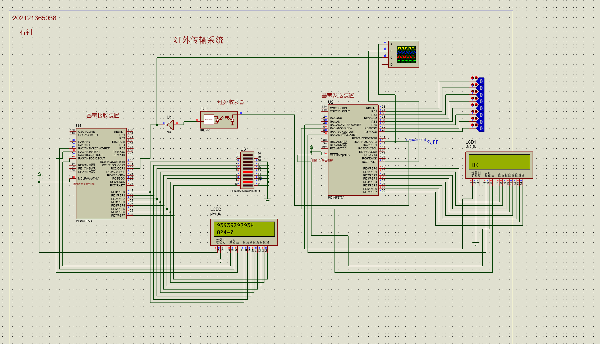


# 自定义通信协议

**==在完整的红外传输系统工作在稳定可靠的状态后，我们可以拓展一些功能，如自己定义一个红外传输协议，使得单片机之间的红外通信能够实现更加复杂的功能，一次性能够传输更多的数据。==**

- 添加一个起始位，长度位结束位的两倍
- 修改全部所有数据位对应的电平宽度，增加各自的比例。
  - 起始位：0xC30
  - '0': 0x204
  - '1':0x418
  - 结束位:0x9C0

- 修改同步头宽度，因为在实际使用红外通信时，单片机产生的红外信号可能没有那么理想，红外发射头发送出去的信号会衰减，因此我们可以适当增加同步头宽度，提高红外调制信号的“功率”，使得红外接收头能够正常接收到红外信号

# 周期信号测量+红外收发系统

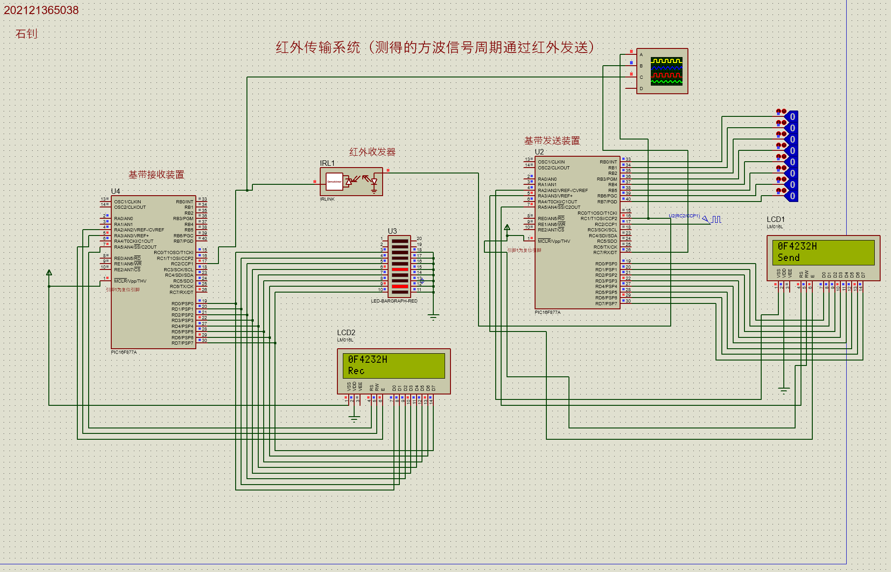

# 红外双发双收（双工系统）

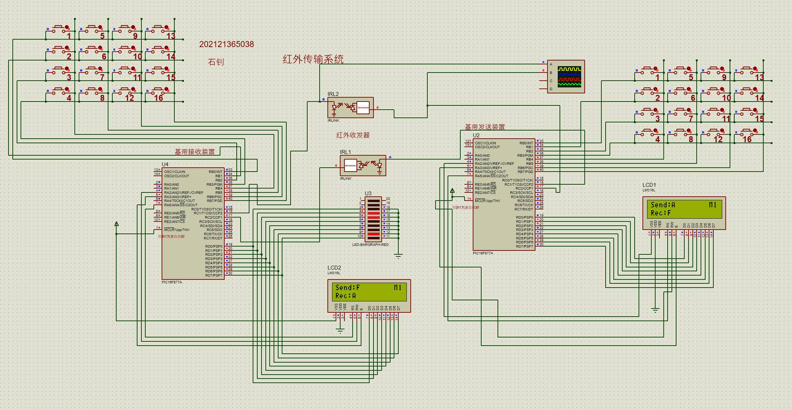

# 红外双工+中继基站系统

**==如图所示，红外收发装置通过中继系统进行数据通信==**

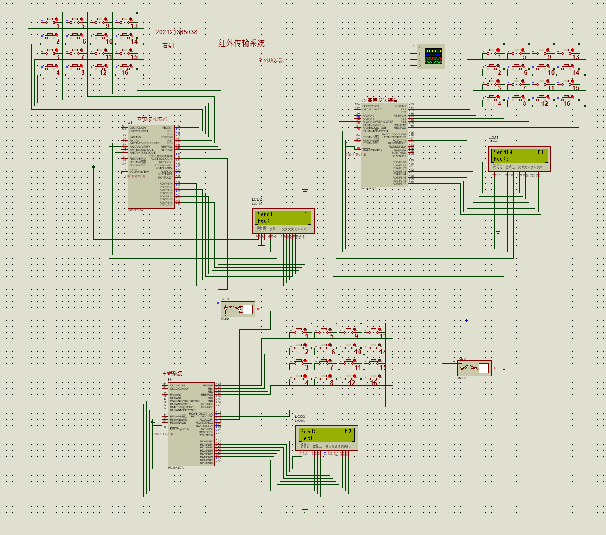

# 心得体会

  我在本次小组任务中，首先学习了红外通信系统的基本组成结构，了解了通信系统中调制/解调的原理以及实现方法。基于对第九章各个例子以及习题的学习以及编写相关代码，我熟悉了CCP模块的输入捕获、输出比较、PWM模式的工作原理。通过将这些模块组合，协同工作，在代码中利用定义的各个“标志位"，配置好了这些CCP各个功能模块协同工作的代码结构。

  在准备进行本次小组任务的工作前，我们首先大概预览了一下本次小组任务需要用到的知识点，因为整个红外通信系统的构成需要多个单片机协同工作，所以必须要循循渐进地进行代码的编写、调试、验证。为了设计出最终包含红外双工通信+中继器的复杂系统，我们首先编写完成了一个简易的红外通信系统，不过这个系统的信号发送端发送的是基带信号，没有经过红外管，直接送给接收端单片机进行信号的解调。虽然我们在发送端设置好了各个不同数据位的电平宽度，比如’0‘，’1‘，’停止位‘的电平宽度有按照一定的比例用于区分，但课本上一开始给的例子，各个数据位电平宽度仅仅在微妙级，不管是仿真还是实物验证接收端都有可能无法解调出正确的信号，因为这些数据位的电平宽度太短，没有明显的区分度，一旦程序运行效率不行或者单片机电路上的微小延迟都有可能造成数据读取的错误。因此，我们等比例放大了每个数据位的电平宽度，以及同步头的宽度（保证调制信号的功率）。这样的话，不同bit的区分度就大大提高了。然后，我们自己再编写一段调试代码，即接收到任意的上边沿+下边沿的输入捕获，输出端改为固定指定的数据位发送，然后在接收端那边通过LCD1602显示实际上捕获到的电平宽度，这样就能知道红外接收端实际容允的电平宽度范围，确保整个红外通信系统的稳定性。

  本次小组任务，更像一个小课程设计，我们设计出了一个功能完备的红外通信系统，在每个阶段的调试过程中，我们遇到了很多的问题，这些问题大多数是由于寄存器的配置引起的（因为单片机中CCP各个模块要协同工作，这就涉及到大量寄存器的状态切换），一旦寄存器配置冲突，而我们又不熟悉寄存器，就无法认识到代码的问题所在。我们通过MPLAB强大轻量化的Debug窗口，以及Proteus的调试功能，反复验证，循序渐进，最终设计出来了一个具备双工通信+中继器（基站）的完备通信系统，并且我们的通信系统可以通过修改代码中的参数实现连续任意位Byte的收发。

 本次小组任务是有挑战性的，但是这也为我们后续学习更多复杂的通信系统打下基础。我们学会了化繁为简，分模块和层次，熟练配置单片机上所有相关功能寄存器的技巧，这不仅是我们单片机编程、电路系统设计技术上的显著提升，也是对理论基础是否扎实的考验。我想，通过本次小组任务，我们可以设计出各种功能强大，效率高的通信系统，利用自身专业编写出完备的通信协议等。
