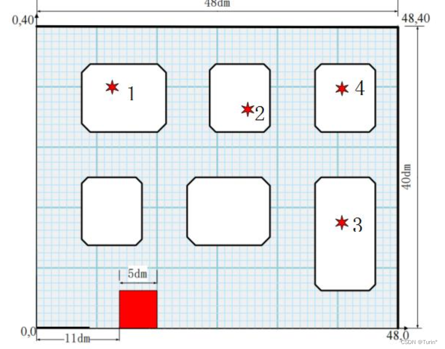
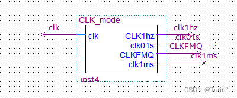
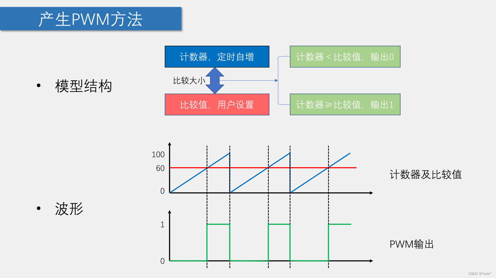

## 设计题目： 智能消防系统

**题目来源： 2023 年全国大学生电子设计竞赛试题试题 G 题**
### 一、 任务：
- 设计一套智能消防系统， 采用 FPGA 实验板。 防区区域为 40dm× 48dm，
- 可能出现的火源如图所示的 1、 2、 3、 4。 当消防车接收到火源地点位置信息即刻前往熄灭火源， 消防工作完成时间越短越好。 其中白色部分是街区， 消防车不得驶入， 红色区域是消防车停车点。


### 二、 要求：
- 消防车起始停留在红色区域， 接收到火情信息并显示火源地点位置坐标后，
- 出发前往火源地点， 途中不得碾压街区及其边界线。 消防车距离火源地点 5dm内停车， 发出声光报警， 持续 5 秒， 表示将模拟火源熄灭， 之后消防车返回红色区域。 从消防车出发到返回红色区域， 用时越短越好

### 三、硬件部分
- 主要结构：4驱直流电机小车
- 主控：FPGA
- 传感器：1.四路循迹模块（避线）   2.红外计数器（测速/里程计算）
- 代码主要语法：状态机

### 四、解题四路
#### 一、调试小车基本运动模式

### 什么是分频器？
**分频器原理**
- 通过检测输入时钟信号下降沿（上升沿），或者说采样的方法，控制输出的时钟信号频率。

**如将50MHZ的时钟信号12分频：**
```
process(clk,q1)
begin
	if clk'event and clk='1' then
		if q1<=2 then CLKFMQ<='1';q1<=q1+1;
		--改变q1<=2参数可变更占空比
		 elsif q1=11 then CLKFMQ<='0';q1<=0;
		 --改变q1=11参数可以变更CLKFMQ的频率
		 else CLKFMQ<='0';q1<=q1+1;
		end if;
	end if;
end process ;
```
**分频器模块**
- 用于产生各种所需频率的方波信号
```clike
--------------------------------------
LIBRARY IEEE;
USE IEEE.STD_LOGIC_1164.ALL;
USE IEEE.STD_LOGIC_ARITH.ALL;
USE IEEE.STD_LOGIC_UNSIGNED.ALL;
--------------------------------------
ENTITY   CLK_mode is--分频器模块                              
	PORT(	clk:in std_logic; --系统晶振源 50MHZ              
	      CLK1hz,clk01s,CLKFMQ,clk1ms:out std_logic--1hz,1000hz,蜂鸣器频率
		);
END CLK_mode   ;                                           
--------------------------------------
ARCHITECTURE abc OF CLK_mode   IS  
signal q1:integer range 0 to 24999; --中间信号
signal q2:integer range 0 to 4999999;
signal q3:integer range 0 to 49999;
BEGIN
--蜂鸣器频率--
process(clk,q1)
begin
	if clk'event and clk='1' then
		if q1<=12999 then CLKFMQ<='1';q1<=q1+1;
		 elsif q1=24999 then CLKFMQ<='0';q1<=0;
		 else CLKFMQ<='0';q1<=q1+1;
		end if;
	end if;
end process ;
--0.1s的分频--
process(clk)
	begin
	if clk'event and clk='1'then
		if q2<=5 then clk01s<='1';q2<=q2+1;
		elsif q2=4999999 then clk01s<='0';q2<=0;
		else clk01s<='0';q2<=q2+1;
		end if;
	end if;
end process;
--1ms--
process(clk)
	begin
	if clk'event and clk='1'then
		if q3<=40000 then clk1ms<='1';q3<=q3+1;
		elsif q3=49999 then clk1ms<='0';q3<=0;
		else clk1ms<='0';q3<=q3+1;
		end if;
	end if;
end process;
end abc;
```
### 什么是PWM？
- PWM（Pulse Width Modulation）即脉冲宽度调制，在具有惯性的系统中，可以通过对一系列脉冲的宽度进行调制，来等效地获得所需要的模拟参量，常应用于电机控速、开关电源等领域 
- PWM重要参数：      频率 = 1 / TS            占空比 = TON / TS           精度 = 占空比变化步距


**信号接口/变量定义：**
```c
-----------------------------------------------------------------------------------------
LIBRARY IEEE;
USE IEEE.STD_LOGIC_1164.ALL;
USE IEEE.STD_LOGIC_ARITH.ALL;
USE IEEE.STD_LOGIC_UNSIGNED.ALL;
-----------------------------------------------------------------------------------------
ENTITY   Carcontrol_4  is--路线四控制模块                             
PORT(CLK,CLKFMQ,clk01s,clk1ms:in std_logic; --pwm,时钟信号,复位信号
			RESET:IN STD_LOGIC;
			Mapan:in std_logic;--码盘信号
			X1,X2:in std_logic_vector(3 downto 0);--巡线信号
			en11,en12,en21,en22,FMQ:OUT std_logic;--通道A B 的驱动电压
			turn_timer1,LED:out std_logic_vector(7 downto 0):="00000000";--计数器
			contrologic:OUT std_logic_vector(7 downto 0):="00000000"--电机驱动/制动的信号--输出到数据选择器上
		);
END Carcontrol_4;                                           
-----------------------------------------------------------------------------------------
ARCHITECTURE abc OF  Carcontrol_4  IS  
  type Sreg0_type is--状态枚举
  (T0,T00,T01,T20,T1,T2,T21,T3,
  stop1,stop2,stop3,stop4,
  TX1,TX1fix,TX1end,
  TX2,TX2fix,TX2end,
  TX3,TX3fix,TX3end,
  TBX1,TBX1fix,TBX1end,
  TBX2,TBX2fix,TBX2end,
  TBX3,TBX3fix,TBX3end,
  TB1,TB2,TB3,TB4,TB5,HT);
  signal XJ :std_logic_vector(7 downto 0);--两个四路循迹模块的并置信号
  signal Sreg0: Sreg0_type;--状态类型
  signal FMQEN: std_logic:='1';--蜂鸣器的使能信号，低电平有效
  signal Z11,Z12,Z21,Z22:integer;--PWM脉宽调制占空比
  signal left1,left2,right1,right2:std_logic;
  signal q1:integer range 0 to 100;
  signal q2:integer range 0 to 100;
  signal q3:integer range 0 to 100;
  signal q4:integer range 0 to 100;
  signal turn_timer:INTEGER  range 0 to 100000 ;
```

```c
BEGIN
XJ<=X1&X2;--循迹信号（八位）
LED<=XJ;--通过LED观察循迹模块是否正常运行
EN11<=left1;EN12<=right1;EN21<=left2;EN22<=right2;--电机的PWM信号输入
--------------------------------------------
--四个模块，分别控制小车四个电机的PWM信号输入
--占空比定义为 变量（整型），在没有pid控制的情况下，便于对小车进行校准，以及调速。
process(clk,q1)
begin
	if clk'event and clk='1' then
		if q1<=Z11 then left1<='1';q1<=q1+1;--高电平有效值定义为整型，便于在状态机中进行变速
		 elsif q1=100 then left1<='0';q1<=0;
		 else left1<='0';q1<=q1+1;
		end if;
	end if;
end process;
process(clk,q2)
begin
	if clk'event and clk='1' then
		if q2<=Z12 then right1<='1';q2<=q2+1;
		 elsif q2=100 then right1<='0';q2<=0;
		 else right1<='0';q2<=q2+1;
		end if;
	end if;
end process;
process(clk,q3)
begin
	if clk'event and clk='1' then
		if q3<=Z21 then left2<='1';q3<=q3+1;
		 elsif q3=100 then left2<='0';q3<=0;
		 else left2<='0';q3<=q3+1;
		end if;
	end if;
end process;
process(clk,q4)
begin
	if clk'event and clk='1' then
		if q4<=Z22 then right2<='1'; q4<= q4+1;
		 elsif  q4=100 then right2<='0'; q4<=0;
		 else right2<='0';q4<=q4+1;
		end if;
	end if;
end process;
-----------------------------------------------------------------------------	
```
## 路线规划（以路线4为例）
### 计时器（控制小车在不同状态下定时运动）
```c
process(clk1ms,Timer_flag)
begin
	if Timer_flag = 1 THEN
		if rising_edge(clk1ms) THEN
			turn_timer <= turn_timer +1;
		end if;
	else
		turn_timer<=0;
	end if;
end process;
```
### 程序主要部分（状态机）

>**不同状态下，根据路径规划，小车的运动姿态（转向，直行）不同，每个状态有特定的==状态转移条件==（运动时间（用红外计数里程判断更精准），特征值（黑线）**
- 小车碰到黑线（居民楼）进行偏移转向
- 车头碰到黑线（关键点检测）进行直角转弯
- 小车要精确地行驶，到底指定地点，需要利用好黑线，既不能触线，也不能过偏，即贴线行驶，这就要使得小车在贴线行驶的路段在规定的 时间 / 里程 内，进行==贴线行驶==->==避线==->==贴线行驶==，三个状态的闭环，在小车行驶姿态垂直于黑线时的路径，循迹模块检测黑线直接进行直角转弯即可（这样就不需要控制里程/时间）。
- 规划好前往火源点的路径后，返回的路径按照相反的逻辑控制即可。


```c
-----------------------------------------------------------------------------	
PROCESS(reset, clk1ms)--1ms的时钟信号，用于状态机的状态检测以及计时器的计时精度
BEGIN
    IF reset = '1' THEN--复位信号
      Sreg0 <= T0;FMQEN<='1';Z11<=36;Z12<=29;Z21<=36;Z22<=29;--蜂鸣器无效，状态机初始化
      contrologic <= "00000000";--控制逻辑均置零
		turn_timer<= 0 ;--计数器清零
    ELSIF rising_edge(clk1ms) THEN
      CASE Sreg0 IS 
        WHEN T0 =>contrologic <= "01100110";Z11<=38;Z12<=34;Z21<=38;Z22<=34; --直行
		   if turn_timer = 1000 then
				   Sreg0 <= T00;  
					Timer_flag<=1; 
				 else
					Timer_flag<=0;
				 end if;		  
			WHEN T00 =>
          if  XJ(3)='0' then--检测黑线
			    Sreg0<=T01;
			 ELSE  Sreg0<=T00;
          end if;
		  WHEN T01 =>contrologic <= "10011001"; Z11<=36;Z12<=29;Z21<=36;Z22<=29;--碰到黑线回退
		   if turn_timer = 700 then --1450
				   Sreg0 <= T1;  
					Timer_flag<=1; 
				 else
					Timer_flag<=0;
				 end if;		  
        WHEN T1 =>contrologic <= "00100010";Z12<=40;Z22<=40;--转弯
				if turn_timer = 1250 then
				   Sreg0 <= stop1;  
					Timer_flag<=1; 
				 else
					Timer_flag<=0;
				 end if;		  
		  WHEN stop1 =>contrologic <= "00000000" ;--停止
				if turn_timer = 300 then
				   Sreg0 <= T2;  
					Timer_flag<=1; 
				 else
					Timer_flag<=0;
				 end if;
-----------------------------------------------------------------------------	
--贴线			 
		  WHEN T2 =>contrologic <= "01100110";Z11<=38;Z12<=34;Z21<=38;Z22<=34; --空白区域直行
		  if turn_timer = 1500 then
				   Sreg0 <= TX1;  
					Timer_flag<=1; 
				 else
					Timer_flag<=0;
			 end if;
		 When TX1 =>contrologic <= "01100110";Z11<=38;Z12<=34;Z21<=38;Z22<=34; --贴线循迹(街区2）
				if (XJ(0) and XJ(1) and XJ(2) and XJ(3))  = '0' then
				Sreg0 <= TX1fix; 
				elsif turn_timer = 2800 then--完成贴线
				   Sreg0 <= TX1end;  
					Timer_flag<=1; 
				 else
					Timer_flag<=0;
				end if;
		 WHEN TX1fix => contrologic <= "10101010";Z11<=40;Z12<=40;Z21<=40;Z22<=40;--修正
				if (XJ(0) and XJ(1) and XJ(2) and XJ(3)) = '1'then Sreg0 <= TX1; 
				end if;
		 When TX1end => contrologic <= "01100110";Z11<=38;Z12<=34;Z21<=38;Z22<=34; --完成贴线,直行小段
				 if turn_timer = 500 then 
				   Sreg0 <= T20;  
					Timer_flag<=1; 
				 else
					Timer_flag<=0;
			    end if;
-----------------------------------------------------------------------------				 
       WHEN T20 =>
          if  XJ(3)='0' then  --前端检测黑线
			    Sreg0<=T21;
          end if;
		  WHEN T21 =>contrologic <= "10011001"; Z11<=36;Z12<=29;Z21<=36;Z22<=29;--检测到黑线，回退
		  		if turn_timer = 600 then
				   Sreg0 <= T3;  
					Timer_flag<=1; 
				 else
					Timer_flag<=0;
				 end if;		  
		  WHEN T3 =>contrologic <= "00100010";Z11<=40;Z12<=40;Z21<=40;Z22<=40;--直角转弯
				if turn_timer = 1500 then
				   Sreg0 <= TX2; --进入第二段循迹贴线（火源区3）
					Timer_flag<=1; 
				 else
					Timer_flag<=0;
				 end if;	
-----------------------------------------------------------------------------				 
		  WHEN TX2 =>contrologic <= "10011001"; Z11<=36;Z12<=29;Z21<=36;Z22<=29;--进入第二段循迹贴线（火源区3）
			if XJ(4) = '0' then
				Sreg0 <= TX2fix; 
				elsif turn_timer = 2000 then--限制贴线时间
				   Sreg0 <= TX2end;  
					Timer_flag<=1; 
				 else
					Timer_flag<=0;
				end if;
		 WHEN TX2fix => contrologic <= "01010101";Z11<=40;Z12<=40;Z21<=40;Z22<=40;
				if XJ(4) = '1'then Sreg0 <= TX2; 
				end if;
		 When TX2end => contrologic <= "10011001"; Z11<=36;Z12<=29;Z21<=36;Z22<=29;
				 if turn_timer = 500 then --贴线结束，空白区直行
				   Sreg0 <= TX3;  
					Timer_flag<=1; 
				 else
					Timer_flag<=0;
			    end if;
-----------------------------------------------------------------------------					 
		  WHEN TX3 =>contrologic <= "10011001";  Z11<=36;Z12<=29;Z21<=36;Z22<=29;--进入第三段循迹贴线（火源区4）
			if (XJ(4) and XJ(5) and XJ(6) and XJ(7)) = '0' then
				Sreg0 <= TX3fix; 
				elsif turn_timer = 1900 then--限制时间
				   Sreg0 <= TX3end;  
					Timer_flag<=1; 
				 else
					Timer_flag<=0;
				end if;
		 WHEN TX3fix => contrologic <= "01010101";Z11<=40;Z12<=40;Z21<=40;Z22<=40;
				if (XJ(4) and XJ(5) and XJ(6) and XJ(7)) = '1'then Sreg0 <= TX3; 
				end if;		
		  WHEN TX3end=>FMQEN<='0';contrologic <= "00000000"; --报警
		  		if turn_timer =4999 then 
					Sreg0 <= TBX1;FMQEN<='1';
					Timer_flag<=1; 
				 else
					Timer_flag<=0;
			  end if;
-----------------------------------------------------------------------------	
-----------------------------------------------------------------------------	
		WHEN TBX1 =>contrologic <= "01100110"; Z11<=38;Z12<=34;Z21<=38;Z22<=34; --进入返回第一段循迹贴线（火源区4）
			if (XJ(0) and XJ(1) and XJ(2) and XJ(3)) = '0' then
				Sreg0 <= TBX1fix; 
				elsif turn_timer = 1200 then
				   Sreg0 <= TBX1end;  
					Timer_flag<=1; 
				 else
					Timer_flag<=0;
				end if;
	   WHEN TBX1fix => contrologic <= "10101010";Z11<=40;Z12<=40;Z21<=40;Z22<=40;
				if (XJ(0) and XJ(1) and XJ(2) and XJ(3))= '1'then Sreg0 <= TBX1; 
				end if;			
-----------------------------------------------------------------------------			
		 When TBX1end => contrologic <= "01100110";Z11<=38;Z12<=34;Z21<=38;Z22<=34; --空白区域
				 if turn_timer = 500 then 
				   Sreg0 <= TBX2;  
					Timer_flag<=1; 
				 else
					Timer_flag<=0;
			    end if;		
	    WHEN TBX2 =>contrologic <= "01100110";Z11<=38;Z12<=34;Z21<=38;Z22<=34;--进入返回第二段循迹贴线（火源区3）
				if (XJ(0) and XJ(1) and XJ(2) and XJ(3)) = '0' then
					Sreg0 <= TBX2fix; 
				elsif turn_timer = 3500 then
				   Sreg0 <= TBX2end;  
					Timer_flag<=1; 
				 else
					Timer_flag<=0;
				end if;
		 WHEN TBX2fix => contrologic <= "10101010";Z11<=40;Z12<=40;Z21<=40;Z22<=40;
				if (XJ(0) and XJ(1) and XJ(2) and XJ(3)) = '1'then Sreg0 <= TBX2; 
				end if;		
------------------------------------------------------------------------------
		  WHEN TBX2end=>contrologic <= "01100110";Z11<=38;Z12<=34;Z21<=38;Z22<=34;--前端检测黑线
          if  XJ(3)='0' then  
			    Sreg0<=HT;
			 Else  Sreg0<=TBX2end;
          end if;		 
		  WHEN HT =>contrologic <= "10011001"; Z11<=36;Z12<=29;Z21<=36;Z22<=29;--碰到黑线回退
		   if turn_timer = 500 then --1450
				   Sreg0 <= TB3;  
					Timer_flag<=1; 
				 else
					Timer_flag<=0;
				 end if;
        WHEN TB3=>contrologic <= "00100010";Z11<=40;Z12<=40;Z21<=40;Z22<=40;--转向			 
				if turn_timer = 900 then
				   Sreg0 <= TBX3;  
					Timer_flag<=1; 
				 else
					Timer_flag<=0;
				 end if;	
------------------------------------------------------------------------------
	    WHEN TBX3 =>contrologic <= "01100110";Z11<=38;Z12<=34;Z21<=38;Z22<=34; --贴线循迹，回到起点
				if (XJ(0) and XJ(1) and XJ(2) and XJ(3)) = '0' then
					Sreg0 <= TBX3fix; 
				elsif turn_timer = 4200 then
				   Sreg0 <= TBX3end;  
					Timer_flag<=1; 
				 else
					Timer_flag<=0;
				end if;
		 WHEN TBX3fix => contrologic <= "10101010";Z11<=40;Z12<=40;Z21<=40;Z22<=40;
				if (XJ(0) and XJ(1) and XJ(2) and XJ(3)) = '1'then Sreg0 <= TBX3; 
				end if;	
------------------------------------------------------------------------------			
		  WHEN OTHERS => null; contrologic<= "00000000";
		  END CASE;
	END IF;
  END PROCESS;
PROCESS(FMQEN)
BEGIN
	IF FMQEN<='0'then FMQ<=CLKFMQ;
	ELSE FMQ<='1';
	END IF;
END PROCESS;
END abc;
```
### 四路数据选择器模块
```c
LIBRARY IEEE;
USE IEEE.STD_LOGIC_1164.ALL;
USE IEEE.STD_LOGIC_ARITH.ALL;
USE IEEE.STD_LOGIC_UNSIGNED.ALL;
--四路（总线式）数据选择器，通过四位按键控制电机逻辑/电机有效电压（PWM）/蜂鸣器信号/选择小车行驶路线
ENTITY MUX4 IS
PORT(C1,C2,C3,C4:IN STD_LOGIC_VECTOR(7 DOWNTO 0);
	  EN11_1,EN12_1,EN21_1,EN22_1:in std_logic;
	  EN11_2,EN12_2,EN21_2,EN22_2:in std_logic;
	  EN11_3,EN12_3,EN21_3,EN22_3:in std_logic;
	  EN11_4,EN12_4,EN21_4,EN22_4:in std_logic;
	  FMQ1,FMQ2,FMQ3,FMQ4:in std_logic;
	  RESET:IN STD_LOGIC_vector(3 downto 0);--路线选择信号
	  FMQ:out std_logic;--蜂鸣器
	  LOGIC:OUT STD_LOGIC_vector(7 DOWNTO 0);--小车运动控制逻辑
	  EN11,EN12,EN21,EN22:OUT STD_LOGIC;--小车电机PWM方波输出信号
	  CLK1MS:in std_logic;--光耦传感器脉冲，复位信号，1MS时钟
	  LEDSEG: OUT STD_LOGIC_VECTOR(6 DOWNTO 0);--LED显示
	  Y:out std_logic_VECTOR(5 DOWNTO 0)--共阴极
		);
END MUX4;--
ARCHITECTURE ABC OF MUX4 IS
signal ledin:std_logic_vector(3 downto 0);
signal SEL:std_logic_vector(2 downto 0):="000";
BEGIN
--显示译码器--
P11:process (ledin)
	BEGIN
	CASE ledin IS 
			WHEN "0000"=>ledseg<="0111111";--"1111111110";
			WHEN "0001"=>ledseg<="0000110";--"1111111101";
			WHEN "0010"=>ledseg<="1011011";--"1111111011";
			WHEN "0011"=>ledseg<="1001111";--"1111110111"; 
			WHEN "0100"=>ledseg<="1100110";--"1111101111";
			WHEN "0101"=>ledseg<="1101101";--"1111011111";
			WHEN "0110"=>ledseg<="1111101";--"1110111111";
			WHEN "0111"=>ledseg<="0000111";--"1101111111";
			WHEN "1000"=>ledseg<="1111111";--"1011111111";
			WHEN "1001"=>ledseg<="1101111";--"0111111111";
			WHEN "1010"=>ledseg<="0000001";--"0111111111";
			WHEN OTHERS=>ledseg<="0000000";--共阴极，无效
	END CASE;
end process P11;
--四位脉冲分配器--
p22:process(clk1ms)
	begin
		IF clk1ms'event and clk1ms='1' then
			if sel="101" then sel<="000";
			else sel<=sel+1;
			end if;
		end if;
end process P22;
PROCESS(RESET)
BEGIN
CASE RESET IS
WHEN "1000" => 
					LOGIC <=C1;
					EN11<=EN11_1;
					EN12<=EN12_1;
					EN21<=EN21_1;
					EN22<=EN22_1;
					FMQ<=FMQ1;
		CASE SEL IS
		WHEN "001"=>ledin<="0000";y<="111101";
		WHEN "010"=>ledin<="1001";y<="111011";
		WHEN "011"=>ledin<="0011";y<="110111";
		WHEN "100"=>ledin<="0010";y<="101111";
		WHEN OTHERS =>ledin<="1111";y<="111111";
		END CASE;
WHEN "0100" => LOGIC <=C2;
					EN11<=EN11_2;
					EN12<=EN12_2;
					EN21<=EN21_2;
					EN22<=EN22_2;
					FMQ<=FMQ2;
	CASE SEL IS
		WHEN "000"=>ledin<="0010";y<="111101";
		WHEN "001"=>ledin<="1000";y<="111011";
		WHEN "010"=>ledin<="0010";y<="110111";
		WHEN "011"=>ledin<="1001";y<="101111";
		WHEN OTHERS =>ledin<="1111";y<="111111";
	END CASE;
WHEN "0010" => LOGIC <=C3;
					EN11<=EN11_3;
					EN12<=EN12_3;
					EN21<=EN21_3;
					EN22<=EN22_3;
					FMQ<=FMQ3;
		CASE SEL IS
		WHEN "000"=>ledin<="0010";y<="111101";
		WHEN "001"=>ledin<="1000";y<="111011";
		WHEN "010"=>ledin<="0010";y<="110111";
		WHEN "011"=>ledin<="1001";y<="101111";
		WHEN OTHERS =>ledin<="1111";y<="111111";
		END CASE;
WHEN "0001" => LOGIC <=C4;
					EN11<=EN11_4;
					EN12<=EN12_4;
					EN21<=EN21_4;
					EN22<=EN22_4;
					FMQ<=FMQ4;
		CASE SEL IS
		WHEN "000"=>ledin<="0010";y<="111101";
		WHEN "001"=>ledin<="1000";y<="111011";
		WHEN "010"=>ledin<="0010";y<="110111";
		WHEN "011"=>ledin<="1001";y<="101111";
		WHEN OTHERS =>ledin<="1111";y<="111111";
		end case;
WHEN OTHERS=>LOGIC<="00000000";
END CASE;
END PROCESS;
END ABC;
```
