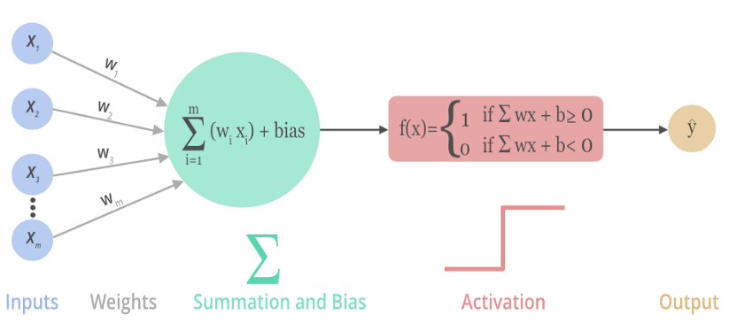
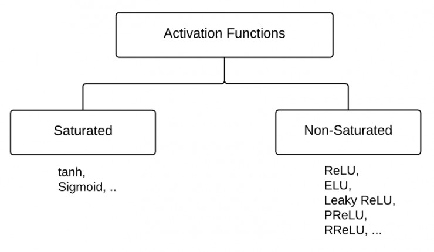
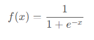
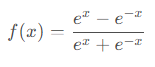
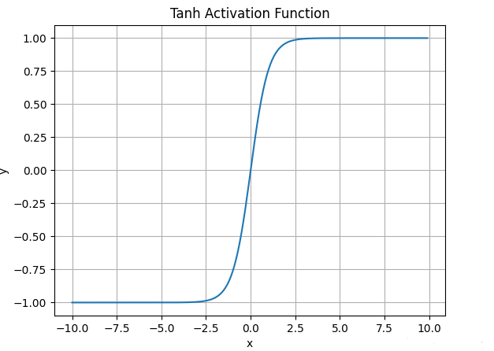
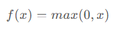
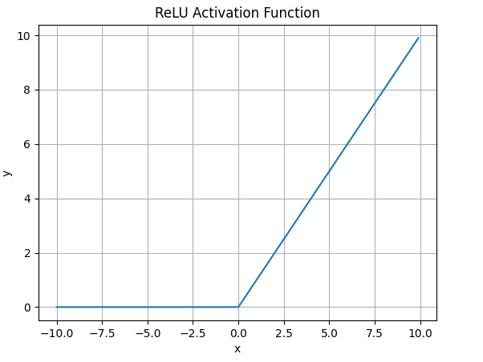
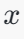
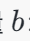
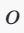

# 一、神经网络的基本概念

## 1. 神经元（感知器）

一种被称为感知器的人工神经元在20世纪五六十年代被科学家Frank提出。通过数学模型，可以认识到**感知器**是一个根据输入与权重来做出决定的设备，随着**权重**和**阈值**的变化，可以得到不同的**决策模型**。当一个感知器计算后得到的值大于阈值时，从神经学的角度来讲这个感知器被激活，反之为0。感知器可以一定程度上模仿人脑做出决策，但是感知器的决策过程全部是线性的，在处理图像处理、语音识别等复杂问题时，难以仅靠线性模型达到良好的识别效果，因此需要在感知器模型种引入非线性部分。

## 2. 非线性神经元

为解决复杂的数学模型，引入**激活函数**，激活函数给神经元带来了非线性因素，使得神经网络可以任意逼近任何非线性函数。

通常将激活函数与线性神经元合并使之成为**非线性神经元**

如果不用激活函数，每一层输出都是上层输入的线性函数，无论神经网络有多少层，输出都是输入的线性组合，这种情况就是最原始的[感知机](https://baike.baidu.com/item/感知机/12723581)（Perceptron）。

激活函数可以分为**两大类：**

- **饱和激活函数：** sigmoid、 tanh...
- **非饱和激活函数:** ReLU 、Leaky Relu  、ELU、PReLU、RReLU...

[深度学习中常见的10种激活函数（Activation Function）总结_激活函数有哪些-CSDN博客](https://blog.csdn.net/qq_42691298/article/details/126590726)

## 3.常见的激活函数

### 3.1 Sigmoid函数

### 3.2 tanh函数

**tanh**激活函数的数学表达式为：

 函数图像如下：

### 3.3 ReLU函数

**ReLU**激活函数的数学表达式为：

函数图像如下：

什么情况下适合使用ReLU？

- ReLU解决了梯度消失的问题，当输入值为正时，神经元不会饱和

- 由于ReLU线性、非饱和的性质，在SGD中能够快速收敛

- 计算复杂度低，不需要进行指数运算

ReLU有哪些缺点？

- 与Sigmoid一样，其输出不是以0为中心的

- Dead ReLU 问题。当输入为负时，梯度为0。这个神经元及之后的神经元梯度永远为0，不再对任何数据有所响应，导致相应参数永远不会被更新

- 训练神经网络的时候，一旦学习率没有设置好，第一次更新权重的时候，输入是负值，那么这个含有ReLU的神经节点就会死亡，再也不会被激活。所以，要设置一个合适的较小的学习率，来降低这种情况的发生

## 4. 神经网络的基本架构

- 神经网络最左边的称为**输入层**，其中的神经元称为**输入神经元**，原始数据经由该层输入到神经网络进行后续处理。

- 最右边的称为**输出层**，包含输出神经元，该层的输出是神经网络对样本处理后的最终结果，如分类结果。

- 在输入层和输出层之间的是中间层，也称为 **隐藏层**，即既非输入也非输出的神经网络层，一个神经网络可以有一个或者多个隐藏层，隐藏层的主要作用是处理从上一层神经元传递来的信号。

一般的，**输入层**和 **输出层**在整体神经网络的外部，称为可见层。设计神经网络的输入输出通常比较简单，直接，例如，假设我们知道了一朵花的4个明显特征（如花瓣的长度，宽度），可以利用这4个特征确定它是哪一种类的花，由于我们已经知道这朵花的4个特征，那么就需要4个输入神经元，每个数值代表花朵的一种特征的具体数值。**输出层**可以包含一个或者多个神经元，这由我们想要设定的具体花朵类别决定，可以根据输出的数字，确定花朵的类型。我们可以使用每一个**输出神经元**代表一种类型的花，这种方法称为One-Hot，One-Hot是一种常见的输出层编码方法。

## 5. 梯度下降

[机器学习-梯度下降算法原理及公式推导_梯度下降计算公式-CSDN博客](https://blog.csdn.net/iqdutao/article/details/107174240)

## 6. 反向传播

[“反向传播算法”过程及公式推导（超直观好懂的Backpropagation）_反向传播算法(过程及公式推导)-CSDN博客](https://blog.csdn.net/ft_sunshine/article/details/90221691)

**“正向传播”求损失，“反向传播”回传误差**。同时，神经网络每层的每个神经元都可以**根据误差信号修正每层的权重**

# 思考

## 一、输入x是 784长度的向量，什么机制使得输出y变成的长度为10的向量？

将长度为784的向量 x*x* 转换为长度为10的向量，是通过**全连接层（Fully Connected Layer）** 实现的。具体操作通过 **权重矩阵** 和 **偏置向量** 来完成。

### 1. **全连接层的基本机制：**

全连接层的工作机制可以用矩阵乘法来描述。给定输入向量 x*x*（长度为784），要转换为长度为10的输出向量，通常通过如下步骤：

#### 2. **步骤：**

1. **输入向量 **：这是一个长度为784的向量，表示神经网络的输入。

   

2. **权重矩阵 **：全连接层会有一个权重矩阵 W*W*，其维度是 10×78410×784，表示从输入784维向量到输出10维向量的权重连接。每一行表示一个输出神经元与所有输入神经元的权重连接。

3. **偏置向量 **：偏置向量 b*b* 是一个长度为10的向量，表示每个输出神经元的偏置。

4. **计算输出向量 **：通过矩阵乘法计算输出向量。输出向量 o*o* 的维度是10。具体计算方式如下：

   

   - W \cdot x \)：矩阵 \( W \) 乘以向量 \( x \)，将784维的输入向量映射为10维的输出向量。

### 3. **矩阵乘法具体步骤：**

- 假设输入向量 是长度为784的向量：

  

- 权重矩阵 W*W* 是一个 10×78410×784 的矩阵：

  

- 偏置向量 b*b* 是一个长度为10的向量：

  

- 输出向量 o*o* 通过矩阵乘法和加法得到，维度为10：

  

每一行表示一个输出神经元的结果，最终得到一个长度为10的向量。

### 4. **激活函数：**

在得到长度为10的向量后，通常会将其通过激活函数进行处理。在分类任务中，输出层通常使用 **Softmax** 函数，将每个输出值转换为概率值。Softmax 函数公式为：

这会将输出向量 o*o* 转换为一个概率分布，表示输入属于不同类别的概率。

### 总结：

将784长度的输入向量变为10长度的输出向量的关键步骤是通过 **全连接层的矩阵乘法** 和 **偏置项**，最终计算出长度为10的向量，并通过 **Softmax** 函数将其转换为概率分布，从而实现分类。
