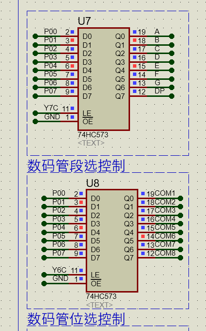
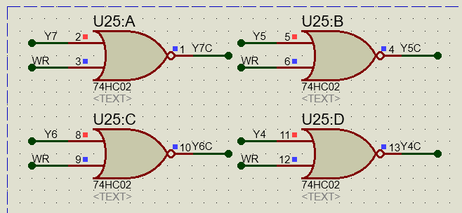
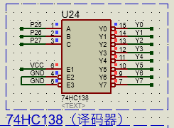
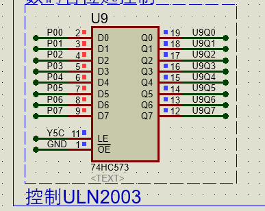
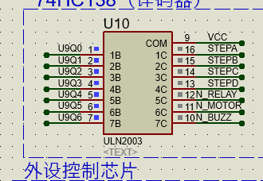
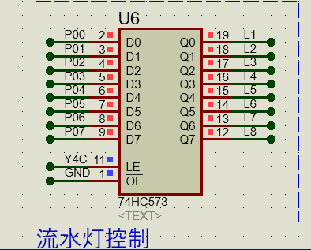
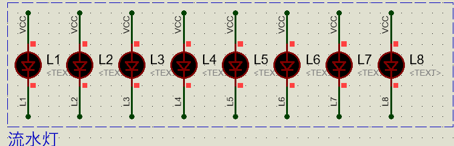

# 前言

**为了确保程序的准确性，总结了以下要点**

1. ==保证程序**逻辑正确**，其次再是“基于现象上”的正确，保证程序不会出现**隐性问题**==
2. ==在逻辑正确的前提下，保证数据读取的**实时性**，尽量优化代码执行效率==
3. ==对数据的处理，在确保程序完全正常运行的前提下，最大限度地提高内存空间的**利用率**==
4. ==编写程序时，先写主框架，验证逻辑后，再依次验证其他模块==

# 数码管/LED模块工作原理

==例如：数码管的段选/位选输出由两个74HC573锁存器控制==




>  **锁存器送出数据的过程**
>
> 1. P0输出8位数据
>
> 2. 锁存器不使能，Q0~Q7为之前的数据，D0 ~ D7等待被送出
>
> 3. 锁存器使能，数据送出，Q0~Q7即为P00 ~ P07的信号
>
>    注意：OE此处默认接GND

>**如何控制锁存器送出数据的顺序/使锁存器单个送出数据? **
>
>- 由一个或非门(U25)的四个输出控制四个锁存器的输入使能信号(Y7C~Y4C)
>
>
>
>- 或非门的输入Y7 ~ Y4由一个译码器的输出控制，或非门的一端WR默认为低电平，那么这里的或非门就相当于一个输入为Y（n）的非门
>- 其中74HC138(U24)的输入为P2口的P27~P25 
>- 通过推导可知，P27 ~ P25对应的三位二进制数即为后面会使能的锁存器，即111使得Y7=0，继而使得与非门输出Y7C=1，使得控制数码管段选的锁存器使能，送出数据。
>
>
>
>总结：P27~P25对应组成的二进制值即为使能的锁存器, LED/数码管/外设控制都是由锁存器控制，锁存器的输入共用==P0口==，这样通过多个锁存器，以及逻辑电路，节省了单片机的IO口

# 程序设计与分析

## CT107D初始化

**==上电时，默认所有IO口为高电平，未被使能过的锁存器默认输出低电平，这会导致全部LED被点亮，有源蜂鸣器响(也是低电平有效),这就需要我们写一个程序初始化函数，关闭这些影响后续功能的现象==**

```c
/**
  * @brief		系统初始化函数			
  * @param  	无
  * @retval 	无		
  */
void System_Init(void)
{
    /*关闭LED*/
	P0 = 0xFF;
	P2 = P2 & 0x1F | 0x80;    //100X XXXX 锁存器Y4C使能
	P2 &= 0x1F;
	
    /*关闭蜂鸣器*/
	P0=0x00;//锁存器输出会经过ULN2003，相当于反相器，预载值应为全低电平，这样最终输出的是高电平
	P2 = P2 & 0x1F | 0xA0;    //101X XXXX 锁存器Y5C使能
	P2 &= 0x1F;	
}
```

**注意：锁存器输出会经过ULN2003，相当于(增强驱动能力)反相器，预载值(P2)应为全低电平，这样最终输出的是高电平。**

ULN2003：[【常用芯片】ULN2003工作原理及中文资料（实例：STM32驱动28BYJ48步进电机）_uln2003驱动板说明书-CSDN博客](https://blog.csdn.net/qq_38410730/article/details/79787766)

**由于单片机的引脚输出电流太低了，无法驱动大部分的设备。而ULN2003只相当于是一个开关，设备（负载）的供电是在外围电路上，而它能够通过微弱的单片机输出电流来控制外围电路的开闭。这某种程度上也可以说是，放大电流，增加驱动能力**






## LED模块

原理图



## LED/蜂鸣器/继电器

ps:~(0x01<<addr); 一定要加括号，否则会出现逻辑错误，如 0000 0001--> 1110 1111 变成 1111 1110 -- > 1110 0000 ，最终经过一系列运行导致==LED亮度降低==(待考究)。

ps:==一定要仔细注意逻辑，不能记忆性写程序！==

```c
#include <LED.h>

/**
  * @brief  LED控制函数
  * @param  LED位，使能标志位
  * @retval 无
  */

static unsigned char temp_1;
static unsigned char temp_old_1;

void LED_Disp(unsigned addr,enable) 
{
	static unsigned char temp=0x00;   // led暂存值
	static unsigned char temp_old=0xFF; //上下两个变量应当赋不想等的初值
	if(enable)//LED使能时
	{
		temp|=0x01<<addr; //点亮第一位, 即 0x01<<0 temp=xxxx xxx1
	}
	else
	{
		temp&=~(0x01<<addr); //熄灭第一位，即~ (0x01<<0) temp=xxxx xxx0
	}
	if(temp!=temp_old) // temp的值发生变化时（即外部调用此函数，想要改变LED的状态），才会对P0进行赋值操作，因为P0口负责多个锁存器的预载值，LED一般是静态的，不应该对P0进行反复赋值
	{
		P0=~temp; //低电平有效，故按位取反
		P2 = P2 & 0x1F | 0x80;    //100X XXXX 锁存器（Y4C使能）
		P2 &= 0x1F;	//000 x xxxx
		temp_old=temp;//记录当前的led暂存值
	}
}

void Beep(unsigned char flag)
{
	if(flag)
		temp_1 |= 0x40;	
	else
		temp_1 &= ~0x40;
	if(temp_1 != temp_old_1)
	{
		P0 = temp_1;
		P2 = P2 & 0x1f | 0xa0; //锁存器（Y5C使能）
		P2 &= 0x1f;
		temp_old_1 = temp_1;		
	}
}

void Relay(unsigned char flag)
{
	if(flag)
		temp_1 |= 0x10;
	else
		temp_1 &= ~0x10;
	if(temp_1 != temp_old_1)
	{
		P0 = temp_1;
		P2 = P2 & 0x1f | 0xa0;//锁存器（Y5C使能）
		P2 &= 0x1f;
		temp_old_1 = temp_1;		
	}	
}
```

**PS:按位取或/按位取与，通常用于对单个BIT位进行操作**

## 数码管模块

ps:**==蓝桥杯单片机开发板使用的是共阳极数码管，注意段码和位码，以及Disp函数的逻辑==**

```c
#include <Nixie.h>

//共阳极数码管
unsigned char Nixie_seg[] = //段码
{
	0xc0, //0
	0xf9, //1
	0xa4, //2
	0xb0, //3
	0x99, //4
	0x92, //5
	0x82, //6
	0xf8, //7
	0x80, //8
	0x90, //9
	0xFF, //熄灭	<10>
	0x88, //A 	<11>
	0x83, //b	<12>
	0xc6, //C	<13>	
	0xa1, //d	<14>
	0x86, //E	<15>
	0x8e  //F	<16>
};

unsigned char Nixie_Location[] =  //位码
{
	0x01,
	0x02,
	0x04,
	0x08,
	0x10,
	0x20,
	0x40,
	0x80
};
/**
  * @brief		数码管点亮函数			
  * @param  	位选，段选，小数点
  * @retval 	无
  */	
void Nixie_Disp(unsigned char Location,Seg,Point)
{
	P0=0xFF; //段码，数码管熄灭，消影				
	P2 = P2 & 0x1F | 0xE0;    //111X XXXX 锁存器 Y7C使能
	P2 &= 0x1F;		//关闭锁存器
	
	P0=Nixie_Location[Location];//位选预载值
	P2 = P2 & 0x1F | 0xC0;    //101X XXXX 锁存器 Y5C使能
	P2 &= 0x1F;		//关闭锁存器
	
	P0=Nixie_seg[Seg];//段选预载值
    //这里的Point即为数码管‘点’的使能位，实质上‘点’对应的是数码管段码的BIT7，最高位
	if(Point){P0 &= 0x7F;}    //错误写法：P0|=0x80; 共阳极数码管！，逻辑0点亮！
	P2 = P2 & 0x1F | 0xE0;   //111X XXXX 锁存器 Y7C使能
	P2 &= 0x1F;		//关闭锁存器
}
```

## 定时器模块

**==注意，STC15单片机的定时器是支持自动重装载的，这里不需要在中断子程序中赋初值，否则会出现定时器定时值的混乱==**

```c
#include <Timer0.h>

/**
  * @brief		定时器初始化					
  * @param  	无
  * @retval 	无		
  */
void Timer0_Init(void)		//1毫秒@12.000MHz
{
	AUXR &= 0x7F;			//定时器时钟12T模式
	TMOD &= 0xF0;			//设置定时器模式
	TL0 = 0x18;				//设置定时初始值
	TH0 = 0xFC;				//设置定时初始值
	TF0 = 0;				//清除TF0标志
	TR0 = 1;				//定时器0开始计时
	ET0 = 1;				//定时器中断0打开
	EA  = 1;				//总中断打开
	PT0 = 1;
}

/*
void Timer0_Server(void)  interrupt 1
{
}
*/
```

## 按键模块

ps:**==键值读取函数中定义局部变量temp一定要赋初值！！！否则会出现在没有按键按下时键值读取异常值的情况。==**

```c
#include <Key.h>

/**
  * @brief		矩阵按键读取函数
  * @param  	无
  * @retval 	无		
  */
/*矩阵按键模式*/
unsigned char Key_Read(void)
{
	unsigned char temp=0;//局部变量初始化为0
    ET0=0;//串口使用屏蔽
	P44=0;P42=1;P35=1;P34=1;
	if(P33==0){temp=4;}
	if(P32==0){temp=5;}
	if(P31==0){temp=6;}
	if(P30==0){temp=7;}
	P44=0;P42=1;P35=1;P34=1;
	if(P33==0){temp=8;}
	if(P32==0){temp=9;}
	if(P31==0){temp=10;}
	if(P30==0){temp=11;}
	P44=0;P42=1;P35=1;P34=1;
	if(P33==0){temp=12;}
	if(P32==0){temp=13;}
	if(P31==0){temp=14;}
	if(P30==0){temp=15;}
	P44=0;P42=1;P35=1;P34=1;
	if(P33==0){temp=16;}
	if(P32==0){temp=17;}
	if(P31==0){temp=18;}
	if(P30==0){temp=19;}
    ET0=1;//串口使用打开
    P3=0xff;//
	return temp;
}

/**
  * @brief		独立按键读取函数
  * @param  	无
  * @retval 	无		
  */
/*独立按键模式*/
/*unsigned char Key_Read(void)
{
	if(P33==0){temp=4;}
	if(P32==0){temp=5;}
	if(P31==0){temp=6;}
	if(P30==0){temp=7;}
	return temp;
}*/
```

## 主函数模块

```c
//头文件引用
#include <Key.h>
#include <Nixie.h>
#include <LED.h>
#include <Timer0.h>
#include <Init.h>

unsigned char Nixie_Buf[8]={10,10,10,10,10,10,10,10};//数码管显示数据
unsigned char Nixie_Pos;//数码管数据数组位下标
unsigned char Nixie_Point[8]={0,0,0,0,0,0,0,0};//数码管每一段的“点”数据

unsigned char Key;//键值
unsigned char Key_Up,Key_Down,Key_Val,Key_Old;//按键扫描变量

unsigned char ucLED[8]={0,0,0,0,0,0,0,0};//LED显示数据

unsigned int Nixie_Timer;//数码管定时更新
unsigned int Key_Timer;//按键定时扫描

/*按键处理函数*/
void Key_Proc(void)
{
	if(Key_Timer) return;//Key_Timer=0时执行下面的语句
	Key_Timer=1;
	//按键扫描部分//
	Key_Val=Key_Read();
	Key_Down=Key_Val & (Key_Old ^ Key_Val);
	Key_Up=~Key_Val & (Key_Old ^ Key_Val);
	Key_Old=Key_Val;
}

/*信息（数码管）显示处理函数*/
void Nixie_Proc(void)//信息处理/显示程序
{
	if(Nixie_Timer) return;//Nixie_Timer=0时执行下面的语句
	Nixie_Timer=1;
	
}

/*其他信息处理函数*/
void LED_Proc(void)//LED“报警”程序
{

}

/*串口处理函数*/
void Uart_Proc(void)
{
    
}

/*主函数*/
void main()
{
	Timer0_Init();//定时器初始化
	System_Init();//系统板初始化
	while(1)//循环执行程序模块
	{
		Key_Proc();
		Nixie_Proc();
		LED_Proc();
	}
}

void Uart_Server(void) interrupt 4
{
    
}

void Timer0_Server(void)  interrupt 1//中断服务程序
{
	if(++Nixie_Timer==500){Nixie_Timer=0;}//500ms定时长度
	if(++Key_Timer==20){Key_Timer=0;}//20ms定时长度
	if(++Nixie_Pos==8){Nixie_Pos=0;}//数码管动态显示
	Nixie_Disp(Nixie_Pos,Nixie_Buf[Nixie_Pos],Nixie_Point[Nixie_Pos]);//数码管动态显示
	LED_Disp(Nixie_Pos,ucLED[Nixie_Pos]);//LED，一轮即可点亮
}
```

## 超声波模块（使用PCA）

**ps:==返回值的单位是cm,可以根据题目要求更改底层==**

```C
#include <ultrasound.h>
#include "intrins.h"

sbit Tx = P1^0;
sbit Rx = P1^1;

void Delay12us()		//@12.000MHz
{
	unsigned char i;

	_nop_();
	_nop_();
	i = 38;
	while (--i);
}

void Ut_Wave_Init() //超声波模块初始化
{
	unsigned char i;
	for(i=0;i<8;i++)
	{
		Tx = 1;
		Delay12us();
		Tx = 0;
		Delay12us();
	}
}

unsigned char Ut_Wave_Data() //超声波距离读取函数
{
    unsigned int time;//时间储存变量
    CCON =  0x00;// 初始化PCA控制寄存器，PCA定时器停止，清除CF
    CH = CL = 0;//复位计数值 等待超声波信号发出
    EA=0;//总中断关闭
    Ut_Wave_Init();//发送超声波信号
    EA=1;//总中断打开
    CR = 1;//开始计时
    while((Rx == 1) && (CF == 0));//等待接受返回信号或者定时器溢出
    CR = 0;//停止计时
    if(CF == 0) //定时器没有溢出
    {
        time = CH << 8 | CL;//读取当前时间
        return (time * 0.017);//返回距离值
    }
    else
    {
        CF = 0;//清除溢出标志位
        return 0;
    }
}
```

## 串口模块（putchar重定向）

```c
#include <Uart.h>

/* 串口初始化函数 */
void Uart1_Init(void)		//9600bps@12.000MHz
{
	SCON = 0x50;		//8位数据,可变波特率
	AUXR |= 0x01;		//串口1选择定时器2为波特率发生器
	AUXR |= 0x04;		//定时器时钟1T模式
	T2L = 0xC7;		//设置定时初始值
	T2H = 0xFE;		//设置定时初始值
	AUXR |= 0x10;		//定时器2开始计时
	ES = 1;//允许串口中断
	EA = 1;//总中断开启
}

/* putchar重定向 */
extern unsigned char putchar(unsigned char ch)
{
	SBUF= ch;//将dat数据赋给SBUF，将数据发送出去
	while(TI == 0);//等待数据发送
	TI = 0;//将发送标志位清零
	return (ch);
}
```

## 串口中断服务程序

```c
void Uart_Server() interrupt 4
{
	if(RI == 1 && Uart_RecData_Index <8)
    {
        Uart_RecData[Uart_RecData_Index++]=SBUF;
        RI=0;
    }
    
    if(Uart_RecData_Index == 6)
    {
        Uart_RecData_Index=0;
    }
}
```


## 定时器使用注意事项：

- 定时器0：主要工作定时器.NE555方波发生器
- 定时器1：一般用于PWM,使用NE555时,主要定时器选为定时器1
- 定时器2：串口中断1绑定
- PCA：用于超声波模块

# #补充 

## 一、IIC模块

```c
/*
  程序说明: IIC总线驱动程序
  软件环境: Keil uVision 4.10 
  硬件环境: CT107单片机综合实训平台 8051，12MHz
  日    期: 2011-8-9
*/

#include "iic.h"


#include "intrins.h"

#define DELAY_TIME 5

#define Photo_Res_Channel 0x41
#define Adj_Res_Channel 0x43


//总线引脚定义
sbit SDA = P2^1;  /* 数据线 */
sbit SCL = P2^0;  /* 时钟线 */

void IIC_Delay(unsigned char i)
{
    do{_nop_();}
    while(i--);        
}

void Delay200us(void)	//@12.000MHz
{
	unsigned char data i, j;

	i = 3;
	j = 82;
	do
	{
		while (--j);
	} while (--i);
}

//总线启动条件
void IIC_Start(void)
{
    SDA = 1;
    SCL = 1;
    IIC_Delay(DELAY_TIME);
    SDA = 0;
    IIC_Delay(DELAY_TIME);
    SCL = 0;	
}

//总线停止条件
void IIC_Stop(void)
{
    SDA = 0;
    SCL = 1;
    IIC_Delay(DELAY_TIME);
    SDA = 1;
    IIC_Delay(DELAY_TIME);
}

//发送应答
void IIC_SendAck(bit ackbit)
{
    SCL = 0;
    SDA = ackbit;  					// 0：应答，1：非应答
    IIC_Delay(DELAY_TIME);
    SCL = 1;
    IIC_Delay(DELAY_TIME);
    SCL = 0; 
    SDA = 1;
    IIC_Delay(DELAY_TIME);
}

//等待应答
bit IIC_WaitAck(void)
{
    bit ackbit;
	
    SCL  = 1;
    IIC_Delay(DELAY_TIME);
    ackbit = SDA;
    SCL = 0;
    IIC_Delay(DELAY_TIME);
    return ackbit;
}

//通过I2C总线发送数据
void IIC_SendByte(unsigned char byt)
{
    unsigned char i;

    for(i=0; i<8; i++)
    {
        SCL  = 0;
        IIC_Delay(DELAY_TIME);
        if(byt & 0x80) SDA  = 1;
        else SDA  = 0;
        IIC_Delay(DELAY_TIME);
        SCL = 1;
        byt <<= 1;
        IIC_Delay(DELAY_TIME);
    }
    SCL  = 0;  
}

//从I2C总线上接收数据
unsigned char IIC_RecByte(void)
{
    unsigned char i, da;
    for(i=0; i<8; i++)
    {   
    	SCL = 1;
	IIC_Delay(DELAY_TIME);
	da <<= 1;
	if(SDA) da |= 1;
	SCL = 0;
	IIC_Delay(DELAY_TIME);
    }
    return da;    
}
```

### 基于IIC的AD/DA转换

```c
unsigned char AD_Read(unsigned char addr)
{
    unsigned char temp;
    
    IIC_Start();       //主机发送开始信号
    IIC_SendByte(0x90); //主机发送寻址信号, 确认PCF8591，写模式
    IIC_WaitAck();      //主机等待应答
    IIC_SendByte(addr); //主机发送一个字节(要操作数据的地址),对应AD转换的通道
    IIC_WaitAck();      //主机等待应答
    
    IIC_Start();		 //主机发送开始信号
    IIC_SendByte(0x91); //主机发送寻址信号, 确认PCF8591，读模式
    IIC_WaitAck();		//主机等待应答
    temp = IIC_RecByte(); //从机送出数据,主机读入的数据用变量存储
    IIC_SendAck(1);		//主机不发送应答,1表示完成数据的接收,从机停止发送数据
    IIC_Stop();			//中止信号,结束IIC通信
    return temp;
}

void DA_Write(unsigned char Data)
{
    IIC_Start();	//主机发送开始信号
    IIC_SendByte(0x90);//主机发送寻址信号, 确认PCF8591，写模式
    IIC_WaitAck();	//主机等待应答
    IIC_SendByte(0x41); //主机发送一个字节(要操作数据的地址),对应DA转换的通道
    IIC_WaitAck();	//主机等待应答
    IIC_SendByte(Data); //主机送出DA输出的数据字节
    IIC_WaitAck(); //主机等待应答
    IIC_Stop(); //中止信号,结束IIC通信
}
```

### 基于IIC的AT24C02(EPPROM)储存器

```c
void EEPROM_Write(unsigned char *EEPROM_String,unsigned char addr,unsigned char num)
{
	IIC_Start();//主机发送开始信号
    IIC_SendByte(0xA0);//主机发送寻址信号，确认EEPROM芯片，写模式
    IIC_WaitAck();//主机等待应答
    IIC_SendByte(addr);//发送一个要操作数据的地址字节,最好是八的倍数，如果不是8的倍数，将无法写入整页的字节
    IIC_WaitAck();//主机等待应答

    while(num--)//循环发送数据字节,存入AT24C02
    {
        IIC_SendByte(*EEPROM_String++);//发送数据字节,要存入AT24C02的数据,字节个数为num
        IIC_WaitAck();//主机等待应答
        IIC_Delay(200);//延时200ms,保证从机(AT24C02能够完整收到数据)
    }
    
    IIC_Stop();//终止IIC通信
}

void EEPROM_Read(unsigned char *EEPROM_String,unsigned char addr,unsigned char num)
{
    IIC_Start();//主机发送开始信号
    IIC_SendByte(0xA0);//主机发送寻址信号，确认EEPROM芯片，写模式
    IIC_WaitAck();//主机等待应答
    IIC_SendByte(addr);//发送一个要操作数据的地址字节
    IIC_WaitAck();//主机等待应答  

    IIC_Start();//主机发送开始信号
    IIC_SendByte(0xA1);//主机发送寻址信号，确认EEPROM芯片，读模式
    IIC_WaitAck();//主机等待应答	
	
    while(num--)//循环接收数据字节,存入EEPROM_String指向的地址
    {
        *EEPROM_String++=IIC_RecByte();//指针移位读取数据到对应的地址中
        if(num)//判断是否读取完数据
        {
            IIC_SendAck(0);//发送应答0,表示继续接收数据
        }
        else 
        {
            IIC_SendAck(1);//发送应答1,表示停止接收数据
        }
    }
    IIC_Stop();//终止IIC通信
}
```


## 二、onewire模块

```c
#include "onewire.h"
#include "reg52.h"

sbit DQ = P1^4;  

//单总线内部延时函数
void Delay_OneWire(unsigned int t)  
{
	t *= 12;
	while(t--);
}

//单总线写操作
void Write_DS18B20(unsigned char dat)
{
	unsigned char i;
	for(i=0;i<8;i++)
	{
		DQ = 0;
		DQ = dat&0x01;
		Delay_OneWire(5);
		DQ = 1;
		dat >>= 1;
	}
	Delay_OneWire(5);
}

//单总线读操作
unsigned char Read_DS18B20(void)
{
	unsigned char i;
	unsigned char dat;
  
	for(i=0;i<8;i++)
	{
		DQ = 0;
		dat >>= 1;
		DQ = 1;
		if(DQ)
		{
			dat |= 0x80;
		}	    
		Delay_OneWire(5);
	}
	return dat;
}

//DS18B20初始化
bit init_ds18b20(void)
{
  	bit initflag = 0;
  	
  	DQ = 1;
  	Delay_OneWire(12);
  	DQ = 0;
  	Delay_OneWire(80);
  	DQ = 1;
  	Delay_OneWire(10); 
    initflag = DQ;     
  	Delay_OneWire(5);
  
  	return initflag;
}

float rd_temperature(void)
{
	unsigned char low,high;
	init_ds18b20();//初始化ds18b20;
	Write_DS18B20(0xcc);//跳过ROM指令
	Write_DS18B20(0x44);//开始温度转换

	init_ds18b20();//初始化ds18b20;
	Write_DS18B20(0xcc);//跳过ROM指令
	Write_DS18B20(0xBe);//开始温度读取
	
	low = Read_DS18B20();
	high = Read_DS18B20();
	
	return (high << 8 | low)/16.0;//二进制转十进制
	
}
```

## #DS1302模块

### DS1302（时钟芯片）底层

```c
#include <reg52.h>
#include <intrins.h>
#include "ds1302.h"
sbit SCK=P1^7;		
sbit SDA=P2^3;		
sbit RST = P1^3;  											

void Write_Ds1302(unsigned  char temp) 
{
	unsigned char i;
	for (i=0;i<8;i++)     	
	{ 
		SCK=0;
		SDA=temp&0x01;
		temp>>=1; 
		SCK=1;
	}
}   

void Write_Ds1302_Byte( unsigned char address,unsigned char dat )     
{
 	RST=0;	_nop_();
 	SCK=0;	_nop_();
 	RST=1; 	_nop_();  
 	Write_Ds1302(address);	
 	Write_Ds1302(dat);		
 	RST=0; 
}

unsigned char Read_Ds1302_Byte ( unsigned char address )
{
 	unsigned char i,temp=0x00;
 	RST=0;	_nop_();
 	SCK=0;	_nop_();
 	RST=1;	_nop_();
 	Write_Ds1302(address);
 	for (i=0;i<8;i++) 	
 	{		
		SCK=0;
		temp>>=1;	
 		if(SDA)
 		temp|=0x80;	
 		SCK=1;
	} 
 	RST=0;	_nop_();
 	SCK=0;	_nop_();
	SCK=1;	_nop_();
	SDA=0;	_nop_();
	SDA=1;	_nop_();
	return (temp);			
}
```

### 基于底层的时序编写 

```c
void Set_Rtc(unsigned char* ucRtc)
{
	unsigned char i;
	Write_Ds1302_Byte(0x8e,0x00);//关闭写保护
	for(i=0;i<3;i++)
		Write_Ds1302_Byte(0x84-i*2,ucRtc[i]);//给ds1302写入数据,0x84时 0x82分 0x80秒
	Write_Ds1302_Byte(0x8e,0x80);//打开写保护
}


void Read_Rtc(unsigned char* ucRtc)
{
	unsigned char i;
	for(i=0;i<3;i++)
		ucRtc[i] = Read_Ds1302_Byte(0x85-i*2);//读取ds1302的数据
}

void Set_Date(unsigned char* ucDate)
{
	Write_Ds1302_Byte(0x8e,0x00);//关闭写保护
	Write_Ds1302_Byte(0x8c,ucDate[0]);
	Write_Ds1302_Byte(0x88,ucDate[1]);
	Write_Ds1302_Byte(0x86,ucDate[2]);
	Write_Ds1302_Byte(0x8e,0x80);	
}

void Read_Date(unsigned char* ucDate)
{
	ucDate[0] = Read_Ds1302_Byte(0x8d);
	ucDate[1] = Read_Ds1302_Byte(0x89);
	ucDate[2] = Read_Ds1302_Byte(0x87);
}
```


## 总结

- **程序模板使用到的模块：**
  - 系统初始化、按键、数码管、LED（继电器、蜂鸣器）
  - 串口(定时器2)、超声波(PCA)，NE555(定时器0（计数器模式))，定时器1
  - IIC（AD/DA转换、AT24C02存储器）、OneWire（ds18b20温度读取）
  - DS1302时钟芯片

- **单片机程序设计，模块化，可读性强，执行效率高，占用储存空间小，以及契合硬件电路底层原理是最重要的思路**

- **后续设计功能更复杂，更强的单片机/嵌入式系统时，就要拓展相关的知识面，进一步提升对单片机/各种芯片/电路的认识。**


# 进阶

## EEPROM存入多字节大小变量

### 方法一 多个变量值传递

```c
unsigned int change_counter=0;//参数更改计次
unsigned char EEPROM_Data[2]={0,0};//EEPROM流数组，存储int类型
```

```c
	EEPROM_Read(EEPROM_Data,0x00,2);//EEPROM初始化读取
	change_counter=EEPROM_Data[0] | EEPROM_Data[1]<<8;//将EEPROM数据流转存入整型变量
```

**==缺点：浪费了内存空间，逻辑繁琐==**

### 方法二 联合体

**==使用联合体，联合体内的元素公用一段内存空间。指定的变量只有在调用时才会使用内存空间，节省资源同时逻辑简洁直观==**

```c
union 
{
	unsigned int change_counter;
	unsigned char Temp[2];
}EEPROM_DATA;
```

**对比**

> **方法一**
>
>  >```c
>  >	.change_counter++;//参数改变次数加一	
>  >	/*将整数型变量存入数组中*/
>  >	EEPROM_Data[0] = (unsigned char)(change_counter & 0xFF);//低八位写入
>  >	EEPROM_Data[1] = (unsigned char)(change_counter>>8 & 0xFF);//高八位写入
>  >	EEPROM_Write(&EEPROM_Data[0],0x00,2);//将EEPROM数据流存入AT24C02
>  >```
>
> **方法二**
>
> >```c
> >			EEPROM_Data.change_counter++;
> >			EEPROM_Write(&EEPROM_Data.Temp[0],0x00,2);//将EEPROM数据流写入AT24C02
> >```

## EEPROM

**EEPROM读取数据需要在开中断之前，本身时序较长，容易被打断**

```c
void main()
{
	EEPROM_Read(EEPROM_Data_T.Temp,0x00,2);//EEPROM
	
	System_Init();//系统初始化，关闭LED、继电器、蜂鸣器                                                                         
	Timer0_Init();//定时器初始化
	Uart1_Init();//串口初始化
	Ultrasound_Init();//超声波初始化
	rd_temperature();//读取上电的默认温度
	Delay(750);//延时750ms,等待温度读取正常稳定
	while(1)
	{
		Key_Proc();
		Nixie_Proc();
		LED_Proc();
		Uart_Proc();
	}
}
```


