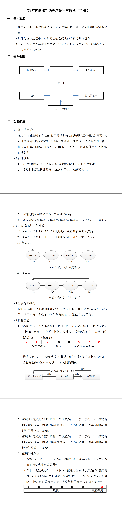

# 题目要求



## 题目分析（思路）

1. 首先，定义按键所控制的相关变量
2. 编写数码管显示的逻辑，以”设置状态为准“，测试按键是否能正常控制相关参数(工作模式、流转间隔)
   - 因为一共有四个工作模式，流转间隔定义为一个数组，存放各个元素的流转时长

3. 将工作模式1的相关逻辑（LED流转方式）编写出来
   - 这里使用一个指针用于LED的点亮(LED_OFF)，另一个用于LED的熄灭(LED_ON)

4. 将工作模式，流转间隔的逻辑与LED工作模式1关联，测试按键功能是否正常，LED是否能被流转间隔控制

5. 如果以上程序测试正确，编写其他三个工作模式的LED模块
   - 此时进行程序测试，功能正常，但是切换其他流转模式会有上一个模式的LED”残留“ (如双LED模式切换到单LED模式时)，因此需要进行LED的复位（在按键控制模块中编写）
6. 修改完毕后，编写亮度控制，此时注意到，一个定时器0无法满足对LED扫描的同时进行亮度控制，因此再调用定时器1，用于LED的**扫描指针偏移**，以及LED的**PWM控制亮度**。
   - 这里修改完程序后，发现数码管闪烁，这是因为定时器1的频率较高，会打断主函数中数码管显示模块，因此将Nixie_Proc()函数放入定时器1中进行运行
7. 当以上各个功能全部测试完毕后，调用EEPROM模块，保存流转间隔

# 程序部分

```c
//头文件引用
#include <Key.h>
#include <Nixie.h>
#include <LED.h>
#include <Timer0.h>
#include <Init.h>
#include <iic.h>

unsigned char Nixie_Buf[8]={10,10,10,10,10,10,10,10};//数码管显示数据
unsigned char Nixie_Pos;//数码管数据数组位下标
unsigned char Nixie_Point[8]={0,0,0,0,0,0,0,0};//数码管每一段的“点”数据

unsigned char Key;//键值
unsigned char Key_Up,Key_Down,Key_Val,Key_Old;//按键扫描变量

unsigned char ucLED[8]={0,0,0,0,0,0,0,0};//LED显示数据

unsigned int Nixie_Timer;//数码管定时更新
unsigned int Key_Timer;//按键定时扫描

unsigned char Work_Mode;//工作模式参数 0-模式1 1-模式2 2-模式3 3-模式4
unsigned char Set_Mode;// 0-数码管熄灭 1-模式编号 2-流转间隔
unsigned char Nixie_FlashFlag;//闪烁标志位
unsigned int Timer_800ms;//0.8s定时（闪烁用）

/**/
unsigned int LED_Flow_Timer_Set[]={400,400,400,400};//流转间隔参数,控制流转速度
unsigned int LED_Flow_Timer;//流转定时
bit LED_Enable=0;//LED流转使能位，1时LED流转使能，默认LED流转启动
unsigned char LED_Level_ShowFlag;//按下按键4显示LED亮度等级
unsigned char LED_ON=0;//LED点亮指针
unsigned char LED_OFF=7;//LED熄灭指针
/*LED亮度控制相关参数*/
unsigned char LED_Count;//LED显示周期
unsigned char LED_Level;//LED等级
unsigned char LED_Pos;//LED扫描位

void Key_Proc(void)//按键检测程序
{
	if(Key_Timer) return;//Key_Timer=0时执行下面的语句
	Key_Timer=1;
	
	/*按键扫描模块*/
	Key_Val=Key_Read();
	Key_Down=Key_Val & (Key_Old ^ Key_Val);
	Key_Up=~Key_Val & (Key_Old ^ Key_Val);
	Key_Old=Key_Val;
	
	/*按键4按下*/
	if(Key_Old==4)
	{
		LED_Level_ShowFlag=1;//显示LED亮度等级
	}
	else
	{
		LED_Level_ShowFlag=0;//松开，LED亮度等级标志位失效
	}
	
	/*按键控制模块*/
	switch(Key_Down)
	{
		case 7://按键7，用于控制LED的启动和暂停
			LED_Enable^=1;
			break;
		case 6://按键6，控制设置界面
			if(++Set_Mode==3)
				Set_Mode=0;
				EEPROM_Write(LED_Flow_Timer_Set,0x00,4);
			break;
		case 5://按键5
			if(Set_Mode==2)//设置界面位于“流转间隔“对应”运行模式“的流转间隔+100ms
			{	
				LED_Flow_Timer_Set[Work_Mode]+=100;
				if(LED_Flow_Timer_Set[Work_Mode]>=1300)
					LED_Flow_Timer_Set[Work_Mode]=400;
			}
			else if(Set_Mode==1)//设置界面位于“运行模式”运行模式切换
			{
				if(++Work_Mode==4)
					Work_Mode=0;
				
				/*每次模式切换，对LED指针进行复位*/
				if(Work_Mode==0)
				{
					//上一个模式为4
					ucLED[LED_OFF]=0;//控制熄灭的LED指针
					ucLED[7-LED_OFF]=0;//控制熄灭的LED指针
					LED_ON=0;//LED点亮指针复位
				}
				else if(Work_Mode==1)
				{
					//上一个模式为1
					ucLED[LED_OFF]=0;//控制熄灭的LED指针
					LED_ON=7;//LED点亮指针复位
				}
				else if(Work_Mode==2)
				{
					//上一个模式为2
					ucLED[LED_OFF]=0;//控制熄灭的LED指针
					LED_ON=0;//LED点亮指针复位
				}
				else
				{
					//上一个模式为3
					ucLED[LED_OFF]=0;//控制熄灭的LED指针
					ucLED[7-LED_OFF]=0;//控制熄灭的LED指针	
					LED_ON=3;//LED点亮指针复位
				}
				
			}
			break;
		case 4:
			if(Set_Mode==2)
			{	
				LED_Flow_Timer_Set[Work_Mode]-=100;
				if(LED_Flow_Timer_Set[Work_Mode]<=300)
					LED_Flow_Timer_Set[Work_Mode]=1200;
			}
			else if(Set_Mode==1)
			{
				if(--Work_Mode==255)
					Work_Mode=3;
				
				/*每次模式切换，对LED指针进行复位*/
				if(Work_Mode==0)
				{
					ucLED[LED_OFF]=0;
					LED_ON=0;
				}
				else if(Work_Mode==1)
				{
					ucLED[LED_OFF]=0;
					ucLED[7-LED_OFF]=0;
					LED_ON=7;
				}
				else if(Work_Mode==2)
				{
					ucLED[LED_OFF]=0;
					ucLED[7-LED_OFF]=0;
					LED_ON=0;
				}
				else
				{
					ucLED[LED_OFF]=0;
					LED_ON=3;
				}
				
			}		
	}
}

void Nixie_Proc(void)//信息处理/显示程序
{
	if(Nixie_Timer) return;//Nixie_Timer=0时执行下面的语句
	Nixie_Timer=1;
	LED_Level=4-((AD_Read(0x01))/64);
	switch(Set_Mode)
	{
		case 0:
			Nixie_Buf[0]=10;
			Nixie_Buf[1]=10;
			Nixie_Buf[2]=10;
			Nixie_Buf[3]=10;
			Nixie_Buf[4]=10;
			Nixie_Buf[5]=10;
			if(LED_Level_ShowFlag)
			{
				Nixie_Buf[7]=LED_Level;
				Nixie_Buf[6]=17;
			}
			else
			{
				Nixie_Buf[6]=10;
				Nixie_Buf[7]=10;
			}
			break;
		case 1:
			Nixie_Buf[0]=17;
			Nixie_Buf[1]=Nixie_FlashFlag?Work_Mode:10;
			Nixie_Buf[2]=17;
			Nixie_Buf[3]=10;
			Nixie_Buf[4]=(LED_Flow_Timer_Set[Work_Mode]/1000)?LED_Flow_Timer_Set[Work_Mode]/1000:10;//高位熄灭
			Nixie_Buf[5]=LED_Flow_Timer_Set[Work_Mode]/100%10;
			Nixie_Buf[6]=LED_Flow_Timer_Set[Work_Mode]/10%10;
			Nixie_Buf[7]=LED_Flow_Timer_Set[Work_Mode]%10;
			break;
		case 2:
			Nixie_Buf[0]=17;
			Nixie_Buf[1]=Work_Mode;
			Nixie_Buf[2]=17;
			Nixie_Buf[3]=10;
			if(Nixie_FlashFlag)
			{
				Nixie_Buf[4]=(LED_Flow_Timer_Set[Work_Mode]/1000)?LED_Flow_Timer_Set[Work_Mode]/1000:10;//高位熄灭
				Nixie_Buf[5]=LED_Flow_Timer_Set[Work_Mode]/100%10;
				Nixie_Buf[6]=LED_Flow_Timer_Set[Work_Mode]/10%10;
				Nixie_Buf[7]=LED_Flow_Timer_Set[Work_Mode]%10;			
			}
			else
			{
				Nixie_Buf[4]=10;
				Nixie_Buf[5]=10;
				Nixie_Buf[6]=10;
				Nixie_Buf[7]=10;
			}
			break;			
	}
}

void LED_Proc(void)//LED“报警”程序
{
	unsigned char i;
	if(LED_Flow_Timer)return;
		LED_Flow_Timer=1;
	
	/*LED工作模式控制模块*/
	switch(Work_Mode)
	{
		case 0:			
			if(LED_Enable)//LED流转使能位有效
			{
				ucLED[LED_ON]=1;
				ucLED[LED_OFF]=0;
				if(++LED_ON==8)
				{
					LED_ON=0;LED_OFF=7;
				}
				else
				{
					LED_OFF=LED_ON-1;
				}			
			}
			break;
		case 1:
			ucLED[LED_ON]=1;
			ucLED[LED_OFF]=0;
			if(LED_Enable)
			{
				if(--LED_ON==255)
				{
					LED_ON=7;LED_OFF=0;
				}
				else
				{
					LED_OFF=LED_ON+1;
				}					
			}
			break;	
		case 2:
			ucLED[LED_ON]=1;
			ucLED[7-LED_ON]=1;
			ucLED[LED_OFF]=0;
			ucLED[7-LED_OFF]=0;
			if(LED_Enable)
			{
				if(++LED_ON==4)
				{
					LED_ON=0;LED_OFF=3;
				}
				else
				{
					LED_OFF=LED_ON-1;
				}			
			}
			break;
		case 3:
			ucLED[LED_ON]=1;
			ucLED[7-LED_ON]=1;
			ucLED[LED_OFF]=0;
			ucLED[7-LED_OFF]=0;
			if(LED_Enable)
			{
				if(--LED_ON==255)
				{
					LED_ON=3;LED_OFF=0;
				}
				else
				{
					LED_OFF=LED_ON+1;
				}			
			}
			break;
	}
}

void Timer1_Init(void)		//125微秒@12.000MHz
{
	AUXR &= 0xBF;			//定时器时钟12T模式
	TMOD &= 0x0F;			//设置定时器模式
	TL1 = 0x83;				//设置定时初始值
	TH1 = 0xFF;				//设置定时初始值
	TF1 = 0;				//清除TF1标志
	TR1 = 1;				//定时器1开始计时
	ET1 = 1; 				//定时器i打开
}

void main()
{
	EEPROM_Read(LED_Flow_Timer_Set,0x00,4);//读取AT24C02中的数据
	Timer0_Init();//定时器初始化
	Timer1_Init();
	System_Init();//系统板初始化
	while(1)//循环执行任务
	{
		Key_Proc();
		//Nixie_Proc();
		LED_Proc();
	}
}

void Timer0_Server(void)  interrupt 1//中断服务程序
{
	if(++Nixie_Timer==300){Nixie_Timer=0;}//500ms定时长度
	if(++Key_Timer==20){Key_Timer=0;}//20ms定时长度
	if(++Nixie_Pos==8){Nixie_Pos=0;}//数码管动态显示
	if(++LED_Flow_Timer>=LED_Flow_Timer_Set[Work_Mode]){LED_Flow_Timer=0;}//控制LED流转速度
	if(++LED_Count==13){LED_Count=0;}//LED亮起的周期（PWM周期），12MS
	if(++Timer_800ms==800){Timer_800ms=0;Nixie_FlashFlag^=1;}
	Nixie_Disp(Nixie_Pos,Nixie_Buf[Nixie_Pos],Nixie_Point[Nixie_Pos]);//数码管动态显示
}

void Timer1_Server(void)  interrupt 3
{
	if(++LED_Pos==8){LED_Pos=0;}//LED每1ms完成一次扫描
	
	if(LED_Count<((LED_Level-1)*3))//LED占空比
	{
		LED_Disp(LED_Pos,ucLED[LED_Pos]);//LED点亮，1ms
	}
	else
	{
		LED_Disp(LED_Pos,0);//LED熄灭,1ms
	}
	Nixie_Proc();//如果数码管放置在主程序中，由于定时器1频率高，优先级高，主函数会被频繁打断出现闪烁现象
}
```

