# 一、LED模块

## 1.LED底层代码

```c
void Led_Disp(unsigned char addr, enable)
{
    static unsigned char temp = 0x00;
    static unsigned char temp_old = 0xff;
    if (enable)
        temp |= 0x01 << addr;
    else
        temp &= ~(0x01 << addr);
   if (temp != temp_old)
    {
        P0 = ~temp;
        P2 = P2 & 0x1f | 0x80;
        P2 &= 0x1f;
        temp_old = temp;
    }
}
```

## 2.基本调用方式

```c
ucLED[n]=x;

中断程序
{
    Led_Disp(Nixie_Pos,ucLED[Nixie_Pos]);
}
```


# 二、按键模块

## 1.按键底层代码

```c
unsigned char Key_Read()
{
    unsigned char temp = 0;
    ET0 = 0;
    P44 = 0;P42 = 1;P35 = 1;P34 = 1;
    if(P33 == 0) temp = 4;
    if(P32 == 0) temp = 5;
    if(P31 == 0) temp = 6;
    if(P30 == 0) temp = 7;
    P44 = 1;P42 = 0;P35 = 1;P34 = 1;
    if(P33 == 0) temp = 8;
    if(P32 == 0) temp = 9;
    if(P31 == 0) temp = 10;
    if(P30 == 0) temp = 11;
    P44 = 1;P42 = 1;P35 = 0;P34 = 1;
    if(P33 == 0) temp = 12;
    if(P32 == 0) temp = 13;
    if(P31 == 0) temp = 14;
    if(P30 == 0) temp = 15;
    P44 = 1;P42 = 1;P35 = 1;P34 = 0;
    if(P33 == 0) temp = 16;
    if(P32 == 0) temp = 17;
    if(P31 == 0) temp = 18;
    if(P30 == 0) temp = 19;
    P3 = 0xff;
    ET0 = 1;
    return temp;
}
```

## 2.基本调用方式


```c
switch(Key_Down)//下降沿
{
    case X:
        
    break;
}
```

#### **2.3** **模式切换**

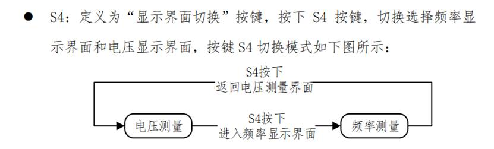

第十届省赛真题

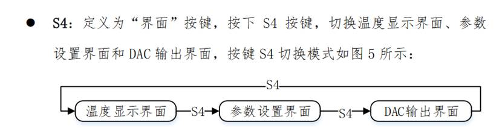

第十二届省赛真题

#### **2.4** **参数设置**

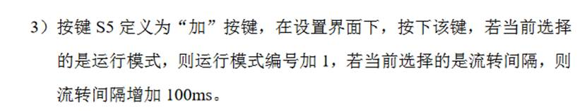

第九届省赛真题

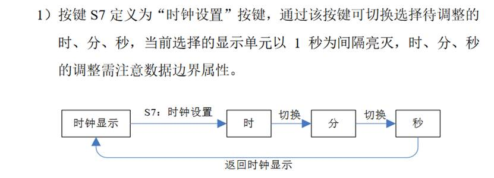

第八届省赛真题

#### **2.5** **参数保存**

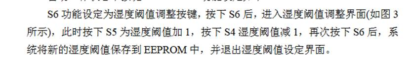

第五届省赛真题

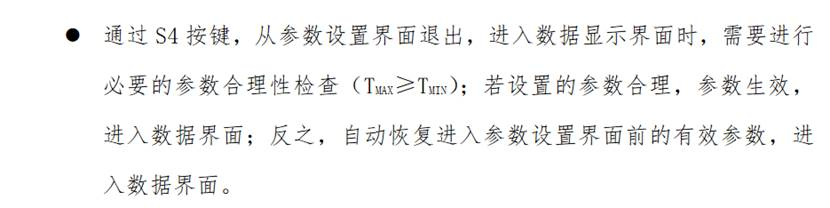

第十一届省赛真题

#### **2.6** **特定使能**

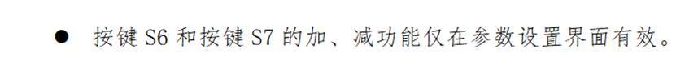

第十一届省赛真题

#### **2.7** **长按跳转 松手返回**

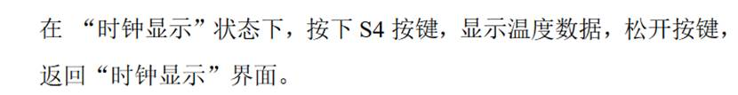

第八届省赛真题

#### **2.8** **键盘输入**


模拟训练二

#### **2.9** **长按短按 效果不同**

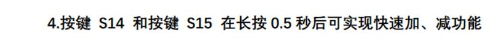

# 三、数码管模块

## 1.数码管底层代码

```c
unsigned char seg_dula[] = {0xc0,0xf9,0xa4,0xb0,0x99,0x92,0x82,0xf8,0x80,0x90,0xff};
unsigned char seg_wela[] = {0x01,0x02,0x04,0x08,0x10,0x20,0x40,0x80};

void Seg_Disp(unsigned char wela,dula,point)
{
    P0 = 0xff;
    P2 = P2 & 0x1f | 0xe0;
    P2 &= 0x1f;

    P0 = seg_wela[wela];
    P2 = P2 & 0x1f | 0xc0;
    P2 &= 0x1f;
    
    P0 = seg_dula[dula];
    if(point)
        P0 &= 0x7f;
    P2 = P2 & 0x1f | 0xe0;
    P2 &= 0x1f; 
}

```

## 2.基本调用方式

```c
Seg_Buf[X] = Y;
Seg_Point[X] = Y;
```

#### **3.3** **显示整数变量**

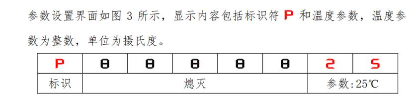

第十二届省赛真题

#### **3.4** **显示小数点变量**

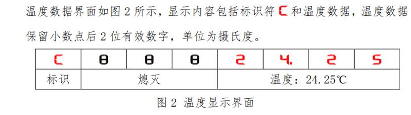

第十二届省赛真题

#### **3.5** **不同状态显示不同内容**

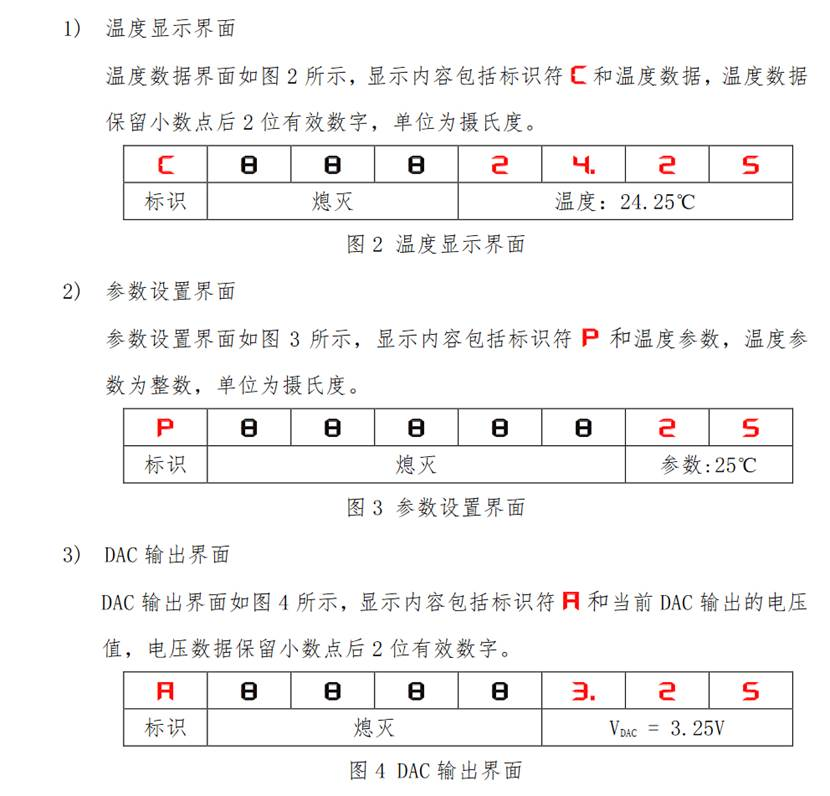

第十二届省赛真题

#### **3.6** **高位熄灭**

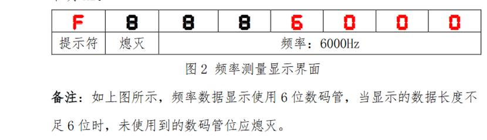

第十届省赛真题

#### **3.7** **选中单元闪烁**

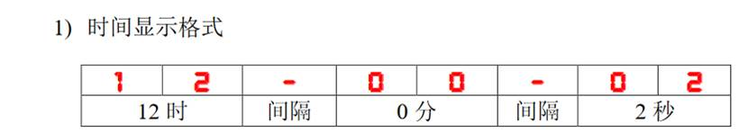

第八届省赛真题


# 四、继电器蜂鸣器

## 1.底层代码

```c
static unsigned char temp_1 = 0x00;
static unsigned char temp_old_1 = 0xff;

void Beep(unsigned char flag)
{
    if(flag)
        temp_1 |= 0x40;
    else
        temp_1 &= ~0x40;
    if(temp_1 != temp_old_1)
    {
        P0 = temp_1;
        P2 = P2 & 0x1f | 0xa0;
        P2 &= 0x1f;
        temp_old_1 = temp_1;        
    }
}

void Relay(unsigned char flag)
{
    if(flag)
        temp_1 |= 0x10;
    else
        temp_1 &= ~0x10;
    if(temp_1 != temp_old_1)
    {
        P0 = temp_1;
        P2 = P2 & 0x1f | 0xa0;
        P2 &= 0x1f;
        temp_old_1 = temp_1;        
    }   
}

```

...


# NE555

绑定定时器0，应采用计数器模式


# #超声波

## 1.超声波底层代码

```c
void Delay12us()        //@12.000MHz
{
    unsigned char i;

    _nop_();
    _nop_();
    i = 33;
    while (--i);
}

void Ut_Wave_Init() //超声波初始化函数 产生8个40Mhz的方波信号
{
    unsigned char i;
    for(i=0;i<8;i++)
    {
        Tx = 1;
        Delay12us();
        Tx = 0;
        Delay12us();
    }
}

unsigned char Ut_Wave_Data() //超声波距离读取函数
{
    unsigned int time;//时间储存变量
    TMOD &= 0x0f;//配置定时器1计时模式
    TH1 = TL1 = 0;//复位计数值 等待超声波信号发出
    Ut_Wave_Init();//发送超声波信号
    TR1 = 1;//开始计时
    while((Rx == 1) && (TF1 == 0));//等待接受返回信号或者定时器溢出
    TR1 = 0;//停止计时
    if(TF1 == 0) //定时器没有溢出
    {
        time = TH1 << 8 | TL1;//读取当前时间
        return (time * 0.017);//返回距离值
    }
    else
    {
        TF1 = 0;//清除溢出标志位
        return 0;
    }
}

```


## 2.PCA写法


```c
unsigned char Ut_Wave_Data() //超声波距离读取函数
{
    unsigned int time;//时间储存变量
    CMOD =  0x00;//配置PCA工作模式
    CH = CL = 0;//复位计数值 等待超声波信号发出
    Ut_Wave_Init();//发送超声波信号
    CR = 1;//开始计时
    while((Rx == 1) && (CF == 0));//等待接受返回信号或者定时器溢出
    CR = 0;//停止计时
    if(CF == 0) //定时器没有溢出
    {
        time = CH << 8 | CL;//读取当前时间
        return (time * 0.017);//返回距离值
    }
    else
    {
        CF = 0;//清除溢出标志位
        return 0;
    }
}

```


# #串口

## 1.串口底层

```c
/* 串口初始化函数 */
void UartInit(void)     //9600bps@12.000MHz
{
    SCON = 0x50;        //8位数据,可变波特率
    AUXR |= 0x01;       //串口1选择定时器2为波特率发生器
    AUXR |= 0x04;       //定时器时钟1T模式
    T2L = 0xC7;     //设置定时初始值
    T2H = 0xFE;     //设置定时初始值
    AUXR |= 0x10;       //定时器2开始计时
    ES = 1;
    EA = 1;
}

/* 字节发送函数 */
void SendByte(unsigned char dat)
{
    SBUF=dat;//将dat数据赋给SBUF，将数据发送出去
    while(TI == 0);//等待数据发送
    TI = 0;//将发送标志位清零
}

/* 字符串发送函数 */
void Uart_Send_String(unsigned char *dat)
{
    while(*dat != '\0')//当字符不为空时，继续发送
        SendByte(*dat++);//发送后指针dat加1，指向下一个字节
}

/* 串口1中断服务函数 */
void Uart1Server() interrupt 4
{
    if(RI == 1) //串口接收数据
    {
        Uart_Recv[Uart_Recv_Index] = SBUF;
        Uart_Recv_Index++;
        RI = 0;
    }
}

```

## **2. **串口接收数据

**模拟题**

---

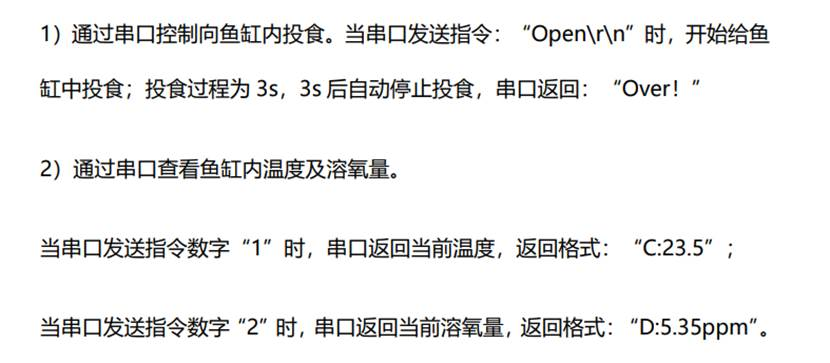

---


## **3. **串口发送数据

**模拟题**

---

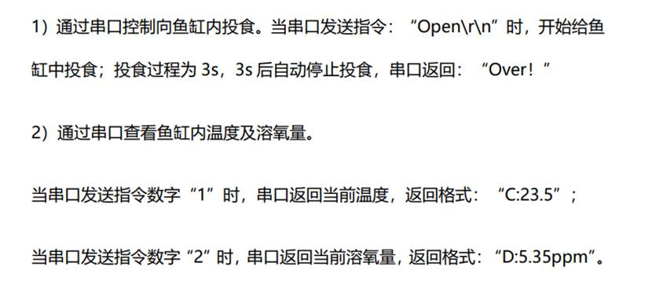

---

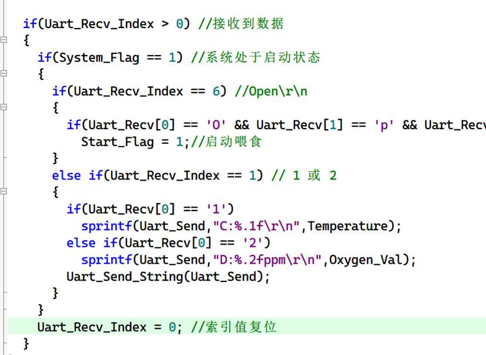

- **内存溢出：idata/xdata/data/code**

## 					==第三部分 大模板==

### 一、头文件声明区域

```c
/* 头文件声明区 */
#include <STC15F2K60S2.H>//单片机寄存器专用头文件

#include <Init.h>//初始化底层驱动专用头文件

#include <Led.h>//Led底层驱动专用头文件

#include <Key.h>//按键底层驱动专用头文件

#include <Seg.h>//数码管底层驱动专用头文件

#include <Uart.h>//串口底层驱动专用头文件
```

### 二、变量声明区域

```c
/* 变量声明区 */

unsigned char Key_Val,Key_Down,Key_Old,Key_Up;//按键专用变量

unsigned char Key_Slow_Down;//按键减速专用变量

unsigned char Seg_Buf[8] = {10,10,10,10,10,10,10,10};//数码管显示数据存放数组

unsigned char Seg_Point[8] = {0,0,0,0,0,0,0,0};//数码管小数点数据存放数组

unsigned char Seg_Pos;//数码管扫描专用变量

unsigned int Seg_Slow_Down;//数码管减速专用变量

unsigned char ucLed[8] = {0,0,0,0,0,0,0,0};//Led显示数据存放数组

unsigned char Uart_Slow_Down;//串口减速专用变量

unsigned char Uart_Recv[10];//串口接收数据储存数组 默认10个字节 若接收数据较长 可更改最大字节数

unsigned char Uart_Recv_Index;//串口接收数组指针

unsigned char Uart_Send[10];//串口接收数据储存数组 默认10个字节 若发送数据较长 可更改最大字节数
```

### 三、按键处理函数

```c
/* 键盘处理函数 */

void Key_Proc()

{

  if(Key_Slow_Down) return;//作用：使得程序在每次定时扫描过程只执行一次，即Key_Slow_Down=0时立即置1，向下执行。

  Key_Slow_Down = 1;//键盘减速程序

 

  Key_Val = Key_Read();//实时读取键码值

  Key_Down = Key_Val & (Key_Old ^ Key_Val);//捕捉按键下降沿

  Key_Up = ~Key_Val & (Key_Old ^ Key_Val);//捕捉按键上降沿

  Key_Old = Key_Val;//辅助扫描变量

 

}
```

### 四、信息处理函数

```c
/* 信息处理函数 */

void Seg_Proc()

{

  if(Seg_Slow_Down) return;

  Seg_Slow_Down = 1;//数码管减速程序

 

}
```

### 五、其他显示函数

```c
/* 其他显示函数 */

void Led_Proc()

{

  

}
```

### 六、串口处理函数

```c
/* 串口处理函数 */

void Uart_Proc()

{

  if(Uart_Slow_Down) return;

  Uart_Slow_Down = 1;//串口减速程序 

  

}
```

### 七、定时器初始化函数

```c
/* 定时器0中断初始化函数 */

void Timer0Init(void)    //1毫秒@12.000MHz

{

  AUXR &= 0x7F;    //定时器时钟12T模式

  TMOD &= 0xF0;    //设置定时器模式

  TL0 = 0x18;   //设置定时初始值

  TH0 = 0xFC;   //设置定时初始值

  TF0 = 0;     //清除TF0标志

  TR0 = 1;     //定时器0开始计时

  ET0 = 1;   //定时器中断0打开

  EA = 1;   //总中断打开

}
```

### 八、中断服务函数

```c
/* 定时器0中断服务函数 */

void Timer0Server() interrupt 1

{  

  if(++Key_Slow_Down == 10) Key_Slow_Down = 0;//键盘减速专用

  if(++Seg_Slow_Down == 500) Seg_Slow_Down = 0;//数码管减速专用

  if(++Uart_Slow_Down == 200) Uart_Slow_Down = 0;//串口减速专用

  if(++Seg_Pos == 8) Seg_Pos = 0;//数码管显示专用

  Seg_Disp(Seg_Pos,Seg_Buf[Seg_Pos],Seg_Point[Seg_Pos]);

  Led_Disp(Seg_Pos,ucLed[Seg_Pos]);

}
```

### 九、串口服务函数

```c
/* 串口1中断服务函数 */

void Uart1Server() interrupt 4

{

  if(RI == 1) //串口接收数据

  {
      Uart_Recv[Uart_Recv_Index] = SBUF;
  		Uart_Recv_Index++;
      RI = 0;
  }
}
```

### 十、主函数

```c
/* Main */

void main()

{

  System_Init();

  Timer0Init();

  UartInit();

  while (1)

  {

    Key_Proc();

    Seg_Proc();

    Led_Proc();

    Uart_Proc();

  }

}
```


 
